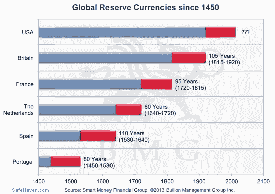

# 地缘政治和比特币:如果比特币被禁止会发生什么？

> 原文：<https://medium.com/hackernoon/geopolitics-cryptoeconomics-2018-and-beyond-b91f4ea3a3c9>

价格会波动，短期泡沫最终会破裂，但没有什么能阻止全球分析师重新评估和想象货币的真正定义是什么，或者可能是什么。

如果你认为 2017 年是比特币和加密货币的疯狂之年，那么 2018 年将是绝对疯狂的一年。从各州推出自己的中央加密货币，到更多国家正式承认比特币为交易媒介。当许多美国人的纳税季到来时，美国国税局(IRS)将最终出台关于如何报告新资产类别的更具体的指导方针。证券交易委员会(SEC)将继续打击欺诈性 ico，并将各种加密资产归类为证券。在全球政治和经济舞台上，我们看到中国正以一种非军国主义的方式慢慢接近与美国的实力平衡。法国和德国呼吁在下一届年度 G20 峰会上就比特币展开辩论，G20 峰会是欧盟和 19 个最富裕国家的会议。2018 年将是比特币扩散的一年，无论各国喜欢与否，它都会渗透到市场和官僚机构中。我们甚至可能看到一个主权国家的人民决定采用比特币作为其储备货币的第一个事件，可能的超级通胀候选人是委内瑞拉、津巴布韦和阿根廷。

## //SWIFT VS 比特币，BAN？

SWIFT 是全球银行间金融电信协会，如果你是一个民族国家，它以前也是唯一的国际汇款和收款方式。在我们的数字时代，SWIFT 在全球汇款平均需要三天时间，而且周末不工作。SWIFT 主要由西方国家集中控制，尤其是将 SWIFT 作为政治工具的美国。如果你不和美国友好相处，或者如果你做了美国不喜欢的事情，你就会被切断 SWIFT，受到联合国的制裁，你的经济就会瘫痪。这些国家包括[伊朗](https://www.financemagnates.com/cryptocurrency/news/government-iran-preparing-adopt-bitcoin-use-inside-country/)、[俄国](https://www.coindesk.com/russias-government-test-blockchain-land-registry-system/)和[朝鲜](https://www.fireeye.com/blog/threat-research/2017/09/north-korea-interested-in-bitcoin.html)，他们对比特币协议非常着迷，并且正在快速测试。比特币对那些在美国实施禁运时没有其他手段在国际上转移资金的国家来说自然具有吸引力。与 SWIFT 相比，比特币协议是一种更快、更安全、分散的汇款方式，而且比特币在周末也能使用。于是，自然吸引力就成了一个显而易见的答案，因为实际上来说，作为一种货币交换手段，SWIFT 不如比特币。我认为:随着越来越多的西方盟友的*被禁止使用 SWIFT，越来越多的民族国家采用比特币作为转移资金的方法，因此，美国在地缘政治中的影响力就越小。好的或坏的行为者对比特币的接受进一步合法化了这个曾经未知的社会经济实验。*

*尽管是个人、小企业或跨国公司，但我们现在已经到了民族国家开始关注的地步。*

*在我们当前的经济体系中，美元是主要的全球储备货币。美元的主导地位类似于美国的军事实力，两者都在二战结束以来的单极美国霸权中发挥了至关重要的作用。除非美国共和国的代表领导人承认失去一些经济影响力和权力，否则比特币最终将被视为金融和/或国家安全威胁，如果它还没有被视为的话。我们可以同意，政府不喜欢他们无法控制的事情，他们无法控制比特币。你不能管理一个自治协议。你不能完全禁止点对点的货币体系。你不能将传统的规章制度应用到完全不同类型的技术上。当控制最初的区块链协议变得毫无疑问时，我们就要宣布它为非法。如果美国禁止比特币，将其贴上金融和/或国家安全威胁的标签，价格最初将在短期内暴跌，但从长期来看，它只会变得更加神圣。我们已经见证了过去禁令的结果，包括 1920 年禁酒令期间酒精变得更贵，大麻变得更便宜，因为现在大麻被合法化了。诚然，这有点达到了争论的目的，因为我不认为有更好的类比。也许美国将试图通过描绘一幅虚假的画像来将比特币定罪，即它只资助恐怖组织和/或被坏人使用。我不知道，我只是假设比特币可能被阻止的最后方法之一，如果可以，它将从有史以来最伟大的帝国开始。*

**

## *//石油美元 VS 人民币*

*目前，比特币不像人民币对美元的霸权那样值得成为对手。从战略上讲，美元是全球最受欢迎的交易方式，无论是石油、荷兰的港口、波多黎各的出租车，还是任何接受美元的国际机场。石油美元，正如它被创造出来时一样，被有意地作为国家和公司获取石油的唯一交换媒介，*支撑着美元*的价值，因为我们大多数人都还活着。例如，如果你是一家英国石油公司，你需要兑换美元来购买石油，事实上，如果你的业务需要石油并且你将来也需要美元，不卖出美元可能是最明智的。*

*伊拉克和利比亚是仅有的两个尝试使用石油美元以外的货币的国家。在萨达姆·侯赛因和穆阿迈尔·卡扎菲被捕和被暗杀之前，两国领导人各自独立设计了一个用另一种货币形式换取石油的货币战略:[侯赛因转向欧元](https://www.theguardian.com/business/2003/feb/16/iraq.theeuro)和[卡扎菲的黄金货币计划](https://www.foreignpolicyjournal.com/2016/01/06/new-hillary-emails-reveal-true-motive-for-libya-intervention/)。*

**

*中国成为第三个试图在全球石油交易中与美元竞争的国家。撇开朝鲜的诡计不谈，中国的上海期货交易所提供石油换人民币*用黄金*做担保*是当今地缘政治和世界经济中最热门的话题。根据中国当局的说法，用易于兑换成黄金的人民币为石油定价是中国最终计划的一个组成部分，该计划旨在使人民币国际化，并在全球舞台上挑战美元。对此深感兴趣的国家正是伊朗、俄罗斯和委内瑞拉等受到美国制裁的国家。此外，在过去的几年里，中国用《孙子兵法》的风格，将自己定位于战胜美国霸权。[中国控制着他们的国家债务与 GDP 的比率](/@KeratiChop/introduction-to-bitcoin-money-our-debt-based-society-2b74ec0f56c7)而[是美国庞大的美联储债务的最大债权人](http://money.cnn.com/2017/08/16/investing/china-us-debt-treasuries/index.html)。为了最终推出人民币-石油期货交易所，中国在过去的十年里已经积累了至少 5000 吨黄金，相当于超过 3210 亿美元。中国还从至少十个其他国家进口石油，很容易就能填满上海交易所的市场。中国在非洲的基础设施投资是任何其他国家都无法比拟的，包括美国。最后，中国的[一带一路倡议](https://www.google.com/search?q=one+belt+one+road+initiative&oq=one+belt+one+road+ini&aqs=chrome.0.0j69i57j0l4.2247j0j7&sourceid=chrome&ie=UTF-8)旨在宣称对整个东欧、中东和东南亚的经济影响力。随着经济实力在 21 世纪的国际舞台上扮演着越来越重要的角色，尤其是在比较两个同归于尽的核国家时，军事实力已经不像过去那样重要了。我们正看到全球从美元转向人民币的开端。不幸的是，石油美元的日子似乎屈指可数了。**

## *//比特币的含义*

*作为当前全球体制的第一把交椅，在位者理所当然地过于自满。[俄国](https://techcrunch.com/2017/10/15/russia-may-soon-issue-its-own-official-blockchain-based-currency-the-cryptoruble/)[委内瑞拉](https://www.npr.org/sections/thetwo-way/2017/12/04/568299704/venezuela-will-create-new-petro-cryptocurrency-president-maduro-says)[沙特](https://cointelegraph.com/news/saudi-arabias-idb-plans-blockchain-financial-project)[阿联酋](http://gulfnews.com/news/uae/government/dubai-launches-blockchain-strategy-to-become-paperless-by-2020-1.1907790)[瑞典](https://cointelegraph.com/news/sweden-officially-started-using-blockchain-to-register-land-and-properties)[德国](https://decentralize.today/mapping-out-the-blockchain-ecosystem-in-germany-in-2017-86e4cd1432ba)[阿根廷](https://www.bloomberg.com/news/articles/2017-11-02/argentina-s-biggest-futures-market-plans-to-join-bitcoin-party)[泰国](/power-ledger/power-ledger-signs-agreement-with-bcpg-to-bring-distributed-renewable-energy-trading-to-thailand-cd68d09c23ac)和[中国](https://neo.org/)都在向区块链技术和加密货币的新范式转变前进。*

*比特币是中国国际货币和经济主导计划的难以忽视的事实。中国努力阻止资本外逃，导致 2017 年 9 月[完全禁止中国加密货币交易所](https://www.ccn.com/btcc-chief-bobby-lee-on-segwit2x-and-the-chinese-bitcoin-exchange-ban/)。这不应该被误认为是禁止比特币或区块链创新，而是禁止法令加密入口和出口以限制人民币流出中国。自从禁止集中交易以来，中国公民[对比特币贪得无厌的胃口](http://www.newsbtc.com/2017/09/25/chinas-localbitcoins-sets-time-trading-volume-record/)表现为通过[本地比特币](https://localbitcoins.com/)进行的场外&点对点交易的激增。因为没有哪个政府能够控制比特币协议，所以我相信中国已经有了一个总体规划。我相信，一旦中国重新开放交易所，他们将公布他们的人民币加密货币版本，迫使中国公民在进入新资产类别的市场之前首先购买他们的中央加密货币。这样做，支撑了人民币的价值，与传统市场支撑美元的价值相类似。当然，这纯粹是我的猜测。*

*在地缘政治和全球经济中，比特币协议充当了一个非凡的通配符，从根本上扮演了一个不受国家限制的通货紧缩价值储存库的角色，以抵御通货膨胀和疲软的货币。很少有人能够奢侈地将比特币作为一种投资工具进行投机。事实证明，比特币对经历了恶性通货膨胀、特别是逃到使用比特币的委内瑞拉人很有用。[在政府手中的希腊储蓄账户遭遇 47.5%的大幅缩水时，不可变现的资产是必要的。比特币作为一种不依赖任何中央权威的价值形式，而是一个公共平台，改变了地缘政治的动态。一旦闪电网络为该协议激活，比特币将作为世界货币试水，并将 24/7，365 透明地进行。民族国家不能再忽视一成不变的区块链，那些率先跟上潮流的国家将在我们的数字时代带我们去哪里的问题上领先一步。比特币不分国界，完全中立，不管你是穆斯林、黑人、女性、男性、同性恋、共和党人、胖子，还是有怪异的恋物癖，只要你能发送或接收交易，你就是本世纪*金融革命的一部分。地球上 100%去中心化和计算最安全的网络至少提供了一个远离传统货币形式的选择，是一个自治的新货币系统，每天都在变得更加强大，它不会消亡。毫无疑问，比特币存在短期泡沫，但人们可以辩称，法定货币才是等待破裂的真正泡沫。2018 年及以后将继续证明，将货币的控制权与国家分离，就像将宗教与政府分离一样显而易见。*](https://www.usatoday.com/story/money/business/2013/07/29/bank-of-cyprus-depositors-lose-savings/2595837/)*

***————***

**[*1.1 —比特币简介:钱&我们的债基社会*](/@KeratiChop/introduction-to-bitcoin-money-our-debt-based-society-2b74ec0f56c7)[*1.2—比特币的安全模型:比特币挖矿是如何进行的？*](/hackernoon/a-new-asset-class-blockchain-technology-cryptocurrency-73abd75f8109)[*1.3—什么是道黑客:以太、永恒、共识——规则&分叉*](/social-club/down-the-rabbit-hole-ethereum-immutability-consensus-rule-forks-e9fa8faa9e07)**

**[*1.5 —比特币的实质性&通往 100K 美元的技术之路*](https://hackernoon.com/bitcoins-substantive-technical-road-to-100k-2637b899ffc5)[*2.1—简介:群龙无首的加密运动将与等级政府*](https://hackernoon.com/introduction-leaderless-crypto-movement-will-rival-hierarchical-governments-1c93afec3066)[*分庭抗礼 2.2 — BIP-148 UASF 一周年:新的统治体系*](https://hackernoon.com/bip-148-uasf-first-year-anniversary-a-new-system-of-governance-223907ec298b)**