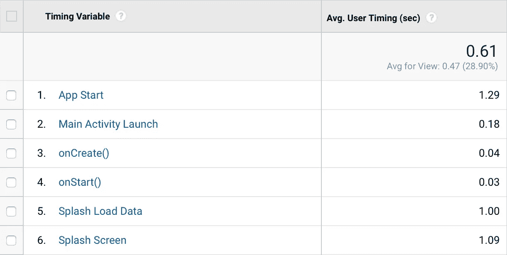

# 使用 Pury 插件访问原始分析结果

> 原文：<https://medium.com/hackernoon/get-access-to-raw-profiling-results-with-plugins-for-pury-f9a7cc5e8345>


从一开始，我设计 Pury 的方式就是让它可以发展成一个拥有一个内核和多个插件和扩展的系统。这样人们就可以用最合适的方式来定制它。作为迈向这个方向的第一步，我想向大家展示一下*插件*。

## 自定义插件

在以前的版本中，可以改变一个*记录器*来利用像 Timber 这样的库。插件允许更加灵活的定制。它们提供对原始结果的访问，以便以最合适的方式进行处理。例如，比较主分支和特性分支之间的性能可能会很有趣，我有一些想法，但是还没有尝试过。或者将格式更改为 JSON，在设备群中运行应用程序，收集结果并与一些脚本进行比较。我一直想实时测量应用程序的性能。所以我用谷歌[分析进行了一点尝试，并得到了有希望的结果。不是得到标准的 Pury 输出:](https://hackernoon.com/tagged/google)

```
App Start --> 0ms
  Splash Screen --> 5ms
    Splash Load Data --> 37ms
    Splash Load Data <-- 1042ms, execution = 1005ms
  Splash Screen <-- 1042ms, execution = 1037ms
  Main Activity Launch --> 1043ms 
    onCreate() --> 1077ms 
    onCreate() <-- 1100ms, execution = 23ms
    onStart() --> 1101ms 
    onStart() <-- 1131ms, execution = 30ms
  Main Activity Launch <-- 1182ms, execution = 139ms
App Start <-- 1182ms
```

我将执行时间发送给[谷歌分析计时 API](https://developers.google.com/analytics/devguides/collection/android/v4/usertimings) ，得到了这个:



如您所见，我在一个表中获得了所有的执行时间。考虑到 [GA 细分](https://support.google.com/analytics/topic/3123779)，它可能是一个非常强大的[工具](https://hackernoon.com/tagged/tool)来分析不同版本和设备的应用性能。我计划写一篇关于谷歌分析计时 API 和谷歌分析插件的文章，但同时我想回到 Pury 插件上来。

## 插件创建

要创建自定义插件，您需要实现*插件*接口:

```
public interface Plugin {void handleResult(ProfileResult result, ProfilerId profilerId);
}
```

在*中，handleResult()插件*接收分析结果和产生该结果的分析器的标识符。值得一提的是 *ProfileResult* 是一个具有 4 种不同实现的接口。为了简化结果处理，我使用了[访问者模式](https://en.wikipedia.org/wiki/Visitor_pattern)，每个结果都有一个方法 *accept(ResultVisitor)。*这是 *ResultVisitor* 界面:

```
public interface ResultVisitor {
    void visit(AverageProfileResult averageProfileResult);

    void visit(RootAverageProfileResult rootAverageProfileResult);

    void visit(RootSingleProfileResult rootSingleProfileResult);

    void visit(SingleProfileResult singleProfileResult);
}
```

每种结果类型都有一个方法，所以不需要检查或强制转换。希望你会觉得有用。

当我在编写对*插件的支持时，*我认为通过 profiler 名称过滤输入可能是一个非常常见的用例。所以如果你认为实现*插件*并进行过滤的抽象类有用，请在 GitHub 上提出一个问题[。](https://github.com/NikitaKozlov/Pury)

## 如何使用插件

要动态添加和删除插件，请使用以下方法:

```
public final class Pury { ....    public static void addPlugin(String key, Plugin plugin) {}
public static void removePlugin(String key) {} ....}
```

那两个方法后面都有一个*映射*，所以如果添加了两个相同 key 的插件，第一个就被移除了。

## 日志插件

随着*插件*的引入，我决定改变日志工作的方式。所以现在日志只是另一个*插件，*仅此而已。要查看代码，请检查 *LoggerPlugin* 类。

*LoggerPlugin* 是默认添加的，所以日志记录是开箱即用的。要拆除或更换它，使用钥匙 *Pury。LOGGER _ 插件。LoggerPlugin* 使用与之前用于记录结果相同的*记录器*。使用 *Pury.setLogger(Logger)* 方法进行更改。

## 结论

*插件*支持定制和更好地控制报告分析结果。它们给 Pury 增加了一定程度的灵活性，我希望这是有用的。你可以在 GitHub 上找到带有示例[的代码。](https://github.com/NikitaKozlov/Pury)

正如我已经提到的，现在我正在与谷歌分析整合 Pury。如果你对结果感兴趣，请在 Twitter 或这里关注我。如果你有关于分析结果还能做什么的想法，请写在评论中或者在 Gitter 中写[。](https://gitter.im/NikitaKozlov/Pury)

[](http://bit.ly/HackernoonFB)[](https://goo.gl/k7XYbx)[](https://goo.gl/4ofytp)

> [黑客中午](http://bit.ly/Hackernoon)是黑客如何开始他们的下午。我们是 [@AMI](http://bit.ly/atAMIatAMI) 家庭的一员。我们现在[接受投稿](http://bit.ly/hackernoonsubmission)并乐意[讨论广告&赞助](mailto:partners@amipublications.com)机会。
> 
> 如果你喜欢这个故事，我们推荐你阅读我们的[最新科技故事](http://bit.ly/hackernoonlatestt)和[趋势科技故事](https://hackernoon.com/trending)。直到下一次，不要把世界的现实想当然！

[](https://goo.gl/Ahtev1)