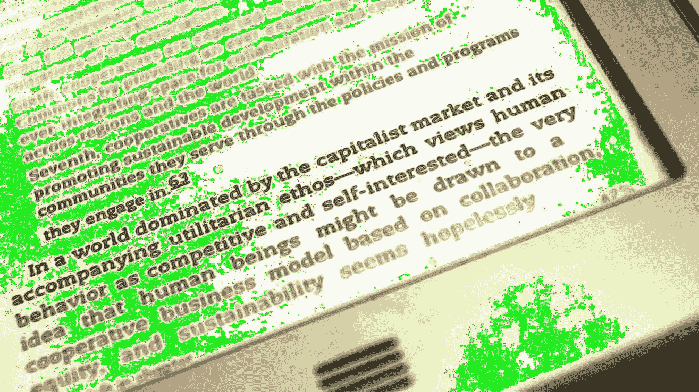

# 通过周六阅读，在科技领域取得进步

> 原文：<https://medium.com/hackernoon/get-ahead-in-tech-by-reading-on-saturdays-411d8c79d25a>

## 亲爱的黑客午间读者:

当你已经拥有美好的生活时，说“优先考虑工作生活平衡”很容易。当你今天已经赚了足够多的钱时，说“优先睡个好觉”很容易。说起来容易，“优先考虑饮食和运动”——当你有别人给你做营养餐，车库里停着一辆新的特斯拉，等着你开车去健身房。

你知道什么不容易吗？从无到有。有时候，你必须把“它”放在比你更重要的位置——如果你想“它”活得长久和成功的话。这就是创业生活。

以下是 3 个必读的热门阅读:**，以及 [**软件开发**](https://hackernoon.com/tagged/software-development) **中的 14 个热门帖子。**都是一圈！**

## **📖 📖 📖**

## **3 必须阅读科技故事**

**[**亲爱的脸书，“下载我的档案”坏了，这可不行**](https://hackernoon.com/dear-facebook-download-my-archive-is-broken-and-thats-not-okay-a1df2eb9e8a9) 作者:前谷歌人 [Jorge Serna](https://medium.com/u/829d5c865a60#TU 产品总监<a class=)**

**💻 💻 💻 💻 💻 💻 💻 💻 💻 💻 💻 💻 💻 💻**

## **14 个趋势软件开发帖子**

**[**无服务器速成班，Node.js**](https://hackernoon.com/a-crash-course-on-serverless-with-node-js-632b37d58b44) 作者:Bookvar 软件工程师[阿德南·拉希奇](https://medium.com/u/d1aeac7eadae?source=post_page-----411d8c79d25a--------------------------------)**

**[**JavaScript 中的尴尬时刻**](https://hackernoon.com/awkward-moments-in-javascript-a0b1cabcd6f1) 作者 [Asana](https://medium.com/u/4fecc4c082c?source=post_page-----411d8c79d25a--------------------------------) 工程师 [Greg Sabo](https://medium.com/u/5182310d740b?source=post_page-----411d8c79d25a--------------------------------)**

**[**软件开发人员不测试软件的常见借口**](https://hackernoon.com/common-excuses-why-developers-dont-test-their-software-908a465e122c) 软件开发人员[詹姆斯·杰弗瑞](https://medium.com/u/235deb8332f0?source=post_page-----411d8c79d25a--------------------------------)**

**[**处理多租户上的数据迁移 PHP 开发人员拉韦尔**](https://hackernoon.com/abstract-upgrade-command-for-multi-tenant-71089b9a838f)[马可·奥雷利奥·德莱乌](https://medium.com/u/697926a78faa?source=post_page-----411d8c79d25a--------------------------------)**

**[**删除你的代码**](https://hackernoon.com/delete-your-code-c5d2dc59f1ff) 由 Laravel/React 高级开发人员 [Ruairidh Wynne-McHardy](https://medium.com/u/441404d060b?source=post_page-----411d8c79d25a--------------------------------)**

**[**雄辩关系小抄**](https://hackernoon.com/eloquent-relationships-cheat-sheet-5155498c209) 软件工程师[马哈茂德·扎尔特](https://medium.com/u/df333b2420b7?source=post_page-----411d8c79d25a--------------------------------)**

**[**ES6 适合初学者**](https://hackernoon.com/es6-for-beginners-f98120b57414) 由程序员 [Srebalaji Thirumalai](https://medium.com/u/3b40c612296?source=post_page-----411d8c79d25a--------------------------------)**

**[**我们如何让 npm 包在浏览器中工作**](https://hackernoon.com/how-we-make-npm-packages-work-in-the-browser-announcing-the-new-packager-6ce16aa4cee6) 作者 Catawiki 开发者 [Ives van Hoorne](https://medium.com/u/ee6691f0bd65?source=post_page-----411d8c79d25a--------------------------------)**

**[**用云语音制作音频可搜索**](https://hackernoon.com/making-audio-searchable-with-cloud-speech-36ce63b6b4d3) 由《代码鉴赏家》、乡村音乐和自制冰淇淋[莎拉·罗宾逊](https://medium.com/u/7f2ab73b39f8?source=post_page-----411d8c79d25a--------------------------------)**

**[**用围棋解决主谋**](https://hackernoon.com/solving-mastermind-with-go-a930004c22a0) 由大陆——其后端软件工程师[露蒂·雷哈克](https://medium.com/u/987e45f31938?source=post_page-----411d8c79d25a--------------------------------)**

**[**围棋之美**](https://hackernoon.com/the-beauty-of-go-98057e3f0a7d) 作者[卡尼什克·杜德佳](https://medium.com/u/b1ea875d8232?source=post_page-----411d8c79d25a--------------------------------)**

**[**使用通用组件启动并运行**](https://hackernoon.com/up-and-running-with-universal-components-66678132cad) 由美国职业足球大联盟 UI 团队的技术负责人 [kurtiskemple](https://medium.com/u/8be181d9f877?source=post_page-----411d8c79d25a--------------------------------)**

**[**走这条(JavaScript)路**](https://hackernoon.com/walk-this-javascript-way-e9c45ab5b696) 由计算机科学教授 [Baptiste Pesquet](https://medium.com/u/89db07ce83f?source=post_page-----411d8c79d25a--------------------------------)**

**[**敏捷为什么不起作用？**](https://hackernoon.com/why-isnt-agile-working-d7127af1c552) 由 Zendesk 高级产品经理 [John Cutler](https://medium.com/u/4c3f4fe11e6b?source=post_page-----411d8c79d25a--------------------------------)**

## **直到下一次，不要把世界的现实想当然。**

**亲切的问候，**

**[大卫·斯穆克](http://www.davidsmooke.net/)，[阿米](http://twitter.com/ami)**