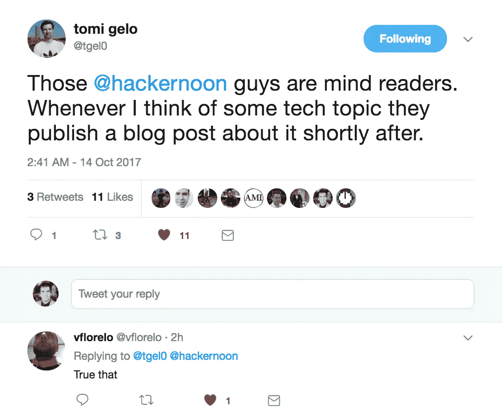
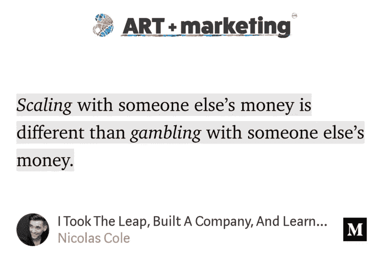

# 通过周日阅读，在科技领域取得领先

> 原文：<https://medium.com/hackernoon/get-ahead-in-tech-by-reading-on-sundays-8579db617261>

> "我们生活在这样一种社会中，在几乎所有情况下，努力工作都会得到回报。"—天体物理学家尼尔·德格拉斯·泰森

## 亲爱的美丽的黑客午间读者，

现在是周日中午，我要提醒你， ***读书是苦差事*** 。

分清学习的轻重缓急需要有意识的努力。少了一个电视节目，或者少了一个网飞系列。文字让大脑工作。而是从被动走向主动。这是优先考虑的耐心，与他人的观点产生共鸣。好奇心驱使积极的读者。

你的纪律会得到心态的回报。

你的问题会得到解决。

你的好奇心会得到故事的回报。

阅读是对你的投资。对某一主题的专业知识。一个已解决问题或未解决问题的图书馆。当你在休息日安排自己的优先事项时，积极选择。

> [**读黑客正午。**](http://hackernoon.com)

非常感谢数据专家托米斯拉夫·盖洛(Tomislav Gelo )( T9 ),他在推特上喊出了！

***官方声明:我无法确认或否认我们是否在使用读心术来决定应该发表什么。***

## 我们将关注 8 个科技故事，它们会让你思考(或许还会付诸行动):

💻 🖥️ 💻 🖥️ 💻 🖥️ 💻

[**该怪谁？(v0.1)**](https://hackernoon.com/whos-to-blame-v0-1-456403c2bc52) 由 ThoughtWorks 软件工程师[克里斯汀·罗赫兹](https://medium.com/u/82c01b993787?source=post_page-----8579db617261--------------------------------)

“几周前，我停止了生产。我运行了一个旨在融合我们的沙盒环境的脚本，却意外地融合了我们的生产环境。生产下降了，暂时停止了对所有顾客的服务。当时，我为之提供咨询的客户正在监控我们平台的生产流量，并注意到了中断，然后联系我的团队说:“嘿，发生了什么事？ [**阅读更多软件开发中的故事。**](https://hackernoon.com/tagged/software-development)

[**跟随线索，为你的非 VC 创业想法赢得 2 万美元的比特币投资**](https://hackernoon.com/follow-the-clues-and-win-20-000-in-bitcoin-investment-for-your-non-vc-startup-idea-c7b770e7ae4) 由 Zenentrepreneur [Riz Virk](https://medium.com/u/4300cfeb5f2d?source=post_page-----8579db617261--------------------------------)

*“我为那些对风险投资有非传统想法的人提供这个新的竞赛——这可能是一个电影项目，一个零售企业，一个服务公司，一个利基市场的应用程序，或者完全在那里的东西——一个基于重力的宇宙飞船的原型，一个比特币采矿服务——你能想到的！我将向一名幸运的获胜者提供 2 万美元的比特币(或现金)投资，以实现他们的想法。”* [**阅读更多创投故事。**](https://hackernoon.com/venture-capital/home)

[**实用主义完美主义者🕵**](https://hackernoon.com/quick-and-dirty-tricks-for-debugging-javascript-d0e911c3afa) 调试 Javascript 的快速卑鄙手段[王昌](https://medium.com/u/a942ecc9d3a8?source=post_page-----8579db617261--------------------------------)

在一个理想的世界里，每段代码都有多个测试，任何回归都会立即指向一个特定的提交，所有的提交都会有一个合理的大小和一个合理的消息。我不住在那里(这可能部分是我自己的错)，你可能也不住在那里……” [**用 Javascript 阅读更多故事。**](https://hackernoon.com/javascript/home)

[**从传统金融世界过渡到加密金融世界**](https://hackernoon.com/transitioning-from-the-legacy-financial-world-to-the-crypto-financial-world-e6fefecfc4b5) 由区块链和加密货币企业家[查德·阿罗约](https://medium.com/u/4c81742fc42a?source=post_page-----8579db617261--------------------------------)

“我不认为大多数人会很快拿到用比特币支付的工资。但是，请接受这样的事实，一些人目前正通过数字资产获得报酬，越来越多的加密技术将成为我们生活的一部分。接下来的问题是，“短期内权力平衡会是什么样的？更重要的是，从长远来看？ [**阅读更多加密货币的故事。**](https://hackernoon.com/tagged/cryptocurrency)

[**多么牛逼的工程师求助**](https://hackernoon.com/how-awesome-engineers-ask-for-help-93bcb2c7dbb7) 由 Asana 软件工程师 [Greg Sabo](https://medium.com/u/5182310d740b?source=post_page-----8579db617261--------------------------------)

你静静地凝视着，屏幕的两侧不知不觉地向你移动了一英寸。一个咖啡圈出现在你的笔记本上。你保持沉默。然后，你重新启动。也许这一次，错误就不会发生了。寻求帮助是困难的，拖延保护我们免受其害。这就是为什么掌握求助的技巧。作为一名工程师，这是实现高生产率的关键。” [**阅读更多软件开发中的故事。**](https://hackernoon.com/tagged/software-development)

[**瑞克和莫蒂以及生命的意义**](https://hackernoon.com/rick-and-morty-and-the-meaning-of-life-6640df17e263) 作者:作家、工程师和连续创业者[丹尼尔·杰弗里斯](https://medium.com/u/618a7c78c957?source=post_page-----8579db617261--------------------------------)

*“一切事物的根源都是虚无的黑洞。最终你将不复存在，尽管有数百万年令人欣慰的信念，但坟墓后可能什么也没有，这意味着我们就像从未存在过一样消失了。我们拥有和梦尘一样多的物质。在那虚无之外，意识是唯一实际存在的东西。”* [**阅读更多电视&影评尽在我们的姐妹刊，电影时间大师。**](http://movietime.guru)

[**为什么 Oculus Go 如此重要**](https://hackernoon.com/why-the-oculus-go-matters-2dbae1297043) 空间计算和系统制造商[阿尔弗雷多](https://medium.com/u/cabecb0f738a?source=post_page-----8579db617261--------------------------------)

*“Oculus Go 在 Oculus Connect 4 上亮相。廉价耳机的计划之前就已经说过了，这没什么大不了的。Oculus Go 想做一个没有智能手机的 Gear VR。”* [**阅读更多虚拟现实中的故事。**](https://hackernoon.com/tagged/virtual-reality)

从我们的姐妹出版物中，[艺术+营销](http://artplusmarketing.com) : [**我实现了飞跃，建立了一家公司，并了解了为什么这么多创业公司失败**](https://artplusmarketing.com/i-took-the-leap-built-a-company-and-learned-why-so-many-startups-fail-c4356e0c41d9) 作者是数字出版社创始人[尼古拉斯·科尔](https://medium.com/u/7c10a61aa346?source=post_page-----8579db617261--------------------------------)

🕛在我们再次相见之前，不要把这个世界的现实想当然。

亲切的问候，

[大卫·斯穆克](http://www.davidsmooke.net/)，[阿米](https://medium.com/u/1fedc8fffada?source=post_page-----8579db617261--------------------------------)

**详见**[***最新***](http://hackernoon.com/latest)*[***趋势***](http://hackernoon.com/trending)**和* [**记住，**](http://hackernoon.com/archive) *[*雷吉·米勒是一个爱读*](https://www.youtube.com/watch?v=RVJaOfn318Q) *的时尚弄潮儿人。******

*****P.P.S.*** *如果你厌倦了屏幕上的阅读，你也可以像* [*莫拉德斯特恩*](https://medium.com/u/c3fa1db85268?source=post_page-----8579db617261--------------------------------) *和* [***一样打印出你最喜欢的阅读***](https://twitter.com/morad/status/919270681602379782)*(*[*13 种方法把你的职业生涯变成一艘 f-ing 火箭船*](http://Sean Johnson Partner at @digintent and @founderequity.) *乘***