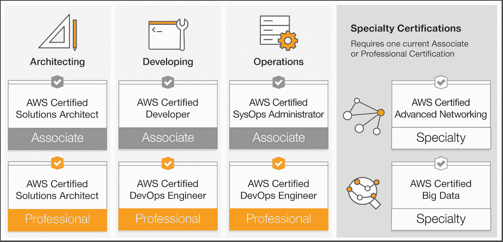

# 在 AWS re:Invent 2017 获得认证

> 原文：<https://medium.com/hackernoon/get-certified-at-aws-re-invent-2017-f86957e2cdd>

## 利用展会上的能量，带着新的云证书回家，证明您所知道的！

Study hard, write prepared

今年的 AWS re:Invent 将会比以往更大更好。40，000 名建筑工人来到[拉斯韦加斯](https://hackernoon.com/tagged/las-vegas)，为期一周，挤满了黑客马拉松、训练营、分组会议和大型社交活动。对于最好的云会议，你别无所求。

但是预算紧张，可能需要一些说服才能获得旅行所需的批准。AWS 今年试图通过提供一封证明信的起点来使它变得更容易一些。希望这管用，你将在 11 月底前往拉斯维加斯。

有什么比带着闪亮的新 AWS 认证回到办公室更好的超越期望的方法呢？

这是展示你的云印章和展示你在展会中学到了多少的好方法。今年，任何人都可以获得认证。

## **学习树**

AWS 认证分为三类:助理、专业和专业。这些级别提供了一条学习路径，展示了云中特定学科的发展。

官方的 AWS 学习树在[他们的站点](https://aws.amazon.com/certification/our-certifications/)上有，看起来是这样的；

[AWS certification roadmap](https://aws.amazon.com/certification/our-certifications/)

但是连官方的学习树都少了一个步骤！最近，AWS 宣布了一项全新认证的测试期， [AWS 认证云从业者](https://aws.amazon.com/certification/certified-cloud-practitioner/)。

这个新的认证是 AWS 新人的完美起点。

## **AWS 认证云从业者**

这个全新的测试版认证是关于基础的…非常基础的。目标受众？“……任何角色，包括技术、管理、销售、采购或财务(或同等培训)”。

这里的目标是让团队中的每个人都说同一种语言。这样，当你在讨论一个新项目的时候，就不会有人盯着你了。这是一种确保每个人都熟悉基本 AWS 服务、术语和原则的方法。

因此，这是技术深度最小的考试。推荐阅读是；

*   [亚马逊网络服务概述](https://d0.awsstatic.com/whitepapers/aws-overview.pdf)
*   [云架构:最佳实践](https://d0.awsstatic.com/whitepapers/AWS_Cloud_Best_Practices.pdf)
*   [AWS 定价的工作原理](https://d0.awsstatic.com/whitepapers/aws_pricing_overview.pdf)

AWS 还建议您审查[可用的支持计划](https://aws.amazon.com/premiumsupport/compare-plans/)。此外，AWS 的任何[技术](https://aws.amazon.com/training/course-descriptions/essentials/)或[商业](https://aws.amazon.com/training/course-descriptions/business-essentials/)培训将有助于确保这次考试是一次成功的考试。

该考试相对较短(110 分钟 70 个问题)，目前的价格为 50 美元。这里唯一的限制是，如果你已经尝试或通过了另一个 AWS 考试，你不能参加这次考试。

这是一个尝试 AWS 认证的好方法。

## **协理级**

有了从业者认证，是时候升级到助理级认证了。这里有三个选择:[解决方案架构师](https://aws.amazon.com/certification/certified-solutions-architect-associate/)、[开发人员](https://aws.amazon.com/certification/certified-developer-associate/)和[系统运行管理员](https://aws.amazon.com/certification/certified-sysops-admin-associate/)。这三种方法的难度相似，但都是针对与工作角色相关的特定任务量身定制的。

对于每个助理的考试，建议使用以下白皮书:

*   [安全流程概述](https://d1.awsstatic.com/whitepapers/Security/AWS_Security_Whitepaper.91d93e72ef4609e15e4b43542292d8562d9e58d3.pdf)
*   [云中的存储选项](https://d1.awsstatic.com/whitepapers/Storage/AWS%20Storage%20Services%20Whitepaper-v9.3db376a75b6ba1be650cff7fb26a1504be4c24c8.pdf)
*   [在 AWS 上构建容错应用](https://media.amazonwebservices.com/AWS_Building_Fault_Tolerant_Applications.pdf)
*   [亚马逊网络服务概述](https://d1.awsstatic.com/whitepapers/aws-overview.pdf)
*   [AWS 风险与合规概述](https://d1.awsstatic.com/whitepapers/compliance/AWS_Risk_and_Compliance_Overview.pdf)
*   [云架构](https://d1.awsstatic.com/whitepapers/AWS_Cloud_Best_Practices.b3fceb6d514bedffa52210b642f4ecbb545987ae.pdf)

此外，我建议您查看以下内容:

*   [AWS 架构良好的框架](https://d1.awsstatic.com/whitepapers/architecture/AWS_Well-Architected_Framework.pdf)
*   [AWS 云采用框架概述](https://d1.awsstatic.com/whitepapers/aws_cloud_adoption_framework.pdf)

还有一些额外的认证特定要求。在开始准备考试时，请务必阅读考试指南、考生概述和考试蓝图。

## **专业水平**

专业水平考试会让事情更上一层楼。这些考试主要涵盖基于情境的决策。它们旨在确保你能够**应用**你所获得的知识。

在尝试这些选择题考试之前，您需要参加相关的准水平考试。你有 170 分钟的时间，这听起来可能很多，但如果你没有做好准备，你可能会发现自己撞上了那堵墙。

查看所有相关资料以及一些重要的深度白皮书。无论您是参加 [AWS 认证 DevOps 工程师](https://aws.amazon.com/certification/certified-devops-engineer-professional/)还是 [AWS 认证解决方案架构师](https://aws.amazon.com/certification/certified-solutions-architect-professional/)，请务必阅读:

*   [AWS 架构良好的框架—安全支柱](https://d1.awsstatic.com/whitepapers/architecture/AWS-Security-Pillar.pdf)
*   [AWS 架构良好的框架—可靠性支柱](https://d1.awsstatic.com/whitepapers/architecture/AWS-Reliability-Pillar.pdf)
*   [AWS 架构良好的框架——性能效率支柱](https://d1.awsstatic.com/whitepapers/architecture/AWS-Performance-Efficiency-Pillar.pdf)
*   [AWS 架构良好的框架——成本优化支柱](https://d1.awsstatic.com/whitepapers/architecture/AWS-Cost-Optimization-Pillar.pdf)
*   [AWS 云采用框架:安全视角](https://d1.awsstatic.com/whitepapers/AWS_CAF_Security_Perspective.pdf)
*   [AWS 上的蓝/绿部署](https://d1.awsstatic.com/whitepapers/AWS_Blue_Green_Deployments.pdf)
*   [基础设施为代码](https://d1.awsstatic.com/whitepapers/DevOps/infrastructure-as-code.pdf)
*   [AWS 操作清单](https://d1.awsstatic.com/whitepapers/aws-operational-checklists.pdf)
*   [使用 AWS 的备份和恢复方法](https://d1.awsstatic.com/whitepapers/Storage/Backup_and_Recovery_Approaches_Using_AWS.pdf)

在这个级别，你还需要投资一些额外的培训。AWS 今年将在 AWS re:Invent 上提供专业的训练营，它们非常值得投资。如果这不是你的速度，有一些优秀的第三方培训提供商可能非常适合你的学习风格。

AWS 及其测试提供商也提供在线模拟考试。根据我的经验，模拟考试和实际考试非常相似。它们是一个很好的标尺，可以看出你是否准备好参加考试。

这是一个大约 40 美元的明智投资。

## **专业考试**

[去年在 AWS re:Invent](/@marknca/beta-certifications-at-aws-re-invent-2016-f2ebf224264) 上，有三个测试版的考试；AWS 认证高级网络、AWS 认证安全、AWS 认证大数据。

其中，高级网络和大数据通过了测试阶段，不是标准考试。安全考试被取消了，正在重新进行…还不知道它什么时候会重新出现。

我就不拐弯抹角了，这些专业考试**很难**。

花些时间通读通过考试的人的第一手资料(无论是测试版还是 *live* )。从 [Adrian Cantrill 关于](https://twitter.com/adriancantrill) [AWS 认证高级网络专业](https://read.acloud.guru/passing-the-aws-certified-advanced-networking-specialty-exam-bf06375b4bfc)的帖子开始，然后是这篇关于 [AWS 认证大数据考试](https://www.linkedin.com/pulse/my-experience-aws-certified-big-data-specialty-exam-beta-khor-%E8%AE%B8%E6%80%80%E7%A5%A5/)的帖子，来自 [Hwai-Siang Khor](https://www.linkedin.com/in/hwaisiang/) 。

现在是糟糕的部分，为这些考试做准备可能会失败。它们是 3 小时的选择题考试，要求对手头的主题有广泛的了解。

AWS 提供最低限度的指导，并且没有正式的实践考试。你 100%依赖第三方。

我去年关于回顾 AWS re:Invent 相关讨论的建议仍然有效。2016 年的[分组会议](https://www.youtube.com/user/AmazonWebServices/playlists?shelf_id=19&view=50&sort=dd)和 2015 年的[分组会议](https://www.youtube.com/results?search_query=aws+re%3AInvent+2015)可在线观看。期待 AWS 在大数据、体系结构、企业和 DevOps 专题讲座中的发言会特别有帮助。

我在[去年的 beta 测试帖子](/@marknca/beta-certifications-at-aws-re-invent-2016-f2ebf224264)中调出了一些这样的演讲，现在考试已经开始了，它们仍然是我最关注的话题。

## **立即预订**

[AWS 在展会期间有一个现场测试设施](https://reinvent.awsevents.com/learn/certification/?trk=typed_bookmarked)。这是一个很好的机会，可以从被 40，000 名其他建筑者包围的能量和兴奋中获益。

我强烈建议在一大早，一周的早些时候写一份考试。最好是在一顿丰盛的早餐后，带着一个全新的思维去迎接挑战。该节目可能会势不可挡，确保你为自己的成功做好准备！

**好运！**

> 请记住，我今年将再次参加 AWS re:Invent，并希望帮助您从展会中获得最大收益。如果你有一个想得到回答的问题，请在下面的回复中或者在 Twitter 上告诉我([我是@marknca](https://twitter.com/marknca) )，我会写下来，记录下来，或者分享一些解决方案的代码。