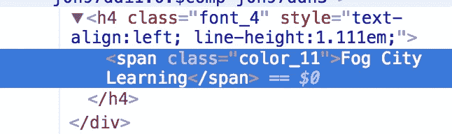
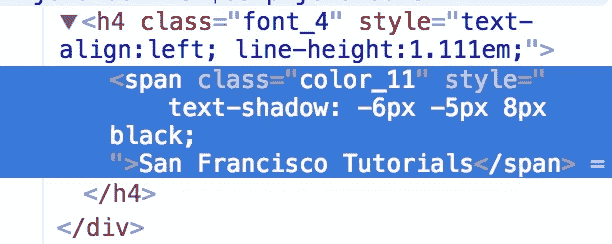
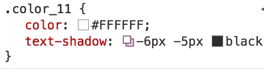

# 从 Chrome Devtools 中获取代码并放入编辑器中

> 原文：<https://medium.com/hackernoon/get-code-out-of-chrome-devtools-and-into-your-editor-defaf5651b4a>

我每天使用 Google Chrome Devtools 来快速测试 CSS 和 HTML 的变化，但有时在我将代码插入元素面板后，我会忘记我实际上做了什么更改。当我试图将代码移植回我的文本编辑器时，这变成了一个令人沮丧的练习。

本系列文章描述了我用来准确判断我做了哪些更改，以及如何将它们返回到我的编辑器中的方法。

**方法 DOM Diff 方法**

当您已经编写了一些直接修改 DOM 或改变内联样式的代码时，这种方法最有效。

例如，假设我添加了一个框阴影，并更改了标题元素的 innerHTML:

before

after

如果我使用纯内联样式进行编辑，页面这个区域的 DOM 会发生变化:

before

after

这是一个简单的例子，我可能会记得将这些更改复制到我的代码编辑器中。但是如果我做了大量的改变呢？

一般的答案是，我可以对页面之前和之后的状态进行“区分”。在开始修改样式和 HTML 之前，我会在控制台上使用以下命令将 dom 的状态复制到剪贴板:

> copy(document . getelementsbytagname(' html ')[0]。outerHTML)

我会将它粘贴到 diff 工具的左侧面板中(我使用 RubyMine 或 [Meld](http://meldmerge.org/) 进行 diff，但你也可以使用在线工具，如 [Mergely](http://www.mergely.com/editor) )。然后我会修改我的样式& HTML 并再次运行相同的命令来获得 DOM 的“after”状态。

我把它粘贴到 Mergely 中，这是我得到的结果:

你可以看到，如果你对页面做了大量的修改，这将是一个非常有用的方法来回忆你到底修改了什么！

**缺点**

这种方法的缺点是，它只适用于直接对 DOM 进行的更改。如果您在样式表本身中编辑 CSS 规则，它将不起作用。

因此，在下面的实例中，我用类“color_11”更改了所有元素，上面的方法不起作用:

我将写一篇后续文章，讨论如何查看对非内联样式的更改。

请查看我在 Udemy 上的 39 讲 Chrome DevTools 初学者到专家课程。通常是 125 美元。 [$10 到 4/23](https://www.udemy.com/master-google-chrome-developer-tools/?couponCode=MEDIUM420) 。

> [黑客中午](http://bit.ly/Hackernoon)是黑客如何开始他们的下午。我们是 [@AMI](http://bit.ly/atAMIatAMI) 家庭的一员。我们现在[接受投稿](http://bit.ly/hackernoonsubmission)，并乐意[讨论广告&赞助](mailto:partners@amipublications.com)机会。
> 
> 如果你喜欢这个故事，我们推荐你阅读我们的[最新科技故事](http://bit.ly/hackernoonlatestt)和[趋势科技故事](https://hackernoon.com/trending)。直到下一次，不要把世界的现实想当然！

