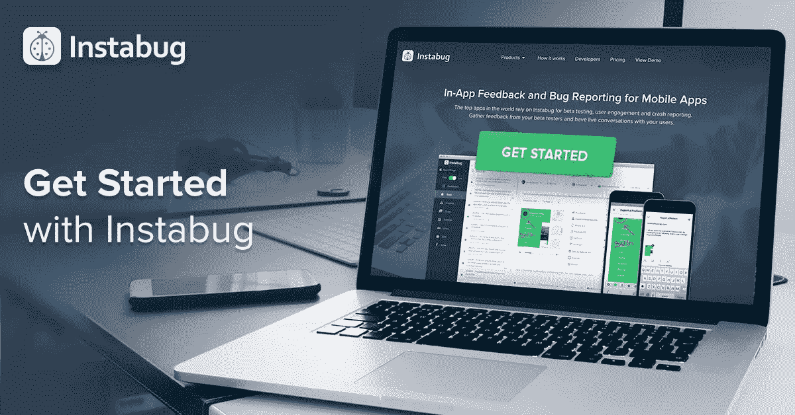
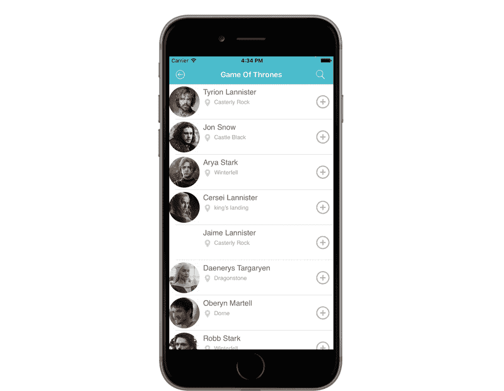
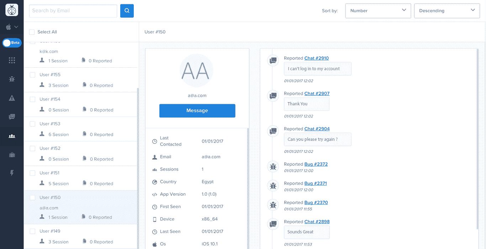
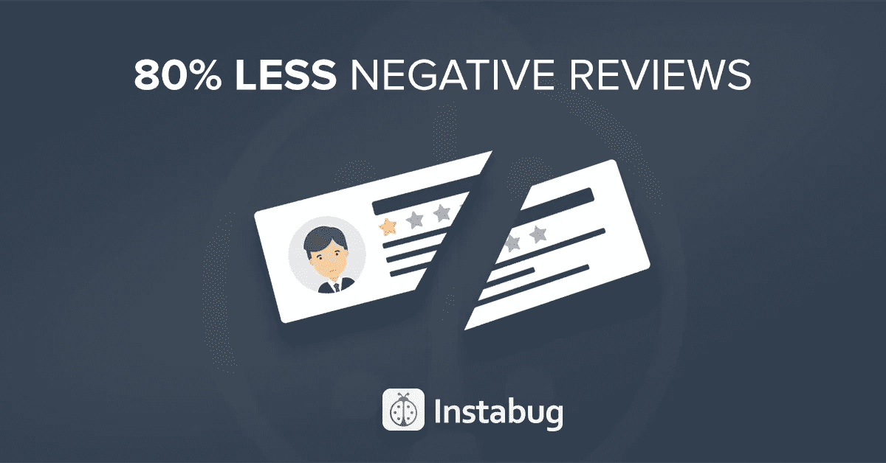
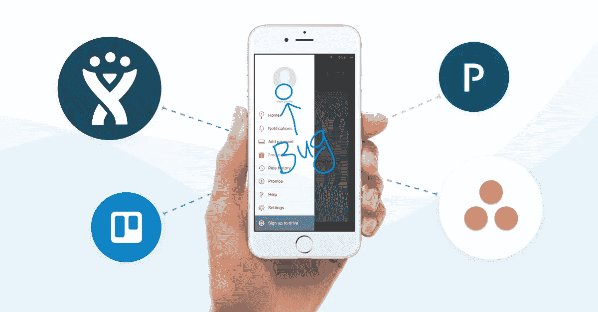

# 获取产品反馈，更快地修复错误，并为您的应用带来 5 星评价

> 原文：<https://medium.com/hackernoon/get-product-feedback-fix-bugs-faster-and-drive-5-star-reviews-to-your-app-e5e1738cd36f>

[**Instabug**](https://instabug.com/) 是针对移动应用的应用内[反馈](https://hackernoon.com/tagged/feedback)和 bug 报告。它允许普通移动用户或 beta 测试人员以最直观的方式提交他们对任何移动应用程序的反馈或报告 bugs 通过摇动他们的设备！它还使开发移动应用程序的团队能够使用它的[仪表板](https://hackernoon.com/tagged/dashboard)更有效地相互协作，在那里他们可以分配 bug，对它们进行评论并添加标签。

凯文·威廉·大卫采访了 Instabug 公司的首席执行官奥马尔·加布。

## 嗨，奥马尔，给我们讲讲 Instabug 吧？

Instabug 是一家 B2B SaaS 公司。通过错误报告、崩溃报告和应用内聊天，Instabug SDK 可以帮助开发人员为他们的企业构建更好的应用。

## 告诉我更多关于你为什么要建立这个的信息？

当我的联合创始人兼 CTO，[**moa taz Soliman**](https://twitter.com/msoliman3890)和我在大学最后一个学期的时候，我们决定建立一个 app。我们很快意识到，应用程序开发过程的某些部分是不必要的乏味和耗时，尤其是在进行 beta 测试的时候。我们对现有的工具不满意，所以我们构建了自己的工具，放弃了应用程序，专注于改进工具。

## Instabug 与市场上已经存在的有什么不同？

当涉及到我们提供给客户的用户数据和日志时，没有任何其他公司能提供我们这样的详细程度。Instabug 是市场上公认的顶级移动应用程序错误报告工具，这为我们扩展崩溃报告和应用内聊天产品奠定了坚实的基础。没有其他公司提供这种特定的工具组合，我们认为这对构建成功的应用程序至关重要。

## 谁会用 Instabug？您的客户在他们的公司中担任什么样的角色？

我们的客户是开发应用程序的公司、独立开发人员和软件代理商。我们与开发人员和项目经理合作。我们真的很高兴有数以万计的企业使用我们的产品，涵盖了一系列行业和应用类别。

## 您的客户如何使用 Instabug？

一些公司使用我们从他们的小型测试组获得关于新推出功能的反馈，其他团队使用 Instabug 来报告错误，并与他们的开发和 QA 团队合作修复它们。

“Instabug 让我们的 beta 测试人员更容易直接从应用程序内部快速发送反馈，帮助我们在易于使用的测试环境中识别和修复关键问题。”——Billy Pham， [**Lyft**](https://medium.com/u/54708edc644b?source=post_page-----e5e1738cd36f--------------------------------) **的 Beta 项目经理。**

“Instabug 的消息传递能力使我们能够快速与测试人员形成闭环，并让他们作为我们测试团队的重要成员参与进来。这使得任何人都可以很容易地开始发送反馈和报告错误。”—塔尔顿·费金斯，在 [**区**](https://medium.com/u/6e0d0a4b41f?source=post_page-----e5e1738cd36f--------------------------------) **进行 PM。**

“当我们集成 SDK 并看到我们的第一份错误报告时，我们知道我们做出了正确的选择。这是如此简单和无缝！现在我们有了用户的即时反馈，这大大加快了产品开发。”— Darius Emrani，PM at [**雅虎**](https://siftery.com/company/yahoo) **。**

## Instabug 有没有你没有想到或预料到的独特用例？

大多数公司在他们的应用程序的 alpha、beta 和生产版本中都使用我们。

真正独特和令人惊讶的是，开发人员开始使用 Instabug 来报告他们自己在模拟器上构建的 bug。与手动提取日志和设备详细信息相比，他们通过 Instabug 向自己报告错误要容易得多。

## 真有意思！

## 有什么早期的“成长秘诀”或策略促成了你现在的成功吗？

老实说，早期对我们有用的是专注于开发开发人员会喜欢的产品，除此之外，提供出色的用户支持。我们相信这两个关键因素使得我们的客户群通过口碑增长。

我们特别强调的一件事是亲自与我们的用户见面。我们拜访他们的办公室，看看他们如何实际使用我们的产品来发现任何见解，但也只是面对面地与他们互动。每当我们访问一个不同的国家时，我们都这样做。

## 在早期构建产品时，最大的挑战是什么？你是如何解决的？

一开始，我们的主要挑战是获得第一批 100 名客户。我们在某种程度上是开发社区的局外人，但我们想接触最好的应用程序。我们给数百家硅谷公司发了电子邮件，但毫无进展。后来，我们改变了方法，对电子邮件进行了创新，使它们变得更加个性化和真实，这很有效。由于没有收到任何回应，我们安排了一次又一次的会议，在那里我们展示了 Instabug。我们收集了人们的真实反馈，了解了我们的弱点和优势，并根据我们收到的评论进一步完善了我们的产品。

## 你加入的最有趣的整合是什么？有什么对你特别有影响的吗？

Instabug 集成了开发人员使用的 15 种最流行的工具。我们最常用的集成是将 bug 自动转发到**和 [**Trello**](https://siftery.com/trello) ，并在 [**Slack**](https://siftery.com/slack) 上即时获得反馈。我们希望确保不打扰用户的工作流程，所以我们找到了他们使用的工具，并基于每个用例构建了每个集成。例如，JIRA 有一个双向集成，所以如果一个问题在 JIRA 被标记为关闭，它在 Instabug 上也会被关闭。**

****

## **你运营公司所依赖的顶级产品是什么&你如何使用它们？**

**[**JIRA**](https://siftery.com/atlassian-jira) :我们工程和产品团队的项目管理。**

**[**Trello**](https://medium.com/u/fb5dd2d116a1?source=post_page-----e5e1738cd36f--------------------------------) :我们营销和运营团队的项目管理和协作。**

**[**条纹**](https://medium.com/u/3ecae35d6d66?source=post_page-----e5e1738cd36f--------------------------------) :为我们付款。**

**[**Slack**](https://medium.com/u/26d90a99f605?source=post_page-----e5e1738cd36f--------------------------------) :从条纹通知到分享 GOT gif 的一切。**

**[**GitHub**](https://medium.com/u/8df3bf3c40ae?source=post_page-----e5e1738cd36f--------------------------------) :为了保持理智。**

**[**AWS**](https://siftery.com/amazon-ec2) :针对云计算。**

**[**Kubernetes**](https://siftery.com/kubernetes) :为了我们的基础设施。**

**[**CircleCI**](https://siftery.com/circleci) :打造更快。**

**[**Google Apps**](https://siftery.com/g-suite-formerly-google-apps-for-work) :用于协作。**

**[**新遗迹**](https://siftery.com/new-relic) ， [**堆分析**](https://siftery.com/heap) ， [**Chartio**](https://siftery.com/chartio) ，[**Google Analytics**](https://siftery.com/google-analytics)， [Baremetrics](https://medium.com/u/432c25701a69?source=post_page-----e5e1738cd36f--------------------------------) ，[段](https://medium.com/u/6e946b6a2866?source=post_page-----e5e1738cd36f--------------------------------):因为我们得不到足够的分析。**

**奖励秘密工具:**

****Akelny** :我们打造的订餐 slack 机器人。在 Instabug，我们要么在吃东西，要么在思考吃东西，要么在计划下一步吃什么，我们一起这么做。但是，在 50 多人的情况下，我们面临着对订单进行分组、管理账单以及将正确的金额返还给正确的人的问题。这是一个烂摊子，所以我们决定做点什么，开发了一个机器人来为我们获取菜单，收集每个人的订单，在线下单，然后让我们知道每个人应该支付的确切金额。从那以后我们一直在使用它，现在我们可以完全专注于重要的部分:吃！**

***原载于*[*siftery.com*](https://siftery.com/stories/get-product-feedback-fix-bugs-faster-and-drive-5-star-reviews-to-your-app)*。***