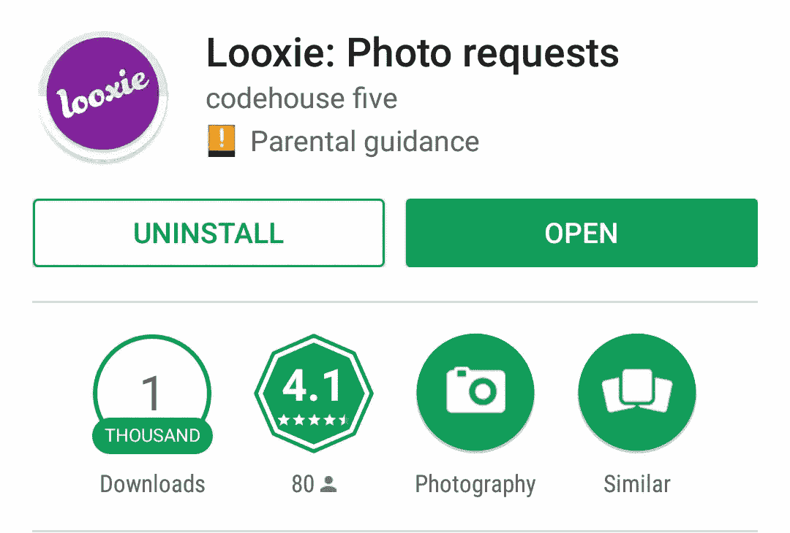

# (尝试)通过制作应用程序快速致富！

> 原文：<https://medium.com/hackernoon/get-rich-quick-by-making-an-app-d575f70b39a0>

“Your app sucks!” / “No, **your** app sucks!”

## 但是你可能会死于尝试

## 从各方面来看，2017 年应该是我基于位置的照片请求应用 Looxie 的辉煌一年。

两年前，如果你告诉我 Looxie 会出现在世界上最大的英文报纸和 TechRadar 的 2017 年 100 款最佳应用以及其他许多地方，我会笑得把你赶出房间。

不过，如果我相信你，我会在脑海中描绘出一幅与目前截然不同的画面:我会想象自己是那些周游世界的企业家之一(我相信现在的孩子称他们为*数字游牧者*),一边在某个海滩上喝着迈泰鸡尾酒，一边用笔记本电脑工作，最好是在巴厘岛。

此外，我的严重压力相关的肠易激综合征将被降级为一天放几个令人尴尬的屁的综合征。

然而，我在这里，白天是一个口腔外科医生，晚上是一个有抱负的技术梦想家，仍然以拔智齿为生，仍然在任何给定的时间里从拉裤子只有十秒钟。

## 我为什么要写这个

如果你像我一样是一个单独的应用程序开发者，这种情况可能以前在你身上发生过:你打开一个受人尊敬的网站的“本周最佳应用程序”综述，看到一个应用程序列表。你想“该死的，儿子——这些家伙成功了。如果我的应用程序包含在类似的列表中就好了。然后我就可以辞掉白天的工作，穿着内衣去收支票了”。

好吧，这有点夸张，但我一直认为，被列入这样的名单是通向成千上万次下载的大门，也许最终会被谷歌收购。

如果你是这么想的，那么如果你的应用程序被包括在这种综述中，你会猛然醒悟。或者不是，因为你读了这篇文章，而且(剧透)你已经准备好了要被打动。

## 互联网金融时报。Looxie

我在 2016 年夏天发布了 Looxie。由于你在发布应用程序后几乎有法律义务这么做，我在我的个人脸书页面、黑客新闻、Reddit 和其他各种渠道和论坛上发布了关于发布的消息。

长话短说，在我所有的帖子之后，Looxie 最终出现在

*   [PhoneArena](https://www.phonearena.com/news/Best-new-Android-and-iPhone-apps-June-14th---June-20th_id82382)
*   [安卓世界](https://androidworld.nl/apps/nieuwe-android-apps-week-26-2016/)
*   拉纳卡在线公司和其他几家当地的印刷和在线商店
*   [安卓世界(再说一次，这些家伙一定喜欢 Looxie)](https://androidworld.nl/apps/looxie-locatiegebaseerde-kiekjes-checken-sturen/)
*   InBusiness(抱歉，没有链接！)
*   [Phandroid](http://phandroid.com/2017/02/03/top-5-android-apps-february-3-2017/)
*   [移动咆哮播客](https://www.youtube.com/watch?v=blUkpITvGz4&feature=youtu.be&list=PLDHf3pOQKOJpqFrj5h4pcFFjCCX0c87b-&t=2798)
*   [这些家伙，我猜是](http://mstarsnews.musictimes.com/articles/120993/20170205/5-best-and-unique-android-apps-on-google-play.htm)？
*   [应用程序](http://www.appszoom.com/android-app/looxie-vzaln.html)
*   中兴的克罗地亚网站(不，真的)
*   [TechRadar 2017 年 100 强](http://www.techradar.com/news/phone-and-communications/mobile-phones/top-210-best-android-apps-2013-693696)
*   印度时报的印刷版

根据我以前发布应用的经验，这不是典型的对应用发布的在线反应。事情看起来不错。

## 该应用程序现在至少有一百万次下载，对吗？

让我跳过这一千字，用一张图来回答这个问题

这张图片有点误导:Play Store 不会显示任何下载量在 1000 到 5000 之间的下载量。根据我最新的 Google Play 开发者控制台统计，该应用程序迄今已被下载了约 4100 次。

4100 次下载。

没错。

## 那么，怎么了？这里出了什么问题？

老实说，没什么。我思考这个问题已经有一段时间了，我把缺乏更快的增长归因于几个原因。

**饱和度**

Play Store 中有超过 200 万个应用程序，你的应用程序被下载 100 次就算幸运了，更不用说 1000 次了。每个人都在争夺关注，但能得到的关注就这么多。

就我个人而言，我过去常常期待“本周最佳”应用列表。我会访问 Android 博客，定期下载所有(或大部分)博客，保留我认为有用的博客。我不再那样做了。如今，在我偶尔查看一些综述的时候，我最多下载几个应用程序。

我的意思是，人们需要多少应用程序？另外，新鲜感已经消失了。

我一直说我不买彩票，也不买刮刮乐，因为我不想靠运气*做成*。相反，我想*让它*因为我自己的努力和奉献。

我现在觉得非常讽刺的是，我认为制作应用程序将是我做到这一点的一种方式，因为通过创建应用程序实际上获得舒适生活的机会必须与在这一点上赢得彩票的机会相当。

**安卓独占性**

没有理由隐藏它，我是一个巨大的安卓粉丝。我甚至从未尝试为 iOS 开发，因为这是一个我不感兴趣的平台。

然而，这对任何应用程序做大的机会都是非常不利的。

首先，所有这些硅谷类型(风投、记者、博客等)主要是苹果设备的用户。如果你的应用不在 iOS 系统上，它可能就不存在。

不仅如此，不幸的是，你不会在安卓开发者和安卓用户之间找到你在苹果平台上找到的那种友情。

许多 Mac 或 iOS 专属产品自豪地宣称它们只对苹果族开放(查看 [Robofont](http://doc.robofont.com/) 和 [Sketch](https://www.sketchapp.com/) 这两个产品的例子，它们在登陆页面上令人眼花缭乱地宣传这一事实)。这是荣誉的象征。

如果你试图宣传你的应用程序只支持 Android，大多数 Android 用户(甚至是铁杆用户)的反应会是“是啊，那又怎样？”。然后你会在 Play Store 得到 1 星的评价，因为你的摄影应用程序不会告诉你如何做普拉提或一些狗屎。

**奖励原因:需要注册**

不仅要求注册，而且要求用户使用他们的电子邮件，而不是提供脸书，推特或谷歌登录/注册。

事后看来，我真是太傻了(不过，我得承认，我刚刚开始学习 Firebase，所以这是我实现注册系统最简单的方法)。

就统计数据而言，这个怎么样？在下载该应用的 4100 名用户中，迄今为止只有 2215 名用户愿意注册。

如果简单方便的话，注册是可以的。如果用户不得不经历重重困难，那肯定不行——毫无疑问:如今，基于电子邮件的注册程序正在经历重重困难。

 [## 给安东尼斯·查加利斯买杯咖啡——BuyMeACoffee.com

### 我是一名 Android 开发人员和设计师，热爱漂亮的用户界面！

www.buymeacoffee.com](https://www.buymeacoffee.com/XozUExS) 

## 无尽的遗憾。还是没有？

不尽然！这可能是一篇年终反思的文章，但创作 Looxie 给我的生活带来了快乐。

Looxie 现在有一群专门的定期用户发送来自世界各地的实时照片。它的实时性使得每张照片都是一种享受，即使对我来说也是如此。不，事实上，*尤其是对我来说:*知道我的应用程序现在正在世界各地被使用*远远超过了我投入开发 Firebase 的费用和时间。*

有趣的是，我认为 Looxie 正在以应有的规模工作。如果它有了上百万的用户，Firebase 的费用会激增，使我无法维持它的运行，因为我没有收到任何资金。Firebase 可以很好地扩展，但我的银行账户不行。这是我开始研究 Looxie 时从未考虑过的。

## 至理名言？

我不是说“不要做 app”。我甚至不是说“不敢做梦”。做一些东西并看到它工作是一种奇妙的感觉，这是我自己会继续做的事情，即使我知道它成功的可能性很小甚至不存在。

我只是说，你应该保持你的期望，如果你看到你的应用出现在 Android 或通用技术博客上，不要放弃你的日常工作。还没有。