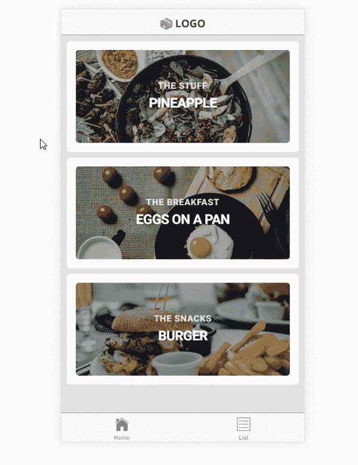

# 立即开始使用 Ionic 3 和移动应用

> 原文：<https://medium.com/hackernoon/get-started-with-ionic-3-and-mobile-apps-today-f8ba0787ebb>


这个世界确实变得移动了。这对任何人来说都不是新闻。随着移动设备满足了用户的大部分需求，用户正不断地抛弃台式机。最近的一份消费者媒体报告提到，多达 2/3 的数字时间是在手机*上度过的。这一数字近年来一直在上升，我猜它会继续上升。然而，这并不意味着应用程序永远是必由之路。Google Play 和 App store 如今充斥着数百万未使用的应用。绝大多数下载量只能归因于少数大型玩家，这强调了进入应用市场的难度。

# 你的应用程序如何适应？

你不必总是为了成为下一个脸书而开发移动应用。应用程序为你提供了一个创造令人惊叹的产品的机会，也是你进入开发世界的一个很好的起点。近年来，我的注意力更多地放在了利基应用上，而不是与软件巨头竞争。这让我实现了创作的愿望，也教会了我很多关于编程和开发的知识。

随着快节奏的技术行业不断产生新的库和开发框架，选择一个起点变得越来越困难。这就是 [Ionic](http://ionicframework.com/) 是一个神奇工具的地方。请记住，从 Ionic 开始，有一些基本的 HTML、CSS 和 [JavaScript](https://hackernoon.com/tagged/javascript) 知识会更容易。我将向您介绍一个简单应用程序的基本结构，并使用我的 starter 应用程序链接到存储库。

*下面是我的入门应用程序:*



启动器基于 Ionic 团队自己的 tabs-starter，它提供了一个很好的起点。我只是简单地扩展了他们的 starter 的特性，加入了一些基本的功能、风格和服务。

*项目结构:*

```
.
   ├── ...
   ├── src                       
   │   ├── app                    # Global Modules
   │   ├── assets                 # data.json and images
   |   ├── pages                  # All pages
   |   ├── services               # Service to get items
   |   ├── theme                  # Global SCSS theme
   |   ├── declarations.d.ts      # Config file
   |   ├── index.html             # Root index
   |   ├── manifest.json          # Metadata
   │   └── service-worker.js      # Cache configurations
   └── ...
```

Ionic 的新版本就像许多现代开发框架一样，是基于组件的第二个版本。这意味着每个页面都被看作是一个单独的组件，具有单独的样式和功能。这使得它非常容易维护，因为所有代码都位于相关的组件中。

*   *应用文件夹*包含所有全局配置。这既是样式也是包含的模块。每当创建一个新组件时，都需要在应用程序中注册它。
*   *资产*文件夹包含所有静态资产。这既是图像，也是 JSON 数据。
*   *pages* 文件夹包含应用程序中的所有页面，而 *services* 文件夹包含服务。
*   主题文件夹保存了所有的 SCSS 变量。所有的颜色都在这个文件中进行了配置，这使得在整个应用程序中快速改变样式变得非常容易。剩下的文件仅仅作为配置，你不需要改变它们。

# **除了离子启动器还包括什么？**

这个应用程序包含了几乎所有应用程序的核心内容。它提供了一个非常简单的服务来从本地 JSON 文件中检索条目。这项服务很容易被你选择的数据库所取代。 [Firebase](https://firebase.google.com/) 正变得越来越流行，并提供了与 Ionic 的极其简单的集成。我的项目中的本地 JSON 数据文件仅仅是为了演示服务如何检索数据。

除了服务之外，我还在组件之间实现了一些简单的数据共享。这个区域和 Ionic 1 相比有了很大的变化，但是一旦你理解了这个概念，它就会变得非常强大。应用程序传递第一个视图中的类别数据，以便只显示列表中的相关项目。从该视图或列表选项卡，您可以访问包含标题、类别、内容和样式背景图像的*单个项目的视图。*

# **生产中是否应该使用 Ionic 3？**

在我看来，Ionic 是为利基行业创建移动应用的完美工具。该框架让你立即投入运行并创建移动应用程序。此外，您将能够利用现有的网络技术知识，并将您的能力扩展到网站和移动应用程序。如果你从未用过 Angular 4，Ionic 是一个不错的起点。你甚至可以快速建立一个组件库，在你的网站和应用程序之间共享。鉴于目前主要发布的离子 3.0，离子可以很容易地用于生产应用程序。

**性能怎么样？**

混合应用程序的性能通常会变得更好，对于较小的利基应用程序的负载也是如此。如果你正在创建一个大规模的生产应用程序，答案可能会不同。我没有为此使用过 Ionic，因此我可能不是回答这个问题的最佳人选。

# **今天就开始**

没有理由等待。如果你对这个领域感兴趣，我建议你尽快开始。您可以在这里找到我的存储库[，这是一个简单应用程序的良好起点。我已经在](https://github.com/kristofferandreasen/simple-ionic-3-app) [GitHub](https://github.com/kristofferandreasen/simple-ionic-3-app) 上描述了更多的技术细节，开始使用不会超过几分钟。我在文章的最后提供了一些参考资料，这些资料是我在使用 Ionic 的头几天使用的。

我希望你喜欢我对 Ionic 3 的简要介绍以及使用这种工具的机会。根据我的经验，等待不会带来任何好处。这也适用于新的开发工具。你会惊讶地发现，只要坚持不懈的努力，你就能如此快速地起床跑步。

关于你想到的任何项目，请随时联系我，我很乐意与你讨论。

[](http://ionicframework.com/) [## 离子框架

### 知道怎么建网站吗？那么你已经知道如何构建移动应用了。Ionic Framework 提供了最好的 web 和…

ionicframework.com](http://ionicframework.com/) 

来源:

[](http://www.smartinsights.com/mobile-marketing/mobile-marketing-analytics/mobile-marketing-statistics/) [## 移动营销统计汇编

### “到 2014 年移动互联网接入将超过固定互联网接入”是总结 2008 年……的大胆预测的大标题

www.smartinsights.com](http://www.smartinsights.com/mobile-marketing/mobile-marketing-analytics/mobile-marketing-statistics/) [](http://bit.ly/HackernoonFB)[](https://goo.gl/k7XYbx)[](https://goo.gl/4ofytp)

> [黑客中午](http://bit.ly/Hackernoon)是黑客如何开始他们的下午。我们是 [@AMI](http://bit.ly/atAMIatAMI) 家庭的一员。我们现在[接受投稿](http://bit.ly/hackernoonsubmission)并乐意[讨论广告&赞助](mailto:partners@amipublications.com)机会。
> 
> 如果你喜欢这个故事，我们推荐你阅读我们的[最新科技故事](http://bit.ly/hackernoonlatestt)和[趋势科技故事](https://hackernoon.com/trending)。直到下一次，不要把世界的现实想当然！

