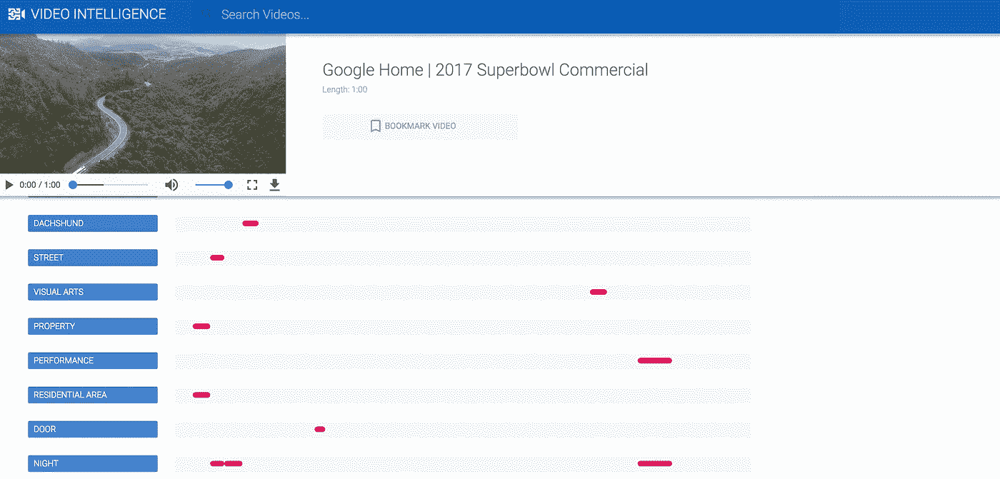
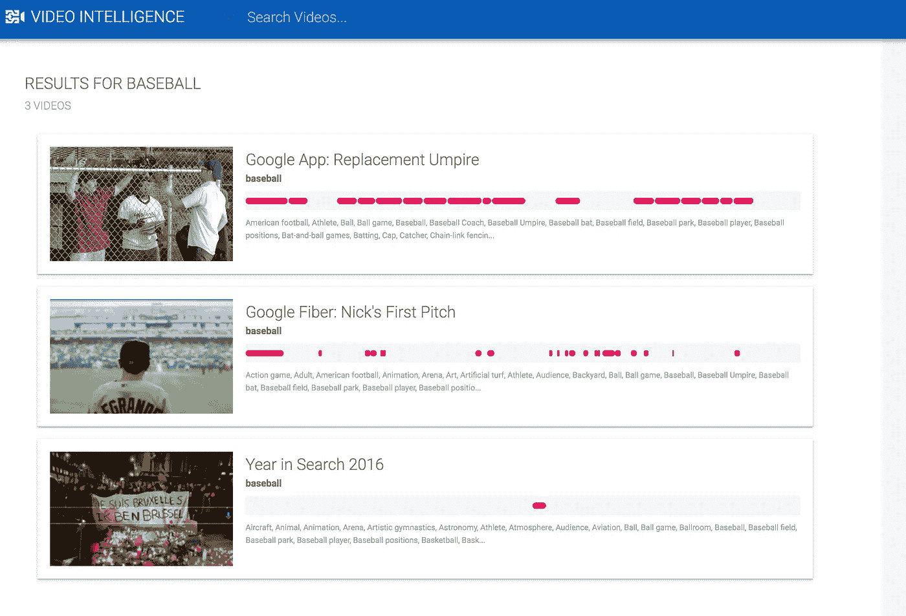
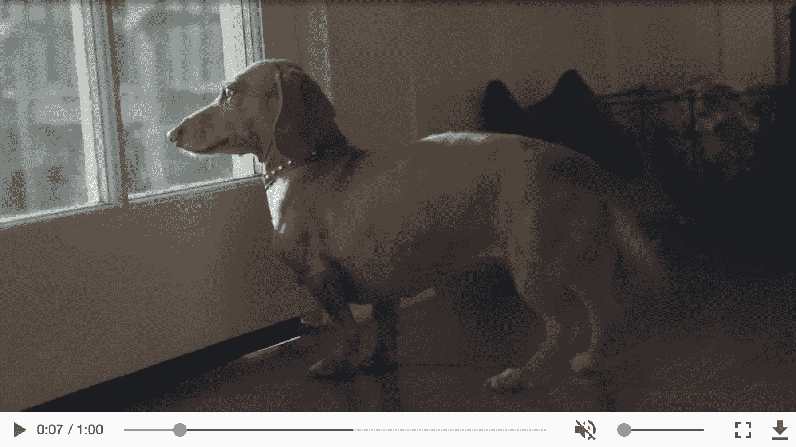
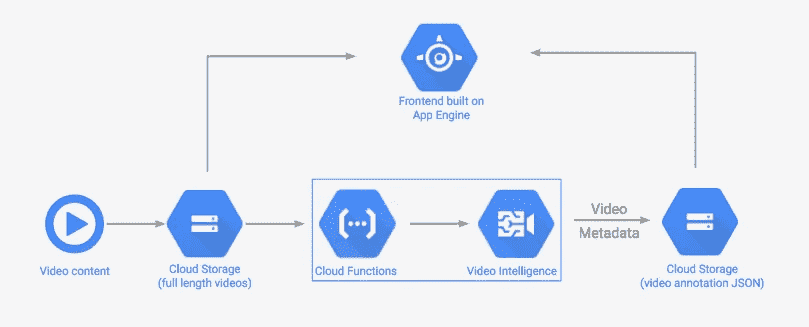

# 用几行代码分析你的视频

> 原文：<https://medium.com/hackernoon/get-the-code-for-the-video-intelligence-api-demo-794e7675effe>

上个月在旧金山举行的谷歌云会议上，我们宣布了[视频智能 API](https://cloud.google.com/video-intelligence)——这种 API 可以通过一个 API 请求轻松分析你的视频内容。为了展示视频 API 的潜力，我构建了一个演示。演示的代码是 [**现在可以在 GitHub**](https://github.com/sararob/video-intelligence-demo) 上找到！该演示展示了如何使用视频智能 API 来:

**查看视频中每个场景发生的事情:**



**使用 API 中的元数据搜索大型视频库:**



# 什么是视频智能 API？

该 API 提供了对预训练模型的访问，该模型从高层次上告诉您视频是关于什么的，以及每个场景中发生了什么的粒度数据。假设你在 0:07 有一个和狗在一起的场景，像这样:



视频 API 告诉你在那个场景中有一只狗，以及所有其他包含一只狗的场景。下面是一个标签的 JSON 响应:

```
{
      "description": "Dog",
      "language_code": "en-us",
      "locations": [ {
        "segment": {
          "start_time_offset": 7090474,
          "end_time_offset": 8758738
        },
        "confidence": 0.99793893,
        "level": "SHOT_LEVEL"
}
```

这个 JSON 以微秒为单位提供了这个标签在视频中出现的片段。对于视频中的同一个片段，API 也告诉我们它是什么品种的狗——它以 81%的置信度返回标签“Dashchund”。

您可能会想，难道我不能以 1fps 的速度从视频中提取帧，然后发送到 Vision API 吗？你可以，但是不要。这就是视频 API 的秘制酱发挥作用的地方。除了上面的镜头级别注释，它还通过一个模型来分析视频中不同帧之间的关系。如果视频有服装和糖果的场景，视频级注释可以告诉你这是一个关于万圣节的视频。最后，API 的镜头切换检测功能将您的视频分成多个场景。这作为 segments 的 JSON 对象返回，指示视频中摄像机镜头的每次变化。

要了解关于视频 API 的更多信息，请查看来自 Google Next 的[这篇精彩演讲](https://www.youtube.com/watch?v=y-k8oelbmGc)，作者是 [Ram Ramanathan](https://twitter.com/ramramanathan1) (视频 API 项目经理)、Juhyun Lee(视频 API 工程师)和 Lynne Hur witz(Wix 工程师)。

# 演示是如何工作的？



在**后端**，应用程序的视频存储在谷歌云存储桶中。我写了一个[云函数](https://github.com/sararob/video-intelligence-demo/blob/master/backend/index.js#L27)，每当一个新文件被添加到这个桶中时就会被触发。该函数检查以确保文件是视频，然后将该文件发送到视频 API 进行注释。方便的是，Video API 允许您有选择地传递一个 outputUri 参数作为请求的一部分——这是一个云存储 URL，API 在完成处理后将在其中写入视频注释。我利用这一点将注释 JSON 存储在一个单独的云存储桶中。

**前端**是一个 Node.js 应用，运行在 App Engine 上，使用 ES6、Sass、Gulp、Canvasjs 和其他一些客户端 JS 工具。我和 Alex Wolfe 一起在 UI 上工作——谢谢你的帮助，Alex！

完成演示后，我有机会在 10，000 人面前展示它(我有没有提到这是一个很酷的工作？！).这是下一个主题演讲的视频:

# 下一步是什么？

你可以直接在浏览器中试用视频 API [，无需编写任何代码。如果你有想要分析的视频，](https://cloud.google.com/video-intelligence/)[注册](https://cloud.google.com/video-intelligence/)视频智能 API alpha，让我知道你的想法。在下面的评论里留言或者在 Twitter 上找我 [@SRobTweets](https://twitter.com/srobtweets) 。

[](http://bit.ly/HackernoonFB)[](https://goo.gl/k7XYbx)[](https://goo.gl/4ofytp)

> [黑客中午](http://bit.ly/Hackernoon)是黑客如何开始他们的下午。我们是阿妹家庭的一员。我们现在[接受投稿](http://bit.ly/hackernoonsubmission)并乐意[讨论广告&赞助](mailto:partners@amipublications.com)的机会。
> 
> 如果你喜欢这个故事，我们推荐你阅读我们的[最新科技故事](http://bit.ly/hackernoonlatestt)和[趋势科技故事](https://hackernoon.com/trending)。直到下一次，不要把世界的现实想当然！

