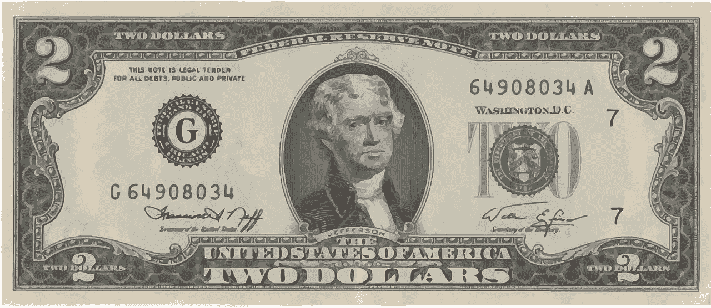

# 给你自己准备 1000 张 2 美元的钞票和 100 个服务员垫

> 原文：<https://medium.com/hackernoon/get-yourself-1-000-2-bills-and-100-waiters-pads-f90181d1fd>

## 生活窍门

> 作者:詹姆斯·阿尔特彻。【JamesAltucher.com 原载

我要休息一天，不再写关于在地板上哭泣的文章。感觉写了 600 个不是失败就是裸男的帖子。

相反，我要分享我做的两件让我的生活变得更好的事情，我不知道还有谁做了这些事情。

**A)给自己准备 1000 张 2 美元的钞票。你可以去当地银行，让他们从美联储订购 2 美元的钞票。**

美联储人扔掉了他们所有的放在 2 美元纸币旁边的古董复印机。也就是说，他们仍然有一百万张有约翰·斯诺签名的 2003 年份的 2 美元钞票。如果你去当地的银行分行要 2 美元的钞票，大约需要 2-3 周才能得到 1000 张。

为什么？

1)当你去一个你打算成为常客的地方时，一定要给 30%的小费，并且全部用 2 美元的钞票。没有人会忘记你，你会永远被善待。再加上人们会为了成为服务你的人而互相争斗。这种感觉真好。你不一定要有钱。你只需要有 2 美元的钞票。

注意:不要浪费 2 美元给出租车司机小费。他们再也不会见到你了。

2)当你闯入一个新的场景时，一定要用 2 美元的钞票。例如，当我开始在华盛顿广场公园下棋时，我总是用 2 美元付账，但当我赢了，我会得到 1 美元或 5 美元。很快，每个人都在囤积他们的 2 美元钞票。我的货币在当地经济中流通。每个人都知道我是谁。这是受欢迎的捷径，因为那是我多么渴望在一群吸毒的无家可归的棋手中找到朋友。

我约会的时候，会带着厚厚的一叠现金。一张 100 美元的钞票在上面，两张钞票填满了整叠钞票。到了付晚餐钱的时候，我会拿出一沓钞票(令人印象深刻)，撕下一张 100 美元的钞票(可怜兮兮)，然后用不停的 2 美元钞票给小费，让自己大吃一惊。“你从哪儿弄来的？”人们总是问。给一个含糊的答案。“我和政府一起做一些项目。”

额外提示:约会前一天晚上去同一家餐馆会有帮助，这样在那里工作的每个人都会很兴奋，期待你会做什么。

4)对话片段。如果你拿出一张 2 美元的钞票，人们会说三件事:“那是什么？”，“你从哪里得到的？”，“它们太美了”

因为就金钱而言，它们是美丽的。我喜欢 2 美元钞票的背面。这么多细节。

**B)购买 100 个服务员护垫。我以前写过这方面的文章，但我怎么强调都不为过。**

1)写想法很容易。而且宽度太短，你放不下很多细节或者写小说什么的。只是用来写想法的。我每天至少在侍者的便笺簿上写十个想法。一年下来，差不多有 4000 个想法。我一周做七天。

2)如果你在餐馆里写下你的想法，服务员会认为你是在做生意，会更快地为你服务。

相信我，这总是管用的。事实上，如果我的服务很差，我只要拿出我的侍者垫，把它放在桌子上，突然每个人都很专心。

3)在商务会议开始时，我拿出服务员的便笺簿，总有人说:“我要两个芝士汉堡和一杯可乐”，每个人都笑了。这是一个很好的话题。

4)这是展示你节俭的好方法。当每个人都拿出一本 40 美元的鼹鼠皮笔记本时，你可以说你花了 10 美分买了服务员的笔记本。当你试图筹集资金的时候，节俭是非常重要的。

我不擅长记名字。服务员便笺簿上每一页的顶部都有代表不同类型桌子的小图形。这些形状有代表每个坐姿的数字。你可以写下谁在开会，他们坐在哪里。

它们可以放在你的衬衫口袋里。而不是几乎所有其他的垫子。

我试图想出第三种生活窍门，但我想不出来。10 年来，我每天都带着侍者的便笺簿和 2 美元的钞票，并取得了巨大的成功。

关键是你在邀请人们进入你的世界。让他们猜测接下来会发生什么。这是一个谜！2 美元的钞票和服务生的便笺是一个好的开始。

哦！还有我特别的握手。但是我会把它留到另一篇文章中。

*【重写说明:这是 1041 字的初稿。最终稿:773 字]*

➤ [为我的时事通讯注册](https://altucher.leadpages.co/start-here/?_ga=1.147953332.2077339586.1472084123?utm_source=medium&utm_medium=syndicate&utm_term=free-updates&utm_content=&utm_campaign=free-updates)。你会收到我最新内容的每日邮件！

➤或访问我的[网站](http://www.jamesaltucher.com/?utm_source=medium&utm_medium=syndicate&utm_term=home-page&utm_content=&utm_campaign=home-page)阅读我的免费博客内容

➤，你有问题吗？在 Quora 上问我…我每天都回答问题！

[*詹姆斯·阿尔图切*](http://www.jamesaltucher.com/?utm_source=medium&utm_medium=syndicate&utm_term=home-page&utm_content=&utm_campaign=home-page) *是畅销书《选择你自己》的作者，* [*的编辑，《阿尔图切报道》*](http://www.thealtucherreport.com/?_ga=1.127276173.1850486739.1486068468?utm_source=medium&utm_medium=syndicate&utm_term=altucher-report&utm_content=&utm_campaign=altucher-report) *和流行播客* [*的主持人，《詹姆斯·阿尔图切秀》*](http://www.jamesaltucher.com/category/the-james-altucher-show/?utm_source=medium&utm_medium=syndicate&utm_term=james-altucher-show&utm_content=&utm_campaign=james-altucher-show) *带你超越商业和企业家精神，探索在一个日益复杂的世界中，作为人类和实现福祉意味着什么。*