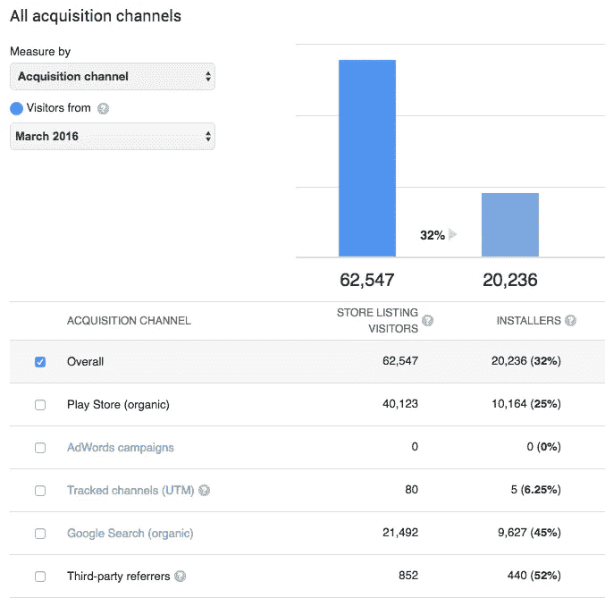
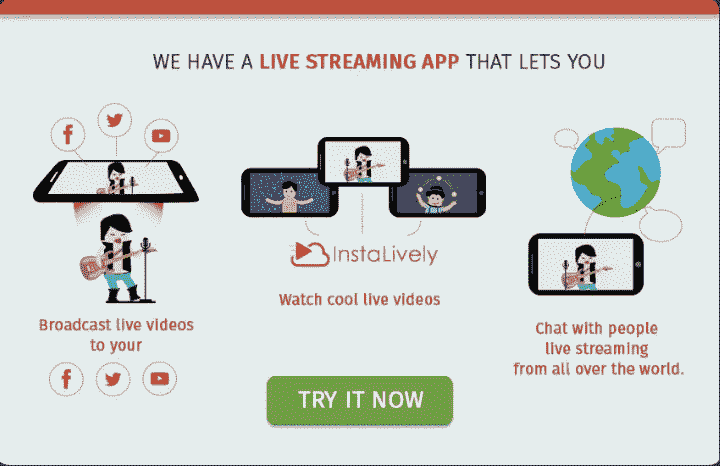

# 在 3 个月内获得 55k 的下载量，没有任何花费。

> 原文：<https://medium.com/hackernoon/getting-55k-downloads-in-3-months-spending-nothing-b9209378c937>

The magic month

正如本系列第 1 部分中提到的[，我们成功地在网站上获得了常规的有机流量，这要归功于谨慎的内容策略，它将相关的人吸引到了网站上。第二个主要挑战是将流量转化为应用程序的下载量。](/@digitallyutkarsh/reaching-0-to-13k-search-traffic-with-just-one-blog-post-in-3-months-818a04959958)

我并不是说我们不需要花钱就能获得下载。这是一个渐进的过程，需要一定数量的钱来安顿下来。一旦解决，它会很容易给你 50k 的下载量，而不用花一分钱。

# 该过程

## 在内容上设置正确的 CTA

一旦用户滚动到底部，我们使用这个横幅作为每个人内容块的覆盖。虽然描述得很详细，但它并不是很具侵入性，因为它通常在用户阅读完博客后出现。这种策略不会给你带来很多下载量。然而，它所做的是在访问你博客的人的潜意识中创造一定数量的品牌回忆。如果一个人回来的次数足够多，他会下意识地知道你的公司是做什么的，即使没有主动搜索过。这是“数字品牌”最基本的形式，你稍后会看到它是有效的。

## 跟踪像素的安装

脸书和谷歌都给你提供了在网页上安装追踪像素的选项。这让你更容易通过谷歌和 FB 广告锁定这些人。由于创造了上述品牌召回，再销售总是比其他活动好得多。人们记住了这个应用程序和它的功能。因此，当它出现在他们的脸书 feed 上时，他们更有可能安装它。我们得到了惊人的卢比消费物价指数。20 (0.3$)做这个。

## 做当地语言的广告

公司联合创始人 Prakhar Khanduja 想出了一个绝妙的主意，用本地语言做广告，而不是在 FB 上做标准的英语广告。结果是，用母语做广告时，CPI 提高了 60%，给我们带来了巨大的 CPI(大约 0.4 美元)。

## ASO-应用商店优化

在做这些事情的时候，作为一个实验，我决定优化 play store 上的内容，看看我会得到什么结果。作为一些关键词研究后的练习，我选择了“直播”、“facebook 直播”、“twitter 直播”、“Youtube 直播”以及这些关键词的不同变体。在对内容进行了大量优化后，我让自己休息了大约一个月，而其余的活动都在进行中。

# 最后

我们只花了一个月的时间做上面提到的付费活动(广告)，在此期间，我们花了相当多的钱在一个月内获得了大约 15k 的下载量。发布一些有趣的事情。有机下载量开始呈指数增长。我们开始在一天内获得 700–800 次有机下载，因为我们已经开始在 Playstore 和 Google 上对相关关键词进行排名。**在‘直播’和 facebook 直播’这两个词上，我们的排名甚至已经超过了 Periscope 和 Meerkat！**

在接下来的几个月里，有机下载的数量逐渐减少，在接下来的三个月里达到了 15000 次；分别是 10000 & 10000 次下载。因此，明智地花钱，同时召回品牌，ASO 给了我 55000 次免费下载！

[如有任何疑问，请联系我](https://in.linkedin.com/in/utkarsh-tripathi-8863502)。

> [黑客中午](http://bit.ly/Hackernoon)是黑客如何开始他们的下午。我们是 [@AMI](http://bit.ly/atAMIatAMI) 家庭的一员。我们现在[接受投稿](http://bit.ly/hackernoonsubmission)并乐意[讨论广告&赞助](mailto:partners@amipublications.com)机会。
> 
> 如果你喜欢这个故事，我们推荐你阅读我们的[最新科技故事](http://bit.ly/hackernoonlatestt)和[趋势科技故事](https://hackernoon.com/trending)。直到下一次，不要把世界的现实想当然！

