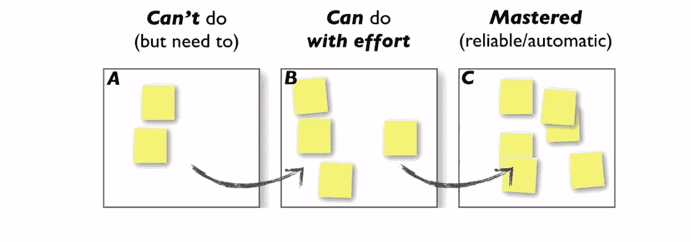
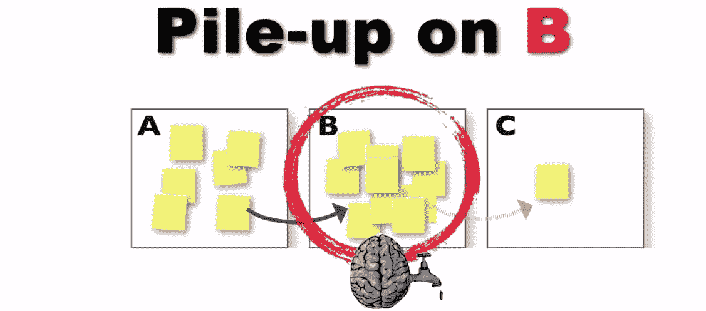
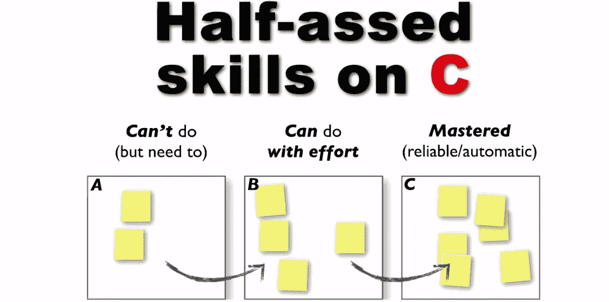
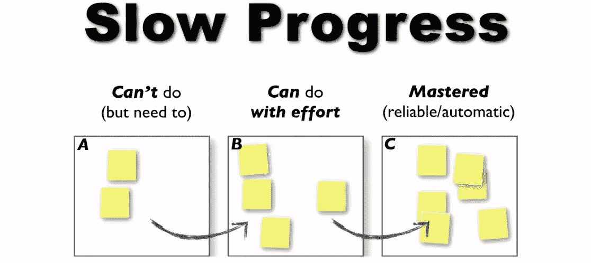
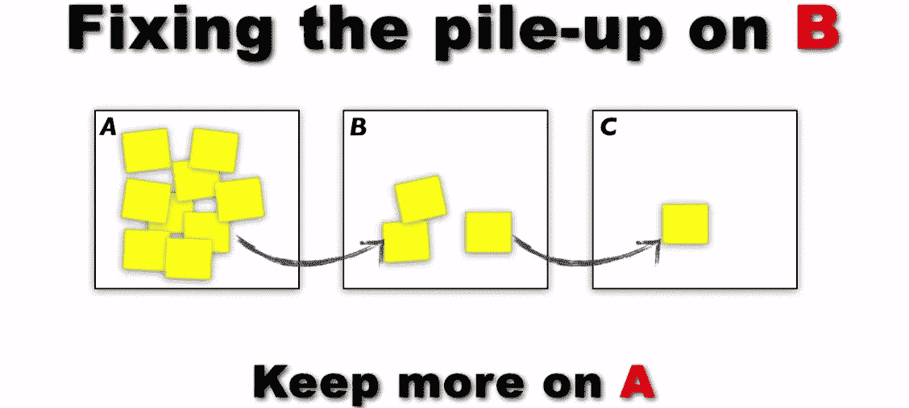
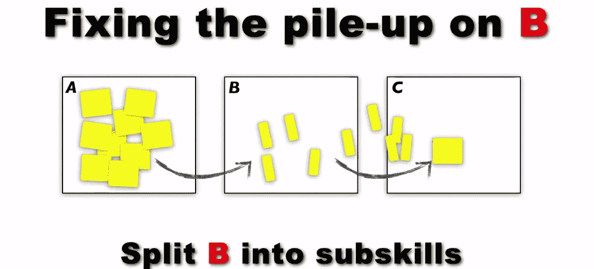
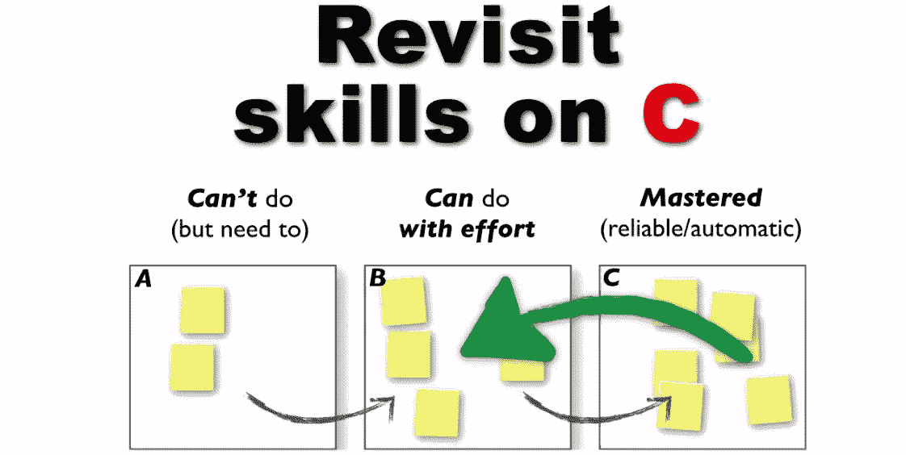
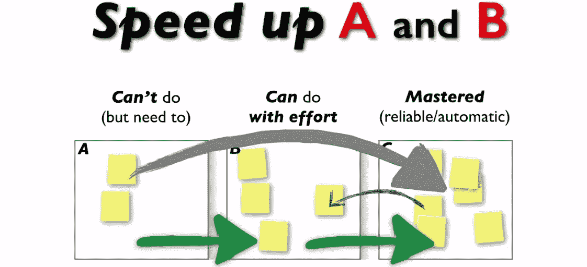

# 进入 Web 开发并学习如何学习

> 原文：<https://medium.com/hackernoon/getting-into-web-development-and-learning-how-to-learn-ccd53f959341>

在这篇文章中，我要感谢视频《让坏蛋开发者——凯西·塞拉》。

你好！。有抱负的 web 开发人员通常会问的一个问题是:要成为 Web 开发人员，我必须知道什么？。虽然你需要为 kickstart 学习 HTML & CSS，但是你会根据你问的人得到非常不同的答案。如果你尝试谷歌一下，情况会更糟，因为你会得到一千个不同的观点，还会在 Quora 或 Stack Overflow 上看到激烈的争论。

W 为什么会这样？这是因为 Web 开发人员可能拥有任何职业中最具活力的技能组合；新的网络技术淡入淡出如此之快，你所知道的很容易过时(虽然它们仍然可以使用，但你会过时)。举例来说，作为一名初露头角的 web 开发人员，我已经在不久前学习的 AngularJS(前端 Web 应用框架)从 1x 到 Angular2 的重大更新中看到了这种情况。是的，Angular 1x 仍然可以使用，但 Angular2 将提供惊人的改进)。

**对于那些仍然好奇的人来说，这可能对你有所帮助**

**HTML 5
CSS
JavaScript
Java
Jquery
underscript . js
backbone . js
angular . js
ember . js
Python
不要让这吓到你，我自己不能声称知道他们所有人。**

在 Web [开发](https://hackernoon.com/tagged/development)中，有很多方法可以完成同样的事情，所以你不必学习所有的框架，但是你应该学习哪一个呢？。主要的问题不是我需要知道什么，而是我怎样才能学得又好又快？(注:在网络中，你可以立即开始使用你选择学习的任何东西，然后从那里开始规划你的道路)。

来自视频([https://www.youtube.com/watch?v=FKTxC9pl-WM](https://www.youtube.com/watch?v=FKTxC9pl-WM))。以下是我从中学到的一些东西:

前提:作为人类，我们大脑中的认知资源有限，就像一个装满水的水箱。所有的精神主张都来自同一个水箱。为了积累专业知识，你必须理解认知(或[学习](https://hackernoon.com/tagged/learning))资源的概念，以及如何有效地管理你的资源。

Sticky notes on A, B and C boards are like coding languages or frameworks.

从上图可以看出，A 是你不知道的，B 是你知道但仍需努力去做的，C 是你已经掌握的(可以自发地做到这一点)。以下是学习 Web 开发时可能会遇到的问题:

1.  你总体上没有好转。原因:堆积在“B”上，即试图学习太多你无法真正掌握的东西，然后转移到“C”上(所以它们堆积在“B”上)。

I wanna learn it all..hahaha

2.你似乎已经掌握了一些东西(现在在“C”上)，但在你内心深处，你知道这不是你能做到的质量。

Are you really there yet?

3.你的学习进度太慢了，花了太多时间。

still in lap 1? I’ve finished lap 3.

**方案** :
1a。在“A”上保留更多内容(从“B”上删除)。你真的还没有学会所有的东西，我再说一遍:你不必现在就学！。最佳方法:在“A”处保持不学东西。
1b。将你现在处于 B 级的技能分解成次级技能，然后掌握它们，这样它们就能达到 C 级。

Dont learn it all!

chew piece by piece

2.重温“C”(你认为你已经掌握的东西)，即把它们带回到“B”来应用 1b。人们发现编码专家经常这样做。

regular gun polishing

3.如果你想学习一些你从来不知道的东西(“A”)并快速掌握它们(“C”)，这是给你的。它通过在非常短的时间内完成非常高质量和高数量(大约 200 个)的例子或代码片段教程。这里的挑战是，我们通常看到的例子并不多。但是在现实生活中尝试一下，在你家附近最繁忙或最受欢迎的机械商店实习，几周后你会成为一名专业学徒。确实如此。

like maths, just use examples and turn to a wonder.

希望我的这篇长文没有消耗你太多的认知资源(P.S 不要介意错别字)，但谢谢你读到这里，继续学习！

还有一个建议:建立网站([http://justbuildwebsites.com/](http://justbuildwebsites.com/))。

非常感谢您的评论、喜欢或分享。谢谢大家！