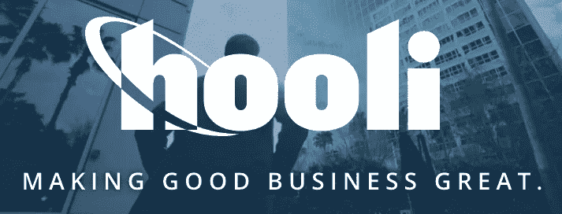
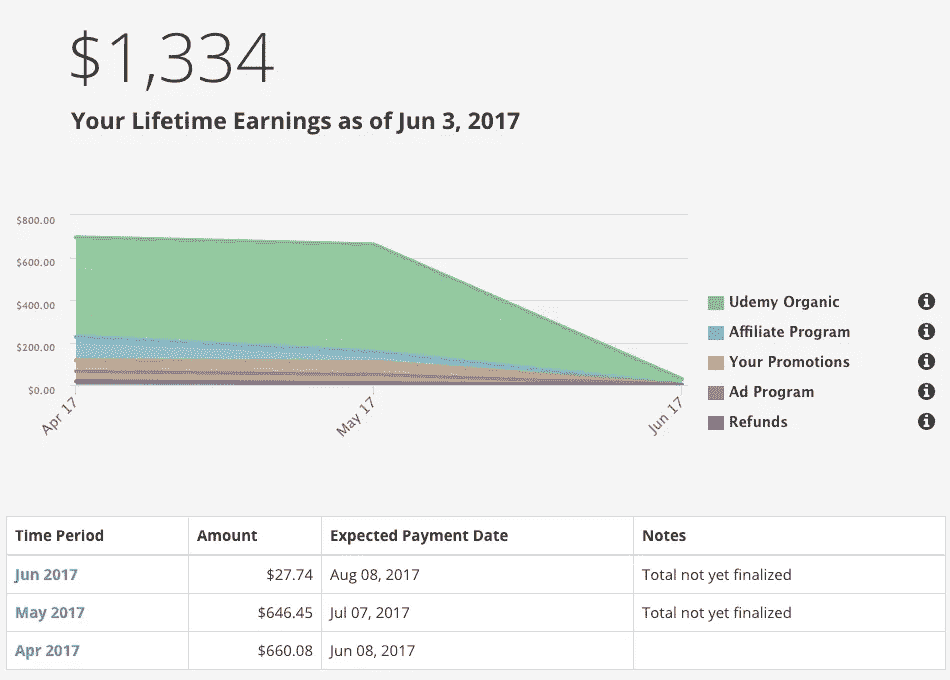
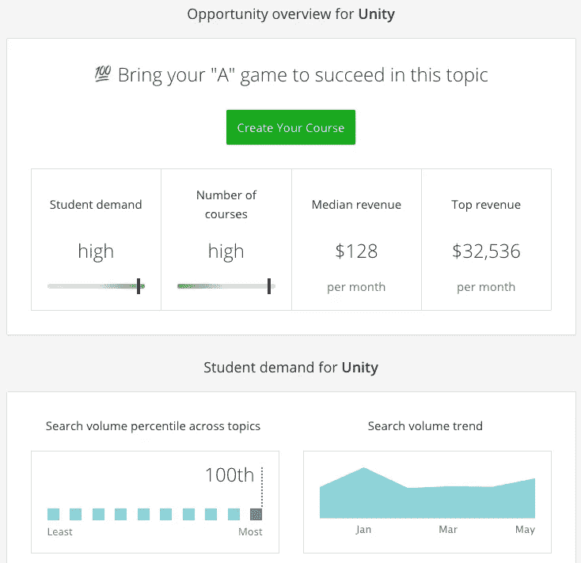
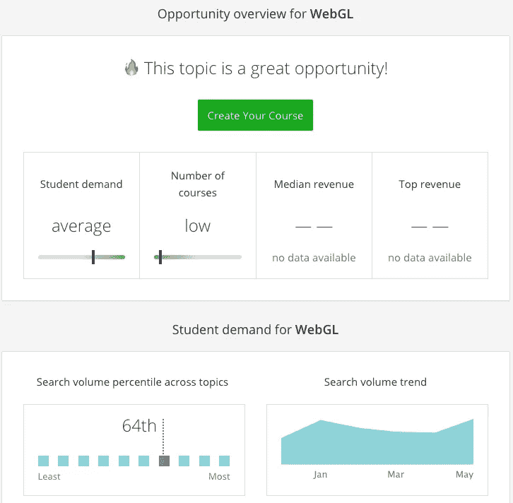

# 有偿学习:在线技术教学热潮

> 原文：<https://medium.com/hackernoon/getting-paid-to-learn-the-online-tech-teaching-hustle-16cf5aa270d1>

支付教育费用太过时了。

几个月前，我在 [Udemy](https://www.udemy.com) 上推出了一门关于[谷歌 Chrome 开发者工具](https://www.udemy.com/master-google-chrome-developer-tools/?couponCode=MEDIUMDISCOUNT)的课程。这篇文章是一点更新，有一些关于我在创建课程的过程中能够实现的学习的想法。

我相信你也可以这样做，在[让世界变得更美好的同时](http://hooli.xyz/)赚钱。

## 创建我的第一个课程

课程创建过程绝对不是免费的。买了学科前五的课程，花钱买了一个[好麦克风](http://www.bluemic.com/products/yeti/)和[录屏软件](https://www.telestream.net/screenflow/overview.htm)。我在关于 Udemy 的第一篇文章[的结尾深入探讨了成本问题，但要点是，如果我把我的时间价值定为每小时 100 美元，那么制作我的课程就要花费我不止$4K](https://hackernoon.com/the-online-tech-teaching-hustle-w-udemy-bdad05e49d02)

这是我在课程发布后两个多月的收入图表。

Don’t worry about the downward trend. It’s because we’re only a few days into June.

我的结果对第一次当老师的人来说绝对不是典型的。我曾在 Udemy 上与另一位成功的导师交谈过，他说他在最初的几个月里挣得少得多。诀窍是我能够找到一个主题:

*   我有很多经验。
*   其他课程已经过时或者只是简单的介绍。
*   其他班级的销售额也很高。

一个月来，我每天查看每门竞争课程的报名人数，并在电子表格上跟踪销售情况。仅供参考，这比看学生总数要好，因为有些教师在课程开始时会发放大量的免费优惠券。(顺便说一句，我不会公开发放免费优惠券)。

## 正外部性

我提到我非常珍惜我的时间，课程的 R&D 和录音花费了大量的时间。但是我在课程创建过程中还收获了什么呢？

I got smarter.

我成了这方面的真正专家。通过阅读文档、实验和观看其他人的课程，我对如何使用谷歌 Chrome 开发者工具有了全面的了解。这帮助我提高了作为软件工程师的工作，并与我一起工作的其他工程师分享我的知识。

## 回到过去

我上大学时，是个骗子。我玩了这个系统。我想出了如何用最少的工作量获得尽可能高的 GPA。我想出了如何同时在多门课程中使用项目，如果我知道我在班上的平均分是 97 分，而 90 分仍能让我得 a，我就会放弃考试。

但是到了当老师的时候，这一切都结束了。当我作为一名研究生在计算机科学 II 的实验室授课时，我真正学会了 C++。没有办法骗我成为一名好教练。我必须真正理解这个话题，才能教给其他人，这是一个警钟。

如果你想真正学会一个话题，试着去教它。

## 我的下一步是什么

我最近放弃了一份高薪的软件工程工作，去开了一家公司( [TINT](http://tintup.com) 正在[招聘](https://jobs.lever.co/tint/114491bb-f40c-4b3c-97c6-c6bca35183a8)我的替代者，顺便说一句)。我现在处于半隐形模式，但是有很多技术我需要获得专业知识。 [WebGL](https://www.khronos.org/webgl/) 和 [Unity](https://unity3d.com/) 就是其中两个。

OK, this is lame PHP code, but you get the point.

由于我一直在学习这些，我一直在做详细的笔记和参考。我正在考虑用 Unity 制作一个关于 WebGL 的课程，因为它将帮助我成为一名专家，并在我为公司开发主要产品时为我赚一些现金。此外，我可以将部分课程内容改编成文章和 Youtube 视频，帮助我推广公司。

## Udemy 的见解

如果你创建一门课程的唯一目的是学习，我会说去吧。但是，除非你做了调查，并且在搜索引擎优化方面很聪明，否则不要指望能卖出很多东西。

Udemy 最近发布了一个新工具，叫做 [Insights](https://www.udemy.com/home/teaching/insights/) (提示:你可能需要一个账号才能访问)。这个工具让你更好地了解学生对某些类型课程的需求。

这是 Unity 的见解页面:

本质上，这意味着 Unity 已经有了很多好的课程内容，但也有大量的需求(搜索量的第 100 个百分点，这意味着这是 Udemy 上搜索的第一主题)。

做一个直线上升的团结课程是没有意义的。这将是太多的工作，其他课程对我来说质量太高，无法有效竞争。但是有了 Unity 的 WebGL 呢？让我们来看看 WebGL 的洞察图表:

WebGL 的课程数量很少，坦率地说，我甚至不知道 web 开发人员是否意识到他们可以使用 Unity 创建 WebGL 内容。他们可能会出于好奇，在搜索用另一种方式学习 WebGL 时购买课程(使用类似于 [three.js](https://threejs.org/) 或类似的库)。

这是我的题目！

我会学习并获得报酬。我要求你也这样做。

## 加入网络组装革命

我现在正在建一些很酷的东西。我很乐意继续关注我的公司(和课程！)随着事情的进展。加入我的[邮件列表](https://upscri.be/1c08e9/)，成为第一个知道的人。

页（page 的缩写）如果你对 Chrome 开发者工具感兴趣，只需 10 美元就可以上我的课[。有效期至 2017 年 6 月 8 日。](https://www.udemy.com/master-google-chrome-developer-tools/?couponCode=JUNE10)

你今天学到新东西了吗？请💚跟着我。这给了我很多动力去写更多这样的文章。