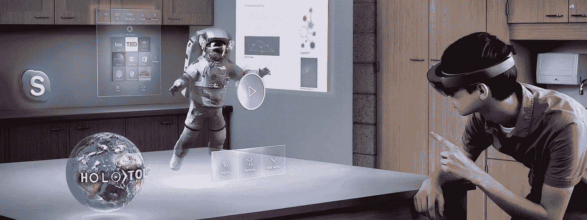

# 增强现实入门

> 原文：<https://medium.com/hackernoon/getting-started-with-augmented-reality-71891ee1e495>

在过去的几年里，增强现实(AR)已经走过了漫长的道路。然而，没有太多的信息可以帮助开发人员理解增强现实的技术是什么，以及开发可靠的增强现实应用程序需要哪些技能。我希望对这一领域有所启发，并希望让你相信这并不难。作为一名全栈 web 开发人员，我花了三周时间掌握 AR 的诀窍，并为我的初创公司建立了一个 MVP。如果你是一个游戏开发者，你可能会更快上手。

实质上，AR 允许数字信息覆盖在真实世界的顶部。然而，根据不同的使用情况，可以使用非常不同的技术来达到预期的效果。

Pokemon Go GPS based 3D rendering (left), Snapchat face recognition (right)

对于基于 AR 的户外导航，例如 Pokémon Go，利用了成熟且易于应用的 GPS 技术。将当前坐标发送到服务器，并返回附近的口袋妖怪。当你选择一个口袋妖怪来捕捉时，特定角色的 3D 渲染会覆盖在场景的顶部。这提供了完整的 AR 体验。这种技术既不难以实现，也不令人印象深刻。应用程序没有试图理解场景的元素，它只需要在地球上定位你。然而，这款游戏确实更容易向不熟悉技术的观众传达 AR 的意义。

在光谱的另一端是 AR 技术，它应用计算机视觉来理解和识别场景中的兴趣点，并在特定的地方覆盖信息。根据不同的目的，使用不同种类和复杂程度的计算机视觉技术。Snapchat 使用实时视频源上的面部特征识别和跟踪作为其社交过滤器。这一点上是最有价值的 AR 公司。与 Pokemon Go 不同，snapchat 需要在每一帧定位你的面部特征，然后才能覆盖任何图形。这是相当令人印象深刻的，因为它不需要任何预定义的模型，并适用于所有的脸。然而，这种检测不需要很高的召回率，因为这些图片是为了社交和娱乐目的而被覆盖的。

下一级计算机视觉扫描周围环境，以理解场景。这需要来自摄像机输入的场景的 3D 模型。如上图所示，机器人下面的环被渲染在桌子上面。因此该装置可以计算出桌子可以用作刨床底座。最令人印象深刻并引起每个人“哇”的反应是当你无法区分现实世界和数字世界时。这种实时体验需要非常高的处理能力(用于计算机视觉和图形)、更大的电源和先进的相机(用于 3D 重建)，而这些目前都无法在移动设备中实现。目前，它们以头饰的形式提供，如微软的 Hololens。这种设备目前非常昂贵和笨重，因此还不是主流。

## **增加摄像机输入**

当您在场景中移动时，您不希望覆盖的信息也跟着移动。它需要相对于真实世界保持静止，而不管你自己的运动。这需要能够“跟踪”场景。在每一帧，在几毫秒内，我们需要知道我们所处的 3D 世界空间的位置和方向。我们可以在 AR 体验上走得更远。我们不是将场景作为一个整体来跟踪，而是跟踪其中的单个物体。因此，如果我们在同一视图中尝试 AR 中的新发型和服装，我们需要在同一帧中同时跟踪头部、身体和手臂。为了获得最令人信服的体验，我们需要在 3D 世界中跟踪不同形状和大小的多个对象。

所以下一个问题是，我们如何在每一帧找到原点？首先，我们需要定义我们在跟踪什么。我们在追踪一个人的脸吗？只看脸还是每个五官？还是手？一个三维物体？一个图像？条形码？然后，我们需要编写一个算法，返回期望目标相对于镜头平面的**位置**和**方向**。如果我们只是得到位置，我们不会知道哪条路是向上的，所以我们也需要方向。两者可以在一个[姿态矩阵](https://en.wikipedia.org/wiki/Pose_(computer_vision))中一起表示。然后你必须根据这个矩阵画出你的增强三维模型。您可以将这个矩阵传递给 3D 渲染引擎，但最好了解一下 3D 渲染管道，它是基于线性代数的。

所以我们来总结一下一帧的 AR 流水线。相机输入被传递给检测引擎，检测引擎返回姿态矩阵。这个姿态矩阵被用作 3D 世界的中心，并且你的定制模型围绕这个中心被渲染。然后嘭，你成功地增加了摄像头的输入。

## 主要挑战

要使 AR 成为主流，必须克服以下问题:

1.  **计算机视觉**——感知场景，识别物体。这是最难的部分。领先的 AR 公司用来解决这个问题的主流库是 [Vuforia](https://www.vuforia.com/) 。如果你需要细粒度的控制，你将需要 [OpenCV](http://opencv.org/) 。OpenCV 是领先的开源计算机视觉库，具有适用于主要平台的 API。
2.  **计算机图形**——渲染 2D/3D 图形，创造出混合现实的效果。这里的挑战是用现实世界的部分知识来渲染。对于图形，您可以直接使用 openGL 或使用引擎，如 [Unity3D](https://unity3d.com/) 。
3.  **显示器—** 打造易于佩戴和使用的透视显示器。这也很有挑战性。目前的选择是手持设备或头盔。Vuforia SDK 适用于 Android/iOS 设备。你也可以选择一款支持 Tango 的设备，它是专门为增强现实应用而设计的。对于头饰，你最好的选择是使用 HoloLens。

全世界都在为解决这些难题做出令人难以置信的努力。如果你只是想开发支持 AR 的应用程序，你不必担心解决所有这些问题。只要你知道如何使用现有的东西，你就准备好构建令人惊叹的 AR 应用程序了。当然，你要记住，这些问题还没有完全解决。所以，准备好在前进的道路上做出一些妥协。Snapchat 和 Pokemon Go 是做出正确妥协的优秀应用程序的例子。