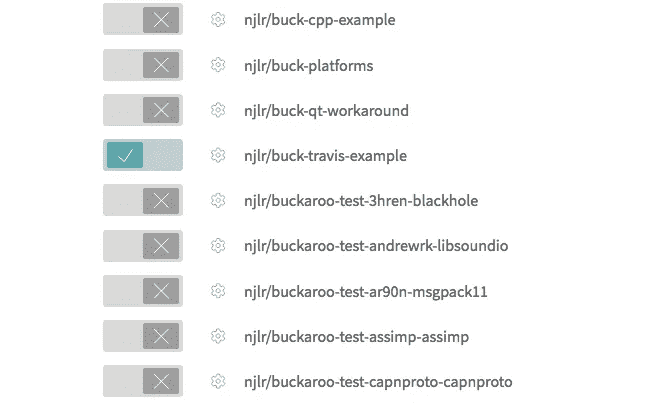

# 从基于 Travis CI 的 Buck build 开始

> 原文：<https://medium.com/hackernoon/getting-started-with-buck-build-on-travis-ci-d1208d363023>

Travis CI, Made in Berlin (Photo by [Markus Spiske](https://unsplash.com/@markusspiske))

[Travis CI](https://travis-ci.org/) 是一项为开源项目提供免费构建服务器的服务([谢谢，风投们！](https://www.crunchbase.com/organization/travis-ci/timeline#/timeline/index))。它与 GitHub 紧密集成，允许您在合并之前自动构建和测试 pull 请求中的代码。这对于有多个参与者的项目来说是非常好的，因为您可以运行测试而不用自己签出代码。

但是你如何将一个基于 Buck 的项目与 Travis CI 整合起来呢？

要遵循本指南，您需要具备以下条件:

*   用 Buck 构建的 GitHub 项目
*   关于[特拉维斯 CI](https://travis-ci.org/) 的一个记述

## TL；速度三角形定位法(dead reckoning)

从 GitHub 上的[示例报告中获取相关文件。](https://github.com/njlr/buck-travis-example)

## 创建. travis.yml 文件

Travis 项目的核心是`.travis.yml`文件。这是一个 YAML 文件，它定义了项目的构建步骤和构建环境。最重要的属性是`script`，它是 Bash 命令的列表。

例如:

Run build.sh on Ubuntu “Trusty”

## 安装生成依赖项

Buck 没有与任何 Travis 系统映像打包在一起，所以我们需要在 Travis 文件中添加一个安装步骤。安装步骤活在`before_install`元素下。

让 Buck 在 Linux 上运行最简单的方法是通过 [Linuxbrew](http://linuxbrew.sh/) ，这是[家酿](https://brew.sh/)的 Linux 端口。像 Homebrew 一样，Linuxbrew 允许我们在用户空间轻松地安装软件包，并且它基本上是软件包兼容的。

此代码片段在项目生成之前运行。首先，它安装 Linuxbrew，然后使用 Linuxbrew 安装 Buck。

你可能已经注意到我们*没有*使用提供的 Linuxbrew 安装脚本。这是因为最好将所有内容都保存在主文件夹中，这样可以确保 Travis 用户拥有读写权限。

一旦我们安装了 Buck，`.travis.yml`的`script`部分可以调用 Buck:

综上所述，我们有以下几点:

将该文件添加到您的项目的根目录，并确保将`buck build`命令更改为指向正确的 Buck 目标！

## 将 Travis CI 连接到 GitHub

一旦 Travis 文件就绪，您需要将 Travis CI 连接到您的 GitHub 项目。[在 Travis CI](https://travis-ci.org/) 上创建一个账户，然后轻触你想要整合的项目。

Travis 现在将与您的项目集成在一起，它将开始构建`master`。您还会注意到有用的通知出现在您的拉取请求中！

## 加速构建

构建需要一段时间，因为每次都要安装所有的依赖项！我们可以通过利用 Travis CI 的缓存功能来大幅改善这一点。

Travis CI 允许您将目录标记为缓存的，这意味着它可以在两次构建之间重用。由于我们在 userland 中安装了 Linuxbrew，我们可以缓存整个`~/.linuxbrew`目录。在后续的构建中，Linuxbrew 将检测到我们的依赖项已经安装，并跳过安装步骤。

我们还需要确保我们不会`git clone` Linuxbrew 两次:

把所有东西放在一起就能得到完整的特拉维斯档案。

## 结论

就是这样！完整的 Travis 文件应该足以开始，或者您可以从 GitHub 上的[示例 repo 中获取相关文件。](https://github.com/njlr/buck-travis-example)

> [黑客中午](http://bit.ly/Hackernoon)是黑客如何开始他们的下午。我们是 [@AMI](http://bit.ly/atAMIatAMI) 家庭的一员。我们现在[接受投稿](http://bit.ly/hackernoonsubmission)并乐意[讨论广告&赞助](mailto:partners@amipublications.com)机会。
> 
> 如果你喜欢这个故事，我们推荐你阅读我们的[最新科技故事](http://bit.ly/hackernoonlatestt)和[趋势科技故事](https://hackernoon.com/trending)。直到下一次，不要把世界的现实想当然！

