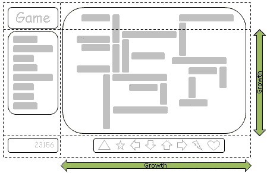
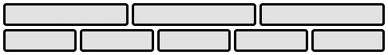
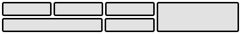
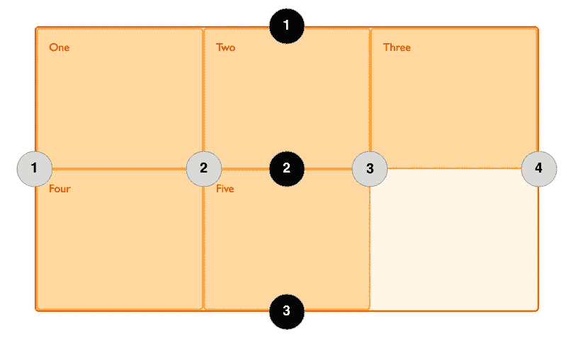

# CSS 网格布局入门

> 原文：<https://medium.com/hackernoon/getting-started-with-css-grid-layout-8e00de547daf>

Image via: [Samuel Zeller](https://unsplash.com/@samuelzeller)

## 帮助您快速掌握的有用资源和教程

是的， **CSS 网格布局**是🔥 [*如此火爆*](http://gph.is/1jFLtFf) 🔥就现在。布局系统最近获得了主流支持——最新版本的 Firefox、Chrome Opera 和 Safari 现在都符合该规范。

但是，只是**什么是 CSS 网格布局**(又名“网格”)**它能做什么**，**真的是量产就绪**？我将列出你需要知道的，并分享大量方便的资源，这样你就可以开始了。👍

# 什么是 CSS 网格布局？

首先，回顾一下历史——六年前的**网格诞生了，通过一份来自[微软](https://hackernoon.com/tagged/microsoft)的提交给 [CSS](https://hackernoon.com/tagged/css) 工作组的提案。这篇 2011 年 4 月的[博客文章概述了最初的提议](https://blogs.msdn.microsoft.com/ie/2011/04/14/ie10-platform-preview-and-css-features-for-adaptive-layouts/)，并提到 Grid 和 Flexbox 最终将如何实现可靠的“自适应布局”。**

****

**How Microsoft visualized what Grid would aim to achieve back in 2011.**

**撇开历史课不谈，下面是 W3C 对网格的简要描述:**

> **这个 CSS 模块定义了一个基于二维网格的布局系统，为用户界面设计进行了优化。在网格布局模型中，网格容器的子容器可以放置在预定义的灵活或固定大小的布局网格中的任意位置。**

**如果你想从 W3C， [*更深入地挖掘完整的规范，你可以在这里*](https://www.w3.org/TR/css-grid-1/) *。***

****但是这和 Flexbox 有什么区别呢？**嗯，Flexbox 是单轴定向的，而 Grid 允许内容在*和*两个维度上对齐；正如下面这些来自 W3C 的[插图所强调的:](https://www.w3.org/TR/css-grid-1/#intro)**

****

**An example of a Flexbox layout**

****

**What can now be achieved with Grid Layout**

**CSS Grid Layout 是一个新的、强大的布局系统，它允许一个网页很容易地被分成列和行。**

**使用 Grid，您可以轻松制作多栏布局。**

****

# **有用的资源和教程**

**在浏览器获得支持的同时，在过去的几周里，大量优秀的教程和介绍性的帖子不断涌现。我们一直很关注它们，这里有一些最好的链接和资源，可以帮助你开始尝试 CSS 网格布局。**

## **[网格布局的基本概念](https://developer.mozilla.org/en-US/docs/Web/CSS/CSS_Grid_Layout/Basic_Concepts_of_Grid_Layout)**

***由* Mozilla 开发者网络提供**

****

**介绍什么是网格，网格容器如何工作，如何嵌套网格项目等等。**

> **【developer.mozilla.org **

****

## **[CSS 网格布局完整指南](http://chris.house/blog/a-complete-guide-css-grid-layout/)**

***由*克里斯豪斯**

****

**涵盖最新版本网格规范的全面指南。Chris 回顾了您需要了解的所有属性，并提供了顶层概念的概述— *所有内容都带有实用代码和可视化示例*。**

> **[*chris.house/blog/a-complete-guide-css-grid-layout*](http://chris.house/blog/a-complete-guide-css-grid-layout/)**

****

## **[示例网格](http://gridbyexample.com/)**

***由*到[我能使用吗](https://medium.com/u/be9c04b39015#feat=css-grid)总体上看起来很不错，表明大多数主流的、最新的浏览器已经准备就绪，可以支持无前缀的 CSS 网格属性。**

**微软是明显的例外，Edge 和 IE 都只通过`-ms-`前缀提供部分支持。Edge/IE 中的原生支持正在进行中 css 网格实现的更新现在是开发者要求的顶级功能之一*(*⬅️*如果你想尽快看到它，可以在这里投票)*。**

**现在，尽管大多数浏览器都支持网格布局，但只有最新版本支持——这代表了全球浏览器使用量的 30–40%。因此，除非你知道你的用户在使用最新的浏览器，否则 Grid 还不能完全适应主流网站。然而，这并不意味着你应该开始尝试和掌握事物。**

****

****想要更多这样的？**订阅 [*FrontEnd Focus*](http://frontendfocus.co/) 获取每周电子邮件，其中包含来自前端 web 开发世界的最佳链接、新闻和教程:**

************

> **[黑客中午](http://bit.ly/Hackernoon)是黑客如何开始他们的下午。我们是 AMI 家庭的一员。我们现在[接受投稿](http://bit.ly/hackernoonsubmission)并乐意[讨论广告&赞助](mailto:partners@amipublications.com)机会。**
> 
> **如果你喜欢这个故事，我们推荐你阅读我们的[最新科技故事](http://bit.ly/hackernoonlatestt)和[趋势科技故事](https://hackernoon.com/trending)。直到下一次，不要把世界的现实想当然！**

****