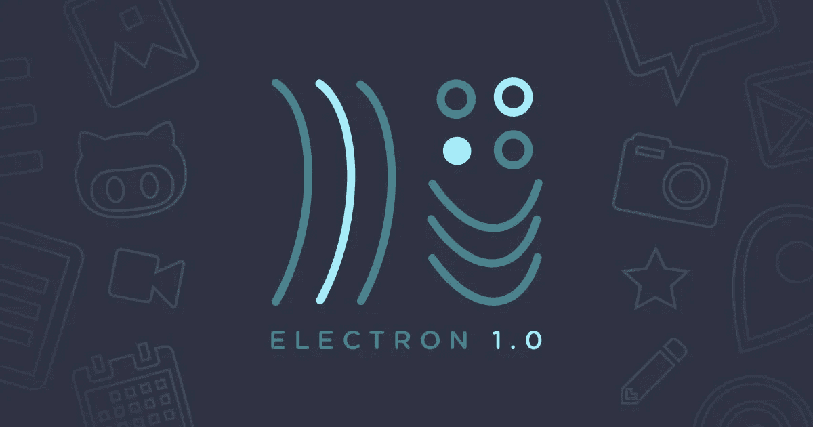

# 通过构建 Markdown 应用程序开始使用电子产品

> 原文：<https://medium.com/hackernoon/getting-started-with-electron-a110470d4a6c>



你是否曾经想在成为一名真正的 web 开发者的同时开发桌面应用程序，而不关心大多数应用程序为不同平台(如 Windows、macOS 或 Linux)构建的原生架构或语言？或者您只是想开始构建桌面应用程序？如果你能够使用你已经知道的技术，比如 HTML、 [JavaScript](https://hackernoon.com/tagged/javascript) 和 CSS，来构建桌面应用程序，这不是很棒吗？我也有同样的冲动想进入桌面应用的世界。所以，最近一直粘在 [GitHub](https://github.com/) 的[电子](http://electron.atom.io/)上。

# 什么是电子？

从 Electron 的官方网站来看，***“Electron 是一个使用 JavaScript、HTML 和 CSS 等 web 技术创建本地应用程序的框架。它会处理困难的部分，这样您就可以专注于应用程序的核心。”***

*甜甜的*。不是吗？你可能想知道是哪些难的部分？！Electron 基本上可以轻松实现自动更新、本地菜单和 API、应用崩溃报告、应用调试，这在市场上的许多类似解决方案中是找不到的。如 [nw.js](http://nwjs.io/) 以及任何项目有 GitHub 做后盾的时候，闭着眼睛都可以用。

# 开始构建应用程序

我学习新技术的哲学是采用现实世界的想法，并尝试用特定的技术实现它。在这种情况下，我决定构建一个简单的 [Markdown 编辑器应用程序](https://github.com/amitmerchant1990/electron-markdownify)，它可以执行以下操作:

*   在编写的同时显示 Markdown 的实时预览
*   显示降价的相关 HTML
*   基本降价编辑
*   支持 GitHub 风格的降价

因此，考虑到上述需求，我已经开始构建它，首先克隆[快速入门库](https://github.com/electron/electron-quick-start)

```
$ git clone https://github.com/electron/electron-quick-start

$ ren electron-quick-start electron-markdownify

$ cd electron-markdownify

$ npm install && npm start
```

这给了我非常基本的电子结构和所有必要的节点依赖安装，包括电子预建，这是任何电子应用程序的心脏，并启动应用程序本身！

app 的文件夹结构包含一个 *main.js* 文件、一个 HTML 文件和 *package.json* 。

这里是项目的 *package.json* ，它包含了这个项目所需的所有依赖项和 devDependencies。

电子在运行时基本上运行两个进程:1) **主进程** 2) **渲染器进程**。

简而言之，Electron 提供了一个运行时来用纯 JavaScript 构建桌面应用程序。它的工作方式是——Electron 获取一个定义在 *yourpackage.json* 文件中的主文件并执行它。这个主文件(通常命名为 *main.js* )然后创建应用程序窗口，其中包含渲染的 web 页面，并增加了与操作系统的本地 GUI(图形用户界面)进行交互的能力。

渲染器过程涉及我们在 HTML 中编写的核心 JavaScript，以驱动应用程序的前端功能。

接下来，为了方便用户写减价，我使用了基于 web 的代码编辑器 [CodeMirror](http://codemirror.net/) 。这使得写 Markdown 变得容易和漂亮。

此外，由于我的应用程序是一个 Markdown 编辑器，我需要一个 Markdown 解析器，它可以将普通的 Markdown 转换成可以预览的 HTML。因此，我使用了这个名为[标记为](https://github.com/chjj/marked)的出色的 Markdown 解析器。它有我需要的所有东西，包括 GFM。

结合所有的零碎，我终于完成了我的原始原型。你可以在[这里](https://github.com/amitmerchant1990/electron-markdownify)看到最终产品。它是开源的。所以，你可以叉它，玩它，可以让它成为你自己的。

# 最后的话

在整个旅程中，我探索了许多关于桌面应用程序开发的新事物，比如打包和分发应用程序，处理不同操作系统的异常等等。

该应用程序仍处于测试阶段，我还在学习电子。我对电子了解得越多，我就越喜欢它。这肯定是桌面应用的未来。

*那都是乡亲们！*

点击可以阅读原帖[。](https://www.amitmerchant.com/Getting-Started-With-Electron/)

[](http://bit.ly/HackernoonFB)[](https://goo.gl/k7XYbx)[](https://goo.gl/4ofytp)

> 黑客中午是黑客如何开始他们的下午。我们是这个家庭的一员。我们现在[接受投稿](http://bit.ly/hackernoonsubmission)并乐意[讨论广告&赞助](mailto:partners@amipublications.com)机会。
> 
> 如果你喜欢这个故事，我们推荐你阅读我们的[最新科技故事](http://bit.ly/hackernoonlatestt)和[趋势科技故事](https://hackernoon.com/trending)。直到下一次，不要把世界的现实想当然！

[](https://goo.gl/Ahtev1)