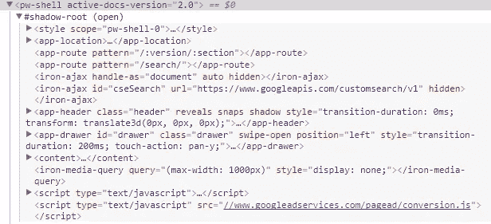

# 谷歌聚合物入门

> 原文：<https://medium.com/hackernoon/getting-started-with-google-polymer-6e57f5a05906>

嗯！他们说“经验是智慧之母”，因此，作为一个最近加入[聚合物爱好者](https://hackernoon.com/tagged/polymer-fandom)(接触两个月)的人，我将带你了解聚合物的具体细节。

所以，没有任何晦涩难懂的废话，让我们从聚合物的基本定义开始！

# **什么是聚合物？**

Polymer 是一个 JavaScript 库，用于使用 web 组件创建 Web 应用程序。

mkk

现在，您可以将 web 组件视为可在网页或 Web 应用程序中使用的可重用元素。这意味着您也可以将它与其他 JavaScript 库一起使用。聚合物就像一块“乐高积木”，可以用来建造任何东西，几乎任何东西。

# 为什么是聚合物？

假设你想给自己做一个学习桌。你要做的是:根据你的要求把一段木头切成小块，制作桌面和桌腿，把这些小块弄平，然后把它们连接起来。

相当长的过程，不是吗？

不如你去拿零件组装桌子吧。超级简单。

这就是聚合物的工作原理。你想使用某个组件，导入并使用它，你不需要知道它是如何工作的。你想和 Angular，React 或者 Vue 或者其他一些 JS 库一起使用，只要导入使用就可以了。

# Web 组件的 4 个主要特性

*   **HTML 导入:**更容易导入 HTML 文档。类似于导入 CSS 文档。
*   **自定义元素:** It 帮助开发者创建自己的元素。
*   **HTML 模板:**它保存页面加载时不呈现的内容，但可以在运行时使用 JavaScript 实例化。简而言之，它包含的 HTML 标记在页面加载时不会呈现，但可以在以后使用 JavaScript 呈现。
*   **暗影 DOM:** 暗影 DOM？这是什么？我刚听说了大教堂的事。
    影子 DOM 在 DOM 中插入一个名为影子根的新节点，并在 DOM 和影子根之间创建一个边界，这样根内的元素(Web 组件)保持模块化，并与主 DOM 分离。还不明白？别担心。下面我来解释一下。

# 聚合物怎么用？

确保安装 Node.js、npm、Git、Bower 和 Polymer CLI。您可以遵循[聚合物网站](https://www.polymer-project.org/2.0/start/install-2-0)上的设置指南。

现在，让我们进入一些代码。

这是我们要做的东西的现场演示。

```
<link rel="import" href="../polymer/polymer-element.html">
<link rel="import" href="../paper-input/paper-input.html">
```

`link rel="import”`是一个 HTML 导入。这将导入聚合物库和一个名为 paper-input 的自定义元素。

```
<dom-module id="basic-example">
<template>
  <style>
    paper-input{
      width: 150px;
    }
  </style>
  <p>Name: [[name]]</p>
  <paper-input value="{{name}}" label="Name"></paper-input
</template>
```

*   `<dom-module>`包装定制元素，包括定制元素的样式、脚本和标记。属性用于将元素包含到主文档树中。
*   `<template>`定义元素的结构和样式。
*   `<template>`中的`styling`定义了元素的样式。
*   `[[name]]`是一个单向绑定。它将显示“名称”属性的值。
*   `<paper-input>`是一个自定义元素，基本上是一个文本字段。`{{name}}`是双向绑定，这意味着如果我们在输入中键入一些内容，它会立即反映在“name”属性中，并将“name”的值更改为键入的任何值。

```
<script>
  class BasicExample extends Polymer.Element{
    static get is(){return 'basic-example';}
    static get properties(){
      return{
        name: {
          type: String,
          value: ""
        }
      }
    } 
  }
  customElements.define(BasicExample.is,BasicExample);
</script>
```

*   这是`<script>`标签内的 ES6 类语法。
*   给元素起一个名字，这样当我们在标签中使用它时，浏览器就能识别它。该名称必须与元素的模板定义`<dom-module id="basic-example">`中给出的`id`相匹配。
*   `customElements.define(BasicExample.is,BasicExample);`这里自定义元素 API 调用`define`方法来注册名为`basic-example`的元素，其类名为`BasicExample`。

现在，我们的定制元素可以在任何地方使用。您所需要做的就是将这个定制元素导入到您想要使用这个元素的文件中，就这样。

例如，如果您想在名为`index.html`的文件中使用这个元素，那么您将导入它并如下使用它:

`<link rel="import" href="path-to-element/basic-example.html">
<basic-example></basic-example>`

# 回到影子王国

如果你还不明白什么是阴影 DOM，这完全没关系。我花了很长时间才明白什么是暗影 DOM。让我用一个例子来解释一下。

假设您用一些不错的 CSS 制作了一个没有阴影 DOM 的自定义元素。其他一些开发人员希望在他/她的 web 应用程序中使用您的元素。如果他/她的应用程序的样式类与您的 web 组件中的样式类匹配，那么它将覆盖您的元素中的样式。那真的很糟糕，没有人想要那样。为什么地球上的开发人员会导入 web 组件，然后花时间改进它的样式？这也是使用影子 DOM 的主要原因。

换句话说，它**封装了**定制元素的样式、脚本和结构。为了让事情更加清楚，我添加了下面的图片。



这是聚合物网站的截图。是一些组件，它的所有样式、结构和脚本都在影子根中。

# 聚合物的下一步是什么？

上周在聚合物峰会上宣布了以下内容:

*   聚合物 3.0 公布。
*   使用 NPM 和纱线，这意味着不再有凉亭。
*   使用 ES6 模块，意味着不再有`<link rel="import">`。
*   将代码从 Polymer 2.0 迁移到 3.0 的简单迁移工具[T5。](https://hackernoon.com/tagged/tool)

新的 YouTube 是迄今为止使用聚合物开发的最大项目。

到目前为止，你至少已经对聚合物及其工作原理有所了解。

所以，试试[这里](https://www.polymer-project.org/2.0/start/first-element/intro)并构建你自己的定制元素。

**感谢阅读本文。如果你喜欢，请点击*拍手*按钮。** 在 [LinkedIn](https://www.linkedin.com/in/amanshu-kataria/) 上联系我。在 Twitter 和 Quora 上关注我。