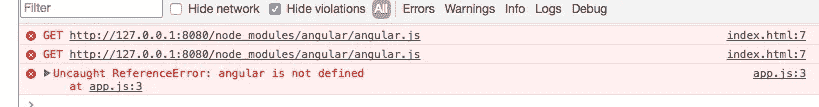
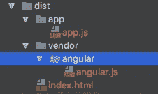

# Angular 的 Gulp 4 入门

> 原文：<https://medium.com/hackernoon/getting-started-with-gulp-4-for-angular-1280a78fa91a>

Gulp 是 Angular 团队和许多其他专业工程师使用的构建工具。速度和简单性被吹捧为优于 Grunt 的优点。我又看了一眼，试图用 GULP 构建一个简单的 SPA Angular 应用程序。下面是我的故事。

**安装大口**

所以安装大口— [链接](https://github.com/gulpjs/gulp/blob/master/docs/getting-started.md)。并创建一个 gulpfile.js:

```
var gulp = require('gulp');

gulp.task('default', function() {
  // place code for your default task here
});
```

现在运行它，它应该什么也不做。瞧啊。

```
Genes-MacBook-Pro-2:gulp_plunge thinkjones$ gulp
[18:18:56] Using gulpfile ~/dev/GeneConroyJonesArticles/gulp_plunge/gulpfile.js
[18:18:56] Starting 'default'...
[18:18:56] Finished 'default' after 93 μs
Genes-MacBook-Pro-2:gulp_plunge thinkjones$
```

到目前为止一切顺利。

**目录结构**

因此，对于这个应用程序，我们将转换*客户端*目录中的文件，并将它们复制并转换到 *dist。*

```
# Dir Structure 
\client\  # Source Files
\client\index.html\dist\    # Dist or converted files.
```

**用** [**复制文件 gulp . dest**](https://gulp.readme.io/docs/gulpdestpath-options)

**我们的第一个任务是复制 index.html 到 dist 文件夹。为此，我们可以使用 [gulp.dest](https://gulp.readme.io/docs/gulpdestpath-options) 。一个内置的吞咽命令。**

```
gulp.task('default', **function**() {
    gulp.src('./client/index.html')
        .pipe(gulp.dest('./dist/index.html'))
});
```

**然后运行`gulp`**

**这看起来不错吧？**错了****

**这实际上是将项目复制到一个文件夹`/dist/index.html/index.html`**

**Gulp.dest 需要一个文件夹作为目的地。你真正需要的是:**

```
gulp.task('default', **function**() {
    gulp.src('./client/index.html')
        .pipe(gulp.dest('./dist'))
});
```

**但是，如果您尝试运行下一步，您将得到一个目录权限错误。**

```
events.js:160
      throw er; // Unhandled 'error' event
      ^Error: EISDIR: illegal operation on a directory, open '/Users/thinkjones/dev/GeneConroyJonesArticles/gulp_plunge/dist/index.html'
Genes-MacBook-Pro-2:gulp_plunge thinkjones$
```

**这是因为在运行之前没有清理目录。随后在谷歌上快速搜索，结果是需要为 *gulp.series* 安装 Gulp 4，并通过 *npm 安装 *del* 。*新 *gulpfile.js* :**

```
**var** gulp = require('gulp');
**var** del = require('del');

gulp.task('default',  gulp.series(clean, copyIndex));

**function** clean(done) {
    del(['dist']);
    done();  # Async callback for completion.
}

**function** copyIndex(done) {
    **return** gulp.src('./client/index.html').pipe(gulp.dest('./dist', {overwrite: **true**}));
}
```

**GULP 的好处在于你可以很好地将任务模块化成函数。**

**现在成功运行**的**给了我们大口:**

```
Genes-MacBook-Pro-2:gulp_plunge thinkjones$ gulp
[18:53:32] Using gulpfile ~/dev/GeneConroyJonesArticles/gulp_plunge/gulpfile.js
[18:53:32] Starting 'default'...
[18:53:32] Starting 'clean'...
[18:53:33] Finished 'clean' after 6.5 ms
[18:53:33] Starting 'copyIndex'...
[18:53:33] Finished 'copyIndex' after 28 ms
[18:53:33] Finished 'default' after 37 ms
```

**输出不错。让我们查一下目录:**

****

**完美。让我们在这里添加一个角度应用程序。**

****添加角度 App****

**鲍尔似乎变得不太受欢迎，这似乎没有必要，因为我们已经有了 npm。让我们使用 NPM 安装 Angular。**

```
npm install angular # installs to ./node_modules/angular.js
```

**让我们参考我们 index.html 档案中的文件。我们稍后(可能)会改变这一点，但让我们假设我们现在正在这样做。**

```
<!DOCTYPE html>
<html>
<head>
    <title>Gulp Plunge</title>

    <!-- Vendor Files -->
    <script src="/node_modules/angular/angular.js"></script>

    <!-- App Files -->
    <script src="/app/app.js"></script>

</head>
<body ng-app="app">
</body>
</html>
```

**现在让我们提供这个文件，看看它看起来像什么:**

```
npm install --save-dev http-server
node ./node_modules/http-server/bin/http-server dist
```

**我们知道这将会失败，因为我们已经添加了一个 app.js，并且没有将其复制到 dist 目录中。所以我添加了一个新的 copyAppJs 函数:**

```
**var** gulp = require('gulp');
**var** del = require('del');

gulp.task('default',  gulp.series(clean, copyIndex, copyAppJs));

**function** clean(done) {
    del(['dist/**/*.*']);
    done();
}

**function** copyIndex(done) {
    **return** gulp.src('./client/index.html').pipe(gulp.dest('./dist', {overwrite: **true**}));
    done();
}

**function** copyAppJs(done) {
    **return** gulp.src('./client/**/*.js').pipe(gulp.dest('./dist', {overwrite: **true**}));
    done();
}
```

**重新运行 GULP 后问题得到解决。**

**但是仍然有一个角度问题:**

****

**node_modules 文件夹位于根目录中，因此也需要复制到 dist。由于这涉及到一个*供应商*代码，让我们来看看添加供应商资产的潜在模式。**

****用 GULP 添加供应商资产。****

**对于大型应用程序，你会希望将供应商的代码与你的应用程序代码分开。原因是在开发时，你的应用程序代码会比供应商的代码更频繁地改变，所以为了保持*的速度，不编译所有东西，只编译应用程序中的资产是有益的。此外，供应商代码的添加略有不同。你可能会把所有东西都放在你的 **app** 文件夹中，但你可能只会放入来自**供应商**安装的某些文件。让我们看看如何使用 GULP 来管理这个过程。***

**因为每个工程师都喜欢 DRY，所以让我们在一个地方指定供应商文件，然后根据需要使用它们来填充 dist/index.html 和任何其他相关资产。**

**供应商源代码将被推送到`/dist/vendor:`**

```
**function** copyVendor(done) {
    **var** vendor_files = ['./node_modules/angular/angular.js'];
    **return** gulp.src(vendor_files).pipe(gulp.dest('./dist/vendor', {overwrite: **true**}));
}
```

**哪些副本。/node _ modules/angular/angular . js '到/vendor/angular.js**

**从表面上看，这很好，但它缺少包文件夹。这可能会导致冲突或无意的覆盖。我们真正需要的是将它复制到:**

**/dist/vendor/angle/angular . js**

**为了保持原来的目录结构或者它的一部分，你可以使用[基本选项](https://github.com/gulpjs/gulp/blob/master/docs/recipes/maintain-directory-structure-while-globbing.md)**

```
**function** copyVendor(done) {
    **var** vendor_files = ['./node_modules/angular/angular.js'];
    **return** gulp.src(vendor_files, {base: './node_modules'}).pipe(gulp.dest('./dist/vendor', {overwrite: **true**}));
    done();
}
```

**耶！**

****

**重新运行 gulp 并刷新应用程序会产生一个完全正常工作的应用程序。**

**然而，令人沮丧的是，每次都必须重新运行 gulp。让我们看看让手表走起来有多容易。**

****Gulp-watch —在进行更改时自动更新您的应用程序代码****

**因此，让我们添加一个新函数，并将其分配给一个任务:**

```
**function** watchAppJs(done) {
    **return** gulp.watch('./client/**/*.*', gulp.series(clean, copyIndex, copyAppJs, copyVendor));
}gulp.task('watch', gulp.series(watchAppJs));
```

**现在，当我编辑 app.js .时，我在终端中看到以下内容:**

```
[19:42:40] Using gulpfile ~/dev/GeneConroyJonesArticles/gulp_plunge/gulpfile.js
[19:42:40] Starting 'watch'...
[19:42:40] Starting 'watchAppJs'...
[19:42:52] Starting 'clean'...
[19:42:52] Finished 'clean' after 4.98 ms
[19:42:52] Starting 'copyIndex'...
[19:42:52] Finished 'copyIndex' after 45 ms
[19:42:52] Starting 'copyAppJs'...
[19:42:52] Finished 'copyAppJs' after 6.72 ms
[19:42:52] Starting 'copyVendor'...
[19:42:52] Finished 'copyVendor' after 20 ms
```

**那很容易。**

**那么接下来呢？**

**确保 index.html 包含最新的供应商文件。**

**所以现在真正让我恼火的是我在 index.html 中维护厂商文件:**

```
<head>
    <title>Gulp Plunge</title>

    <!-- Vendor Files -->
    <script src="/vendor/angular/angular.js"></script>

    <!-- App Files -->
    <script src="/app/app.js"></script>

</head>
```

**和 gulpfile.js:**

```
**function** copyVendor(done) {
    **var** vendor_files = ['./node_modules/angular/angular.js'];
    **return** gulp.src(vendor_files, {base: './node_modules'}).pipe(gulp.dest('./dist/vendor', {overwrite: **true**}));
}
```

**由于 *gulpfile.js* 是事实的来源，我们希望用正确的依赖资产自动填充 *dist/index.html* 。[吞咽注射](https://www.npmjs.com/package/gulp-inject)似乎是个不错的选择。安装:**

```
npm install --save-dev gulp-inject
```

**然后修改 index.html 以添加模板标记来指定写入资产的位置:**

```
<!-- Vendor Files -->
<!-- app:js -->
<!-- endinject -->
```

**然后告诉大口注射:**

```
**var** vendor_files = ['./node_modules/angular/angular.js'];**function** copyIndex(done) {
    **var** sources = gulp.src(vendor_files, {read: **false**});
    **return** gulp.src('./client/index.html')
        .pipe(inject(sources, {name: 'app'}))
        .pipe(gulp.dest('./dist', {overwrite: **true**}));
}
```

**现在 dist/index.html 看起来像这样:**

```
<!-- Vendor Files -->
<!-- app:js -->
<script src="/node_modules/angular/angular.js"></script>
<!-- endinject -->
```

**这没问题，但是文件再次指向 node_modules。我们的网络服务器从。/vendor/angular/angular.js。因此，我们需要在过程中操作这些文件。我们可以通过吞咽注射的*忽略路径*和*添加前缀*选项来实现。 *ignorePath* 可以删除前缀文件夹 *addPrefix* 可以添加新的位置。**

**函数 copy-index 现在变成:**

```
**function** copyIndex(done) {
    **var** sources = gulp.src(vendor_files, {read: **false**});
    **return** gulp.src('./client/index.html')
        .pipe(inject(sources, {name: 'app', ignorePath: 'node_modules', addPrefix: 'vendor' }))
        .pipe(gulp.dest('./dist', {overwrite: **true**}));
}
```

**运行 gulp 时，供应商文件指向正确的 dist 位置:**

```
<head>
    <title>Gulp Plunge</title>

    <!-- Vendor Files -->
    <!-- app:js -->
    <script src="/vendor/angular/angular.js"></script>
    <!-- endinject -->

    <!-- App Files -->
    <script src="/app/app.js"></script>

</head>
```

**我喜欢这种方法的原因是因为在 *gulpfile.js* 中，我们指定了文件的实际位置:**

```
**var** vendor_files = ['./node_modules/angular/angular.js'];
```

**并且当需要它们存在于不同的位置时，根据需要对它们进行操作。**

**[代码位于此处](https://github.com/thinkjones/GeneConroyJonesArticles/tree/master/gulp_plunge)**

**还有很多其他的东西可以看，但是到目前为止，我喜欢我所看到的。在后续文章中，我们将了解:**

1.  **少编译**
2.  **HTML 模板化**
3.  **缩小和版本化**
4.  **自动化 karma 配置和单元测试。**

**[](http://bit.ly/HackernoonFB)****[](https://goo.gl/k7XYbx)****[](https://goo.gl/4ofytp)**

> **[黑客中午](http://bit.ly/Hackernoon)是黑客如何开始他们的下午。我们是 AMI 家庭的一员。我们现在[接受投稿](http://bit.ly/hackernoonsubmission)并乐意[讨论广告&赞助](mailto:partners@amipublications.com)机会。**
> 
> **如果你喜欢这个故事，我们推荐你阅读我们的[最新科技故事](http://bit.ly/hackernoonlatestt)和[趋势科技故事](https://hackernoon.com/trending)。直到下一次，不要把世界的现实想当然！**

****