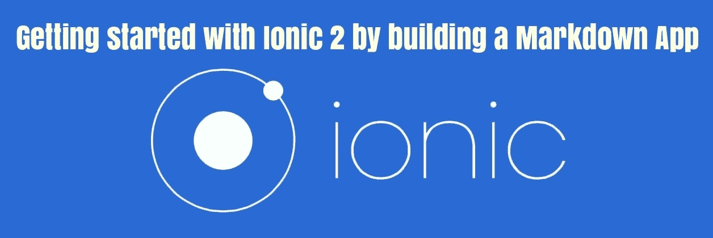
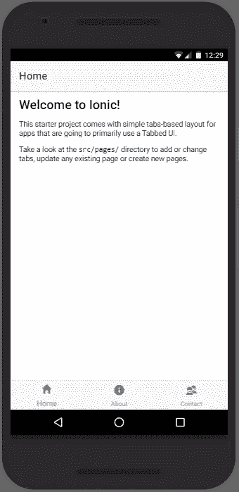
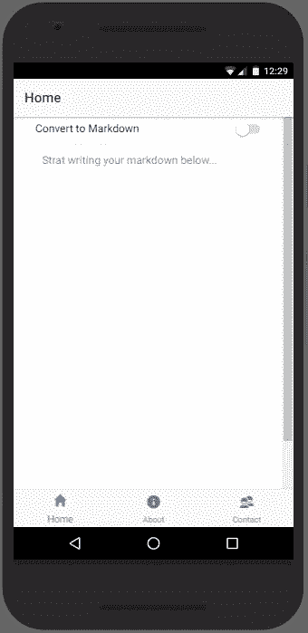
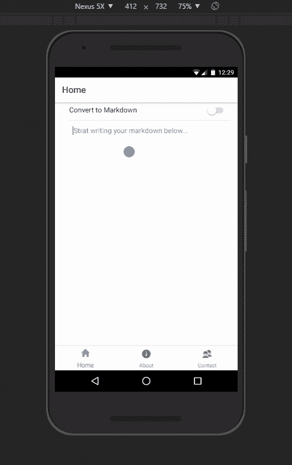

# 通过构建降价应用程序开始使用 Ionic 2

> 原文：<https://medium.com/hackernoon/getting-started-with-ionic-2-by-building-a-markdown-app-53c4022cf236>



读者你好！今天我们将深入探讨一下`Ionic`(或本例中的`Ionic 2`)。我们将通过构建一个简单的降价应用程序来了解`Ionic`，它可以让用户在移动设备上随时预览降价文本。我们将在考虑 Android 平台的情况下构建这个应用程序。

那么，首先*“什么是离子？”*你问。

从其官方网站、***“Ionic 是一款漂亮、免费和开源的移动 SDK，用于轻松开发本地和渐进式网络应用。”*** 有了 [Ionic](https://hackernoon.com/tagged/ionic) ，你就可以用你已经知道的技术来构建移动应用。没错！都是 HTML，CSS 和 [JavaScript](https://hackernoon.com/tagged/javascript) 。

是的，是的，我听到你问*“我们已经有了像*[*Phonegap*](http://phonegap.com/)*这样的框架，为什么我们还需要 Ionic？”*答案是，像 Phonegap 这样的框架是使用 [Cordova](https://cordova.apache.org/) 构建的系统(它们是相当同义的)，而 Ionic 是一个基于 [AngularJS](https://angular.io/) 的应用开发平台，带有谷歌的 [Material Design](https://material.io/) UI，它使用 Cordova 来为移动平台包装自己。除了在其核心使用 AngularJS，离子还促进..

*   构建渐进式 web 应用程序的功能
*   Live Reload 在开发的每一步都编译和重新部署你的应用程序，这是为傻瓜准备的
*   AoT 编译使得 ionic 应用程序加载速度快如闪电

在本教程中，我们将使用 Ionic 2 来制作我们的 Markdown 应用程序，Ionic 2 在其核心中使用了 [Angular 2](https://angular.io/) 。要在本地构建一个 Ionic 应用，你只需要在你的电脑上安装最新版本的 [Node.js](https://nodejs.org/en/) ，一个最新的浏览器(最好是 Chrome)和一个你选择的文本编辑器。听起来很刺激？让我们开始吧。

## 安装离子

Ionic 2 应用程序主要通过 Ionic 命令行实用程序(“CLI”)创建和开发，并使用 Cordova 作为本机应用程序进行构建和部署。这意味着我们需要安装一些实用程序来进行开发。

## Ionic CLI 和科尔多瓦

要创建 Ionic 2 应用程序，你需要安装最新版本的 Ionic CLI 和 Cordova。安装 Ionic CLI 和 Cordova 进行本地应用程序开发:

```
$ npm install -g ionic cordova
```

这将需要一些时间来安装和准备使用。

> *您可能需要在这些命令前添加“sudo”来全局安装实用程序，或者在 Windows 中，您需要在管理员模式下打开命令提示符。在脆弱的网络中安装* `*Ionic*` *时，你可能会出错，但坚持下去，你一定会安装它。*

一旦安装了`ionic`和`cordova`，我们就可以使用以下命令生成一个基本的 Ionic 应用程序:

```
$ ionic start ionic-markdownify --v2
```

> *请注意，我们添加了— v2，因为我们想使用 Ionic 2 构建我们的应用程序。万一你想用 Ionic 1 来构建 app，省略— v2。*

这将生成一个名为`ionic-markdownify`的文件夹，其文件夹结构如下:

`pages` dir 包含我们的应用程序将要使用的所有页面。在我们的应用程序中，我们将只处理`home` dir。

要运行我们的应用程序，请进入创建的目录，然后运行`ionic serve`命令，在浏览器中测试您的应用程序！

```
$ cd ionic-markdownify 
$ ionic serve
```

这将启动我们的应用程序，我们可以通过 [http://localhost:8100 看到我们的应用程序。](http://localhost:8100.)这是一个基于选项卡的基本应用程序，如下所示:



接下来，为了制作 Markdown 应用程序，我们将首先修改我们的文件`src/pages/home/home.html`。我们将把`<ion-content></ion-content>`中的内容替换为以下内容:

> *注意，我们使用了* `*Ionic*` *的内置 textarea 组件* `*<ion-textarea>*` *，它在特定的操作系统环境(在我们的例子中是 Android)中为 textarea 提供了原生的触感。我们还使用* `*[(ngModel)]="plainText"*` *绑定了* `*ion-textarea*` *，这将帮助我们在* `*src/pages/home/home.ts*`中获取 `*class HomePage*` *中的值*

接下来，我们将添加一个切换按钮，用于在 Textarea 和 Markdown 预览之间切换。补充一下吧。

在这之后，我们将在现有的一个之后添加另一个`<ion-content></ion-content>`,我们将使用它来保存降价的 HTML 预览。我们将在这个组件中添加`[hidden]="!toggleVal"`,以便仅在切换状态改变时显示。我们对`<ion-textarea>`所在的`<ion-item>`也做了同样的事情。布线完成后，这些`src/pages/home/home.html`看起来会像这样:

为了使我们的`<ion-textarea>`达到最大高度，我们将在`src/pages/home/home.scss`中添加下面这段 CSS:

在此之后，我们将添加`[(ngModel)]="toggleVal"`到`<ion-toggle>`来跟踪相同的值，还将添加`(ionChange)="convert()"`来跟踪切换的变化。

此时，我们的应用程序的`Home`标签看起来如下:



然后我们将把`convert()`功能添加到`home.ts`中，如下所示:

> *注意，该函数将检查切换的当前状态，并基于此将 Markdown 转换为相关的 HTML。还要注意，我们已经基于 textarea 的值维护了切换的状态。*

为了将 Markdown 转换成 HTML，我们将使用`marked`库。要安装它，请在 CLI 中启动以下命令:

这将把`marked`安装到我们的项目中。为了在我们的应用程序中使用它，现在让我们在`src/pages/home/home.ts`的顶部添加下面一行

```
import marked from 'marked';
```

除此之外，为了使用`<div [innerHtml]="content"></div>`的引用，我们将从`@angular/core`添加 Angular 的`[ViewChild](https://angular.io/docs/ts/latest/api/core/index/ViewChild-decorator.html)`[](https://angular.io/docs/ts/latest/api/core/index/ViewChild-decorator.html)

```
import { Component, ViewChild, Input } from '@angular/core';
```

并将它添加到*班级主页*如下:

```
@ViewChild(Content) content: Content;
```

添加完所有这些之后，我们的`src/pages/home/home.ts`在这一点上会如下所示:

这基本上概括了我们整个 app。现在，在你的浏览器中点击 [http://localhost:8100](http://localhost:8100) ，你会看到我们漂亮的小应用程序正在运行！



你也可以在[这里](https://github.com/amitmerchant1990/ionic-markdownify)查看这个应用的整个代码库。

本教程的整体思想是通过构建一个真实世界的应用程序让您开始使用 Ionic 2，并理解 Ionic 2 的一些概念。你可以改进这个特别的应用程序。一些改进包括..

*   实现滑动手势，以摆脱切换，使用户只需向左滑动，以获得预览。
*   实现 Markdown 的编辑工具，如粗体、斜体、下划线、代码等。
*   实现一个文本编辑器来代替文本区域。

您还可以使用 [Ionic Package](http://blog.ionic.io/build-apps-in-minutes-with-ionic-package/) 为您喜欢的任何平台(Android、iOS、Windows Phone OS)打包您新创建的应用程序并进行分发。

想要了解更多关于 Ionic 2 的信息，你可以按照这个[文档](http://ionicframework.com/docs/v2/components/#overview)的内容，对 Ionic 2 的所有组件进行调整。

感谢阅读。

黑客快乐！

[](http://bit.ly/HackernoonFB)[](https://goo.gl/k7XYbx)[](https://goo.gl/4ofytp)

> [黑客中午](http://bit.ly/Hackernoon)是黑客如何开始他们的下午。我们是 [@AMI](http://bit.ly/atAMIatAMI) 家庭的一员。我们现在[接受投稿](http://bit.ly/hackernoonsubmission)并乐意[讨论广告&赞助](mailto:partners@amipublications.com)机会。
> 
> 如果你喜欢这个故事，我们推荐你阅读我们的[最新科技故事](http://bit.ly/hackernoonlatestt)和[趋势科技故事](https://hackernoon.com/trending)。直到下一次，不要把世界的现实想当然！

