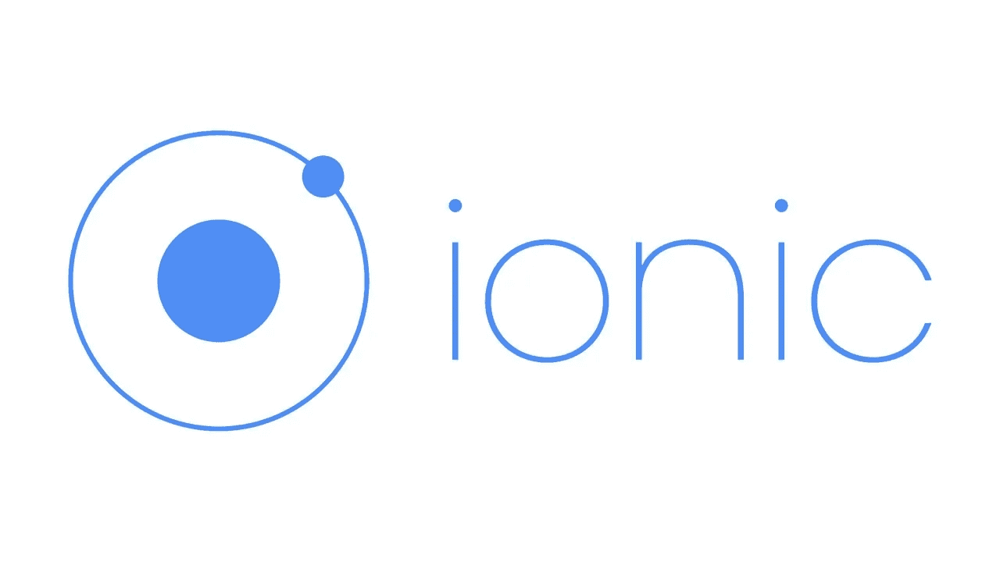
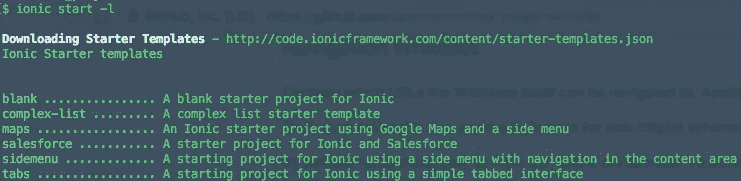
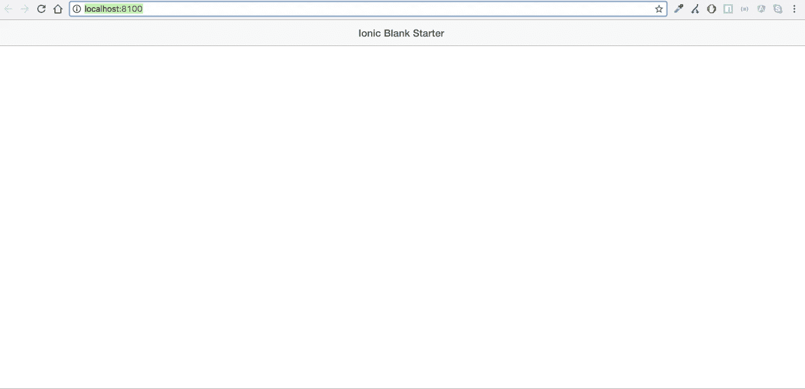
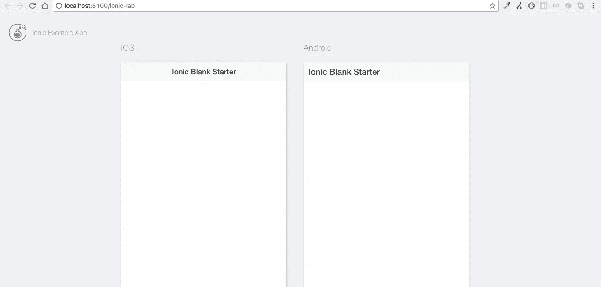
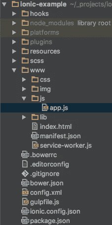

# Ionic 框架入门:概述

> 原文：<https://medium.com/hackernoon/getting-started-with-ionic-framework-an-overview-6725b687779b>

## 什么是爱奥尼亚？



最近几天我一直在熟悉[离子架构](http://ionicframework.com/)。首先，我想到了一个可能与你类似的问题。 ***为什么选择离子框架？***

我选择 Ionic 作为我的下一个框架来阐述我的技能集的原因如下:

*   Ionic 就是关于 **HTML** ， **CSS** ， **JavaScript**
*   因为我在过去的几个月里一直在密切关注 JavaScript，最近还在从事一个自由职业项目，使用了 Node.js、Express.js & **AngularJS 等技术和框架(我很熟悉)。**
*   用我目前的知识(AngularJS)来构建移动应用程序
*   学习曲线是如果你熟悉 AngularJS
*   Ionic 是跨平台的
*   有自己的用户界面组件，感觉*很笨拙*并且易于定制
*   它是开源的，并且有一个活跃的不断增长的社区(随着版本 2 的发布，尤其是)

在上述“推理列表”中，我还包括了爱奥尼亚提供的几个要点:

*   拥有自己的命令行界面(CLI)来*搭建、开发*和*部署*应用。
*   它通过两个选项提供对移动设备 API 的访问:ngCordova 和 ionic-native
*   用 Ionic 编写的应用程序可以使用 Apache 的 Cordova 为特定的设备(比如 Android & iOS)进行转换。

说了这么多，我将在本文中简要讨论一些事情，如果/当你计划开始使用 *Ionic Framework* 开发应用程序时，你应该知道这些事情。

# **混合移动架构**

你以为我会以围绕混合移动应用 讨论一些 [**神话来开始这篇文章吗？我没有，因为西蒙已经在 DevDactic.com**](https://devdactic.com/myth-hybrid-development/)**[发表了一篇很棒的文章](https://devdactic.com)**

混合移动应用的起源是为了理解*什么是混合应用？*

> 混合应用是一种使用浏览器窗口显示界面的移动应用。

这属于由三种类型组成的**类型移动应用**的分类:

*   本机:使用特定于平台的编程语言(如 Objective C 或 Java)开发
*   移动网站:使用 HTML、CSS 和 JavaScript 等网络技术开发，只能通过移动网络浏览器访问。它们实际上是 web 应用程序。
*   混合:跨平台，可以访问本地 API(主要通过插件)

使用 Ionic Framework 开发的混合移动应用程序的架构由两个概念组成，人们必须尽快熟悉这两个概念:WebView 和 Apache Cordova。

# 什么是 WebView？

可以把它想象成一个浏览器，运行在使用 Ionic 的移动应用程序范围内。这个浏览器实现了用 HTML、CSS 和 JavaScript 编写的代码。

特定移动操作系统上的应用程序通过像 [Cordova](https://cordova.apache.org/) 这样的工具运行。它提供了用 JavaScript 编写的 API 来与移动设备的本机功能进行交互，例如访问摄像头或麦克风。

WebView 与 Cordova 的 API 进行通信，然后再与移动设备进行通信。


Courtesy of [https://www.linkedin.com/in/shindesantosh](https://www.linkedin.com/in/shindesantosh)

网络视图如今如此普遍，以至于你可以使用电子浏览器来构建桌面应用程序。

*有关混合移动应用的详细信息，我希望您考虑阅读 John Bristowe 的* [*文章*](http://developer.telerik.com/featured/what-is-a-hybrid-mobile-app/) *。*

# 开发离子应用的先决条件？

您将需要这些工具作为操作系统环境设置的一部分。

*   [Node.js](http://www.nodejs.org)

即使你不使用 Node.js 作为你的开发环境的一部分，要使用 Ionic，你必须安装它来访问命令行工具，如 Bower，Gulp，以及 Ionic 自己的命令行界面，使用它的节点的包管理器: [*npm*](http://www.npmjs.com) 。

## **安装离子**

Ionic 是 Angular.js、UI 路由器、Angular 指令、Angular 服务、js 实用程序和移动 CSS 样式的集合。这些被捆绑在一起成为 ionic.bundle.js 和 ionic.css。

从命令行:

`$ npm install cordova ionic -g`

这将安装一个您将要使用的工具:Ionic CLI，这是一个命令行工具。

有关它能做什么的详细信息:

`$ ionic --help`它列出了您可以使用该实用程序执行的所有任务。

# Ionic App 开发流程

安装命令行实用程序后，您可以使用 Ionic 的入门模板创建一个应用程序。Ionic 提供了三种入门模板:

*   空白`ionic start myApp blank`
*   选项卡`ionic start myApp tabs`
*   侧菜单馅饼 `myApp sidemenu`

要获得所有可用离子模板的列表，请在终端中键入:

`$ ionic start -l`

`ionic start`是用于支持离子应用程序的命令。



## 搭建离子应用平台

`$ ionic start -a "Example" -i app.example example blank`

该命令可以通过以下选项帮助您搭建 Ionic 项目:

*   `-a "Example"`人类可读的应用程序名称
*   `-i app.example`应用程序 ID
*   `example`项目文件夹的名称
*   `blank`离子模板

这些步骤允许配置文件用应用程序名及其 ID 进行更新。(我们将在后面了解关于配置文件的更多信息)。

在这一步之后，如果你仔细观察你的终端窗口，会运行一个脚本来安装六个提到的 Cordova 插件`package.json`文件。

*   `cordova-plugin-device`获取设备信息
*   `cordova-plugin-console`定义了`console.log()`的一个全局实例
*   `cordova-plugin-whitelist`实施白名单策略来导航应用程序的 WebView
*   `cordova-plugin-splashscreen`在设备上启动应用程序时，显示和隐藏闪屏
*   `cordova-plugin-statusbar`提供定制 iOS 和 Android 状态栏的功能
*   `ionic-plugin-keyboard`提供与键盘交互的功能

现在你已经有了一个 Ionic 项目设置，并且熟悉了项目设置的基本元素。是时候从命令行运行应用程序了，使用`ionic serve`命令在端口上本地运行应用程序。

```
$ cd example
$ ionic serve
```

它将在默认的 web 浏览器中打开一个浏览器窗口，您将会看到如下内容:



`ionic serve --lab`将在本地运行该应用程序，显示该应用程序在 iOS & Android 上的两个实例。



有意在不同的端口号上运行应用程序:`ionic serve -p 8080`

# 离子工程结构

以下是搭建后的 Ionic 项目的根结构:



我将开始描述应用程序的根文件夹中的每个文件夹/文件包含什么，从上到下。

*   `hooks`由执行特定 Cordova 任务时执行的脚本组成
*   包含所有添加到项目中的插件
*   `www`我们编写的 ionic app 代码来构建 app
*   由基本 scss 文件组成(ionic UI 组件的样式)
*   `.bowerrc`安装 Bower 依赖项的目录路径
*   `.editorconfig`为简洁起见默认编辑器配置
*   `bower.json`凉亭依赖列表
*   `config.xml`Cordova 在将 Ionic 应用转换为特定平台时所需的元信息。它由描述项目的 XML 标记组成
*   `gulpfile.js`构建开发应用程序时使用的任务
*   `ionic.config.json`关于离子应用的信息

## www/文件夹

这个文件夹是我们应用程序的主文件夹，也是我们应用程序代码编写的地方。它包括一个应用程序启动文件`index.html`，作为应用程序的第一页，`css`定义自定义样式，`images`向应用程序添加图像，`js`进一步包括`app.js`，我们在其中引导 AngularJS 框架。在该文件中，使用[角度依赖性注入](https://docs.angularjs.org/guide/di)将`ionic`作为依赖性传递。`$ionicPlatform`是注入到`run`方法中的服务，该方法启用前面讨论的 Cordova 插件和应用程序本身。

最后一个文件夹`lib`包含使用 Bower 安装的包/依赖项。它包含预先加载的离子和角度文件的依赖关系。

*我想，您现在已经知道使用 Ionic 框架的混合应用程序是如何工作的了。*

***感谢您的阅读。如果你觉得这篇文章有用，请点击*** 💚 ***按钮这样这个故事就能接触到更多的*读者*。如果你想谈论更多，请在*** [***推特***](https://twitter.com/amanhimself)***|***[***书博***](https://amandeepmittal.wordpress.com/)

想收到更多像这样的文章吗？订阅我 [**这里**](https://patreon.us17.list-manage.com/subscribe?u=ad4c168a6d5bb975f2f282d54&id=39e959cecd) **。有时，我会向我的订户发送“从未见过”的内容。**

[](http://bit.ly/HackernoonFB)[](https://goo.gl/k7XYbx)[](https://goo.gl/4ofytp)

> [黑客中午](http://bit.ly/Hackernoon)是黑客如何开始他们的下午。我们是 [@AMI](http://bit.ly/atAMIatAMI) 家庭的一员。我们现在[接受投稿](http://bit.ly/hackernoonsubmission)并乐意[讨论广告&赞助](mailto:partners@amipublications.com)机会。
> 
> 如果你喜欢这个故事，我们推荐你阅读我们的[最新科技故事](http://bit.ly/hackernoonlatestt)和[趋势科技故事](https://hackernoon.com/trending)。直到下一次，不要把世界的现实想当然！

