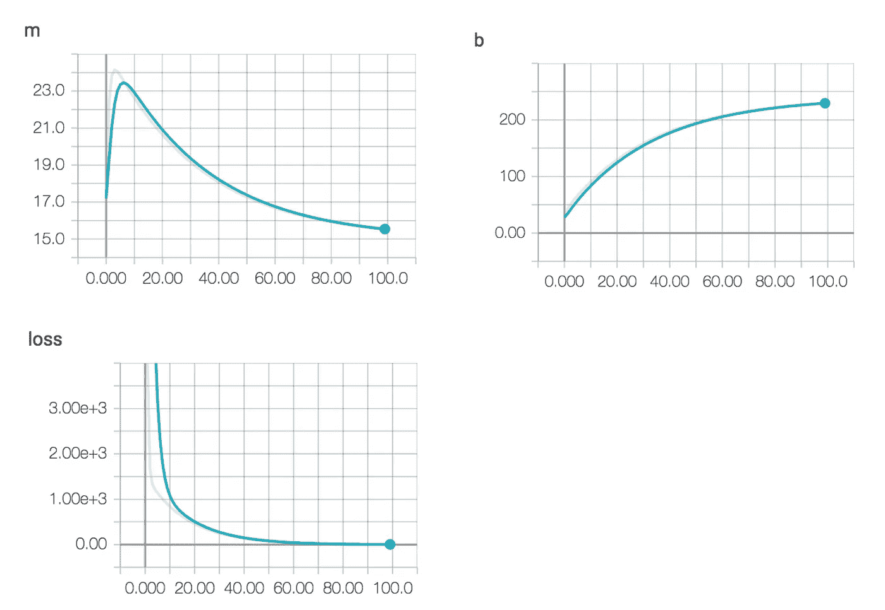

# 5 分钟内开始机器学习

> 原文：<https://medium.com/hackernoon/getting-started-with-machine-learning-in-15-lines-of-code-4112c405f9a4>

## 通过在 15 行代码中构建房屋价格预测来学习机器学习。

*本帖原载于* [现在让我们建立一个机器学习程序来做这件事。使用训练数据，我们希望我们的模型计算出`**m**`和`**b**`的值，我们知道它们分别是 15 和 240。](https://developers.hp.com/# of bedrooms) + $240k</span></pre><p id=)

[我们将使用 python 编写代码。用下面的代码创建一个新的 python 文件，命名为`**home_price.py**` **。**在代码中，我们从导入库开始，设置一些初始变量，线性模型和损失函数。如果没有环境设置，考虑安装](https://developers.hp.com/# of bedrooms) + $240k</span></pre><p id=) [Docker](https://www.docker.com/) 并使用下面的 Docker 命令。

```
docker run -it gcr.io/tensorflow/tensorflow:latest /bin/bash
```

Yes, without the print statements and comments it is just 15 lines of code. 🙌

在代码中，我们设置了一些在培训中使用的基本占位符和变量。然后我们正在编写一个`loss`函数，它是通过从`prediction`值中减去`y`(给定值或地面真值)来计算的。然后，我们将那个`loss`值传递给我们的`optimizer`。随着每一次迭代，我们的`optimizer`将通过更新变量`m`和`b`的值来尝试尽可能接近`y`和`prediction`的值。

接下来，我们用我们的训练数据对模型进行 1000 次训练。最后，您应该得到如下所示的输出

```
**Value of m is [ 15.00007153] and value of b is [ 239.99978638].**
```

***你怎么看待 m 和 b 的值？非常接近我们的期望值，对吧？*💁**


下面是模型如何在每次迭代中被优化的可视化。在开始时，`m`和`b`的值从`1.0`开始(正如我们在代码中指定的)，但是随着时间的推移，它们会达到正确的值。我们也看到我们的`loss`(预测-y)随着时间的推移降低到 0。



*Fig 3\. Values of* `*m*`*,* `*b*` *and* `*loss*` *over 100 iterations.*

> 问:在你的房价预测中，你如何考虑一个社区？
> 
> 问:你会如何考虑家庭图像？

希望上面的教程能帮助你理解 ML 的基础。很快，每个全栈工程师都将在他们的应用中使用 ML。我们离`npm install object-detect`不远了。

如果您想讨论更多关于 ML 的问题，或者需要帮助了解 ML 是否适用于您的问题，请随时联系我。我很乐意帮忙。

***感谢阅读！随意点击*** 👏 ***下面的按钮，如果你觉得这个作品有趣就分享吧！***

***你可以在***[***Twitter***](https://twitter.com/arjoonpatel)***或者***[***LinkedIn***](https://www.linkedin.com/in/arjunpatel/)***上跟我联系。***