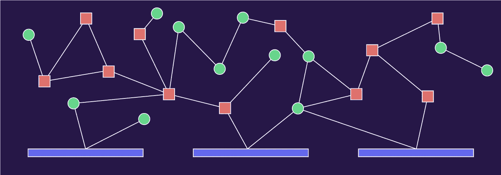
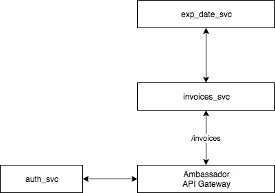
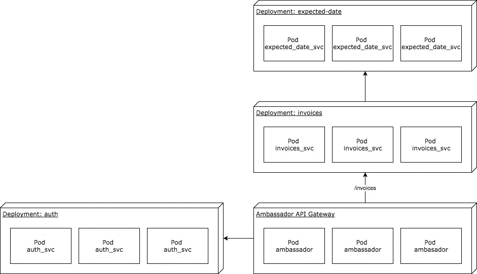

# 微服务和 Kubernetes 入门

> 原文：<https://medium.com/hackernoon/getting-started-with-microservices-and-kubernetes-76354312b556>



every microservices diagram ever

如果只有一个服务，就不是微服务平台。所有这些服务都需要能够相互交流，需要在其中一些服务不舒服时进行处理，需要在真实的机器上运行，需要能够与外部世界联系等等。

这就是 Kubernetes 的用武之地——它编排了各个 Docker 容器的生命和时间，为我们提供了构建健壮和可伸缩系统所需的原语。

这些微服务现在是一件大事，但很少有一步一步的指导来启动和运行一个基本的系统。这部分是因为“基本微服务系统”的概念是一个矛盾。不管怎样，我们都要试试。

我们确实需要一些必备的知识，特别是什么是 [Docker](https://www.docker.com/) 及其用途。之后你需要了解 Kube 的基本知识:[吊舱](https://kubernetes.io/docs/concepts/workloads/pods/pod/)，[服务](https://kubernetes.io/docs/concepts/services-networking/service/)，[部署](https://kubernetes.io/docs/concepts/workloads/controllers/deployment/)等等。

这个指南主要是针对那些已经在 Kube 上运行了一个单独的服务，并且正在思考"*现在该怎么办？"*。

# Tldr 部分

如果你是那种“给我看看代码”的人，你会非常喜欢这个 git repo。否则请继续阅读。

# 开始之前

我们所有的微服务都将在 [node.js](https://nodejs.org/en/) v8.x 中编写，所以你会想先安装它。它们都非常简单，因此您不需要比最粗略的 javascript /节点知识更多的知识。

我们将在 Minikube 上运行所有这些，这是一个让 kube 在本地运行的好方法。你可以在这里找到安装说明。之后，你需要验证你的 Minikube 安装是否一切正常。

首先创建一个 Minikube 集群:

```
$ minikube startStarting local Kubernetes v1.8.0 cluster...
Starting VM...
Getting VM IP address...
Moving files into cluster...
Setting up certs...
Connecting to cluster...
Setting up kubeconfig...
Starting cluster components...
Kubectl is now configured to use the cluster.
Loading cached images from config file.
```

然后检查 Kube 系统服务是否都正常:

```
$ kubectl get services -n kube-systemNAME                   CLUSTER-IP      EXTERNAL-IP   PORT(S)         AGE
kube-dns               10.96.0.10      <none>        53/UDP,53/TCP   1m
kubernetes-dashboard   10.107.19.167   <nodes>       80:30000/TCP    1m
```

还有一件事，我们需要 Minikube 来共享我们的本地 docker 注册表，否则它将无法找到我们构建的 docker 映像。

```
$ eval $(minikube docker-env)
```

超级棒。现在让我们建立一些有趣的东西。

# 总发票管理！！！1!

让我们为一家公司构建一个管理发票的系统。听起来很简单，也是我能想到的最有趣的事情。我们的系统将包括:

*   一个 **API 网关**将流量路由到我们的系统
*   用于限制访问的**认证服务**
*   前端**发票服务**返回发票信息
*   一个后端**预期日期服务**将告诉我们发票可能何时支付



the basics

第一步是让我们的文件夹结构排序。我们将为所有的 kube 配置文件建立一个文件夹，为我们的每个服务建立另外一个文件夹。

```
- total_invoice_managment
|
| - kube
| - invoices_svc
```

## 发票服务

我们的第一项服务是负责个人发票的`invoices_svc`。它将有一个端点`api/invoices/:id`,这个端点将交换发票数据的 id。让我们使用节点包管理器( [npm](http://npmjs.com) )快速搭建服务。

```
$ cd ./invoices_svc
$ npm init 
# then say yes to everything
$ npm install express
```

更新`package.json`以包含启动应用程序的脚本:

添加包含服务代码的`index.js`文件:

验证它是否在本地运行:

```
$ PORT=3007 npm startinvoices_svc listening on 3007$ curl localhost:3007/api/invoices/10{"id":10,"ref":"INV-10","amount":1000,"balance":990,"ccy":"GBP"}
```

有用！对我们的服务按预期工作感到满意后，我们现在可以通过制作一个 [Dockerfile](https://docs.docker.com/engine/reference/builder/#usage) 来对它进行 dockerize:

然后我们可以构建 Docker 容器来确保一切正常:

```
$ docker build ./ -t invoices_svc:v1
```

是时候让这项服务进入 Kube 了。让我们将目录切换到上一级的`kube`文件夹:

```
$ cd ../kube
```

并添加我们的第一位 kube 配置。调用文件`invoices_svc.yaml`

这个配置定义了一个 Kube [服务](https://kubernetes.io/docs/concepts/services-networking/service/)及其伴随的[部署](https://kubernetes.io/docs/concepts/workloads/controllers/deployment/)。我们可以让 kube 启动它

```
$ kubectl apply -f ./invoices_svc.yamldeployment "invoices-svc" created
service "invoices-svc" created
```

我们应该看到它的服务:

```
$ kubectl get servicesNAME           CLUSTER-IP      EXTERNAL-IP   PORT(S)   AGE
invoices-svc   10.104.86.220   <none>        80/TCP    3m
kubernetes     10.96.0.1       <none>        443/TCP   1h
```

所有的豆荚也是:

```
$ kubectl get podsNAME                            READY     STATUS    RESTARTS   AGE
invoices-svc-65b5f7bbd4-ckr8d   1/1       Running   0          44s
invoices-svc-65b5f7bbd4-gvk9s   1/1       Running   0          44s
invoices-svc-65b5f7bbd4-z2kx7   1/1       Running   0          44s
```

由于没有针对`invoices_svc`的外部 IP，我们需要进入集群内的一个容器*，以便能够进行测试。特别是旋转一个看起来很奇怪，但这是一种非常酷的做事方式。Busyboxplus 只是一个容器，有一个基本的外壳和一些常用工具。我们需要它来使用`curl`。*

```
$ kubectl run curl --image=radial/busyboxplus:curl -i --tty[ root@curl-696777f579-qwjcr:/ ]$ curl 10.104.86.220/api/invoices/1{"id":1,"ref":"INV-1","amount":100,"balance":90,"ccy":"GBP"}
```

(要逃离容器，您需要按下`ctl-d)`

有用！算是吧。困在我们的集群中是没有用的——我们需要创建一个*入口*,这样流量就可以找到进入的途径。为此我们将使用[大使](https://www.getambassador.io/)。它是一个围绕[特使代理](https://www.envoyproxy.io)的便捷包装器，内置了许多优秀的 API 网关特性。路由似乎是一个很好的起点。

我们需要让大使在我们的集群上运行。在`kube`文件夹中创建一个名为`ambassador.yaml`的文件:

然后我们可以启动它:

```
$ kubectl apply -f ./ambassador.yaml$ kubectl get services
NAME               CLUSTER-IP       EXTERNAL-IP   PORT(S)          AGE
ambassador         10.103.215.136   <pending>     80:32005/TCP     11s
ambassador-admin   10.104.3.82      <nodes>       8877:31385/TCP   11s
invoices-svc       10.104.86.220    <none>        80/TCP           45m
kubernetes         10.96.0.1        <none>        443/TCP          2h
```

我们需要告诉大使关于我们的`invoices_svc`，我们通过给`invoices_svc.yaml`的`Service`部分添加一些注释来完成

`prefix`键将流量从`/invoices/`路由到我们的服务。为了让事情保持整洁，`rewrite`键也做了一些转换，这样到`/invoices/:id`的流量被路由到我们在`/api/invoices/:id.`的服务

添加配置后，我们可以应用它:

```
$ kubectl apply -f ./invoices_svc.yaml
```

大使监视着集群中发生的一切。当我们更新配置时，ambassador 检测到了这一变化，并寻找任何注释。它发现了它们，现在会将流量路由到该服务。

理论上，我们现在有了一个到集群的外部 api 网关。在验证该假设之前，我们需要创建一个从本地主机到 minikube 集群的隧道:

```
$ minikube service ambassador --url[http://192.168.99.100:32005](http://192.168.99.100:32005)
```

这个特殊的 url 只适用于我的本地机器— **你需要使用你自己的 URL 来完成后面的步骤**。

我们可以使用返回的 url 来访问我们的集群:

```
$ curl [http://192.168.99.100:32005/invoices/42](http://192.168.99.100:32005/invoices/42){"id":42,"ref":"INV-42","amount":4200,"balance":4190,"ccy":"GBP"}
```

🎉有用！所以我们有服务和网关。

## 添加身份验证

让我们的服务提供给世界+狗并不太好。我们应该给我们的网关添加某种认证。当听到我们想要一个新的服务，或者它将被称为`auth_svc`时，没有人会感到惊讶。

*   创建一个名为`auth_svc`的新文件夹
*   从`invoices_svc`复制`Dockerfile`
*   重复我们为`invoices_svc`所做的 npm 步骤

```
$ cd ../
$ mkdir auth_svc
$ cd ./auth_svc
$ npm init
$ npm install express
$ cp ../invoices_svc/Dockerfile .# don't forget to add "start": "node index.js" to your package.json!
```

*   创建`auth_svc`应用程序:

*   创建 kube 配置:

*   构建 docker 映像:

```
$ docker build -t auth_svc:v1 ./auth_svc/
```

*   应用 kube 配置:

```
$  kubectl apply -f ./kube/auth_svc.yaml
```

*   看看是否有效:

```
$ curl [http://192.168.99.100:32005/invoices/42](http://192.168.99.100:32005/invoices/42){"ok":false}
```

王牌，我们现在被锁在外面，除非我们知道这个神奇的词:

```
$  curl [http://192.168.99.100:32005/invoices/42](http://192.168.99.100:32005/invoices/42) -H 'authorization: letmeinpleasekthxbye'{"id":42,"ref":"INV-42","amount":4200,"balance":4190,"ccy":"GBP"}
```

我们来盘点一下。我们有一个 API 网关来验证流量并将其路由到我们的服务。然而，我们不希望我们所有的服务都是公开的，那么我们的前端服务调用的后端服务呢？Kube 也有办法做到这一点。

## 我什么时候能拿到工资？

知道你的顾客什么时候会付钱给你总是很好的。我们将创建一个*非常复杂的算法推理引擎** ，它将告诉我们发票何时应该支付。这与最后两个服务类似:

```
$ cd ../
$ mkdir expected_date_svc
$ cd ./expected_date_svc
$ npm init
$ npm install express
$ npm install moment 
$ cp ../invoices_svc/Dockerfile .# don't forget to add "start": "node index.js" to your package.json!
```

而*极高复杂度算法推理机*的代码是 *:*

只剩下 kube 配置:

你知道规矩:

```
$ docker build -t expected_date_svc:v1 .
$ kubectl apply -f ../kube/expected_date_svc.yaml
$ kubectl get servicesNAME                CLUSTER-IP       EXTERNAL-IP   PORT(S)          AGE
ambassador          10.103.215.136   <pending>     80:32005/TCP     19h
ambassador-admin    10.104.3.82      <nodes>       8877:31385/TCP   19h
auth-svc            10.108.119.134   <none>        3000/TCP         18h
expected-date-svc   10.101.227.50    <none>        80/TCP           1m
invoices-svc        10.104.86.220    <none>        80/TCP           20h
kubernetes          10.96.0.1        <none>        443/TCP          21h
```

所以现在我们已经运行了`expected_date_svc`，我们想要修改`invoices_svc`来使用它。

我们需要一个新的依赖项来发出 http 请求:

```
$ cd ../invoices_svc
$ npm install request-promise
$ npm install request
```

然后我们向`expected_date_svc`发出请求，并将结果添加到我们的 invoice 对象中。下面是更新后的`invoice_svc`:

我们需要重建码头工人的形象:

```
$ docker build -t invoices_svc:v2 .
```

我们还需要更新`invoices_svc`的 kube 配置

首先，它需要引用新的 docker 图像:

我们还需要添加一个包含`expected_svc`URL 的环境变量。这是绝妙的一点。Kubernetes 使用内部 DNS 路由——你可以在这里了解更多信息。简而言之，kube 为每个命名的服务创建一个特殊的 url。它的格式是`SVCNAME.NAMESPACE.svc.cluster.local`，所以`expected_date_svc`可以在`expected-date-svc.default.svc.cluster.local`找到。让我们通过更新配置来设置环境变量:

现在，配置已全部更新，我们将其应用于集群:

```
$ kubectl apply -f ../kube/invoices_svc.yaml
```

并检查是否添加了预期日期:

```
$ curl [http://192.168.99.100:32005/invoices/42](http://192.168.99.100:32005/invoices/42) -H 'authorization: letmeinpleasekthxbye'{"id":42,"ref":"INV-42","amount":4200,"balance":4190,"ccy":"GBP","expectedDate":"2018-01-01T11:54:30.769Z"}
```

这对读者来说应该足够让集群运行了。接下来的步骤包括添加和删除副本以扩展服务，添加[活跃度探测器](https://kubernetes.io/docs/tasks/configure-pod-container/configure-liveness-readiness-probes/#define-a-liveness-http-request)以便 kubernetes 知道服务是否静默失败，或者记录和监控以便我们可以在我们不注意时发现我们的服务在做什么。



How all the bits go togther

## 我喜欢！

太好了，我们也是。我们如此喜欢 kube，以至于我们在[流畅地](https://fluidly.com/)使用它来满足我们最苛刻的基础设施需求，尤其是我们的数据科学模型。这是一个陡峭的学习曲线，但回报是巨大的。

如果你喜欢这类工作的声音，我们经常寻找令人惊讶的人。给我们写封短信:【jobs@fluidly.com】T2。

*我们的数据科学家真正做到了这一点！