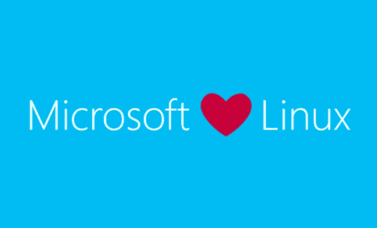
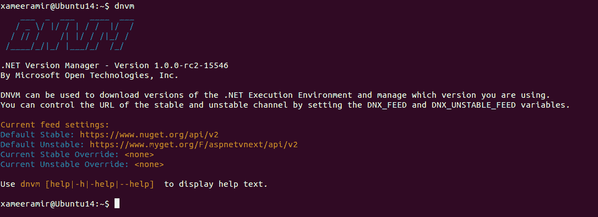
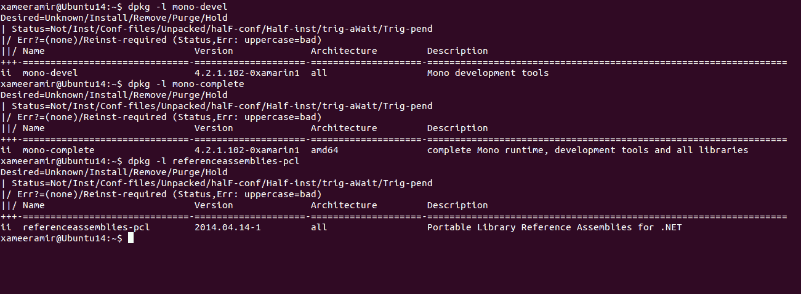
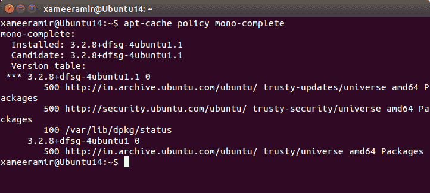
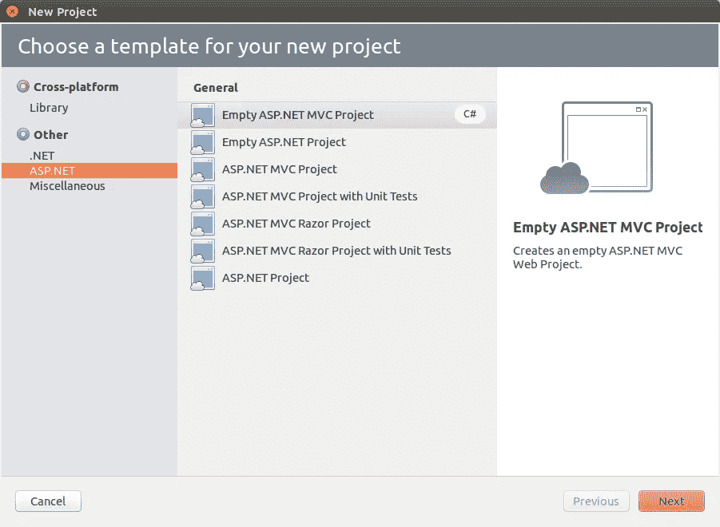

# 开始使用。NET 在 Ubuntu Linux 上的应用

> 原文：<https://medium.com/hackernoon/getting-started-with-net-on-ubuntu-linux-42c1977f5284>



credit: [https://twitter.com/sjvn/status/646381868133273600](https://twitter.com/sjvn/status/646381868133273600)

自，[ASP.NET vNext 的](http://www.asp.net/vnext)开源 。NET core 的`[1.0.0](https://github.com/aspnet/Home/wiki/Roadmap)` [发布就在](https://github.com/aspnet/Home/wiki/Roadmap)附近，我正试图用[弄脏自己的手。网](https://www.microsoft.com/net) *外* [*视窗*](https://www.microsoft.com/en-in/windows) 。

# [安装](https://docs.asp.net/en/latest/getting-started/installing-on-linux.html#install-the-net-version-manager-dnvm)这个。NET 版本管理器(DNVM)

首先[安装](https://hackernoon.com/tagged/install) `unzip`和`curl`如果你还没有的话

`sudo apt-get install unzip curl`

下载并安装 [DNVM](https://github.com/aspnet/dnvm)

`curl -sSL https://raw.githubusercontent.com/aspnet/Home/dev/dnvminstall.sh | DNX_BRANCH=dev sh && source ~/.dnx/dnvm/dnvm.sh`

使用`dnvm`验证安装



# 安装 Mono.NET 执行环境(DNX)

[。NET core 还不成熟](https://docs.asp.net/en/latest/getting-started/choosing-the-right-dotnet.html)，所以暂时最好至少从 [Mono](http://www.mono-project.com/) 入手。

以下[命令在 64 位笔记本电脑上进行测试，以便在](http://askubuntu.com/a/607055/219603) [Ubuntu](http://www.ubuntu.com/) 上安装 Mono :

*   使用`wget "http://keyserver.ubuntu.com/pks/lookup?op=get&search=0x3FA7E0328081BFF6A14DA29AA6A19B38D3D831EF" -O out && sudo apt-key add out && rm out`添加签名密钥
*   使用`echo "deb http://download.mono-project.com/repo/debian wheezy main" | sudo tee /etc/apt/sources.list.d/mono-xamarin.list`添加存储库
*   使用`sudo apt-get update`更新报告列表
*   使用`sudo apt-get install mono-devel`安装 mono-devel
*   使用`sudo apt-get install mono-complete`安装[单体完成](https://hackernoon.com/tagged/mono-complete)
*   使用`sudo apt-get install referenceassemblies-pcl`安装参考组件-pcl

[使用`dpkg`验证安装](http://askubuntu.com/a/423556/219603)



`apt-cache policy <package-name>`也可用于验证安装



我在我的 [Ubuntu 14.4](http://releases.ubuntu.com/14.04/) 机器上设置 Mono 时遇到了麻烦，我无法获得[所需的](http://www.mono-project.com/docs/getting-started/install/linux/#notes) `[ca-certificates-mono](http://www.mono-project.com/docs/getting-started/install/linux/#notes)` [包](http://www.mono-project.com/docs/getting-started/install/linux/#notes)。

所以，我用`sudo apt-get purge mono-complete`卸载了 Mono，并遵循了上面的命令。

# 安装 libuv

要在 IIS 之外[托管 ASP.NET MVC 5 应用，需要](http://stackoverflow.com/q/34649424/2404470)[安装](https://docs.asp.net/en/latest/getting-started/installing-on-linux.html#install-libuv) [libuv](https://github.com/libuv/libuv) ，遵循以下命令:

```
sudo apt-get install make automake libtool curl
curl -sSL [https://github.com/libuv/libuv/archive/v1.4.2.tar.gz](https://github.com/libuv/libuv/archive/v1.4.2.tar.gz) | sudo tar zxfv - -C /usr/local/src
cd /usr/local/src/libuv-1.4.2
sudo sh autogen.sh
sudo ./configure
sudo make
sudo make install
sudo rm -rf /usr/local/src/libuv-1.4.2 && cd ~/
sudo ldconfig
```

# 安装 Monodevelop IDE

来自 [VS 代码文档](https://code.visualstudio.com/Docs/languages/csharp)

> 不支持的项目类型的一个例子是 ASP.NET MVC 应用程序。

在这种情况下，可以使用 [MonoDevelop](http://www.monodevelop.com/download/linux/)

`sudo apt-get install monodevelop`

它支持 ASP.NET 的 MVC 项目。



唷，看起来一切都准备好了。Windows 之外的. NET 应用。

[照片](https://goo.gl/photos/q8uMU5v4DuyS2WVx8)

*原载于*[*xameeramir . github . io*](http://xameeramir.github.io/configure-net-ubuntu-linux/)*。*