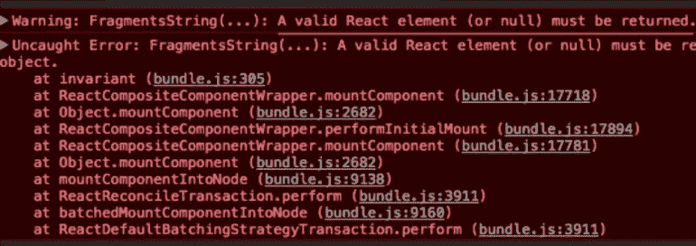
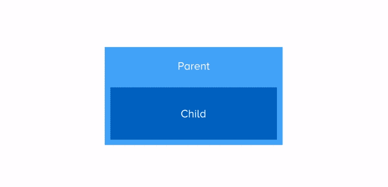
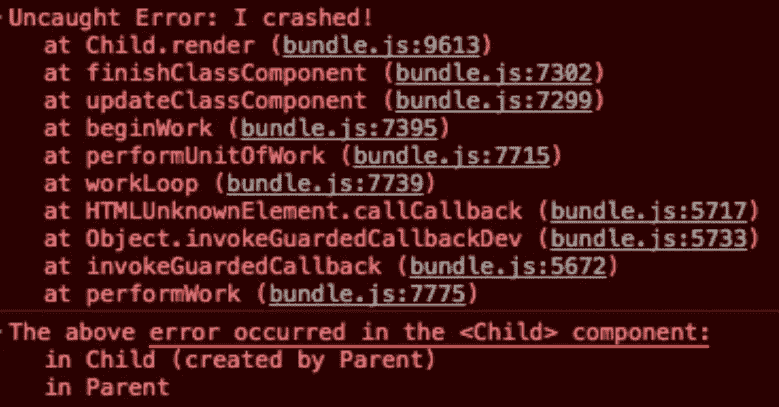
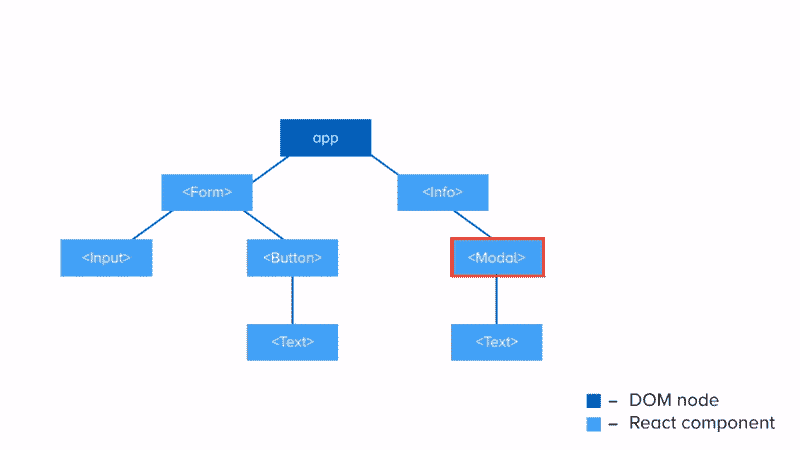
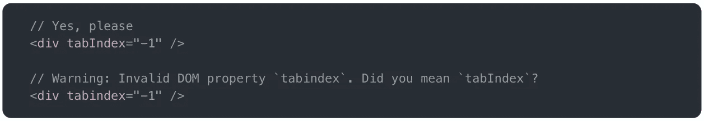
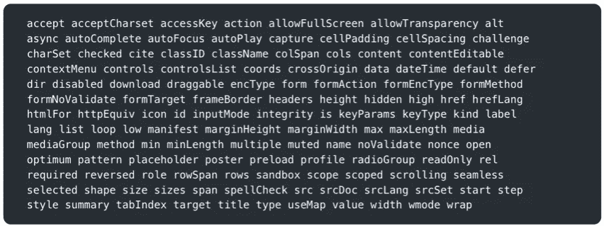
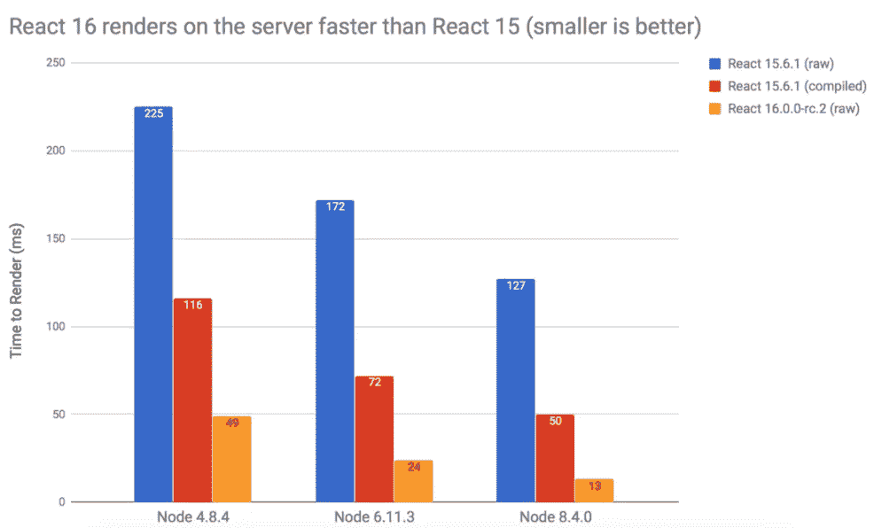
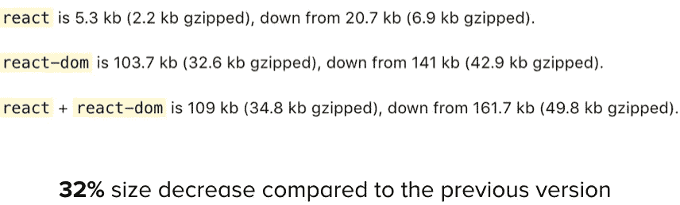

# React 16 入门

> 原文：<https://medium.com/hackernoon/getting-started-with-react-16-5ebd823d6990>


距离[脸书](https://hackernoon.com/tagged/facebook)发布[反应 16](https://reactjs.org/blog/2017/09/26/react-v16.0.html) 已经有一段时间了。
新版本有很多新特性，有助于设计健壮的组件和增强功能，以加快渲染流水线。

[React](https://hackernoon.com/tagged/react) 16 应该是完全向后兼容 React 15 的。正如 React 16 [官方博客文章](https://reactjs.org/blog/2017/09/26/react-v16.0.html#upgrading)所述-

> 如果你的应用在 15.6 中运行时没有任何警告，它应该在 16 中也能运行。

React 16 还带有新的[麻省理工学院许可证](https://opensource.org/licenses/MIT)。如果你没有关注 React 团队为何改用新许可的新闻，请务必阅读[这篇文章](https://medium.freecodecamp.org/facebook-just-changed-the-license-on-react-heres-a-2-minute-explanation-why-5878478913b2)。

谈到它的稳定性，React 团队一直在为 React 16 的生产版本服务于[脸书](https://www.facebook.com/)和[信使](https://www.messenger.com/)。尽管增加了新功能，但与之前的版本相比，它的尺寸减小了 32%。

现在不再浪费时间，我们来谈谈 React 16 的特性。

# 片段和字符串

React 16 让您能够从 render 方法返回一个**数组**中的元素。

```
render() {
    return [
        <h1 key="1">This is h1</h1>,
        <h2 key="2">This is h2</h2>,
        <h3 key="3">This is h3</h3>
    ];
}
```

这意味着，在大多数情况下，你不需要在你的渲染方法中执行数组元素的映射。只需返回数组，它就会呈现得很好。

这里唯一的缺点是它仍然期望一个**键**值被添加到每个数组元素中才能工作。

我觉得这不是一个大问题，而且 React 团队已经保证 React 的未来版本很可能会取消这一要求。

甚至**字符串**和**数字**现在都可以从 render 方法返回。

```
render() {
    return “Just a string”;
}
```

以前版本的 React 会抛出这个错误-



Strings and numbers cannot be returned from the render method in React 15

如您所见，render 方法只允许返回有效的 React 元素。

使用 React 16，render 方法可以返回-
- React 元素
-字符串和数字
-门户
- Null
-布尔表达式

**字符串**和**数字**在 DOM 中呈现为常规的**文本节点**，正如您所猜测的， **null** 不呈现任何内容。

**更新:** React 16.2 于 11 月 28 日发布，改进了对从一个组件的 render 方法返回多个孩子(又名片段)的支持。关于这个的更多信息可以在官方[博客](https://reactjs.org/blog/2017/11/28/react-v16.2.0-fragment-support.html)上找到。

# 误差边界

错误边界有助于您捕捉应用程序中的运行时错误，并允许您呈现回退用户界面。

当出现错误时，React 的早期版本通常会使您的应用程序处于中断状态。为了解决这个问题，React 16 提供了一个全新的生命周期钩子，叫做 **componentDidCatch，**帮助你捕捉运行时错误。

错误边界在它们的子树中捕获错误**，这意味着如果错误发生在错误边界内的任何子组件中，那么特定错误边界的 componentDidCatch 生命周期方法将被触发。**

```
componentDidCatch(error, info) {
    // Render fallback UI
    // Log error
}
```

componentDidCatch 返回两个参数——一个给出堆栈跟踪的 **error** 对象，和一个给出组件堆栈数据的 **info** 对象。

## 误差边界是如何工作的



How Error Boundaries work

这里需要注意几件事-

所有生命周期方法中的错误都可以被错误边界捕获，包括**构造器**方法。

错误边界无法捕捉自身内部的错误。

如果错误边界由于某种原因失败，错误将传播到其上最近的错误边界。

这里有一个关于如何创建和使用错误边界的例子-

在上面的例子中，当在**子**组件(第 17 行)中抛出错误时，**父**组件的 componentidcatch**生命周期方法触发(第 33 行)。在此基础上，我们改变状态，并在其位置上呈现一个回退 UI(第 38 行)。**

## **出现错误时会发生什么？**

**一旦出现错误，**错误堆栈跟踪**和**组件堆栈数据**被记录到控制台，组件树从根被卸载。这可以防止向用户显示损坏的数据。**

****

**Error stack trace returned by an Error Boundary**

****

**Component stack data returned by an Error Boundary**

**但是真的有必要卸载整个 React 组件树吗？React 团队已经讨论了这个决定，根据他们的经验，保留损坏的 UI 比完全移除它更糟糕。点击了解更多信息[。](https://reactjs.org/blog/2017/07/26/error-handling-in-react-16.html#new-behavior-for-uncaught-errors)**

# **门户网站**

**门户允许您将子节点呈现或传送到不同的 DOM 节点层次结构中。**

```
render() {
    return ReactDom.createPortal(child, node);
}
```

**传递给门户的第一个参数是一个**子**组件，它是任何可呈现的实体(render 方法支持的实体)和一个 **DOM 节点**，子组件安装在该节点上。**

**门户通常可用于呈现悬浮卡片或模态，其中的内容将以视觉上不同的非包含方式显示，脱离其父对象。**

## **门户如何工作**

****

**How Portals work**

**上图显示了创建门户的过程，目的是通过**模态**节点将 DOM 层次 1 中的**文本**组件呈现到 DOM 层次 2 中。**

****模态**组件创建一个门户，该门户将**文本**组件安装到不同的 DOM 层次结构中。**

**这是上面例子的代码-**

## **门户中的事件冒泡**

**门户中的事件冒泡与普通 React 组件的工作方式相同，与它在 DOM 树中的位置无关。**

**从门户内部触发的事件将传播到包含它的 React 树中的祖先，即使这些元素不是 DOM 树中的祖先。**

**在这种情况下，模式组件中的按钮没有 **onClick** 处理程序，因此一旦用户单击该按钮，事件就会传播到组件树中它的祖先，并且该组件的 **onClick** 处理程序就会触发。**

# **自定义 DOM 属性**

**使用 React 16，您可以向 React 组件传递自定义属性。**

**过去，React 习惯于忽略未知的 DOM 属性。如果你用 React 不能识别的属性写 JSX，React 会跳过它。但是 React 16 允许将它们添加到组件中。**

```
render() {
    return <div data-attr="10" attr="20">App</div>
}
```

****

**Custom DOM attributes in React 16**

****注意，您仍然应该对已知属性使用规范的 React 命名-****

****

**Canonical naming convention in React**

## **属性白名单**

**React 以前的版本有一个属性白名单，其中包含 React 可以识别的属性列表，并允许将它们添加到组件中。**

****

**Attributes whitelist in React 15**

**React 16 消除了这一点，因此没有更多的属性与白名单匹配，导致文件更小。**

```
render() {
    return <div custom-attr=“20">App</div>
}
```

****

**React 16 support for custom attributes**

**如果您需要使用非标准属性，或者如果您需要与依赖于此类属性的第三方库集成，自定义属性会很方便。就像以前一样，React 16 也允许您对组件使用 **data-** 和 **aria-** 属性。**

# **新核心架构**

**React 16 有一个完全重写的架构，代号为 **Fiber。****

## **异步渲染**

**新的核心算法完全向后兼容，并基于**优先级调度**系统。事件基于优先级进行流式处理，并计划由浏览器呈现，此方法不会阻塞主线程。**

**像**输入**这样的事件被认为是高优先级事件，用户需要得到实时反馈，其他的如 **ajax** 被认为是低优先级事件。**

**调度系统大量使用了**请求回调** API。**

**此方法将在浏览器空闲期间调用的函数排队。这使开发人员能够在主事件循环上执行后台和低优先级工作，而不会影响延迟关键事件，如动画和输入响应。**

**在不支持该 API 的浏览器中，React 提供了一个 polyfill。**

**如果你想更多地了解纤维的工作原理，我强烈建议你去看看林·克拉克的这个[演讲](https://www.youtube.com/watch?v=ZCuYPiUIONs&index=5&list=PLb0IAmt7-GS3fZ46IGFirdqKTIxlws7e0)，或者阅读 React 团队的这篇[博客文章](https://code.facebook.com/posts/1716776591680069/react-16-a-look-inside-an-api-compatible-rewrite-of-our-frontend-ui-library/)中的详细内容。**

# **改进的服务器端渲染**

**React 16 中的服务器端渲染器也进行了重写。据说比**快 3 倍**。**

**它提供了更快的组件流，通过网络传输到客户机。**

**新的打包策略(由[汇总模块捆绑器](https://rollupjs.org/)促成)摆脱了 **process.env** 检查，这确实很慢。**

**React 16 通过新的[**renderToNodeStream**](https://reactjs.org/docs/react-dom-server.html#rendertonodestream)*API 支持组件流。请随意查看 **ReactDOMServer** 的[文档了解更多详情。](https://reactjs.org/docs/react-dom-server.html)***

***React 团队的核心成员之一 Sasha Aickin 写了一篇关于 React 16 的 SSR 改进的很棒的[文章](https://hackernoon.com/whats-new-with-server-side-rendering-in-react-16-9b0d78585d67)。***

***正如博文中所说-***

> ***当与编译出 process.env 的 React 15 进行比较时，Node 4 的性能提升了约 2.4 倍，Node 6 的性能提升了约 3 倍，而在新的 Node 8.4 版本中，性能提升了整整 3.8 倍。而如果和没有编译的 React 15 对比，React 16 在 Node 最新版本的 SSR 上有整整一个数量级的增益！***

******

***SSR improvements in React 16***

# ***减小文件大小***

***尽管增加了所有新功能，React 16 实际上比 15.6.1 小了**！*****

******

***Reduced file size in React 16***

***尺寸差异部分归因于包装的变化。React 现在使用 [Rollup](https://rollupjs.org/) 为每种不同的目标格式创建平面包，从而在大小和运行时性能方面都取得了胜利。***

# ***装置***

***您可以立即开始使用 React 16，它在 NPM 和 Yarn 上可用。***

```
*npm install --save react@^16.0.0 react-dom@^16.0.0yarn add react@^16.0.0 react-dom@^16.0.0*
```

***详细的安装说明可以在[这里](https://reactjs.org/docs/installation.html)找到。关于弃用和突破性变化的细节可以在[这里](https://reactjs.org/blog/2017/09/26/react-v16.0.html#upgrading)找到。***

***不久前，我还在 React 16 上发表了一篇演讲，你可以在这里查看丹·阿布拉莫夫本人转发的这张卡片😄***

***暂时就这样吧！如果你喜欢这篇文章，别忘了给它一些👏
另外，欢迎在 [Medium](/@arunmichaeldsouza) 、 [Twitter](https://twitter.com/amdsouza92) 和 [GitHub](https://github.com/ArunMichaelDsouza) 上关注我。***

***谢谢！***