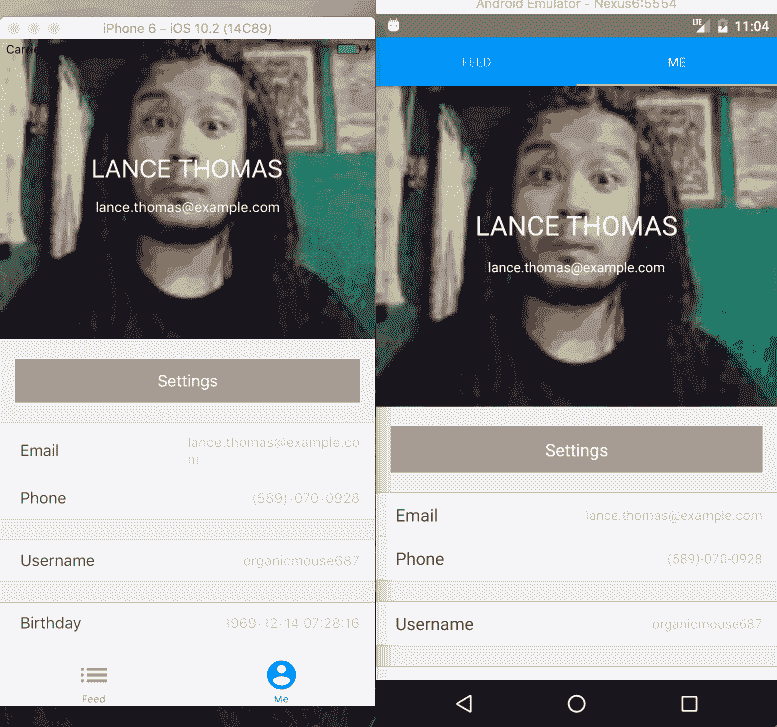
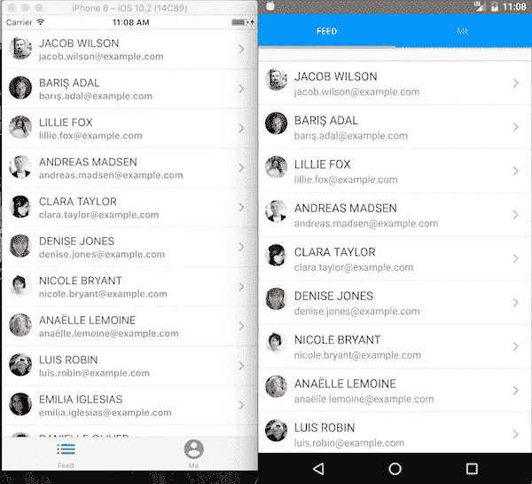
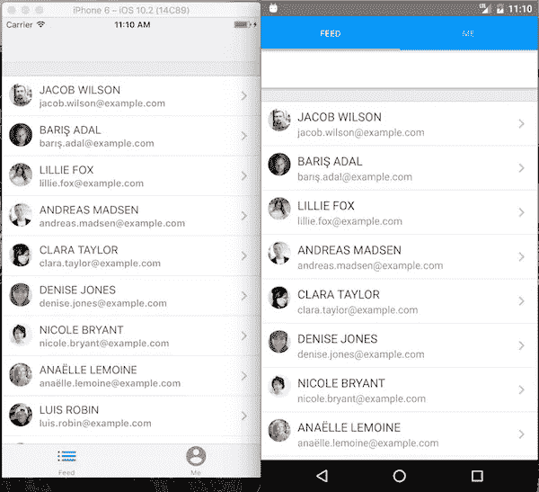

# React 导航入门，React Native 的导航解决方案

> 原文：<https://medium.com/hackernoon/getting-started-with-react-navigation-the-navigation-solution-for-react-native-ea3f4bd786a4>

如果你使用过 React Native 一段时间，你可能会对如何在你的应用中导航感到困惑(实践、包等)。自从 React Native 被开源以来，我一直在使用它，并尝试了许多解决方案，这是我的导航进展…

导航操作系统>导航器>反应-本地-路由器-流量>导航实验或前导航(取决于导航要求)

每次升级都需要时间来重构和引入一个新的、略有不同的导航和管理导航状态的模式。

幸运的是，我们现在有了一个单一的“官方”导航解决方案，在 React Native 中使用 [react-navigation](https://reactnavigation.org/) 。该解决方案将取代 Navigator、NavigationExperimental 和 ex-navigation，成为新的“官方”导航解决方案。

它目前处于测试阶段，但处于相当稳定的状态。如果你开始一个新的 React 本地应用，我会说从 react-navigation 开始，它只会变得更好。

今天，我想花点时间使用 react-navigation 构建一个具有一些常见路线需求的应用程序。我们将讨论选项卡、堆栈和模态——这只是对包的一个非常基本的初步了解。这是最终产品

## 密码

本教程的所有代码都可以在 Github 上找到[。我将从一个简单的应用程序开始，它有](https://github.com/spencercarli/getting-started-react-navigation) [react-native-elements](https://github.com/react-native-community/react-native-elements) ，几个屏幕，以及来自[随机用户生成器](https://randomuser.me/)的一些用户数据，这样我们就可以专注于导航而不是配置应用程序。

## **视频**

更喜欢视频学习？在 Youtube 上看看这个教程的视频版本。

Please note that the API used in this video is slightly out of date.

## 制表符

我们要添加的第一件事是两个选项卡——一个用于用户列表，一个用于当前用户的详细信息。为此，我们将使用 React Navigation 中的 [TabNavigator](https://reactnavigation.org/docs/navigators/tab) 。

我们将在`config/router.js`文件中工作。我们需要做的第一件事是导入我们预先构建的屏幕— `Feed.js`和`Me.js`。我们还需要从`react-navigation`导入`TabNavigator`，从`react-elements`导入`Icon`。

完成后，我们就可以开始定义 TabNavigator 了。TabNavigator 接受一个对象，每个键/值对代表一个选项卡。

您可以看到，我们向每个选项卡传递了一个屏幕——这将是当该选项卡处于活动状态时应该呈现的组件。

我们需要做的最后一件事是在我们的应用程序入口点使用选项卡导航器。TabNavigator 的结果只是一个组件，可以像其他组件一样呈现。

然而，我们想添加一个图标到标签栏，这样事情看起来就对了。有两种不同的方法可以做到这一点——一种是通过`navigationOptions`静态 or 在屏幕上定义信息，这是我的首选方法，在定义标签的同时定义它。

使用 TabNavigator 时，选项卡的设置非常简单，您可以快速更新和修改它们。

## 导航堆栈

现在，当您按下一个行项目时，您可能，并且正确地，会期望我们转到一个新的屏幕。为此，我们将使用 [StackNavigator](https://reactnavigation.org/docs/navigators/stack) 向堆栈中添加一个新屏幕。

这个 API 与 TabNavigator 非常相似，它接受一个对象，在这个对象中我们定义了堆栈中应该可用的所有屏幕。

首先，确保从`react-navigation`导入 StackNavigator。到时候你也会想`import UserDetail from '../screens/UserDetail';`。然后我们定义 StackNavigation，就像我们对 TabNavigator 所做的那样。然后，我们可以用新的堆栈替换 TabNavigator 中的提要屏幕定义。

我之前没有提到它，但是在 React 导航中，除了接受屏幕组件之外，它还接受其他导航堆栈来显示屏幕。这意味着我们的*进给栈*将嵌套在我们的*标签*中。

虽然这很有效，但看起来不太对，我们希望提要屏幕上的导航栏有某种标题…就像之前我们可以利用`navigationOptions`来设置它一样。在这里查看你能做的所有事情的文档。

现在实际上是从我们的列表项导航到屏幕。

每当你定义一个屏幕，这个组件将访问`this.props`上的`[navigation](https://reactnavigation.org/docs/navigators/navigation-prop)`，你可以用它做很多事情。在这里，我们只是将它用于`navigate`功能。在`Feed.js`中，我们将向`onLearnMore`函数添加以下内容。

在没有完全重新散列文档的情况下，我们告诉 navigate 我们想要转到哪个屏幕(它与我们的 StackNavigator 中的键对齐)以及我们想要传递到下一个屏幕的数据。这给我们留下了

现在您可能想知道我们是如何访问传递到新屏幕的数据的。它和导航功能一样，在`this.props.navigation`——特别是`this.props.navigation.state.params`——上可用。我正在提取所有的数据来生成这样的`UserDetail.js`屏幕

## 情态的

我想在本教程中介绍的最后一件事是如何用 React 导航创建一个模态。这是一种常见的模式，但我发现在其他 react 本地路由解决方案中实现起来非常困难/不太直观。

为了完成一个模型，我们将创建另一个 StackNavigator，有一个细微的区别。这个“根”导航器将包含我们的 TabNavigator 以及我们的设置屏幕。我们还将告诉这个 StackNavigator，不要从右到左放置卡片/屏幕，而是从下到上放置。所有这些单词在代码中看起来都是这样的(如果您还没有导入设置屏幕，请确保导入)。

您可以看到这个 StackNavigator 与我们之前创建的完全相同，但是我们利用了其中的两个选项来创建我们想要的模态接口。除了我上面描述的`mode`，我们还有`headerMode`，它告诉 StackNavigator 不要显示这个堆栈的导航条——我们将让子导航条来做这件事。

为了保持一致的界面，并展示您可以在 StackNavigator 中嵌套一个 StackNavigator，我们也将为设置屏幕构建一个。

最后，我们想告诉应用程序入口点使用我们新的根导航器，而不是选项卡。

所有这些留给我们的是

请记住，所有这些[代码都可以在 Github](https://github.com/spencercarli/getting-started-react-navigation) 上获得，我鼓励您查看这些代码以及 [react 导航文档](https://reactnavigation.org/)。

这只是对 React 导航的一个简单的初步了解。如果你想看更多关于它的教程，请通过推荐这篇文章和评论你下一步想学什么让我知道！

> 如果你对 React Native 感兴趣，想了解如何构建高质量的应用程序，请注册我的免费视频课程！

> [黑客中午](http://bit.ly/Hackernoon)是黑客如何开始他们的下午。我们是 [@AMI](http://bit.ly/atAMIatAMI) 家庭的一员。我们现在[接受投稿](http://bit.ly/hackernoonsubmission)，并乐意[讨论广告&赞助](mailto:partners@amipublications.com)机会。
> 
> 如果你喜欢这个故事，我们推荐你阅读我们的[最新科技故事](http://bit.ly/hackernoonlatestt)和[趋势科技故事](https://hackernoon.com/trending)。直到下一次，不要把世界的现实想当然！

