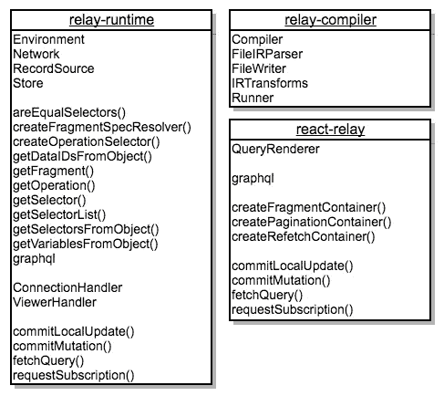
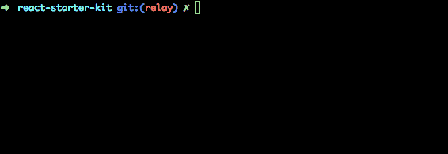

# 开始使用 Relay“Modern”构建同构 Web 应用程序

> 原文：<https://medium.com/hackernoon/getting-started-with-relay-modern-for-building-isomorphic-web-apps-ae049e4e23c1>

**Relay** 代号“ **Modern** ”是在脸书使用的流行的 **GraphQL 客户端**库的新版本。它在重新设计时考虑到了可扩展性，使其非常灵活地集成到任何类型的 web 应用程序中，包括[同构](/airbnb-engineering/isomorphic-javascript-the-future-of-web-apps-10882b7a2ebc)(或通用)web 应用程序。但是首先…

# 为什么选择 GraphQL？

嗯，如果你环顾四周，你会注意到同样在脸书孵化的 GraphQL 技术事实上正在成为开发 web 和移动应用后端的标准，取代 RESTful APIs、JSON APIs、OData 和其他类似的规范——主要是因为 GraphQL 面向开发者体验和性能。脸书开发商绝对抓住了这一点。

以 GitHub 的 GraphQL 实现为例—[docs](https://developer.github.com/early-access/graphql/)+[playground](https://developer.github.com/early-access/graphql/explorer/)，您可以看到它是如何“实时”工作的，并尝试执行几个示例查询。把这个链接给一个从未听说过 GraphQL 的前端开发人员，几个小时之内，他就能掌握核心概念，开始使用它，并完成工作^_^

如果你还在考虑用什么技术为你的下一个应用构建一个[数据 API 服务器](https://github.com/kriasoft/nodejs-api-starter)，请不要再犹豫了，GraphQL 是这个用例的绝佳选择。此外，它非常适合在基于微服务的架构中构建 API 网关。

所以，问题不是你是否需要使用 GraphQL:)，而是哪个 GraphQL 客户端库最适合我们的项目？最起码，你可以只使用 [HTML5 获取 API](https://developer.mozilla.org/docs/Web/API/Fetch_API/Using_Fetch) 。让我们看看它是什么样子的。首先创建几个助手方法— `fetchQuery()`、`commitMutation()`等等。

然后，您可以通过您的应用程序使用这些助手函数来获取大块数据并将数据提交给服务器，如下所示:

虽然这种方法对于小型应用程序来说很好，但是它不能很好地伸缩，也不能很好地与基于组件的 UI 架构一起工作(稍后将详细介绍)。

# 为什么要接力？

新中继的核心特性之一是能够从客户端代码中提取 GraphQL 查询，然后合并并优化它们，这样，例如，您可以解析客户端代码(在编译步骤中)，找到所有 GraphQL 查询，将它们保存到数据库中，并使您的客户端(web)应用程序发送查询 id 而不是文本字符串。这种技术至少在移动设备上有巨大的性能优势，减少了客户端捆绑包的大小、网络流量和 CPU/内存占用。

它支持订阅，因此您可以通过 Web 套接字或类似的传输将数据从服务器传输到客户机，反之亦然，还支持“实时查询”，这是使用 HTTP 长轮询技术的订阅的简化替代方案。

在 Relay 的新版本中，您可以配置“字段处理程序”，它可以用于从服务器有效负载接收的后处理。当您需要在应用程序中实现一些非标准的分页算法时，这是非常方便的。此外，您现在可以配置“客户端模式扩展”，这是一种将一些任意属性/元数据附加到从 GraphQL 后端提取的现有数据记录的便捷方式，以便在客户端使用。这应该能够取代以前需要 Flux/Redux 存储的一些用例。

您可能知道，Relay 有一个数据存储，可用于缓存从服务器获取的数据记录，但更重要的是，它有一些*智能 ass* 逻辑，确保垃圾收集器(GA)清理所有不再使用的数据。祝你在没有中继的情况下顺利实现:)

最后，Relay Compiler(稍后将详细介绍)足够智能，可以从客户端代码中使用的 GraphQL 查询中生成流类型。多酷啊。

# 里面是什么

“现代”接力赛由四个 NPM 包组成，即:

*   `**relay-runtime**` —为创建运行时使用的复杂 GraphQL 客户端提供核心构建块。
*   `**relay-compiler**` —一个命令行工具，用于从源代码中提取 GraphQL 查询，对其进行优化，并以 JavaScript 代码的形式保存在磁盘上。
*   `**babel-plugin-relay**`—Babel Compiler 的一个插件，用`() => require('xxx.graphql')`语句替换源代码中所有硬编码的 GraphQL 查询，其中`xxx.graphql`是 Relay Compiler 生成的相应文件的名称。
*   `**react-relay**` —是一组与 [React](https://hackernoon.com/tagged/react) 应用程序一起使用的高阶组件，这个包在引擎盖下使用`relay-runtime`。如果你正在用 Angular，Vue.js 等构建你的前端，就不需要它了。

花点时间看看公共中继“现代”API 是什么样子的:



Relay “Modern” v1.0.0-rc.3 (April 27, 2017)

如您所见，`react-relay`包只提供了一个顶级 React 组件— `QueryRenderer`和三个助手函数，用于将 React 组件包装成支持中继的高阶组件。就是这样！剩余的五个字段(`graphql`、`fetchQuery`等)只是从`relay-runtime`模块的再输出。

实际上，`react-relay`在`react-relay/classic`和`react-relay/compat`名称空间中公开了更多的 API 方法和字段。但是除非你正在使用一个构建在 Relay `v0.x`之上的遗留代码库，否则你不会想去研究这些。现在让我们看看如何将 Relay“Modern”集成到您的项目中。

# 如何入门 Relay.js

我假设你已经熟悉了 [React](https://facebook.github.io/react/) 、 [Babel](http://babeljs.io/) 和 [Node.js](https://nodejs.org/) ，并且有了使用这个堆栈的基本项目结构。如果你不是 React 的忠实粉丝，我认为下面的代码样本也可以应用到另一个前端框架或库，只需做一些小的调整。

首先，运行以下命令安装前面提到的所有软件包:

```
yarn install relay-runtime@1.0.0-rc.3
yarn install react-relay@1.0.0-rc.3
yarn install relay-compiler@1.0.0-rc.3 --dev
yarn install babel-plugin-relay@1.0.1-rc.3 --dev
```

将`babel-plugin-relay`包含到您的 Babel 配置文件的插件列表中(通常是`.babelrc`或`.babelrc.js`):

添加将运行中继编译器的 npm 脚本。因此，项目根目录中的`package.json`文件将包含以下条目:

现在，您需要将 GraphQL 模式从您的数据 API 服务器复制并粘贴到您的项目中，方法是将其保存到`src/schema.graphql`文件中(参见[示例](https://reactstarter.com/graphql/schema))。这个文件将被中继编译器使用。此外，附带的好处是，将这种基于文本的模式(相对于 JSON)置于源代码控制之下将允许您和您的前端团队轻松地看到您的 GraphQL 模型是如何随着时间的推移而发展的。如果需要的话，可以自动执行这项任务。

现在你可以尝试在你的代码中插入一些 GraphQL 查询(在`src`文件夹中)并运行`yarn run relay`命令将这些文本查询编译成 [JavaScript](https://hackernoon.com/tagged/javascript) 。



或者，您可以在监视模式下运行中继编译器:

```
yarn run relay -- --watch
```

请记住，如果您试图在 GraphQL 查询中使用一些在`src/schema.graphql`文件中丢失的字段，Relay Compiler 会抛出一个错误。

GraphQL 查询应该是什么样子？你需要从`relay-runtime`或`react-relay`模块导入`graphql`对象。并使用*标记的模板文字*。这里有一个例子:

让我们假设您的`src/schema.graphql`文件包含一个带有`viewer`和`posts`顶级字段的模式。然后，如果您运行`yarn run relay`，它将在包含 GraphQL 查询的源文件所在的同一文件夹中生成`__generated__/Example.graphql.js`文件。并且在你用 Babel 编译了你的原始源代码之后，上面带标签的模板文字字符串会被替换成`const query = () => require('__generated__/Example.graphql')`。

需要注意的重要一点是，如果你的代码包含匿名查询或者像`query { viewer { email } }` vs `query ExampleQuery { viewer { email } }`这样的片段，那么 Relay 编译器将无法工作。

您可以通过片段的名称引用这些片段来构建顶级 GraphQL 查询。例如:

即使这些完全相同的查询位于不同的文件中，Relay Compiler 也足够智能来构建依赖树，编译和优化它们。这就是为什么它要求所有的查询和片段都有自己唯一的名字。

现在，为了获取上例中所有组件的数据(`Layout`、`Toolbar`、`PostList`)，我们只需要获取顶级查询的数据，如以下代码所示:

不要太关注渲染函数，而是看看如何使用来自`relay-runtime`模块的`fetchQuery()`助手方法。

你可能会好奇，`environment`变量是从哪里来的？为了使用中继，您需要初始化所谓的中继环境。幸运的是，`relay-runtime`模块为此提供了所有必要的工具。根据您的代码是在浏览器还是 Node.js 环境中执行，这个“环境”会略有不同。

例如，在浏览器中，您可能希望将 HTML Fetch API 与`[whatwg-fetch](https://github.com/github/fetch)` polyfill 结合使用，而在服务器上，您可以使用具有完全相同 API 但设计用于在 Node 中运行的`[node-fetch](https://github.com/bitinn/node-fetch)`模块。多亏了 Webpack 和`[isomorphic-fetch](https://github.com/matthew-andrews/isomorphic-fetch)`模块，你不用考虑太多如何将正确的库捆绑到你的生产代码中，就像做`import fetch from 'isomorphic-fetch'`一样简单。

还有什么不同？GraphQL 端点的基本 URL。例如，在浏览器中，中继可能使用相对于网站域名的 URL 路径字符串从`/graphql`端点获取数据。但是在服务器上，必须是完整的 URL，类似于`http://api:8080/graphql`。

您很可能希望创建一个工厂方法，该方法给定一个基本 URL 和几个其他选项，将初始化正确的 React 环境以及几个将在客户端或服务器端代码中使用的 helper 方法。下面是它可能的样子:

See src/api.js in https://github.com/kriasoft/react-starter-kit

这个工厂方法初始化中继环境，并将其绑定到`fetchQuery()`、`commitMutation()`方法，这样您就不需要在每次需要向服务器发送 GraphQL 查询时都传递它。下面是如何使用它的一个例子:

# 继电器❤反应

现在让我们看看如何用 GraphQL 查询片段来修饰 React 组件，这样您就不需要手动将所有的属性传递到 UI 层次结构中，而是让 Relay 自动查找每个组件所需的数据。为此，您只需使用`react-relay`模块中的三个助手方法之一:

*   `**createFragmentContainer()**` —组成一个 React 组件类，返回一个新的类(`[FragmentContainer](https://facebook.github.io/relay/docs/fragment-container.html)`)，该类拦截道具，用提供的片段解析它们并订阅更新。
*   `**createRefetchContainer()**` —将一个 React 组件类包装到`[RefetchContainer](https://facebook.github.io/relay/docs/refetch-container.html)`中，首先像常规的`FragmentContainer` 一样呈现，但是可以选择使用不同的变量执行新的查询，并在请求返回时呈现该查询的响应。
*   **createPaginationContainer()**—将一个 React 组件类包装到`[PaginationContainer](https://facebook.github.io/relay/docs/pagination-container.html)`中，这是为了简化在列表中加载更多项目的工作流程——在许多情况下，我们不想一次获取所有数据，而是缓慢地加载更多数据。它依赖于 GraphQL 服务器以标准化的方式公开连接。详细规格请查看本页。

其中`Toolbar_viewer`是片段的名称，按照惯例，它使用文件名(工具栏)+下划线+属性名，数据必须通过`this.props`在该属性下可用。

当您初始化这个组件时，您需要传递包含记录 ID 的`viewer={…}` prop，并且`FragmentComponent`将通过该 ID 从本地中继存储中提取所有必需的字段(在这种情况下是`email`和`isAdmin`)。例如，在父`Layout`组件中，您需要像这样实例化`Toolbar`:

如果您将片段命名为`Layout`，而不是`Layout_viewer`，那么`language`字段将通过`this.props.data`可用(相对于`this.props.viewer`)。

好了，现在让我们看看如何将 Relay 与单页应用程序路由器集成。

# 中继❤通用路由器

如前所述，Relay 附带了`[QueryRenderer](https://facebook.github.io/relay/docs/query-renderer.html)`顶级组件，其目的是将一些临时标记安装到 DOM 中，例如“Loading……”，给定一个顶级 GraphQL 查询，开始从服务器获取所需的数据，一旦数据获取完成，就呈现实际的应用程序屏幕(页面)。

我敢肯定这个`QueryRenderer`类并不适合所有类型的应用程序，很可能你会想要复制粘贴并为你的应用程序定制它，或者甚至使用一个替代的解决方案来达到类似的目的。

在同构应用程序的情况下，没有必要渲染一个临时的“加载”屏幕。此外，在用 React 呈现应用程序之前，预加载所有数据可能是一个更好的主意。让我们看看如何通过使用`[Universal Router](https://github.com/kriasoft/universal-router)`库来实现它——你可能已经通过 [React Starter Kit](https://github.com/kriasoft/react-starter-kit) 项目熟悉了这个库。

如果你从未听说过 Universal Router，它是一个简单的中间件风格的路由解决方案，与框架无关(与任何前端框架都可以很好地工作)，并且故意看起来非常类似于 Express.js 路由器，使其更容易在同构 web 应用中采用。

您需要将一个路线列表编译成一个普通的 JavaScript 数组，其中每一项都有`path`、`action`和可选的`children`属性。典型的路线可能如下所示:

其中`api`参数与我们在前面的一个例子中初始化的对象完全相同，它被作为上下文变量传递给路由处理程序(`action()`)方法。

通过调用`new Router(routes)`来初始化路由器，然后执行它的`.resolve({ path, …context }`方法来查找并执行与所提供的 URL 路径字符串相匹配的路由。然后，您只需在客户端将返回的 React 组件呈现为 DOM，或者在服务器端呈现为 HTML 字符串，如以下示例代码所示:

# 摘要

接力《摩登》真的很棒。上面的代码示例演示了它可以多么容易地集成到任何项目中(不一定是 React)。即使您从使用它的基本特性开始，您仍然能够比不使用 Relay 更有效地编写与数据获取相关的代码。在以后的帖子中，我将尝试介绍更多高级的中继功能。敬请期待:)

如果你想看到 React+Relay 集成的工作示例，请访问 GitHub 上的 [React Starter Kit](https://github.com/kriasoft/react-starter-kit) 项目。此外，还有一个兄弟 repo — [Node.js API Starter](https://github.com/kriasoft/nodejs-api-starter) 可以帮助你构建一个 GraphQL API 后端。我在我所有的项目中非常成功地使用了这两个样板，所以如果你需要任何建议，不要犹豫，在 Twitter 上联系( [@koistya](https://twitter.com/koistya) )。

[](http://bit.ly/HackernoonFB)[](https://goo.gl/k7XYbx)[](https://goo.gl/4ofytp)

> [黑客中午](http://bit.ly/Hackernoon)是黑客如何开始他们的下午。我们是 [@AMI](http://bit.ly/atAMIatAMI) 家庭的一员。我们现在[接受投稿](http://bit.ly/hackernoonsubmission)并乐意[讨论广告&赞助](mailto:partners@amipublications.com)机会。
> 
> 如果你喜欢这个故事，我们推荐你阅读我们的[最新科技故事](http://bit.ly/hackernoonlatestt)和[趋势科技故事](https://hackernoon.com/trending)。直到下一次，不要把世界的现实想当然！

