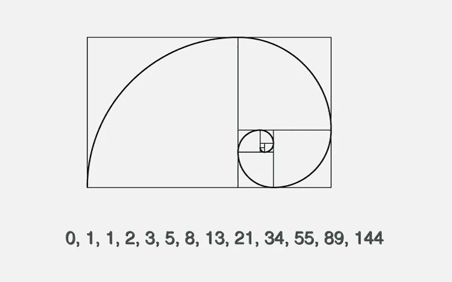
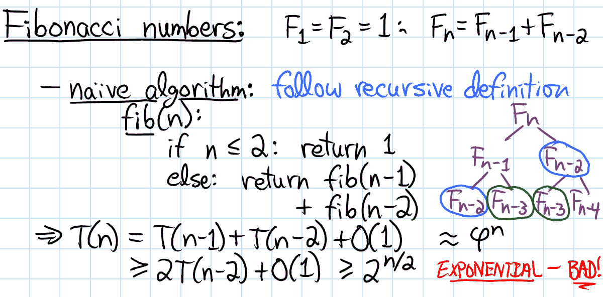
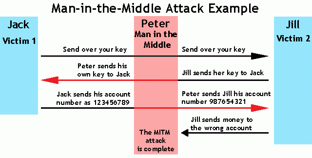
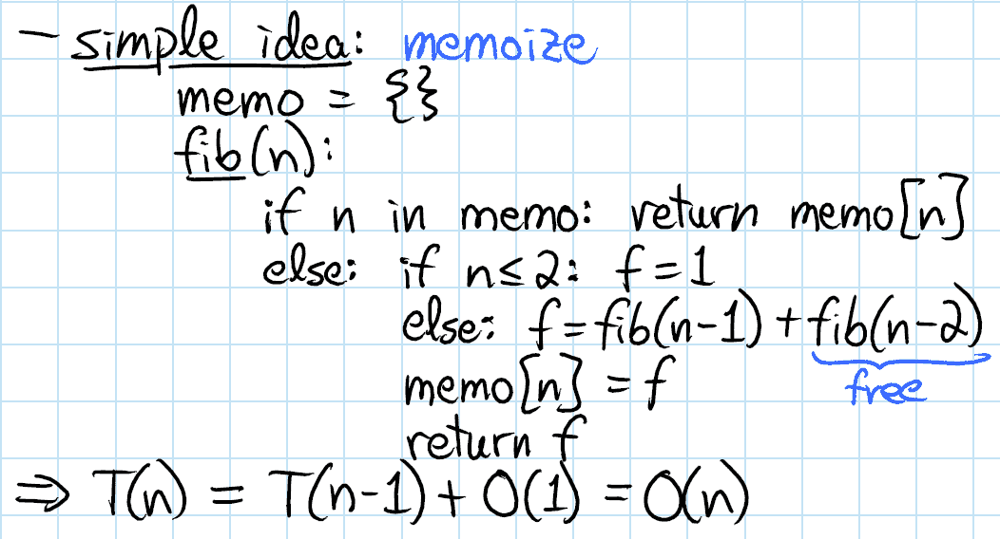

# 两全其美:算法中的时空权衡。

> 原文：<https://medium.com/hackernoon/getting-the-best-of-both-worlds-space-time-trade-offs-in-algorithms-b62116aaf3ef>

## 学习算法科学背后的艺术。

斐波纳契数列是一个整数数列，其中前两项之后的每一项都是前两项的总和。为了更好地理解，下面是它的样子:

The Fibonacci spiral: an approximation of the [golden spiral](https://en.wikipedia.org/wiki/Golden_spiral) created by drawing circular arcs connecting the opposite corners of squares in the Fibonacci tiling; this one uses squares of sizes 1, 1, 2, 3, 5, 8, 13 and 21.

如果我问你这个，告诉我这个系列中的第五个 术语 ***。您可以简单地计算第*和第 ***第四*** 项的总和，这又要求您分别计算第**第二*和 ***第三*** 项的总和。如果你仔细观察，我们不止一次地计算相同的项。这是个坏消息！我们需要一个更好的算法来解决这个问题，随着本文的继续，我们将实现这个目标。*******

**

*Recurrence relation for the Fibonacci sequence (Top). Naive algorithm for calculating Nth-term in a Fibonacci sequence and Time Complexity for the same. (Down)*

*简而言之，算法是解决特定问题 的 ***明确定义的步骤列表。有两个主要因素决定了算法的效率。****

1.  ***空间**:数据存储器( *RAM，HDD* 等。)在执行给定任务时消耗，*
2.  ***时间**:执行给定任务所消耗的时间(*计算时间*或*响应时间*)。*

*一般意义上的时空权衡表示:*

> *您可以降低算法的时间复杂度以换取更大的空间，或者消耗更少的空间以换取更慢的执行。*

*大多数计算机都有很大的空间，但不是无限的空间。此外，大多数人愿意为一个大的计算等待一小会儿，但不是永远。因此，如果您的问题花费了很长时间但没有太多内存，那么时空权衡将让您使用更多内存并更快地解决问题。或者，如果它可以很快解决，但需要比你有更多的内存，你可以尝试花更多的时间来解决有限的内存问题。*

*最常见的情况是使用 [*查找表*](https://simple.wikipedia.org/wiki/Lookup_table) 的算法。这意味着每个可能值的一些问题的答案都可以写下来。解决这个问题的一个方法是写下整个查找表，这将让你很快找到答案，但会占用很多空间。另一种方法是在不写下任何东西的情况下计算答案，这使用很少的空间，但可能需要很长时间。*

*空间-时间折衷可以用于数据存储问题。如果数据以未压缩的方式存储，则比数据以压缩的方式存储需要更多的空间，但需要更少的时间( ***，因为压缩数据减少了占用的空间，但运行压缩算法*** )需要时间。*

*使用 [*循环展开*](https://en.wikipedia.org/wiki/Loop_unrolling) 时，可以使用更大的代码量来提高程序速度。这种技术使得每次循环迭代的程序代码更长，但是节省了在每次迭代结束时跳回到循环开始处所需的计算时间。*

**

*在*密码学*领域，利用时空权衡，攻击者正在减少一次 [*蛮力攻击*](https://en.wikipedia.org/wiki/Brute-force_attack) 所需的指数时间。[彩虹表](https://en.wikipedia.org/wiki/Rainbow_table)使用加密哈希函数的哈希空间中部分预先计算的值，在几分钟内而不是几周内破解密码。减小 rainbow 表的大小会增加遍历散列空间所需的时间。与正常攻击的预期 2^{2n}加密(但只有 O(1)空间)相比，中间相遇攻击攻击使用时空折衷来仅在 2^{n+1}加密(和 O(2^{n}空间)中找到密钥。*

*动态编程是另一个例子，通过使用更多的内存可以减少解决问题的时间。上面的斐波那契问题可以用 DP 更快的解决。*

**

*这将花费 O(n)的时间和空间(这在时间上是一个更好的改进，但是现在我们需要存储以前执行的结果，而不是按需请求它们)。*

*请记住，这只是一个例子，有大量的案例探索这种时空权衡(选择可能不会像这样“明确”)。*

*如果你坚持到了这里，这里有一个好消息给你。包里多出来的东西:*

*时空权衡在生物学中也很普遍。你怎么问？*

> *使用存储的知识或将刺激反应编码为 DNA 中的“本能”,避免了在时间紧迫的情况下进行“计算”的需要。*

*谢谢你的时间。如果你喜欢我的文章，你可以在 Quora 上找到更多我的内容。 ***这些概念对你有意义吗？*** 如果你有 12 秒的时间，我很想看看你下面的评论..**如果这篇文章有帮助，请点击**👏**下面按钮几下以示支持！** ⬇⬇*