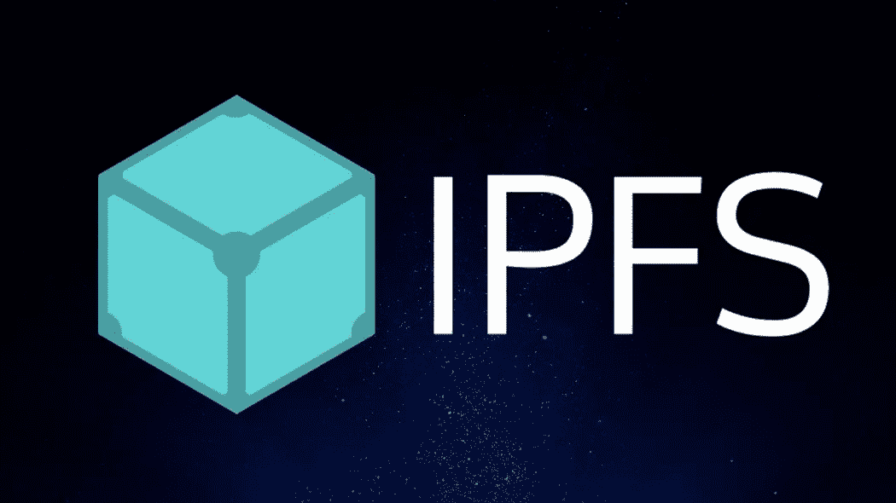

# 了解 IPFS

> 原文：<https://medium.com/hackernoon/getting-to-know-ipfs-21009f018f2e>



本文是区块链列车日志的第 3 部分，从这里开始阅读:[搭上区块链列车](/@pors/catching-the-blockchain-train-9a0945aab958)。

# 我们来读一点(读书对你有好处！)

我已经在前一集列出了这篇文章，但是我再次提到它，因为它是开始理解 IPFS 及其背景的一个很好的地方: [HTTP 已经过时了。现在是分布式永久网络的时候了。](https://ipfs.io/ipfs/QmNhFJjGcMPqpuYfxL62VVB9528NXqDNMFXiqN5bgFYiZ1/its-time-for-the-permanent-web.html)

我们可以从中获得一些东西(稍微简化一点):

*   IPFS 由一个点对点节点(也就是直接相互对话的计算机)网络组成
*   这些节点可以存储内容(任何类型的文件)
*   内容由一个散列表示，并且是不可变的(如果内容改变，散列也会改变)
*   一个节点可以通过使用这个散列从其他节点请求内容。这很酷:在散列和内容本身之间有一个永久的关系。不像现在的网站，URL 后面的内容可以改变。
*   节点可以决定存储任何内容的副本
*   存储内容的节点越多，就越难清除(永久网络)。
*   这样网络也变得更快，类似于种子数量增加时 bittorrent 变得更快(IPFS 部分基于 bittorrent 协议，但区别之一是它[防止相同内容的重复片段](https://www.reddit.com/r/ipfs/comments/48ab4z/why_do_people_say_ipfs_is_permanent_torrents/d0z08of/)

更详细一点:

*   内容(文件)被分成块，每个块都有一个哈希
*   从网络中删除重复的块(内容相同但哈希不同)
*   IPFS 有一个目录概念(另一个散列),指向里面内容的散列
*   Git 类版本控制用于块
*   寻找某些内容的最后版本的问题是由 IPNS 解决的
*   IPNS 允许任何人创建一个独特的公共链接，链接到任何内容。
*   所以一个 IPFS 散列指向一些不可变的内容，不管版本如何；IPNS 地址指向由该地址的创建者确定的某个文件或目录
*   这个 IPNS 地址被实现为 pubkeyhash，类似于比特币钱包中的公共地址。
*   IPNS 哈希表又长又丑。此外，浏览器不会说 IPFS 语。有几个解决方案可以弥补与当前时间的差距，我们将在后面研究。

要阅读和发现更多关于 IPFS 的信息，github 上的这个页面是一个很好的起点 [ipfs/ipfs](https://github.com/ipfs/ipfs) 。请务必查看[快速总结](https://github.com/ipfs/ipfs#quick-summary)。

好了，我想这还有点抽象，是时候开始了。

# 终极时间(动动手指哥们！)

现在我们了解了基础知识，让我们开始玩一点。

要启动并运行，并且能够一起玩，首先[安装](https://ipfs.io/docs/install)(我推荐 ipfs-update 方法)并遵循[入门](https://ipfs.io/docs/getting-started/)。

现在是时候迈出第一步，让这个博客去中心化了。顺便说一句，这个网站有多么伟大的域名！嗯，只要你是看集中版的:)

我将静态生成的网站上传到我的服务器，它看起来像这样:

```
├── archives.html 
├── author 
│   └── mark-pors.html 
├── authors.html 
├── catching-the-blockchain-train.html 
├── categories.html 
├── category 
│   └── blockchain-train-journal.html 
├── feeds 
│   ├── all.atom.xml 
│   └── blockchain-train-journal.atom.xml 
├── getting-to-know-ipfs.html 
├── index.html 
├── picking-a-decentralized-storage-system.html 
├── tags.html 
└── theme 
    ├── css 
    ... // ... 
    └── youtube.png
```

要将一个文件放入星际文件系统，我们只需:

```
$ ipfs init # this creates your node's peer ID 
$ ipfs daemon # start your local node 
$ ipfs add catching-the-blockchain-train.html 
added QmXyZcrThrfWQSTKzPiNT4Nd2RcqcVQ3tr7rmFqHYZ3fq4 catching-the-blockchain-train.html
```

现在我的节点可以服务这个文件，并告诉网络有一段内容(我的第一篇博文！)可用，以防有人请求这个 hash: `QmXyZcrThrfWQSTKzPiNT4Nd2RcqcVQ3tr7rmFqHYZ3fq4`。

因此，在您的终端中:

```
ipfs cat QmXyZcrThrfWQSTKzPiNT4Nd2RcqcVQ3tr7rmFqHYZ3fq4
```

应该返回相同的(当然，只要我通过 HTTP 托管它):

```
curl [http://decentralized.blog/catching-the-blockchain-train.html](http://decentralized.blog/catching-the-blockchain-train.html)
```

请注意，当您通过 ipfs 第二次请求该文件时，它会很快获得它。这是因为您的节点现在在本地有内容的副本。很酷吧？

ipfs 节点自带 HTTP 网关，所以我们也可以在浏览器中访问文件:[HTTP://decentralized . blog:8080/ipfs/qmxyzrthrfwqstkzpint 4 nd 2 rcqcvq3tr 7 rmfqhyz 3 FQ 4](http://decentralized.blog:8080/ipfs/QmXyZcrThrfWQSTKzPiNT4Nd2RcqcVQ3tr7rmFqHYZ3fq4)

这是这里发生的事情(来自入门文档):

> 网关从你的计算机上提供了一个文件。网关查询 DHT，找到你的机器，请求文件，你的机器发送给网关，网关发送给你的浏览器。

注意:这显然引入了一个中央服务器，但至少任何人都可以运行这样的网关。所以它仍然是分散的。我们必须在以后寻找更好的东西。

# 分散吧！终于有了一些进展

要将整个网站推送到星际文件系统上，再简单不过了，只需添加`-r`标志，指向包含所有静态文件的目录。

```
$ ipfs add -r ../../www/dcb 
added QmWu4hsywXoSrw5JRhjUadyMnDuxuvcgExwVD62cWeLVjb dcb/archives.html 
added QmUCJ6z2EfikXEDUYbxfjdkrX2zw62XCAM93HHC61Qrmwg dcb/author/mark-pors.html 
added QmV13vUiKU64oHoxbp5MN7bnehraW46de82PLvndbisn64 dcb/authors.html 
added QmXyZcrThrfWQSTKzPiNT4Nd2RcqcVQ3tr7rmFqHYZ3fq4 dcb/catching-the-blockchain-train.html 
added QmRiWHfYLQEJoKz2dDq2sXnW2keiKZG1nHbnaN55TTXN8b dcb/categories.html 
added QmSCx2eV3BjHJWoXMBc7rKakPv3fAcewyroFCRmovcsYSy dcb/category/blockchain-train-journal.html 
added QmVxVLT22KLGasBLxzSv6yXofx3GVXmWEd3HqSjPp1X6Zz dcb/feeds/all.atom.xml 
added QmdKJY5VVd8Qm5xsLt8Vj5XwvTbe5mCQhK6DnZ9LkqTHwz dcb/feeds/blockchain-train-journal.atom.xml 
added QmYpyQ3MXYZum3q2E9pRxUWnJXK74cLvFbuMDYukK9ivK1 dcb/index.html 
added QmXkfv9ZXb9evxPXTMJC8fvgeZymYpTQo3CVFv7mDoSRTN dcb/picking-a-decentralized-storage-system.html 
added QmSyuSjmzhwkoj6qH7s4MmKeB98Ub1DZ1Hm5anBBnR9yVu dcb/tags.html 
added QmSfLETTMQc1b9cBJENH1S4NK5qniXSf79KSP8h5CbU3U8 dcb/theme/css/main.css 
... // ... 
added QmU8CmEYWV5aUuqoToq1xiyqftdY8MHQ8MdViA2ex23uyV dcb/theme/images/icons/youtube.png 
added QmYBVeJkBRdJYj8jr3YTGWE537h26YqcfjvbX4ttjZ65X2 dcb/author 
added QmPwQPX86RQi6MrZQigh2tWgztcbf46EjhRg1hzMzELvHN dcb/category 
added QmfRxCPp417G3NTqEpBmwtGwtUKFzgQjBRvxNBq88HhC9F dcb/feeds 
added QmYUnPcDPcnKA3WFembvNYG48m1oUWa7QLNWZxrkLv1vcE dcb/theme/css 
added QmfBq8BDXxhu9cLAG4qhxqY6K5xDQCBWyoYqX5fTmQbfwW dcb/theme/images/icons 
added Qme4Dt6vQ1eAVcEs7dY55cAMhTsRJxTakANhZjX9EKvGfF dcb/theme/images 
added QmciTMAUiEqMpar2u9n1dJNJStmrP6fjMESyH6ZS5eo56H dcb/theme 
added QmcPx9ZQboyHw8T7Afe4DbWFcJYocef5Pe4H3u7eK1osnQ dcb
```

注意:当我尝试添加一个符号链接到网络时，我的第一次尝试失败了，那不起作用。

看到`dcb/catching-the-blockchain-train.html`的哈希和我们之前得到的一样吗？这就是实际的重复数据消除。

现在当我们从这个列表中取出底层 hash，并将其馈送给网关时，我们看到了博客:[http://decentralized . blog:8080/ipfs/qmc px 9 zqboyhw 8t 7 AFE 4 dbwfcjyocef 5 PE 4 H3 u 7 ek 1 osnq/](http://decentralized.blog:8080/ipfs/QmcPx9ZQboyHw8T7Afe4DbWFcJYocef5Pe4H3u7eK1osnQ/)。所有相关链接都工作正常；太美了！

万一我的网关宕机了，就试试 IPFS 提供的:[https://gateway . ipfs . io/ipfs/qmc px 9 zqboyhw 8t 7 AFE 4 dbwfcjyocef 5 PE 4h 3u 7 ek 1 osnq/](https://gateway.ipfs.io/ipfs/QmcPx9ZQboyHw8T7Afe4DbWFcJYocef5Pe4H3u7eK1osnQ/)或者你的本地网关:[http://127 . 0 . 0 . 1:8080/ipfs/qmc px 9 zqboyhw 8t 7 AFE 4 dbwfcjyocef 5 PE 4h 3u 7 ek 1 osnq/](http://127.0.0.1:8080/ipfs/QmcPx9ZQboyHw8T7Afe4DbWFcJYocef5Pe4H3u7eK1osnQ/)。这很酷吧？

还有一个小问题:这是博客的前一个版本，因为我还在写这篇文章，当我完成后上传它时，哈希发生了变化，但新的哈希不会出现在文章中…

对此有一个解决方案:

# IPNS 博客的永久地址

这里解释一下 IPNS 的用法:[行星间命名系统](https://ipfs.io/ipfs/QmNZiPk974vDsPmQii3YbrMKfi12KTSNM7XMiYyiea4VYZ/example#/ipfs/QmP8WUPq2braGQ8iZjJ6w9di6mzgoTWyRLayrMRjjDoyGr/ipns/readme.md)。

因此，在我们的例子中，在我的服务器上运行的节点上，我做到了:

```
$ ipfs name publish QmcPx9ZQboyHw8T7Afe4DbWFcJYocef5Pe4H3u7eK1osnQ 
Published to QmRf4ERGvYpVo6HRa2VueZT8pWi8YvyLS3rW6ad2y83tdN: /ipfs/QmcPx9ZQboyHw8T7Afe4DbWFcJYocef5Pe4H3u7eK1osnQ
```

这产生了一个不会改变的博客地址:`QmRf4ERGvYpVo6HRa2VueZT8pWi8YvyLS3rW6ad2y83tdN`。

这个地址指向包含静态文件的目录(顺便说一下，当 index.html 在这个目录中时，它就被服务了)。

当你读到这里时，地址`QmRf4ERGvYpVo6HRa2VueZT8pWi8YvyLS3rW6ad2y83tdN`仍然是主页地址，但它将包含新的内容(当我写完这篇文章后，我会再做一个`publish`)。

所以我们的静态博客现在是去中心化的，可以通过[http://decentralized . blog:8080/ipns/qmrf 4 ergvypvo 6 HRA 2 vue ZT 8 pwi 8 yvyls 3 rw 6 ad 2y 83 tdn/](http://decentralized.blog:8080/ipns/QmRf4ERGvYpVo6HRa2VueZT8pWi8YvyLS3rW6ad2y83tdN/)获得。注意这次是`ipns`部分而不是`ipfs`。

IPFS 很酷，它让我们的生活变得更容易。在我们继续改进我们的博客之前，我想看看引擎盖下面，了解 IPFS(和 IPNS)的工作方式

阅读这里:[了解 IPFS 白皮书第一部分](http://decentralized.blog/understanding-the-ipfs-white-paper-part-1.html)。

*原载于*[*decentralized . blog*](http://decentralized.blog/getting-to-know-ipfs.html)*。*