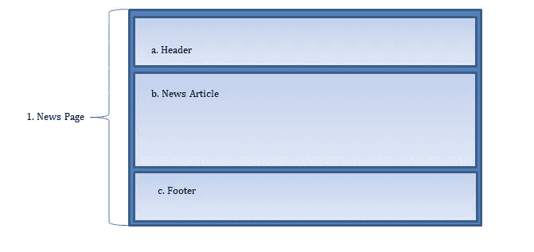

# 开始了解反应

> 原文：<https://medium.com/hackernoon/getting-to-know-react-49980f422fc4>

在过去的几年里，React 已经成为最受欢迎的 JavaScript 库之一。几个方面使 React 成为创建交互式用户界面的强大工具。本文描述了每个初学者都应该理解的一些关键概念。

# **ES6**

关于 React 首先要知道的是，它使用的是 ES6，这是 2015 年至 2016 年发布的 JavaScript 版本。不幸的是，并不是所有的浏览器都兼容 ES6。使用 React 时，我们必须用编译器将 ES6 翻译成旧版本的 JavaScript。最值得推荐的编译器之一是[巴别塔](https://babeljs.io/)。

ES6 的语法与旧版本的 JavaScript 略有不同。如果你不知道 ES6 但是想学 React，[代码学院](https://www.codeschool.com/courses/es2015-the-shape-of-javascript-to-come)、[韦斯博斯](https://es6.io/)和[代码学院](https://www.codecademy.com/learn/introduction-to-javascript)都有 ES6 教程。

# **组件**

关于 React，需要记住的最重要的一点可能是，它是基于组件的。这个想法是拥有一个包含子组件的父组件。使用这种结构，您可以将信息从父节点传递到子节点，反之亦然。

假设您正在创建一个新闻页面。在最基本的层面上，网站的组成部分可能包括以下内容:

1.家长:新闻页面

一、子节点:表头

二。孩子:新闻文章

三。子对象:页脚



然而，随着应用程序的增长，这四个组件可以进一步划分。新闻文章组件可能包含标题、作者和正文组件。如果我们在页脚上方添加一个注释组件会怎么样？这个部分本身将包含多个组件。虽然组件有助于建立开发应用程序的模式，但当开始使用 React 时，它们也会变得难以跟踪。

# **JavaScript 里面的 HTML？**

这个 React 组件显示“Hello World！”：

```
ReactDOM.render(
<h1> Hello World! </h1>,
document.getElementById(‘root’);
);
```

上例中显示的

# 元素不是 HTML。React 使用 JavaScript 的语法扩展，看起来像 HTML，来描述用户界面的外观。这种语法被称为 JSX。

# 虚拟世界

用 JavaScript 创建交互式网站的一种方法是在 DOM 中添加和删除属性。然而，如果用户向待办事项列表中添加一个项目，大多数 JavaScript 库会告诉浏览器如何再次显示整个列表，这使得更新很慢。

JSX 允许 React 创建 DOM 的副本。当进行更改时，整个虚拟 DOM 会重新加载，但是因为它不会更改屏幕上的任何内容，所以会快速重新加载。然后将真实 DOM 与虚拟 DOM 进行比较。因为 React 已经指定了所有内容的位置，所以 DOM 不需要计算出所有内容——它只需要更改更新的元素。换句话说，如果用户将一个项目添加到待办事项列表中，虚拟 DOM 会快速重新考虑布局，因此实际 DOM 只需添加新项目。

虽然这些只是 React 的一些特征，但是掌握上面的概念将有助于您在开发 React 应用程序时做出明智的决定。