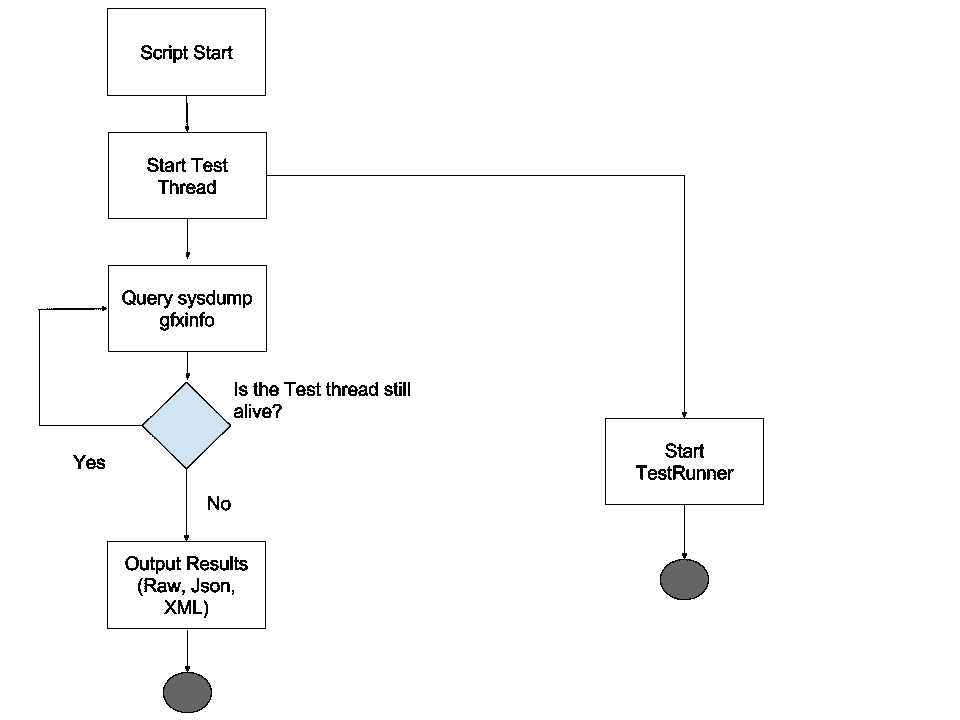

# gfxinfo + UI Automator + Kotlin =自动化邱建测试

> 原文：<https://medium.com/hackernoon/gfxinfo-ui-automator-kotlin-automated-jank-tests-fc43995c7a06>

# 介绍

自动化测试是王道。阅读任何现代编程书籍，比如《有效处理遗留代码》,很明显可以看出为什么编码人员总是不满足。通常，我们自动化测试的主要焦点是我们业务逻辑的正确性。然而，有一种形式的自动化测试可能经常被忽视，那就是测量你的应用程序的邱建。邱建是当你的应用程序因性能不佳而丢帧时使用的术语。类似于单元测试如何提供关于正确性快速反馈，如果我们有性能测试来提供关于邱建(或者希望没有)的快速反馈不是很好吗？这里有一篇关于我们如何结合 [Kotlin](http://kotlinlang.org/) 、 [UI Automator](https://developer.android.com/training/testing/ui-testing/uiautomator-testing.html) (或任何 UI 自动化工具)和 [gfxinfo](https://developer.android.com/training/testing/performance.html) 来创建这样一个测试的帖子。


让我们通过实际监控我们的应用程序的性能来确保我们的用户感到满意！

# 测量邱建

自从 Android 23+以来，随着 gfxinfo 现在报告的信息的增加，测量邱建变得容易多了。dumpsys gfxinfo 是一个 shell 命令，您可以通过命令行在设备上使用它。它为您提供了当前应用程序实例的渲染信息的转储，其中包括您的应用程序的邱建信息。

您可以通过以下方式在 Android API 23+上运行 gfxinfo:

`adb shell dumpsys gfxinfo example.jank.performance.myapplication`

这将输出邱建信息(它是总输出的子集),如下所示:

```
Total frames rendered: 82189
Janky frames: 35335 (42.99%)
90th percentile: 34ms
95th percentile: 42ms
99th percentile: 69ms
```

有了这个终端命令，我们现在有一个简单的方法来测量我们的应用程序的邱建。需要注意的是，gfxinfo 并没有告诉你为什么你的应用程序运行缓慢，或者如何修复它。你必须使用像 [Systrace](https://developer.android.com/studio/profile/systrace.html) 这样的工具来找到问题的根源。然而，这对于我们的用例来说是完美的，因为我们构建测试只是为了识别回归。实际上，修复回归是另一个时间的另一篇博文…

所以现在我们可以很容易地测量我们的应用程序的邱建。现在必须构建的测试的下一部分是仪器部分。在这篇文章中，UI Automator 将是我们选择的 UI 测试工具。

# 设备仪表准备

现在我们需要设置我们的设备，为仪器做好准备。我们实际上还不会运行任何测试(这是下一步)。这里的目标是让被测设备进入一种状态，这样我们就可以通过命令行轻松地开始我们的 UI 自动化测试。Android 的 UI 自动化工具非常适合这一点。

设置和使用 UI Automator 超出了本文的范围。然而，它非常简单。您可以 [*按照这些指示*](https://developer.android.com/training/testing/ui-testing/uiautomator-testing.html) *使用 UI Automator 设置您的项目。*

现在，让我们准备好测试设备。首先，您应该通过分级任务创建常规和测试 apk:

```
./gradlew assembleDebug assembleDebugAndroidTest
```

现在您想将它们部署到设备上:

```
adb install -r debug.apk
adb install -r debug-androidTest.apk
```

就是这样。现在你的设备应该完全准备好我们的 UI Automator 的使用。开始测试，可以通过命令行完成，如下所示:

```
adb shell am instrument -w -r -e debug false -e class example.jank.performance.myapplication.BasicTest example.jank.performance.myapplication.test/android.support.test.runner.AndroidJUnitRunner
```

所以现在我们有了 UI Automator 测试用例，并且可以很容易地从命令行执行它们。在前面的章节中，我们也有一种从命令行测量应用程序邱建的方法。现在，如果有一种很酷的新语言把这两个概念粘在一起就好了。

# 进入科特林！

我们将使用 [Kotlin](https://hackernoon.com/tagged/kotlin) 构建一个简单的脚本，执行 UI 自动化测试，同时通过 gfxinfo 查询设备的邱建信息。然后，Out 脚本以 JSON 和 XML 格式输出最后一个 gfxinfo 查询结果的子集。(老实说，你真的可以在这里使用任何语言，但我需要找到一种方法来合法地在博客名称中包含“Kotlin ”,希望你真的会阅读它。:) )

由于脚本的冗长，我已经将实际的脚本本身嵌入到了博文的底部。相反，这里是一个活动图，它概述了脚本正在执行的每个高级步骤。



Activity diagram documenting script steps

# 就是这样！

我们现在可以使用 Kotlin 在自动化 UI 测试期间利用 gfxinfo 来快速识别邱建中的任何回归，这样您的用户就不必这么做了。这里仍有许多工作要做，但是，希望这是一个很好的起点，让您考虑将它集成到您的 CI 中，以实现最终的 Android 邱建遥测设置。要了解更多关于各种性能测试工具的信息，请看这个 [Google IO /17 会议](https://www.youtube.com/watch?v=Qfo5fdoXrTU)。

## 想看看实际情况吗？

我已经创建了一个示例项目，该项目应用了本文中讨论的概念:(具体来说，您可以执行 exampleTest.sh bash 脚本来查看所有这些步骤在 Android 23+设备上的运行情况)

[](https://github.com/akperkins/automated-jank-test-example) [## AK Perkins/automated-jank-test-示例

### 这是一个关于我们如何结合 Kotlin、UiAutomator 和 gfxinfo 来创建一个…

github.com](https://github.com/akperkins/automated-jank-test-example) 

## 但是如果你的团队使用不同的 UI 自动化工具呢？

不是每个人都使用 UI Automator 进行 UI 自动化测试。然而，这种方法应该适用于任何可以通过命令行启动的 UI 自动化工具。只需要将 UI 自动化步骤替换为您通常用来准备测试设备的任何步骤，然后将用于启动 UI 自动化测试的 shell 命令交给 Kotlin glue 脚本。

你已经有自动化的邱建测试运行了吗？如果是这样，那么请随时[联系我](https://twitter.com/akperkins1)并分享一些你用来有效避免邱建回归的技巧！

# 科特林·邱建测量脚本示例:

快乐编码:)

[](http://bit.ly/HackernoonFB)[](https://goo.gl/k7XYbx)[](https://goo.gl/4ofytp)

> [黑客中午](http://bit.ly/Hackernoon)是黑客如何开始他们的下午。我们是 [@AMI](http://bit.ly/atAMIatAMI) 家庭的一员。我们现在[接受投稿](http://bit.ly/hackernoonsubmission)并乐意[讨论广告&赞助](mailto:partners@amipublications.com)机会。
> 
> 如果你喜欢这个故事，我们推荐你阅读我们的[最新科技故事](http://bit.ly/hackernoonlatestt)和[趋势科技故事](https://hackernoon.com/trending)。直到下一次，不要把世界的现实想当然！

