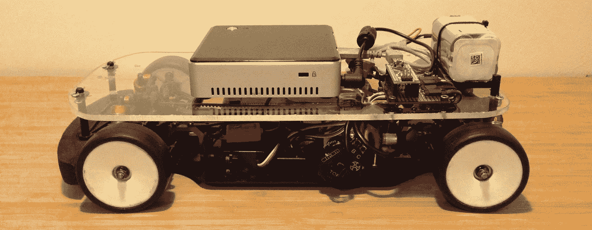
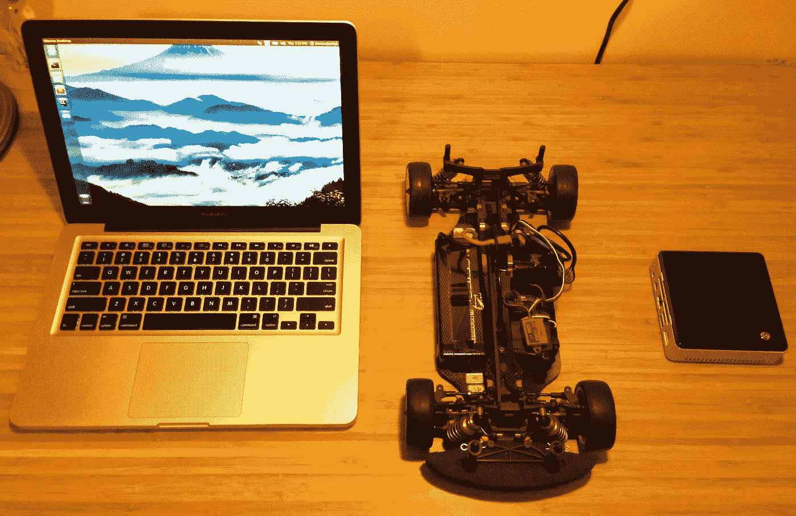
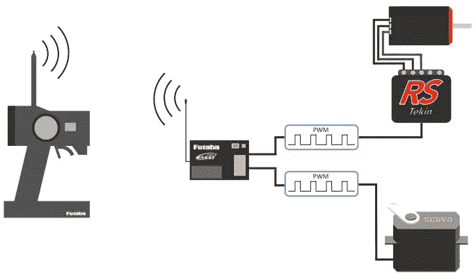
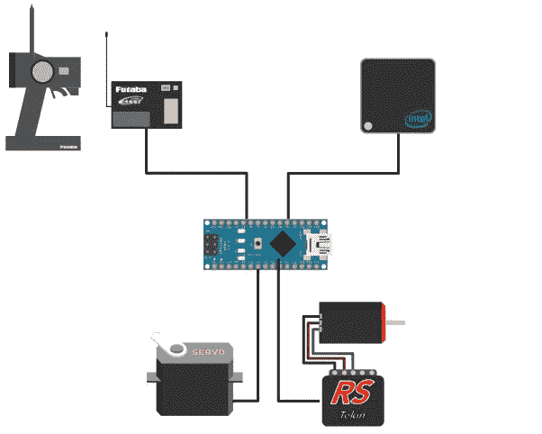
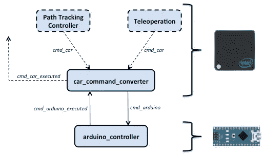
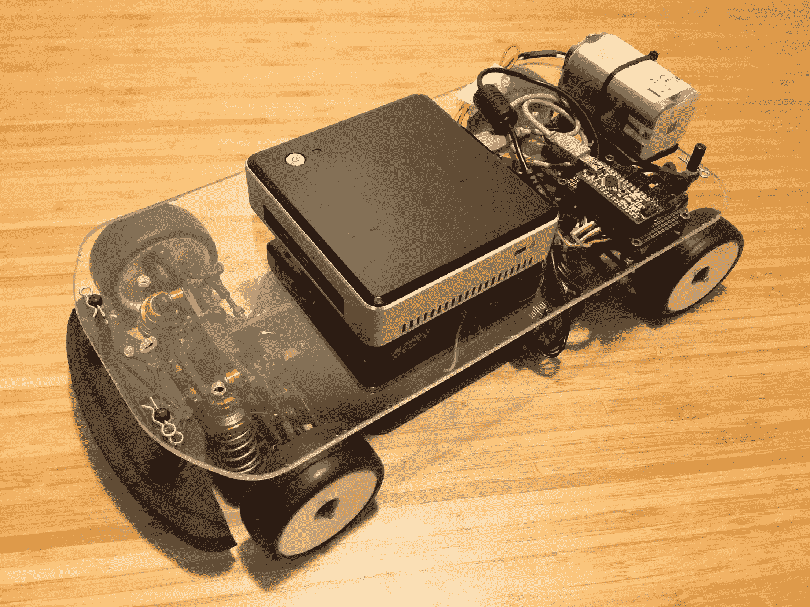

# ghost II——用电脑控制遥控汽车

> 原文：<https://medium.com/hackernoon/ghost-ii-controlling-an-rc-car-with-a-computer-b1d1849d9e43>

这是一系列记录我的项目的第二个故事，我的项目是[自主](https://hackernoon.com/tagged/autonomously) [驾驶](https://hackernoon.com/tagged/race)一辆遥控汽车。第一个故事简单介绍了这个项目的，你可以在这里阅读。

如果你要建造一辆自动驾驶汽车，一个显而易见的要求是，你需要能够控制车载计算机(OBC)，处理所有自动驾驶的 OBC 必须能够实际控制汽车。这就是我今天要讲的内容。

The laptop, the car, and the OBC

这一阶段的目标如下:

1.  OBC 和笔记本电脑之间的通信
2.  从 OBC 向转向伺服系统和电机 ESC 发送命令
3.  能够在任何时候用遥控器覆盖 OBC 命令
4.  出于数据记录目的，用 OBC 监控执行的伺服和 ESC 命令

在开始之前，先简单介绍一下软件。OBC 和笔记本电脑都运行 Ubuntu 14.04，并安装了 ROS Indigo。 [ROS](http://www.ros.org/about-ros/) 代表机器人操作系统，是用于开发机器人系统的框架，为机器人系统的许多常见元素提供工具和约定。如果你不熟悉 ROS，不用担心。但是快速解释一下我将在这些故事中使用的几个术语会有所帮助:

**节点**:计算机上发生的每一个计算过程称为一个节点，会有很多这样的节点。

**主题**:节点之间的通信是通过主题完成的，主题提供了数据的名称以及包含数据本身的消息。

**发布者和订阅者**:对于包含数据的主题，一个节点需要发布它，并且为了让一个节点接收关于主题的信息，它们需要订阅它。

第一个目标:OBC 和笔记本电脑之间的通信。虽然所有的处理都将在 OBC 上进行，但我仍然需要能够从笔记本电脑上监控正在发生的事情，而且我需要通过无线方式来完成。这意味着建立一个特设网络(想想 wifi，但不是一切都通过路由器，而是两台或更多的计算机直接相互连接)。幸运的是，ad hoc 网络的设置非常简单，所以这里不做过多的介绍。为了方便起见，我在 OBC 上添加了一个脚本，在启动时执行，自动创建网络。在笔记本电脑上，我只需像选择任何其他 wifi 网络一样选择新创建的 ad hoc 网络。此外，作为备份，我设置了一个以太网，这样我就可以随时用我的笔记本电脑和以太网电缆登录 OBC。

目标 2-4 包括向汽车的转向伺服系统和电子稳定控制系统发送命令，以及监控来自发射器的命令。遥控汽车的工作方式是在发射器上你有一个油门触发器，方向盘和按钮，发射器将这些控制发送到车上的接收器。对于一辆汽车，将有 2 或 3 个通道传输数据:一个用于转向，一个用于油门，一个可选的第三个通道有时用于激活倒车或其他功能。接收器将其接收到的控制信号转换为脉宽调制(PWM)信号，然后发送至转向伺服系统和电机电子悬架控制系统。PWM 信号本质上是一系列开和关脉冲。伺服系统的位置(或电子稳定控制系统的油门百分比)由接收到的脉冲宽度(即持续时间)决定。

How the transmitter controls get to the servo and ESC

因此，需要完成两件事:第一，我需要能够将这些 PWM 信号发送到转向伺服系统和 ESC，第二，我需要能够监控来自发射器的命令。在我的发射器上，我设置了一个按钮作为激活控制覆盖的第三通道。因此，除了监视转向和油门命令，我还需要检测按钮何时被按下。

发送和检测这些 PWM 信号的一种简单方法是使用微控制器，比如我将使用的 Arduino Nano。这将如何看起来如下所示。发射器将向接收器发送命令，接收器将连接到微控制器，以便它可以监控传入的命令。当微控制器检测到超驰激活时(即第三通道按钮已被按下)，发射器命令将被转发到转向伺服和 ESC。当超驰未激活时，微控制器将为其从 OBC 接收的命令生成 PWM 信号。通过这种设置，发射机将始终优先于 OBC。即使 OBC 撞车了，只要微控制器有电，发射器就能控制汽车。安全第一。

Flow of controls to the servo and ESC

Arduino 有一个很好的伺服库，你给它一个 0-255 之间的整数，它就会产生合适的 PWM 信号。为了测量 PWM 信号，可以使用微控制器上的中断，它可以检测进入其中一个引脚的信号何时在高电平和低电平之间变化。对该脉冲的长度进行计时将会识别出命令是什么。此外，ROS 还有一个串行通信协议以及支持 Arduino 设备上 ROS 功能的库，称为[*rosserial _ Arduino*](http://wiki.ros.org/rosserial_arduino)*。*所有这一切意味着伺服，ESC，Arduino 和 OBC，应该一起玩得很好。

第一步是将微控制器、转向伺服系统、ESC 和接收器连接在一起。我在原型板上放了一些引脚头，为一切提供连接，并在下面布线，以连接到微控制器。对于引脚，从右到左我们有:3 个引脚用于 ESC 输出(Vss、地和信号)，3 个引脚用于转向输出(Vss、地和信号)，来自接收器的超驰信号，来自接收器的节流信号，来自接收器的转向信号，最后两个是接收器的电源电压和地。你可能会注意到有一个额外的引脚，原型板下面还有一个晶体管。这些的目的将在下一个故事中讨论。

Servo and ESC connections for the Arduino Nano

如上所述，Arduino 设备有 ROS 库和串行通信。然而，当使用这些库并通过串行主题发送/接收消息时，会有相当大的开销。此外，像 Nano 这样的小型主板没有太多的内存或处理能力。这意味着微控制器所做的任何处理以及任何串行通信都应尽可能受到限制。

考虑到这一点，我将控件处理划分如下:

*   任何希望控制汽车的节点必须在 *cmd_car* 主题上发布消息，转向和油门值在[-1，1]范围内
*   *car_command_converter* 节点将在 OBC 上运行，将 *cmd_car* 消息转换为 arduino 伺服库期望的【0，255】范围内的 *cmd_arduino* 消息，以及处理任何回退行为
*   *arduino_controller* 节点将使用 *cmd_arduino* 消息为转向伺服和 ESC 生成 PWM 信号，监控来自接收器的命令，并在 *cmd_arduino_executed* 主题上发布执行的命令

Node structure, and on what hardware each node is operating

有了这种配置，arduino 只需传输最少量的处理和数据。与 arduino 交换的消息很小，只有两个 8 位整数用于油门和转向值，一个布尔值用于覆盖标志。然后， *car_command_converter* 节点负责发布和订阅具有浮点值的较大消息，并为这些消息附加时间戳。

我不会遍历这些节点的任何代码，否则这将变成一部小说。但是，如果你感兴趣的话，你可以在 [GitHub](https://github.com/stevendaniluk/ghost) 上查看这些节点的完整代码(以及迄今为止完成的所有内容)。

在测试验证所有节点都正常运行后，所有硬件都可以安装到汽车上。一个旧的 4s lipo 电池为 OBC 提供动力，一块丙烯酸树脂作为平台，这就是汽车移动所需的一切。

后来，一旦我有 IMU 和相机集成，我会投资时间来包装一切都很好。但是现在，一切正常！

既然设置控件的前期工作已经完成，下一阶段将开始自治工作。自主的很大一部分是知道你在哪里，并弄清楚这将是下一个故事的主题。我将给出机器人定位问题的一些背景知识，并解释(其中一种方法)我将用来估计汽车的位置。

如果你对代码感兴趣，请查看 [Github repo](https://github.com/stevendaniluk/ghost) 。或者之前的故事，你可以在这里找到:

[幽灵——我计划驾驶一辆自动遥控汽车](/@stevendaniluk/ghost-my-plan-to-race-an-autonomous-rc-car-46a4b7f093cd)

[幽灵 III——航位推算导航](/@stevendaniluk/ghost-iii-dead-reckoning-navigation-ffd6fd4de1cf)

[Ghost IV —传感器融合:编码器+ IMU](/@stevendaniluk/ghost-iv-sensor-fusion-encoders-imu-c099dd40a7b)

> [黑客中午](http://bit.ly/Hackernoon)是黑客如何开始他们的下午。我们是 AMI 家庭的一员。我们现在[接受投稿](http://bit.ly/hackernoonsubmission)并乐意[讨论广告&赞助](mailto:partners@amipublications.com)机会。
> 
> 如果您喜欢这个故事，我们建议您阅读我们的最新科技故事和[趋势科技故事](https://hackernoon.com/trending)。直到下一次，不要把世界的现实视为理所当然！

