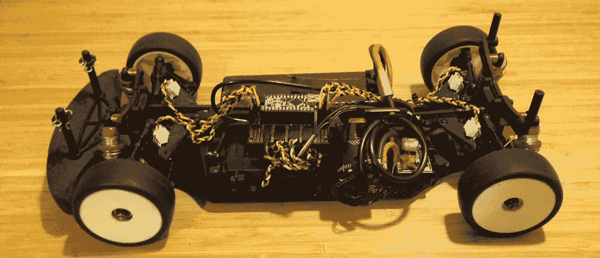
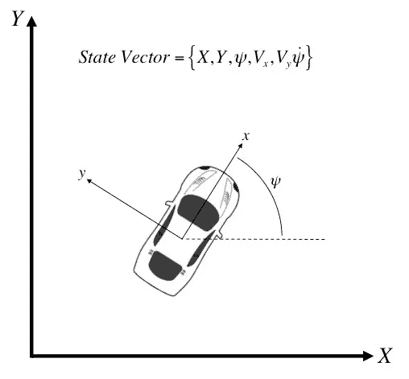
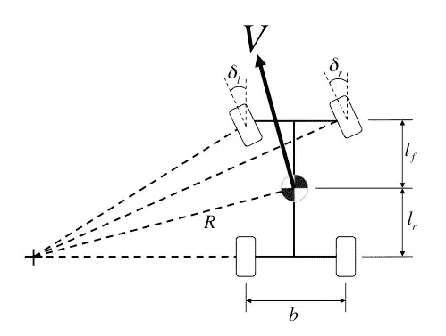
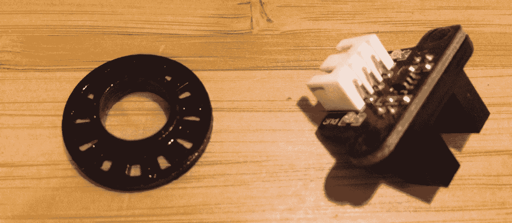
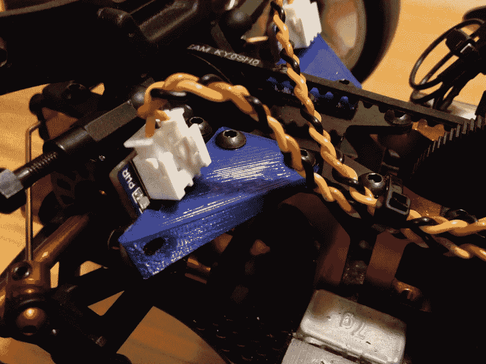
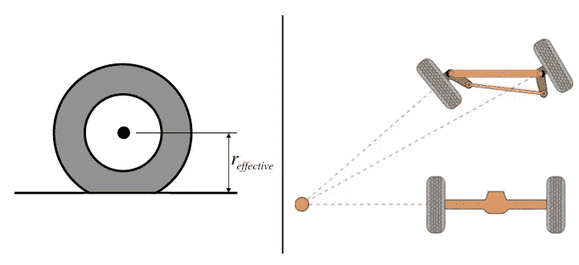
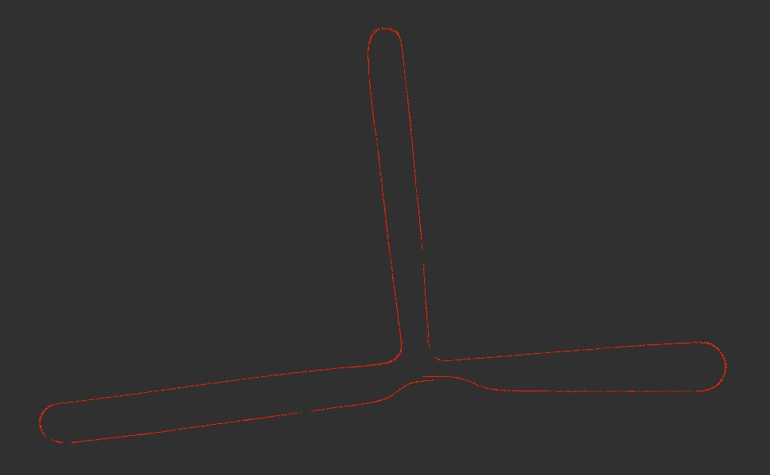
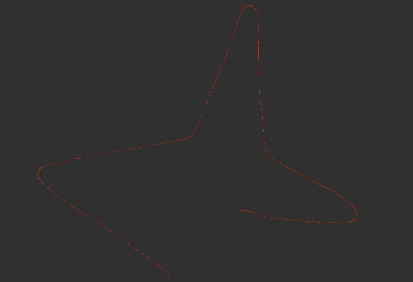

# 幽灵 III —航位推算导航

> 原文：<https://medium.com/hackernoon/ghost-iii-dead-reckoning-navigation-ffd6fd4de1cf>

这是一系列记录自动遥控赛车发展的第三个故事。你可以在这里找到更早的故事:

[Ghost——我计划驾驶一辆自动遥控汽车](/@stevendaniluk/ghost-my-plan-to-race-an-autonomous-rc-car-46a4b7f093cd)

[Ghost II——用电脑控制遥控车](/@stevendaniluk/ghost-ii-controlling-an-rc-car-with-a-computer-b1d1849d9e43)

对于一辆自动驾驶的[赛车](https://hackernoon.com/tagged/race)，你需要解决两个主要问题:“*我在哪里？*、*怎么办？*”。*该怎么办？*“处理车的控制，只有了解车在哪里才能回答，这样后面就来了。*我在哪里？*“这就是我今天要深入探讨的内容。

你可能认为这是一个微不足道的问题。你的智能手机通过 GPS 随时知道你在哪里，这有什么不同吗？好吧，我会详细阐述一下这个问题的含义。对于一个系统，比如一辆自动驾驶的汽车，甚至一架飞机，我们通常用一种叫做状态的东西来描述它，它由状态变量组成。对于这辆车，状态变量是某个参考坐标系中的位置坐标，X 和 Y，该坐标系中的方向(偏航角)，每个方向上的速度，以及方向的变化率(偏航率)。您当然可以包括其他信息，如滚动、俯仰或加速度，如果它们与应用程序相关的话，但对于这个项目，这六个变量将足以描述汽车。

一般来说，没有一个单一的传感器提供完全定义你的状态所需的所有信息(至少不是很好)。为了克服这一点，我们做了一些叫做传感器融合的事情，它将来自多个来源的传感数据融合在一起，形成一个单一的估计。

我们感知和控制身体的方式是传感器融合工作的一个很好的例子，并为我如何解决“*我在哪里？*“问题。当然，当我们感知和控制我们的身体时，会发生很多事情，所以这显然是一种简化，但我会提出三个核心要素。首先是视觉:通过我们的眼睛，我们感知我们的周围环境，包括外观和空间。第二个是我们的前庭系统:位于我们耳朵中的感觉系统，可以检测线性加速度和旋转运动。第三个是我们通常所说的肌肉记忆:以高精度持续执行身体动作的能力。

如果你试着回答“*你在哪里*？”问题仅使用其中一个，它可能不会工作得很好。你的视力表现最好，但即使如此，有时也会被欺骗。想象一下，从一辆静止不动的汽车的窗户往外看，看到旁边的汽车朝相反的方向开走了。我相信我们都有过短暂的失误，我们以为是我们在动，而实际上不是。检测线性和角加速度的前庭系统本身也不会做得很好。想象当有人把你抬走的时候，你闭上眼睛，试着跟踪你的位置。你可能在短期内是准确的，但随着时间的推移，误差会不断积累，很快你的估计就会偏离。最后，我们的肌肉记忆也会表现不佳。考虑闭上眼睛，试着走到 100 米外的特定地点。尽管通过一生的练习，你可以非常准确地完成行走动作，但你仍然会与你预测的动作有微小的偏差，这些误差会随着时间的推移而积累。

然而，当我们结合我们的视觉、前庭系统和肌肉记忆时，我们可以很好地协调我们的身体运动。我们的肌肉记忆预测运动将如何移动我们的身体，然后根据我们的前庭系统和视觉进行更新，以形成更准确的预测。这可以用来更准确地更新我们的运动，这将再次更新我们的前庭系统和视觉，等等。

汽车也可以以类似的方式运行。可以用相机模拟视觉，从周围环境中检测特征和几何形状，并与地图或以前的观察结果进行比较。前庭系统本质上是一个惯性测量单元(IMU)，它是测量加速度的加速度计和测量角旋转的陀螺仪的组合。肌肉记忆可以用车辆在特定转向角度和车轮转数下如何移动的数学模型来模拟。

你如何组合来自这些来源中的每一个的信息实际上是非常有趣的，但是我将在[未来](https://hackernoon.com/tagged/future)的一篇帖子中涉及这个问题，一旦我展示了我实际上如何获得至少两个这样的信息来源。

我要讲的第一个是肌肉记忆案例，在机器人世界里叫做里程计估算。总的想法是，如果你能数出每个车轮旋转的次数，并且如果你知道一些关于你的车辆的几何知识，你就能计算出车辆将如何移动。

你首先做几个假设:车辆沿着一个半径不变的弧线匀速行驶，车轮没有打滑(即没有空转)。如果您以足够高的频率测量车轮旋转，那么在执行此计算时，恒定速度和半径假设将在测量之间的短暂时间内有效。然而，无滑动假设也不成立。车开得越快，这个假设就越站不住脚。但请记住，这只是一个估计，将与其他融合。你可能会很快陷入一个兔子洞，试图说明一切，所以最好保持简单，直到额外的复杂性是必要的。

将一点数学知识(不属于这里)应用于上图，您可以根据车轮旋转和转向角度计算出车辆速度和偏航率。在此基础上，您只需对更新之间的时间变化进行积分，即可确定位置和方向的变化。

重要的一点是，这种方法的误差是无限的。也就是说，每次预测都会包含一些误差，这些误差会被加到下一次预测的误差中，再下一次。这叫漂移，闭上眼睛走路就是这样。除非您有一些全局参考来更新您的估计，否则误差会不断累积。这就是为什么里程计通常被称为航位推算，需要与其他估计融合才能准确。

车轮的旋转可以用一种叫做编码器的传感器来测量。有多种类型可供选择，但我将使用一种更简单的类型:光学编码。基本上，你有一个彼此相对的红外发射器和探测器，以及一个在它们之间旋转的有孔图案的圆盘。当光盘旋转时，发射器和检测器之间的路径会中断，因此您可以通过监控检测器的输出信号来跟踪光盘的旋转。

我已经 3D 打印了自己的编码器光盘，安装在前后差速器的驱动杯上，以及固定编码器的支架上。通过这种设置，我能够检测到车轮旋转的 1/24，相当于大约 8 毫米的移动。

转向角度将来自于将车载 Arduino 发布的执行控制映射到车轮的物理角度。汽车有一种叫做阿克曼转向几何学的东西，它将车轮定位在稍微不同的角度，以说明内侧车轮比外侧车轮行驶的距离更短。我没有考虑这些微小的角度差异，而是简单地假设转向角是内外轮的平均值。这个假设有一些误差，但是可以忽略不计，除非你正在做一个非常紧的转弯。

控制这一过程的方程依赖于车辆的两个测量值:车轮直径和轮距。我当然可以测量这些，但不会很准确。轮胎少量压缩，车轮外倾角(当车轮向内或向外倾斜时)会改变轮距。

(Left) The effective wheel radius as a result of tire compression, (Right) A depiction of Ackermann steering geometry [Wikipedia Commons]

这意味着这些测量值需要根据实际数据进行校准。每辆汽车或移动机器人都必须进行里程计估算。校准这些测量的最简单方法是执行两个动作:纯直线运动和纯旋转运动。数学计算得出，车轮直径只影响纯粹的直线运动，允许您通过计算测量距离内车轮的转数来求解有效车轮直径。旋转运动取决于车轮直径和轮距。但是，一旦您校准了车轮直径，您就可以通过循环行驶固定次数并计算车轮转数来校准轮距。

在重复了 5 次 7.62 米(25 英尺)的直线测试，并在三个顺时针和三个逆时针方向上行驶后，我测得的车轮直径必须增加 3.2%，而轮距必须减少 8.3%。很明显，在很长的距离上，这些测量中的一个小误差会导致非常不同的预测。

为了测试一切，我开着车绕着我大学的一栋建筑，绕着几个走廊跑了一个大的“T”形圈，在与圈的起点相同的位置结束。里程计估算的路径如下所示。总距离约为 100 米，旋转了约 720 度。令我惊喜的是，起点和终点之间的误差只有 0.27 米，方向误差为 9 度。

Estimated path from dead reckoning while driving slowly

对于航位推算来说，这还不算太糟。然而，这一切都是在汽车缓慢行驶的情况下完成的。还记得我之前提到的关于忽略车轮打滑的假设随着速度的增加变得不成立吗？好吧，下面是当你驾驶相同的路线，但更积极地会发生什么。我在光滑的瓷砖地板上的平均速度约为 3-5 米/秒(11-18 公里/小时)，正如你所看到的，里程计的估计值相差甚远。这基本上就像闭着眼睛在冰上跑步一样。

Dead reckoning while driving quickly

如何纠正这一错误？这将是下一个故事的主题。我将在车上添加一个 IMU，并讨论传感器融合的方法，以产生一个更准确的估计，这应该(希望)使高速估计与低速估计一样准确。

你可以在这里找到这个项目[的 Github repo，以及下面这个系列的其他故事。](https://github.com/stevendaniluk/ghost)

[幽灵——我的计划是驾驶一辆自动遥控汽车](/@stevendaniluk/ghost-my-plan-to-race-an-autonomous-rc-car-46a4b7f093cd)

[Ghost II——用电脑控制遥控车](/@stevendaniluk/ghost-ii-controlling-an-rc-car-with-a-computer-b1d1849d9e43)

[Ghost IV——传感器融合:编码器+ IMU](/@stevendaniluk/ghost-iv-sensor-fusion-encoders-imu-c099dd40a7b)

> [黑客中午](http://bit.ly/Hackernoon)是黑客如何开始他们的下午。我们是 [@AMI](http://bit.ly/atAMIatAMI) 家庭的一员。我们现在[接受投稿](http://bit.ly/hackernoonsubmission)并乐意[讨论广告&赞助](mailto:partners@amipublications.com)机会。
> 
> 如果你喜欢这个故事，我们推荐你阅读我们的[最新科技故事](http://bit.ly/hackernoonlatestt)和[趋势科技故事](https://hackernoon.com/trending)。直到下一次，不要把世界的现实想当然！

