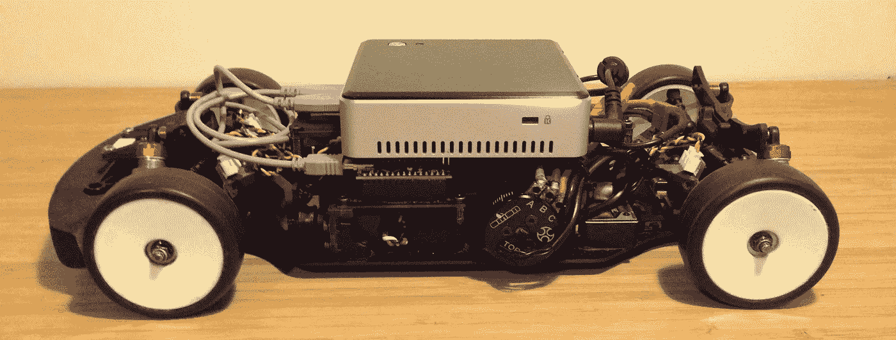
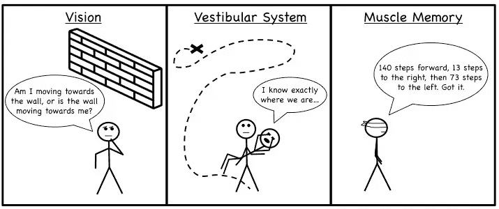
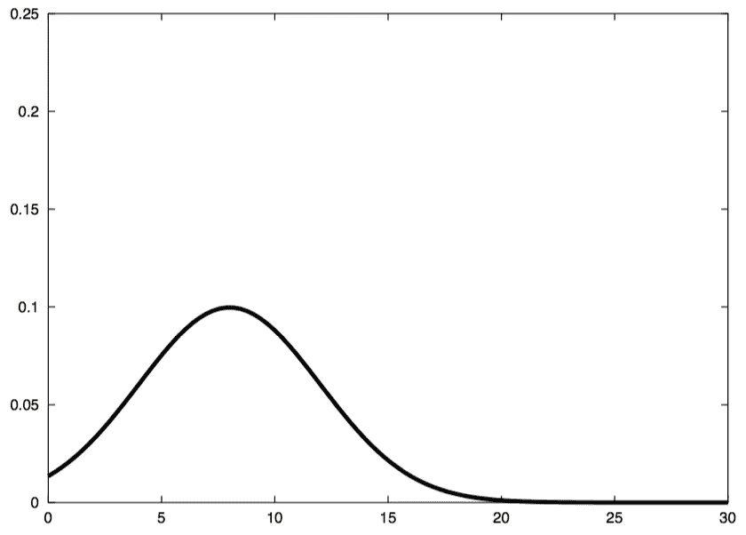
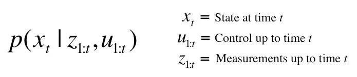
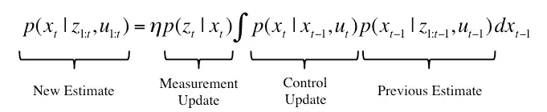
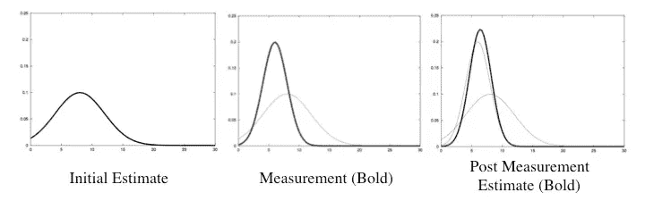
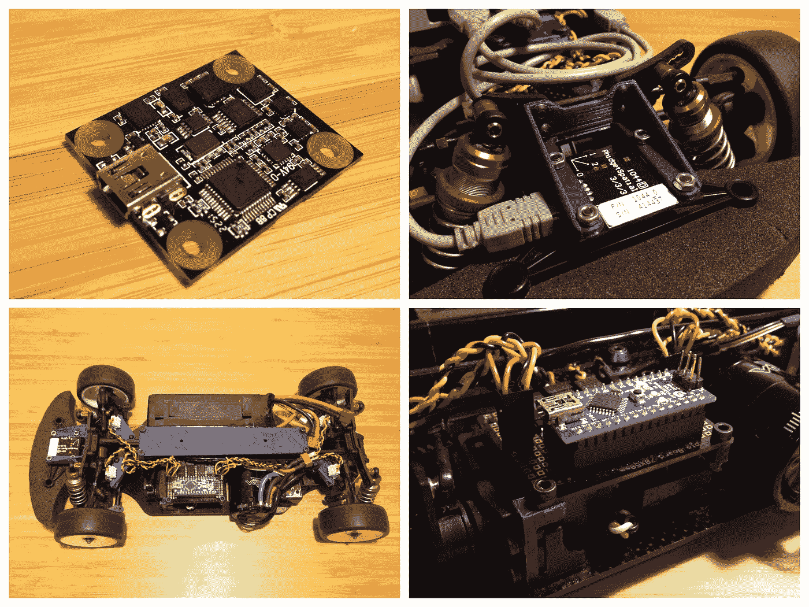
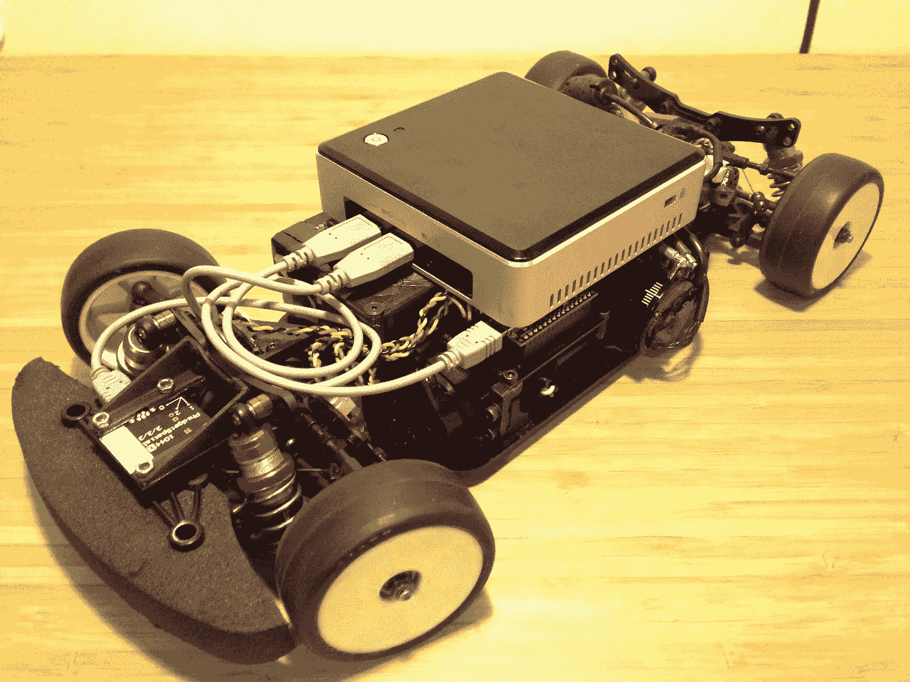

# Ghost IV —传感器融合:编码器+ IMU

> 原文：<https://medium.com/hackernoon/ghost-iv-sensor-fusion-encoders-imu-c099dd40a7b>

这是系列[的第四个故事，记录了](https://hackernoon.com/tagged/documenting)我制作自动遥控赛车的计划。前三个故事可以在这里找到:

[幽灵——我的计划是驾驶一辆自动遥控汽车](/@stevendaniluk/ghost-my-plan-to-race-an-autonomous-rc-car-46a4b7f093cd)

[Ghost II——用电脑控制遥控车](/@stevendaniluk/ghost-ii-controlling-an-rc-car-with-a-computer-b1d1849d9e43)

[幽灵 III——航位推算导航](/@stevendaniluk/ghost-iii-dead-reckoning-navigation-ffd6fd4de1cf)

最后一个故事介绍了状态估计中传感器融合的思想。如果您想要估计某个状态，例如汽车在世界上的位置，并且您有许多传感器提供关于您的状态的部分信息，您希望将这些信息融合成一个更精确的估计值。我通过结合使用视觉、我们的前庭系统和肌肉记忆，对人类如何移动进行了类比，所有这些都有助于对我们所在位置的单一准确估计。下面是我为每个组件制作的精彩插图。

为什么传感器融合是必要的？部分原因是，通常没有一个传感器能够提供我们想要知道的一切(或者至少不是很好)。但是，这也是由于不同的传感器具有不同的特性，其中一些比另一些更理想。GPS 可以给出绝对位置，但是它的更新率很低，并且会受到离散跳变的影响。另一方面，惯性测量单元(IMU)可以极快地更新，但当您试图对加速度进行时间积分以获得位置时，误差会随着时间无限增大。我们想要的是两全其美，因此传感器融合。

对于这个项目，我将实现传感器融合，通过将它与 IMU 的数据相结合，来改善上一个故事中编码器的里程计估计。但是首先，我将花一点时间提供一些关于它实际上是如何工作的细节。传感器融合有几种不同的方法，如概率方法或模糊逻辑。我将解释概率方法是如何工作的，因为那是我正在使用的，而且我觉得它是最直观的。

首先，你需要考虑概率分布。当你考虑自己现在的位置时，你的真实位置可能是在 X 和 y 坐标上，但是，这个真实位置通常并不为人所知。因此，我们考虑世界上每个位置的概率值的分布，其中接近你真实位置的位置的概率应该是高的。下面是一个例子，X 轴代表你在某个方向的位置，Y 轴代表你在那个位置的概率。

What a probability distribution might look like for position (X axis) [Source: Probabilistic Robotics — Dieter Fox, Sebastian Thrun, and Wolfram Burgard]

这同样适用于你如何移动，以及你所做的观察。每次观察(即传感器读数)将是概率分布的形式，你的每个动作也是如此。我们将这些概率结合在一起，试图形成一个更准确的估计。就像你的观点基于多种来源一样。

概率分布非常有用，因为它们不仅仅是单个测量值，还包含与该测量相关的不确定性。对于传感器测量或预测运动之类的事情，我们并不总是确切知道概率分布会是什么样子，因为它通常非常复杂。但是，我们可以做一些假设，形成一个我们认为它应该是什么样子的模型。看看下面这张图。这是用激光进行距离测量的概率分布的潜在模型的描述。

Example of a probability distribution for distance measurements from a laser range, where z-t represents the expected measurement, and z-max represents the maximum range [Source: Probabilistic Robotics — Dieter Fox, Sebastian Thrun, and Wolfram Burgard]

从左边开始，你有一些概率归因于非常短的读数，例如当有东西阻碍激光的路径时。然后，峰值代表您预期的实际测量值。在最右端，你有一些概率分配给激光返回最大范围。此外，所有这些都补充了一点概率分布在每个可能的读数，以说明纯粹的随机测量。对于你所期望的激光测量，这似乎是一个相当合理的模型。对于您想要纳入评估的任何其他传感器或信息，也将执行相同的操作。

现在我们对概率分布及其重要性有了一些了解，让我们回到问题上来。用英语来说，我们试图解决的问题是:假设我做了所有这些动作，做了所有这些观察，我在这里的概率是多少？用数学术语来说，这种想法可以表达为:

其转化为当前状态的概率，以所有先前的观察和所有先前的控制为条件。上述概率分布可以用贝叶斯滤波器来估计，贝叶斯滤波器由下面的等式来表示。

我不打算深入研究贝叶斯过滤器，关于它的教科书已经够多了(一本很好的教科书是迪特·福克斯、巴斯蒂安·特龙和沃尔夫拉姆·伯格德的*概率机器人*，特别是关于贝叶斯过滤器的第二章)。我展示这个公式只是为了说明它方便地由三部分组成:前一时间步的估计分布、控制更新和测量更新。先前的分布是我们在一个时间步之前认为我们在的地方，控制更新是我们仅仅基于我们如何移动而认为我们现在在的地方，并且测量更新是在给定我们认为我们在的地方的情况下接收我们所做的测量的可能性。这意味着我们有一个更新当前状态的递归公式，它依赖于前一时间步的状态、执行的控制和观察到的测量。

下面是一个如何将初始状态估计和测量的概率分布结合起来的例子。测量值与初始状态略有不同，但更集中在一点上。结果是后测量更新更接近实际测量，因为它具有更大的确定性。

下一个显而易见的问题是，我们如何实际获得贝叶斯过滤器所需的每一个概率分布？因为真实的分布可能非常复杂，所以作为一名工程师，你应该做工程师最擅长的事情:做一些假设来得到一个近似值。在激光的例子中，我展示了一组可能的近似值。你可以做的一组不同的近似是，每个预测(状态、控制和测量)都受到白噪声(纯随机)的影响，并且每个分布可以被建模为高斯分布。高斯分布是大多数人熟悉的钟形曲线。当你做这些假设时，数学变得非常好，你就剩下一个叫做卡尔曼滤波器的东西了。

卡尔曼滤波器是最流行的状态估计[工具](https://hackernoon.com/tagged/tools)之一，你会看到它被应用在 GPS 接收机、飞机，甚至阿波罗任务的导航计算机上，这催生了它的发展。当然还有卡尔曼滤波器的变体，例如扩展卡尔曼滤波器、无迹卡尔曼滤波器和信息滤波器，以及可以替代的所有其他近似集合，这将导致不同的方法，例如粒子滤波。每种变化做出不同的假设，并适用于不同的应用。这可能会永远持续下去，但关键是这个问题有很多不同的解决方法。无论如何，回到呈现所有这些信息的实际目的:将里程计数据与 IMU 数据结合起来。

所以，最终目标是预测汽车的位置和方向，以及线速度和角速度。首先，汽车需要一个 IMU。我有一个惯性测量组合，我把它安装在车的最前面。IMU 也有磁力计，但汽车的电动机会产生电场，导致失真，所以我希望它尽可能远。我还为 Arduino 和车载电脑做了一些新的安装，所以我会继续展示这些。在这一点上，汽车基本上是由电池和电子设备组成的。

通过车轮编码器的测量，我可以测量线速度和角速度。我使用的 IMU 提供线性加速度、角速度和磁航向。为了融合这些测量值，我将使用扩展卡尔曼滤波器，它与标准卡尔曼滤波器的不同之处在于对控制更新的假设。

实现卡尔曼滤波器最困难的部分是调整它。还记得我说过卡尔曼滤波器来自于假设所有的分布都是高斯分布(钟形曲线)吗？有两个参数定义了这条曲线:均值和方差。平均值表示曲线的中心，对于测量来说，这只是报告值。方差表示值的分布情况，对于传感器，通常可以从数据手册中获得。卡尔曼滤波器有许多这样的参数，称为协方差值，它控制测量和控制更新。正确调整协方差对滤波器的性能至关重要，但这可能有点棘手。如果我将 IMU 的所有协方差值设置为非常大，而将编码器测量的所有协方差值设置为非常小，这将表明 IMU 数据不可信(非常偏离真实值)，而编码器测量是可信的(非常接近真实值)。结果是，滤波器将忽略 IMU，几乎只监听编码器测量值。如果编码器测量实际上比 IMU 更精确，那么这是没问题的。但是如果相反，那么滤波器的估计将是不准确的，因为它用错误的数据来偏置它的预测。我想说的是，这些参数很重要，需要适当调整。因为您实际上决定了您希望对每一步度量和每一步更新的信任程度。

上一个故事，我以展示仅从编码器测量估计的汽车路径结束，当我快速驾驶时，估计变得非常不准确。因此，我决定在融合了 IMU 数据的情况下重复这个测试。查看下面的视频，观看汽车移动时的估计位置。这是与上次测试相同的路径，大约 100 米长，汽车在光滑的瓷砖地板上以 3-5 米/秒(11-18 公里/小时)的速度行驶。视频是实时的，我没有加速。绿线是融合的位置估计，而红线是仅来自编码器的位置估计。

看起来好多了！这一次，在 100 米长的一圈结束时的位置误差仅为 0.23 米，相比之下，仅使用编码器测量时的位置误差为 10.91 米。这意味着当汽车快速移动时，车轮可能会在光滑的地板上少量滑动，滤波器能够使用 IMU 数据来防止状态估计发散。

重要的一点是，当前状态估计完全是相对的。没有包含任何绝对测量值，例如参考世界上的某个特征或 GPS 信号。结果，随着时间的推移，误差会无限制地增长，就像试图闭着眼睛走路一样。所以我需要某种形式的全局引用。一个摄像头将被安装到汽车上来实现这一点，下一个故事我将解释我是如何做到这一点的。

如果你对代码感兴趣，请点击这里查看 Github repo。或者对于之前的故事，可以在下面找到。

[幽灵——我的计划是驾驶一辆自动遥控汽车](/@stevendaniluk/ghost-my-plan-to-race-an-autonomous-rc-car-46a4b7f093cd)

[Ghost II——用电脑控制遥控车](/@stevendaniluk/ghost-ii-controlling-an-rc-car-with-a-computer-b1d1849d9e43)

[幽灵 III——航位推算导航](/@stevendaniluk/ghost-iii-dead-reckoning-navigation-ffd6fd4de1cf)

> [黑客中午](http://bit.ly/Hackernoon)是黑客如何开始他们的下午。我们是 [@AMI](http://bit.ly/atAMIatAMI) 家庭的一员。我们现在[接受投稿](http://bit.ly/hackernoonsubmission)并乐意[讨论广告&赞助](mailto:partners@amipublications.com)机会。
> 
> 如果你喜欢这个故事，我们推荐你阅读我们的[最新科技故事](http://bit.ly/hackernoonlatestt)和[趋势科技故事](https://hackernoon.com/trending)。直到下一次，不要把世界的现实想当然！

