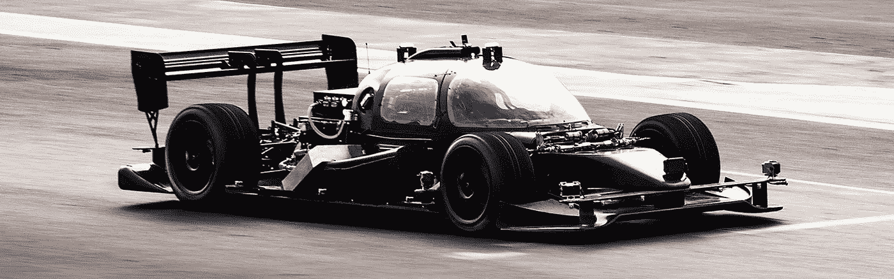
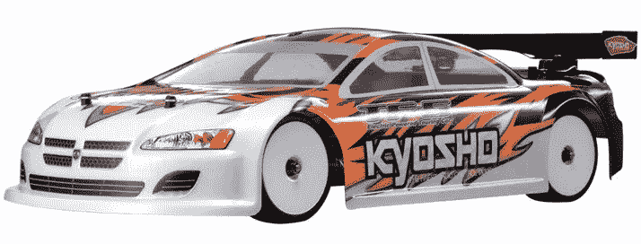
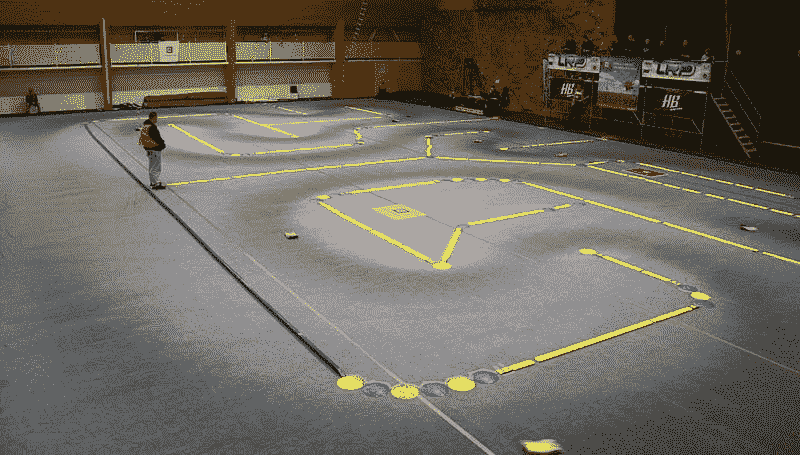
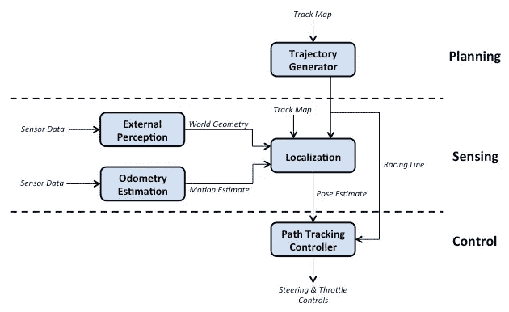
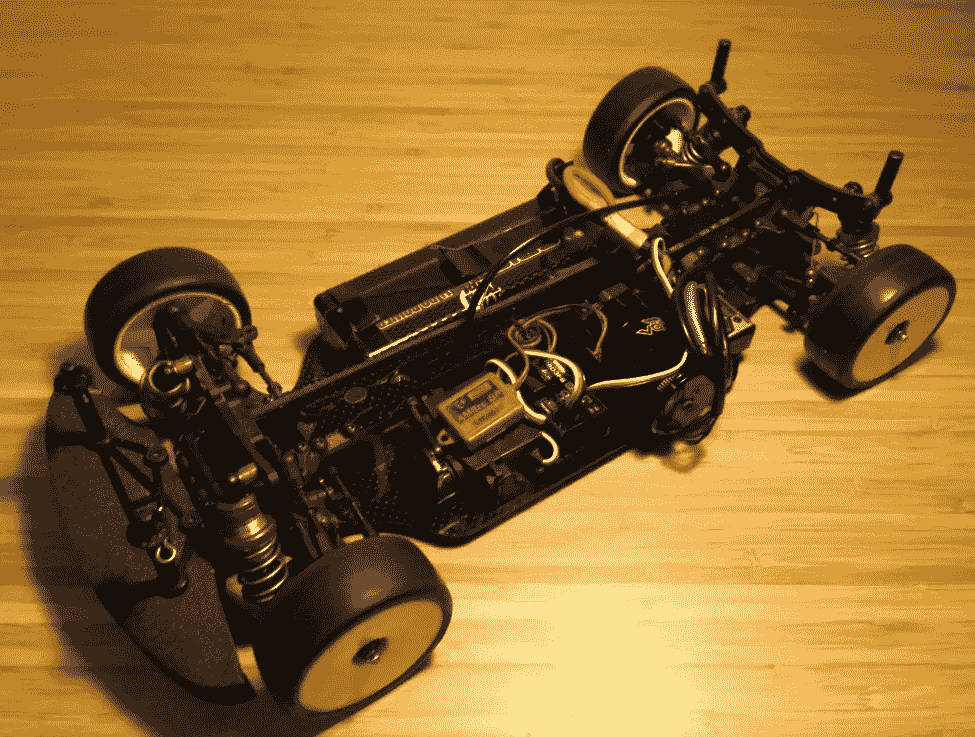
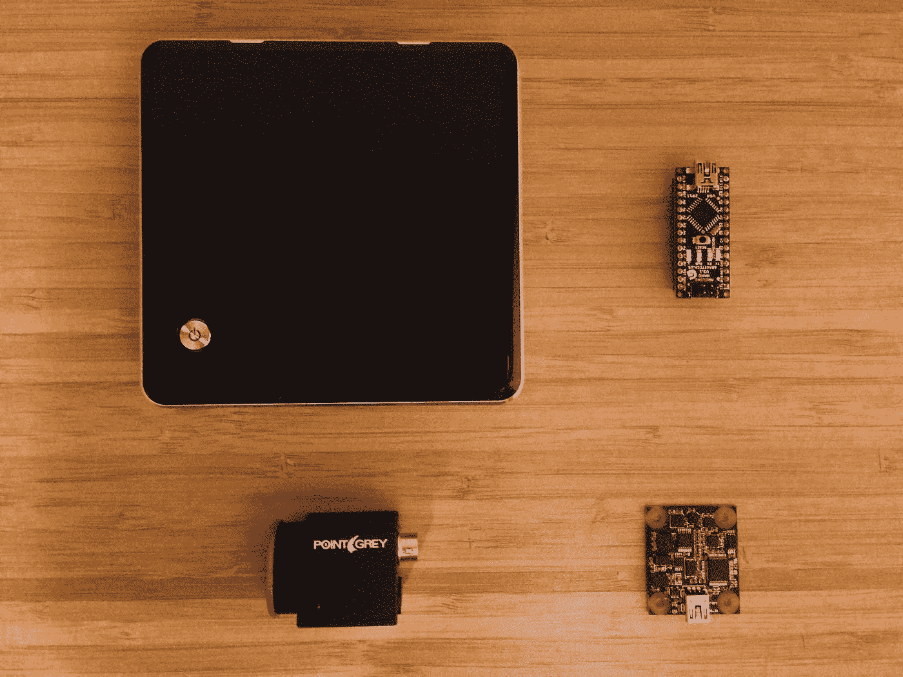

# ghost——我计划驾驶一辆自动遥控汽车

> 原文：<https://medium.com/hackernoon/ghost-my-plan-to-race-an-autonomous-rc-car-46a4b7f093cd>

[RoboRace](http://roborace.com) DevBot (The autonomous race car that my RC car aspires to be)

我已经决定进行一场自动遥控汽车比赛。

大致的想法是，我将乘坐一辆遥控汽车(例如左下)，在它身上安装一台小型计算机和一些传感器，并使它能够在没有任何人类控制的情况下绕着一条轨道行驶(例如右下)。应该很简单…

这里的目标不仅仅是让赛车在赛道上慢慢移动。我更感兴趣的挑战是挑战我的自主知识的极限，看看我能让它开多快，并最终开始研究赛车路线和提高圈速。当自动驾驶汽车或机器人快速移动时，[确定](https://hackernoon.com/tagged/determining)你在哪里，计划去哪里，并实时控制汽车的任务是非常具有挑战性的。但这正是这一切如此有趣的原因！

我想一个重要的问题是:我为什么要这样做？首先，我生活的大部分时间都围绕着遥控汽车、赛车和机器人，这使得这个项目完美地结合了我所有的爱好。其次，项目是学习新技能和扩大知识面的最佳途径之一。你可以花世界上所有的时间来研究如何做某事，但它永远不会像把它付诸实践那样有回报。

我应该提到的是，这个项目在很大程度上受到了来自 [RoboRace](http://roborace.com) 、美国[自驾赛车](http://selfracingcars.com)团体、欧洲[自驾赛道日](http://selfdrivingtrackdays.com)团体以及 [F1/10 自主赛车比赛](http://f1tenth.org)的活动的启发。赛车和机器人世界都充满了才华横溢和充满激情的人，这是非常令人兴奋的，他们终于混合在一起了！我目前正在攻读航空航天工程硕士学位，之后我的目标是从事与 RoboRace 类似的工作。所以，我基本上是在创造我自己的缩小版，我希望它能成为我从事真实工作的垫脚石。

另外，我把这个小项目命名为 *Ghost* 。当我最初想到制作我的一个 RC's autonomous 时，我基本上是想制作一些我可以在赛道上跟随的东西，就像大多数赛车视频游戏中的“幽灵”功能一样。这个名字被保留了下来，所以它就叫这个名字。

我将在这里发布的故事是为那些想要了解 autonomy 如何工作的幕后故事的技术专家以及那些想要阅读一步一步指南的爱好者准备的。我将把故事分成项目的子任务，例如确定赛车在赛道上的位置，并且在深入细节之前总是先从一点(高级)理论开始。我实际上已经在做这个项目的一些部分，但是现在才开始写。也就是说，有些帖子会比其他的来得快，但是我的目标是每 2 周发一个新帖子。

现在，谈谈计划。

**项目概述**

在开始之前，我做了一些假设和限制。这个项目一开始就雄心勃勃，所以我需要仔细选择我的战斗。

第一个假设是路上不会有其他汽车或障碍物。试图理解其他汽车及其超车意图，同时尽量减少时间损失，很容易变成一篇(或几篇)博士论文。最好是走一步看一步。第二个假设是事先有一张赛道地图。有一些很酷的技术，如同步定位和地图绘制(SLAM ),可以在你四处走动时创建地图。然而，我不能证明花太多时间在每条赛道只需要做一次的事情上是合理的。尤其是那些容易被人类复制的东西(如果考虑到任何必要的后期处理，可能会用更少的时间)。

我对设计的一个限制是，视觉(即相机)必须用于对环境的外部感知，而不是激光雷达(或任何其他手段)。这辆车行驶的轨道可能并不总是由某种形式的墙来界定，它们可能只是地面上的标记。在这种情况下，激光雷达用处不大。此外，我需要的激光雷达传感器对我来说太贵了(超过 1000 美元)。有便宜的设备，如[激光雷达](http://www.slamtec.com/en/lidar)(我已经使用过，非常喜欢)，但它只能以 5-10 赫兹的频率扫描周围环境。当以 10 米/秒(36 公里/小时)的速度移动时，10 赫兹的更新导致每米移动一个读数，考虑到轨道只有 2-3 米宽，这是相当大的。或者，相机可以很容易地以几百美元的价格提供每秒 30-100 帧的图像。

对于任何自治系统来说，最好从一个架构开始。架构本质上是如何将系统分解成更小的子系统，以及这些子系统如何相互关联。下面是一个相当标准的自主机器人架构，但它有助于说明任务将如何划分。

Architecture for how the RC car will drive itself

轨迹生成器负责在给定赛道布局的情况下，围绕赛道创建一条赛道线。外部感知通过传感器(如相机或激光雷达单元)确定世界的一些几何形状，而里程计估计则预测汽车如何移动(例如计算车轮转数)。然后，来自外部感知和里程计估计的数据将被融合在一起(未来的帖子将讨论什么是数据融合以及如何实现)，并与定位模块中的轨迹图进行比较，以估计汽车在轨迹上的位置。最后，路径跟踪控制器将查看汽车的位置，并发出适当的油门和转向命令，使汽车遵循所需的路线。

就这样，这就是遥控汽车自动驾驶的基本概念。接下来，说几句关于实现的话。

**硬件**

我将要使用的汽车是一辆阔嘴猴睡衣 TF-5 Stallion 1/10 比例公路车。我花了很多年赛车钢筋混凝土的，其中一些我得到了驾驶阔嘴猴睡衣美国。这是我冬天练习用的车。

在感觉和计算硬件方面，我将使用以下:

*   英特尔 NUC 计算机公司
*   Arduino 纳米微控制器
*   Phidgets 空间 3/3/3 IMU
*   灰点黑蝇照相机

Clockwise from top left: Intel NUC, Arduino micro controller, IMU, and the PointGrey camera

当然可以使用替代硬件，但是我已经有了以前项目中的大部分硬件。我甚至可能最终会改变组件，或者在进行过程中添加更多组件。所有的传感器，以及汽车的伺服系统和电机 ESC(电子速度控制)，都将连接到 NUC，所有的处理都将在那里完成。在以后的文章中，当每一个硬件被介绍的时候，我会更详细地介绍它，设置等等。

**软件**

我将完全在 ROS 中开发这个，并使用 OpenCV，甚至可能在以后使用 TensorFlow(我一直渴望使用它)。如果你想看代码或者跟随我，可以登录我的 GitHub 账户: [stevendaniluk/ghost](https://github.com/stevendaniluk/ghost) 。

这就结束了介绍。请继续关注下一次更新，我将让电脑与汽车对话以发送控制信号。然后，我们将我转移到真正有趣的东西…

你可以在这里找到这个系列的其他故事:

[Ghost II——用电脑控制遥控车](/@stevendaniluk/ghost-ii-controlling-an-rc-car-with-a-computer-b1d1849d9e43)

[幽灵 III——航位推算导航](/@stevendaniluk/ghost-iii-dead-reckoning-navigation-ffd6fd4de1cf)

[Ghost IV —传感器融合:编码器+ IMU](/@stevendaniluk/ghost-iv-sensor-fusion-encoders-imu-c099dd40a7b)

> [黑客中午](http://bit.ly/Hackernoon)是黑客如何开始他们的下午。我们是 [@AMI](http://bit.ly/atAMIatAMI) 家庭的一员。我们现在[接受投稿](http://bit.ly/hackernoonsubmission)，并乐意[讨论广告&赞助](mailto:partners@amipublications.com)机会。
> 
> 如果你喜欢这个故事，我们推荐你阅读我们的[最新科技故事](http://bit.ly/hackernoonlatestt)和[趋势科技故事](https://hackernoon.com/trending)。直到下一次，不要把世界的现实想当然！

