# 2016 年 Git

> 原文：<https://medium.com/hackernoon/git-in-2016-fad96ae22a15>

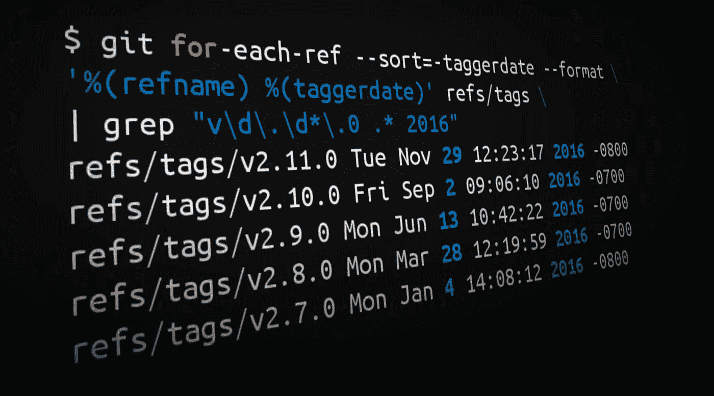

[Git](https://hackernoon.com/tagged/git) 在 2016 年度过了*巨大的*年，五个特性版本 [](#c8e9) ( *v2.7* 到 *v2.11* )和十六个补丁版本 [](#408a) 。189 位作者 [](#315b) 向`master`贡献了 3676 条提交 [⁴](#dbfb) ，比 2015 年上升了 15% [⁵](#2220) ！总共修改了 1545 个文件，增加了 276799 行，删除了 100973 行 [⁶](#bc78) 。

然而，提交计数和 LOC 是衡量生产率的非常糟糕的方法。在深度学习发展到可以定性搜索代码的程度之前，我们将一直依赖人类的判断作为生产力的仲裁者。

考虑到这一点，我决定做一个回顾，涵盖这一年中我最喜欢的六个 Git 特性的变化和改进。对于一篇中型文章来说，这篇文章实在太长了，所以如果你想跳到你特别感兴趣的一个特性，我会原谅你的:

*   [四舍五入出](#fd10) `[git worktree](#fd10)` [命令](#fd10)
*   [更方便](#cc52) `[git rebase](#cc52)` [选项](#cc52)
*   [戏剧性的性能提升为](#42b9) `[git lfs](#42b9)`
*   [实验算法和更好的默认值](#4208) `[git diff](#4208)`
*   `[git submodules](#a5c3)` [以少吸多](#a5c3)
*   [对](#c230)的俏皮增强`[git stash](#c230)`

在我们开始之前，请注意许多操作系统都附带了 Git 的遗留版本，所以有必要检查一下您使用的是不是最新最好的版本。如果从你的终端运行`git --version`返回任何比 Git `v2.11.0`少的东西，直接去 Atlassian 的快速指南[升级或者在你选择的平台上安装 Git](https://www.atlassian.com/git/tutorials/install-git/) 。

# [ `Citation`需要]

在我们进入定性内容之前，还有一个快速的停顿:我想向您展示我是如何从开篇段落(以及夸张的封面图片)中生成统计数据的。您也可以使用下面的命令为您自己的存储库做一个快速的*年回顾*！

```
¹ ***Tags from 2016 matching the form vX.Y.0***$ git for-each-ref --sort=-taggerdate --format \
'%(refname) %(taggerdate)' refs/tags | grep "v\d\.\d*\.0 .* 2016"² ***Tags from 2016 matching the form vX.Y.Z***$ git for-each-ref --sort=-taggerdate --format '%(refname) %(taggerdate)' refs/tags | grep "v\d\.\d*\.[^0] .* 2016"³ ***Commits by author in 2016***$ git shortlog -s -n --since=2016-01-01 --until=2017-01-01⁴ ***Count commits in 2016***$ git log --oneline --since=2016-01-01 --until=2017-01-01 | wc -l⁵ ***... and in 2015***$ git log --oneline --since=2015-01-01 --until=2016-01-01 | wc -l⁶ **Net LOC added/removed in 2016**$ git diff --shortstat `git rev-list -1 --until=2016-01-01 master` \
 `git rev-list -1 --until=2017-01-01 master`
```

上面的命令是在 Git 的`master`分支上运行的，所以不代表任何未合并的工作。如果您使用这些命令，请记住提交计数和锁定不是衡量标准。请不要用它们来给队友的表现打分！

现在，回顾过去…

# 舍入 Git 工作树

`git worktree`命令最早出现在 Git v2.5 中，但在 2016 年有了一些显著的增强。v2.7 中引入了两个有价值的新特性——`list`子命令和用于二等分的命名空间引用——`lock`/`unlock`子命令在 v2.10 中实现。

## 什么是工作树？

`[git worktree](https://git-scm.com/docs/git-worktree)`命令允许您同时检查和处理不同目录中的多个存储库分支。例如，如果您需要快速修复，但又不想弄乱您的工作副本，您可以使用以下命令在新目录中签出一个新分支:

```
**$ git worktree add -b hotfix/BB-1234 ../hotfix/BB-1234**
Preparing ../hotfix/BB-1234 (identifier BB-1234)
HEAD is now at 886e0ba Merged in bedwards/BB-13430-api-merge-pr (pull request #7822)
```

工作树不仅仅是树枝。您可以将多个标签检出为不同的工作树，以便并行构建或测试它们。例如，我从 Git v2.6 和 v2.7 标签创建了工作树，以便检查不同版本 Git 的行为:

```
**$ git worktree add ../git-v2.6.0 v2.6.0**
Preparing ../git-v2.6.0 (identifier git-v2.6.0)
HEAD is now at be08dee Git 2.6**$ git worktree add ../git-v2.7.0 v2.7.0**
Preparing ../git-v2.7.0 (identifier git-v2.7.0)
HEAD is now at 7548842 Git 2.7**$ git worktree list**
/Users/kannonboy/src/git         7548842 [master]
/Users/kannonboy/src/git-v2.6.0  be08dee (detached HEAD)
/Users/kannonboy/src/git-v2.7.0  7548842 (detached HEAD)**$ cd ../git-v2.7.0 && make**
```

您可以使用相同的技术并行构建和运行不同版本的应用程序。

## 列出工作树

`git worktree list`子命令(在 Git v2.7 中引入)显示了与存储库相关的所有工作树:

```
**$ git worktree list**
/Users/kannonboy/src/bitbucket/bitbucket       37732bd [master]
/Users/kannonboy/src/bitbucket/staging         d5924bc [staging]
/Users/kannonboy/src/bitbucket/hotfix-1234     37732bd [hotfix/1234]
```

## 平分工作树

`[git bisect](https://git-scm.com/book/en/v2/Git-Tools-Debugging-with-Git#Binary-Search)`是一个简洁的 Git 命令，允许您执行提交历史的二分搜索法。它通常用于找出哪个提交引入了特定的回归。例如，如果一个测试在我的`master`分支的 tip commit 上失败了，我可以使用`git bisect`遍历我的存储库的历史，寻找第一个破坏它的提交:

```
**$ git bisect start***# indicate the last commit known to be passing the tests 
# (e.g. the latest release tag)*
**$ git bisect good v2.0.0***# indicate a known broken commit (e.g. the tip of master)*
**$ git bisect bad master***# tell git bisect a script/command to run; git bisect will 
# find the oldest commit between "good" and "bad" that causes 
# this script to exit with a non-zero status*
**$ git bisect run npm test**
```

在引擎盖下，二等分使用 refs 来跟踪好的和坏的提交，用作二分搜索法范围的上限和下限。不幸的是，对于工作树爱好者来说，这些引用存储在通用的`.git/refs/bisect`名称空间下，这意味着在不同工作树中运行的`git bisect`操作可能会相互干扰。

从 v2.7 开始，等分引用被移到了`.git/worktrees/$worktree_name/refs/bisect`，因此您可以跨多个工作树同时运行等分操作。

## 锁定工作树

当你完成一个工作树时，你可以简单地删除它，然后运行`git worktree prune`或者等待它被自动垃圾收集。但是，如果您将工作树存储在网络共享或可移动介质上，那么如果在清理过程中无法访问工作树目录，它将被清理-无论您喜欢与否！Git v2.10 引入了`git worktree lock`和`unlock`子命令来防止这种情况发生:

```
*# to lock the git-v2.7 worktree on my USB drive* **$ git worktree lock /Volumes/Flash_Gordon/git-v2.7 --reason \
"In case I remove my removable media"***# to unlock (and delete) the worktree when I'm finished with it*
**$ git worktree unlock /Volumes/Flash_Gordon/git-v2.7
$ rm -rf /Volumes/Flash_Gordon/git-v2.7
$ git worktree prune**
```

`--reason`标志可以让你为未来的自己留下一个注释，描述为什么工作树被锁定。`git worktree unlock`和`lock`都要求你指定工作树的路径。或者，您可以`cd`到工作树目录并运行`git worktree lock .`获得相同的效果。

# 更多 Git r `ebase`选项

在三月份，Git v2.8 增加了在用`git pull --rebase=interactive`拉动的同时交互式地重置基础的能力。相反，6 月的 Git v2.9 版本实现了对执行 rebase exec 的支持，而无需通过`git rebase -x`进入交互模式。

## 再华？

在我们开始之前，我怀疑可能有一些读者不熟悉或不完全熟悉 rebase 命令或交互式 rebase。从概念上来说，这很简单，但是和 Git 的许多强大特性一样，rebase 中充满了一些听起来很复杂的术语。因此，在我们开始之前，让我们快速回顾一下什么是重定基础。

重定基础意味着重写特定分支上的一个或多个提交。`git rebase`命令严重超载，但是 rebase 这个名字来源于这样一个事实，即它经常被用来改变分支的基本提交(创建分支的提交)。

从概念上讲，rebase 通过将分支上的提交临时存储为一系列补丁，然后在目标提交的顶部按顺序重新应用它们，来展开提交。

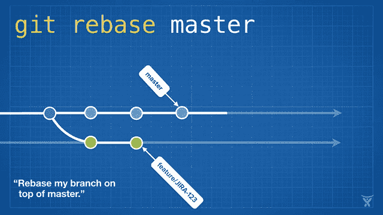

在 master ( `git rebase master`)上重新建立一个特征分支是用 master 的最新变化来“更新”你的特征分支的好方法。对于长期存在的特性分支，定期的重定基础可以最小化未来冲突的可能性和严重性。

一些团队也选择在将他们的变更合并到 master 上之前立即重新定基，以便实现快速合并(`git merge --ff <feature>`)。快速转发将您的提交合并到主服务器上，只需使主服务器引用点位于您重写的分支的顶端，而无需创建合并提交:

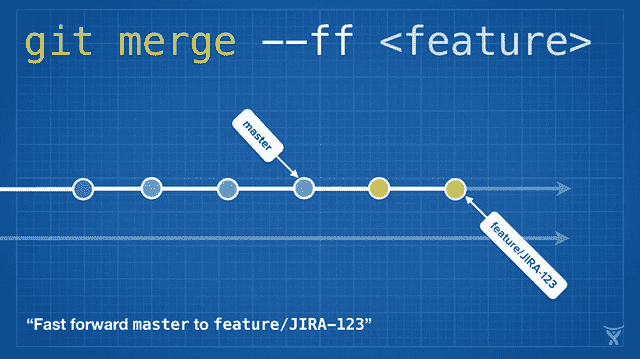

Rebasing 如此方便和强大，以至于它已经被嵌入到其他一些常见的 Git 命令中，比如`git pull`。如果您在本地主分支上有一些未推送的变更，运行`git pull`从原点拉您队友的变更将创建一个不必要的合并提交:

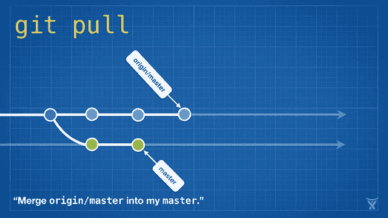

这有点混乱，在繁忙的团队中，您会得到大量不必要的合并提交。`git pull --rebase`在不创建合并提交的情况下，将您的本地更改基于队友的更改:

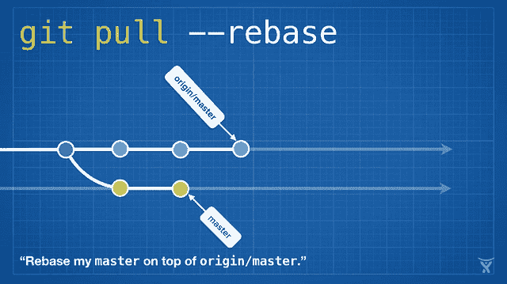

这真是太棒了！更酷的是，Git v2.8 引入了一个特性，让你在拉的时候交互地重置*。*

## 交互式重置基础

交互式重定基础是一种更强大的重定基础形式。像标准的 rebase 一样，它重写提交，但是当它们被重新应用到新的基础上时，它也给你一个交互修改它们的机会。

当您运行`git rebase --interactive`(或`git pull --rebase=interactive`)时，您将在您选择的文本编辑器中看到一个提交列表:

```
**$ git rebase master --interactive****pick** 2fde787 ACE-1294: replaced miniamalCommit with string in test
**pick** ed93626 ACE-1294: removed pull request service from test
**pick** b02eb9a ACE-1294: moved fromHash, toHash and diffType to batch
**pick** e68f710 ACE-1294: added testing data to batch email file*# Rebase f32fa9d..0ddde5f onto f32fa9d (4 commands)
#
# Commands:
# p,* ***pick*** *= use commit
# r,* ***reword*** *= use commit, but edit the commit message
# e,* ***edit*** *= use commit, but stop for amending
# s,* ***squash*** *= use commit, but meld into previous commit
# f,* ***fixup*** *= like "squash", but discard this commit's log message
# x,* ***exec*** *= run command (the rest of the line) using shell
# d,* ***drop*** *= remove commit
#
# These lines can be re-ordered; they are executed from top to 
# bottom.
#
# If you remove a line here THAT COMMIT WILL BE LOST.*
```

注意，每个提交旁边都有单词`pick`。这就是“保持提交原样”的意思如果你现在退出你的文本编辑器，它会像上一节描述的那样执行一个正常的重设基础。但是，如果您将`pick`更改为`edit`或其他 rebase 命令之一，rebase 将允许您在重新应用提交之前对其进行修改！有几个可用的重设基础命令:

*   `**reword**` **:** 编辑提交消息。
*   `**edit**` **:** 编辑已提交的文件。
*   `**squash**` **:** 将提交与之前的提交(文件中它上面的那个)结合起来，连接提交消息。
*   `**fixup**`
*   `**exec**` **:** 运行一个任意的 shell 命令(稍后，在下一节中，我们将看到一个简洁的用例)。
*   `**drop**` **:** 这杀死了提交者。

您还可以在文件内对提交进行重新排序，这将改变重新应用提交的顺序。如果您有处理不同主题的交叉提交，并且您想使用`squash`或`fixup`将它们组合成逻辑上的原子提交，这是很方便的。

一旦您设置了命令并保存了文件，Git 将遍历每个提交，在每个`reword`和`edit`处暂停以进行您想要的更改，并自动为您应用任何`squash`、`fixup`、`exec`和`drop`命令。

## 非交互式执行

当你重定基础时，你实际上是通过在指定的基础上应用你的每一个新的提交来重写历史。`git pull --rebase`可能有点冒险，因为根据上游分支变更的性质，您可能会在新创建的历史中遇到测试失败甚至某些提交的编译问题。如果这些更改导致合并冲突，重置基础过程将暂停并允许您解决这些冲突。然而，完全合并的更改仍然可能会中断编译或测试，让中断的提交在您的历史中留下痕迹。

但是，您可以指示 Git 为每个重写的提交运行项目的测试套件。在 Git v2.9 之前，您可以通过组合使用`git rebase −−interactive`和`exec`命令来完成这项工作。例如，这个:

```
$ git rebase master −−interactive −−exec=”npm test”
```

…将生成一个交互式的 rebase 计划，在重写每个提交后调用`npm test`，确保您的测试仍然通过:

```
**pick** 2fde787 *ACE-1294: replaced miniamalCommit with string in test*
**exec** npm test
**pick** ed93626 *ACE-1294: removed pull request service from test*
**exec** npm test
**pick** b02eb9a *ACE-1294: moved fromHash, toHash and diffType to batch*
**exec** npm test
**pick** e68f710 *ACE-1294: added testing data to batch email file*
**exec** npm test# Rebase f32fa9d..0ddde5f onto f32fa9d (4 command(s))
```

如果测试失败，rebase 将暂停，让您修复测试(并将您的更改应用到提交中):

```
291 passing
**1 failing**1) Host request “after all” hook:
Uncaught Error: connect ECONNRESET 127.0.0.1:3001
…
**npm ERR! Test failed.**
Execution failed: npm test
You can fix the problem, and then run
        **git rebase −−continue**
```

这很方便，但是需要做一个交互式的 rebase 有点笨拙。从 Git v2.9 开始，您可以执行非交互式 rebase exec，使用:

```
$ git rebase master -x “npm test”
```

只需将`npm test`替换为`make`、`rake`、`mvn clean install`，或者您用来构建和测试项目的任何东西。

## 一句警告

就像电影里一样，重写历史是件冒险的事情。任何被重写为 rebase 的一部分的提交都将改变它的 SHA-1 ID，这意味着 Git 将把它视为完全不同的提交。如果重写的历史与原始历史混合在一起，您将得到重复的提交，这会给您的团队带来很多混乱。

为了避免这个问题，你只需要遵循一个简单的规则:

> 不要改变已经提交的承诺！

坚持下去，你会没事的。

# `Git LFS`的性能提升

[Git 是一个分布式版本控制系统](https://www.atlassian.com/git/tutorials/what-is-git/)，这意味着在克隆过程中，存储库的整个历史被转移到客户端。对于包含大文件的项目，尤其是定期修改的大文件 *—* 初始克隆可能会很昂贵，因为每个文件的每个版本都必须由客户端下载。 [Git LFS(大文件存储)](https://www.atlassian.com/git/tutorials/git-lfs/)是由 [Atlassian](https://hackernoon.com/tagged/atlassian) 、GitHub 和其他一些开源贡献者开发的 Git 扩展，它通过延迟下载相关版本的大文件来减少大文件对存储库的影响。具体来说，大文件是在签出过程中按需下载的，而不是在克隆或获取过程中下载的。

除了 Git 在 2016 年发布的五个巨大版本，Git LFS 还有四个功能丰富的版本:1.2 到 1.5 版本。你可以就 Git LFS 本身写一个回顾系列，但对于这篇文章，我将专注于 2016 年解决的最重要的主题之一:速度。对 Git 和 Git LFS 的一系列改进极大地提高了与服务器之间传输文件的性能。

## 长期运行的过滤过程

当您`git add`一个文件时，Git 的干净过滤器系统可以用来在文件内容被写入 Git 对象存储之前对其进行转换。Git LFS 通过使用干净的过滤器将大文件内容存放在 LFS 缓存中，并向 Git 对象存储中添加一个微小的“指针”文件，从而减小了存储库的大小。


涂抹滤镜与清洁滤镜相反，因此得名。当在`git checkout`期间从 Git 对象存储中读取文件内容时，涂抹过滤器有机会在它被写入用户的工作副本之前转换它。Git LFS 涂抹滤镜通过将指针文件替换为相应的大文件来转换指针文件，这些大文件可以来自 LFS 缓存，也可以直接读取到 Bitbucket 上的 Git LFS 存储中。


传统上，涂抹和清洁过滤过程为每个被添加或签出的文件调用一次。因此，Git LFS 跟踪了一个包含 1000 个文件的项目，调用了 1000 次`git-lfs-smudge`命令进行新的签出！虽然每个操作相对较快，但旋转 1000 个单独的涂抹过程的开销是昂贵的。

从 Git v2.11(和 Git LFS v1.5)开始，涂抹和清理过滤器可以被定义为长时间运行的进程，该进程为第一个过滤的文件调用一次，然后馈送需要涂抹或清理的后续文件，直到父 Git 操作退出。[为 Git 贡献长期运行过滤器的 Lars Schneider](https://twitter.com/kit3bus) 简洁地总结了这一变化对 Git LFS 性能的影响:

> 对于 12k 文件的测试报告，过滤过程在 macOS 上快 80 倍，在 Windows 上快 58 倍。在 Windows 上，这意味着测试在 57 秒内运行，而不是 55 分钟！

这是一个令人印象深刻的性能提升！

## 专门化的 LFS 克隆体

长时间运行的涂抹和清洁过滤器对于加速对本地 LFS 缓存的读写是很好的，但是对于加速大对象在 Git LFS 服务器上的来回传输却没什么帮助。每次 Git LFS 涂抹过滤器在本地 LFS 缓存中找不到文件时，它必须进行两次 HTTP 调用来检索它:一次定位文件，一次下载文件。在`git clone`期间，您的本地 LFS 缓存是空的，所以 Git LFS 将天真地为您的存储库中每个 LFS 跟踪的文件进行两次 HTTP 调用:

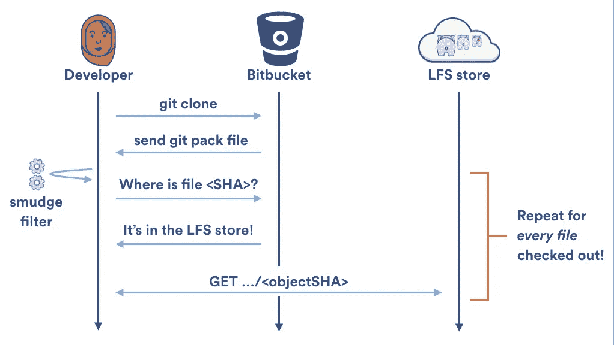

幸运的是，Git LFS 1.2 版提供了专门的`[git lfs clone](https://www.atlassian.com/git/tutorials/git-lfs/#speeding-up-clones)`命令。而不是一次下载一个文件；`git lfs clone`禁用 Git LFS 涂抹滤镜，等到结账完成，然后从 Git LFS 商店批量下载任何需要的文件。这允许并行下载，并将所需的 HTTP 请求数量减半:

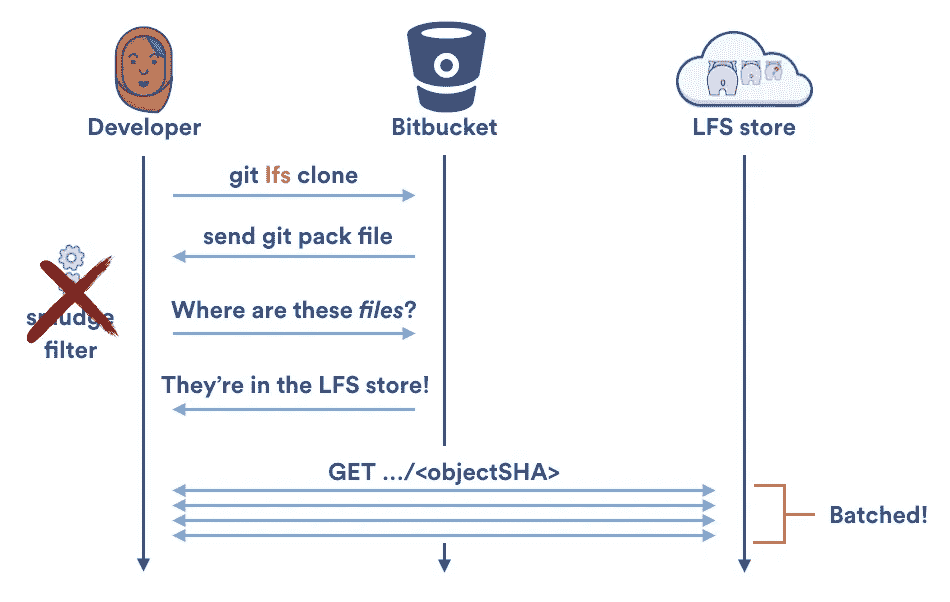

# 自定义传输适配器

如前所述，Git LFS 在 1.5 版中发布了对长时间运行的过滤器进程的支持。然而，对另一种类型的可插拔进程的支持实际上是在今年早些时候发布的。Git LFS 1.3 版包含了对可插拔传输适配器的支持，因此不同的 Git LFS 托管服务可以定义自己的协议，在 LFS 存储器之间传输文件。

截至 2016 年底，Bitbucket 是唯一一家通过 [Bitbucket LFS 媒体适配器](https://confluence.atlassian.com/bitbucket/bitbucket-lfs-media-adapter-856699998.html)实现自己的 Git LFS 传输协议的托管服务。这样做是为了利用 Bitbucket 的 LFS 存储 API 的一个独特功能，即分块。分块意味着大文件在上传或下载前被分解成 4MB 的块。


分块给 Bitbucket 的 Git LFS 支持带来了三大优势:

1.  **并行下载和上传。默认情况下，Git LFS 并行传输多达三个文件。但是，如果只传输一个文件(这是 Git LFS 涂抹滤镜的默认行为)，它将通过单个流传输。Bitbucket 的分块功能允许同时上传或下载来自同一个文件的多个块，通常可以显著提高传输速度。**
2.  **可恢复的块传输。**文件块在本地缓存，因此如果您的下载或上传被中断，Bitbucket 的自定义 LFS 媒体适配器将在您下次推送或拉入时仅恢复传输丢失的块。
3.  **重复数据删除。** Git LFS 和 Git 本身一样，是内容可寻址的；每个 LFS 文件由其内容的阿沙-256 散列来标识。因此，如果你翻转一个比特，文件的 SHA-256 就会改变，你必须重新上传整个文件。分块允许您仅重新上传文件中实际发生更改的部分。举例来说，假设我们有一个 41MB 的 spritesheet，用于在 Git LFS 跟踪的视频游戏。如果我们向 spritesheet 添加一个新的 2MB 层并提交它，我们通常需要将整个新的 43MB 文件推送到服务器。然而，使用 Bitbucket 的自定义传输适配器，我们只需要推送大约 7Mb:第一个 4MB 的块(因为文件的头信息已经改变)和最后一个包含我们刚刚添加的新层的 3MB 块！在上传过程中，其他未更改的块会被自动跳过，从而节省大量带宽和时间。

可定制的传输适配器是 Git LFS 的一个很好的特性，因为它们允许不同的主机试验优化的传输协议来适应它们的服务，而不会使核心项目过载。

# 更好的`git diff`算法和默认值

与其他一些版本控制系统不同，Git 不会显式存储文件已被重命名的事实。例如，如果我编辑了一个简单的 Node.js 应用程序，并将`index.js`重命名为`app.js`，然后运行`git diff`，我将得到看起来像是文件删除和添加的结果:

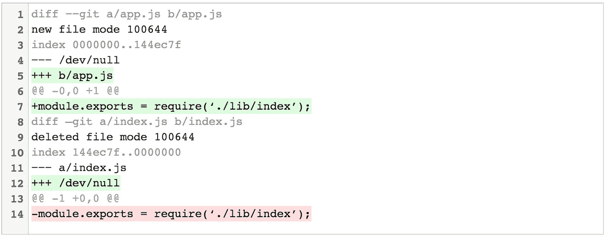

我想移动或重命名一个文件从技术上来说只是一个删除和一个添加，但这不是最人性化的表达方式。相反，您可以使用`-M`标志来指示 Git 在计算 diff 时尝试动态检测重命名的文件。对于上面的例子，`git diff -M`给了我们:

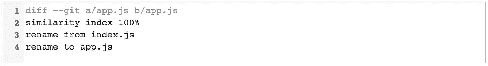

第二行的相似性指数告诉我们所比较的文件内容有多相似。默认情况下，`-M`将考虑任何两个相似度超过 50%的文件。也就是说，您需要修改少于 50%的行，以使它们与重命名的文件相同。您可以通过附加一个百分比来选择自己的相似性指数，即`-M80%`。

从 Git v2.9 开始，`git diff`和`git log`命令都会默认检测重命名，就好像你已经通过了`-M`标志一样。如果您不喜欢这种行为(或者更现实地说，通过脚本解析 diff 输出)，那么您可以通过显式传递`−−no-renames`标志来禁用它。

## 详细提交

你是否曾经调用过`git commit`，然后茫然地看着你的 shell，试图记住你刚刚做的所有更改？详细标志是给你的！

而不是:

```
*Ah crap, which dependency did I just rev?*# Please enter the commit message for your changes. Lines starting
# with ‘#’ will be ignored, and an empty message aborts the commit.
# On branch master
# Your branch is up-to-date with ‘origin/master’.
#
# Changes to be committed:
# new file: package.json
#
```

…您可以调用`git commit −−verbose`来查看您的更改的内联差异。别担心，它不会包含在您的提交消息中:

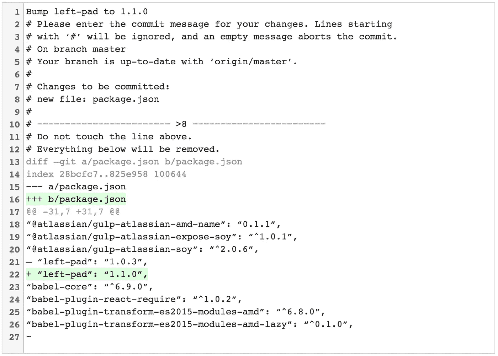

`−−verbose`标志不是新的，但是从 Git v2.9 开始，您可以使用`git config --global **commit.verbose** true`永久启用它。

## 实验差异改进

`git diff`当修改部分前后的行相同时，可能会产生一些稍微令人困惑的输出。当一个文件中有两个或更多结构相似的函数时，就会发生这种情况。对于一个略显做作的例子，假设我们有一个包含单一函数的 JS 文件:

```
*/* @return {string} "Bitbucket" */*
**function** productName() {
  **return** "Bitbucket";
}
```

现在，假设我们已经提交了一个变更，在*前添加了另一个*函数，该函数具有类似的功能:

```
*/* @return {string} "Bitbucket" */*
**function** productId() {
  **return** "Bitbucket";
}*/* @return {string} "Bitbucket" */*
**function** productName() {
  **return** "Bitbucket";
}
```

您可能希望`git diff`显示添加的前五行，但是它实际上错误地将第一行归属于原始提交:

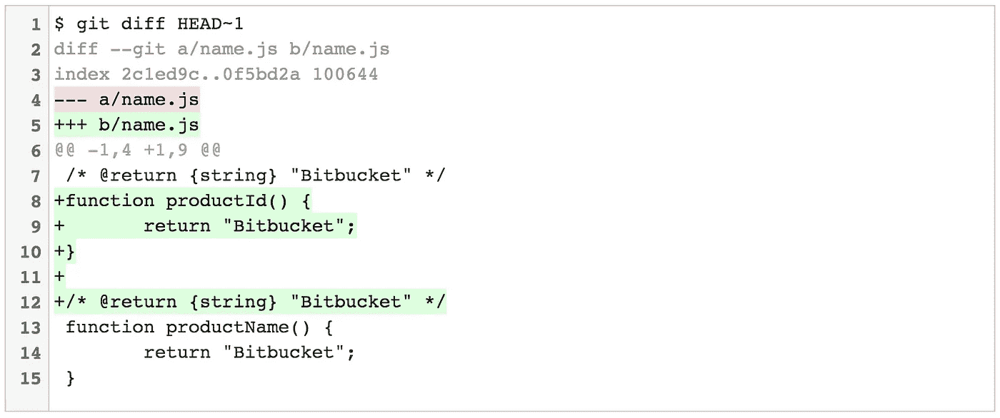

diff 中包含错误的注释！不是世界末日，而是来自 *Whaaat 的几秒认知开销？*每次发生这种情况都会累加起来。

12 月，Git v2.11 引入了一个新的实验性差异选项`--indent-heuristic`，试图产生更具美感的差异:

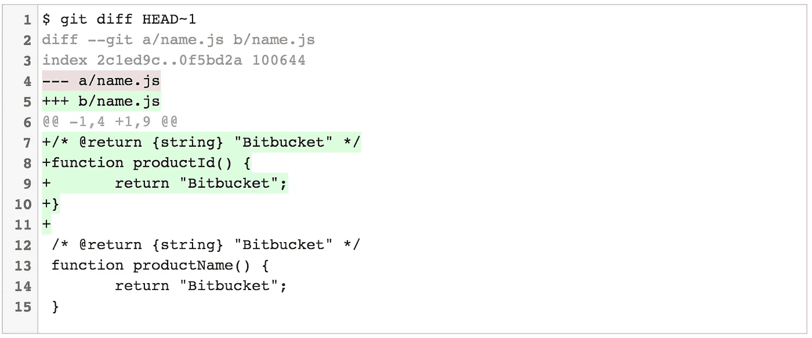

在引擎盖下，`--indent-heuristic`循环遍历每个变更的可能差异，并给每个差异分配一个“不良”分数。这是基于试探法的，比如 diff 块是否以不同级别的缩进开始和结束(这在美学上是不好的)，以及 diff 块是否有前导和尾随空行(这在美学上是令人愉快的)。然后，输出具有最低不良分数的块。

这个特性是实验性的，但是您可以通过将`--indent-heuristic`选项应用到任何`git diff`命令来测试它。或者，如果您喜欢生活在危险边缘，您可以通过以下方式在您的系统中启用它:

```
$ git config --global **diff.indentHeuristic** true
```

# 吸得少的子模块

子模块允许您从您的 Git 存储库中引用和包含其他 Git 存储库。这通常被一些项目用来管理也在 Git 中被跟踪的源代码依赖，或者被一些公司用来替代包含相关项目集合的 monorepo。

由于一些用法的复杂性，以及用一个错误的命令很容易破坏子模块的事实，子模块得到了一些不好的评价。


然而，它们确实有它们的用途，我认为它们仍然是出售依赖项的最佳选择。幸运的是，2016 年对于子模块用户来说是很棒的一年，几个版本都有一些重大的性能和功能改进。

## 并行提取

当克隆或获取一个存储库时，附加`--recurse-submodules`选项意味着任何被引用的子模块也将被克隆或更新。传统上，这是串行完成的，每次取一个子模块。从 Git v2.8 开始，您可以添加`--jobs=n`选项来获取 *n* 并行线程中的子模块。

我建议使用以下选项永久配置此选项:

```
$ git config --global **submodule.fetchJobs** 4
```

…或者您选择使用的任何并行度。

## 浅层子模块

Git v2.9 引入了`git clone -−shallow-submodules`标志。它允许您获取存储库的完整克隆，然后递归地浅层克隆任何被引用的子模块，直到一次提交的深度。如果您不需要项目依赖项的完整历史，这将非常有用。

例如，考虑一个混合了子模块的存储库，这些子模块包含供应商提供的依赖项和您拥有的其他项目。您可能希望最初克隆较浅的子模块，然后有选择地深化您想要使用的几个项目。

另一个场景是配置持续集成或部署作业。Git 需要超级存储库以及来自每个子模块的最新提交，以便实际执行构建。然而，您可能不需要每个子模块的完整历史，所以只检索最近的提交将节省您的时间和带宽。

## 子模块交替

`--reference`选项可以和`git clone`一起使用，指定另一个本地存储库作为备用对象存储库，以保存网络上已有的本地复制对象。语法是:

```
$ git clone **--reference <local repo>** <url>
```

从 Git v2.11 开始，您可以结合使用`--reference`选项和`--recurse-submodules`来设置指向另一个本地存储库中的子模块的子模块替换。语法是:

```
$ git clone **--recurse-submodules** --reference <local repo> <url>
```

这可能会节省大量的带宽和本地磁盘，但是如果引用的本地存储库没有您要从中克隆的远程存储库的所有必需的子模块，这将会失败。

幸运的是，方便的`--reference-if-able`选项将会正常失败，并且对于引用的本地存储库中缺失的任何子模块，将会退回到正常的克隆:

```
$ git clone --recurse-submodules **--reference-if-able** \
<local repo> <url>
```

## 子模块差异

在 Git v2.11 之前，Git 有两种模式来显示更新存储库子模块的提交差异:

`git diff --submodule=short`显示您的项目所引用的子模块中的旧提交和新提交(如果您完全省略了`--submodule`选项，这也是默认设置):

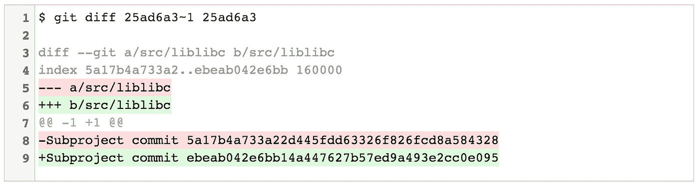

`git diff --submodule=log`稍微详细一些，在更新的子模块中显示任何新的或删除的提交的提交消息的摘要行:

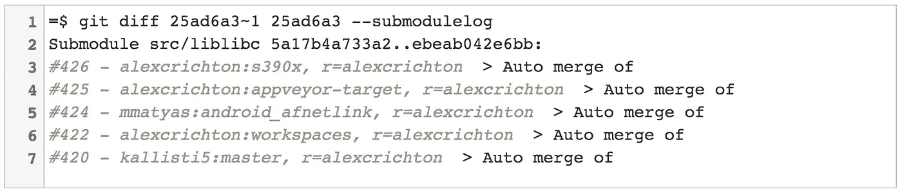

Git v2.11 引入了第三个更有用的选项:`--submodule=diff`。这将显示更新的子模块中所有更改的完整差异:

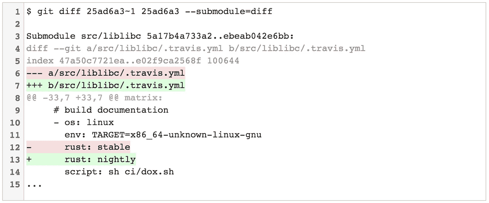

# 对`git stash`的巧妙增强

与子模块不同，`[git stash](https://www.atlassian.com/git/tutorials/git-stash/)`几乎普遍受到 Git 用户的喜爱。暂时搁置(或*隐藏*)您对工作副本所做的更改，以便您可以处理其他内容，然后回来重新应用它们。

## 自动堆叠

如果你是`git rebase`的粉丝，你可能对`--autostash`选项很熟悉。它会在重置基础前自动隐藏对工作副本所做的任何本地更改，并在重置基础完成后重新应用这些更改。

```
**$ git rebase master --autostash**
Created autostash: 54f212a
HEAD is now at 8303dca *It's a kludge, but put the tuple from the database in the cache.*
First, rewinding head to replay your work on top of it...
Applied autostash.
```

这很方便，因为它允许你从一个脏的工作树重新开始。还有一个名为`rebase.autostash`的便利的配置标志使这种行为成为默认，您可以使用以下命令全局启用它:

```
$ git config --global **rebase.autostash** true
```

`rebase.autostash`实际上从 [Git v1.8.4](https://blogs.atlassian.com/2013/08/what-you-need-to-know-about-the-new-git-1-8-4/) 开始就可用了，但是 v2.7 引入了用`--no-autostash`选项取消该标志的能力。如果您将此选项用于未分级的更改，重置基础将中止，并显示一个脏工作树警告:

```
**$ git rebase master --no-autostash**
Cannot rebase: You have unstaged changes.
Please commit or stash them.
```

## 作为补丁存储

说到配置标志，Git v2.7 也引入了`stash.showPatch`。`git stash show`的默认行为是显示你的隐藏文件的摘要。

```
**$ git stash show**
package.json | 2 +-
1 file changed, 1 insertion(+), 1 deletion(-)
```

传递`-p`标志将`git stash show`置于“补丁模式”，显示完整的差异:


`stash.showPatch`将此行为设为默认。您可以通过以下方式全局启用它:

```
$ git config --global **stash.showPatch** true
```

如果您启用了`stash.showPatch`,但随后决定只查看文件摘要，您可以通过传递`--stat`选项来恢复原来的行为。

```
**$ git stash show --stat** package.json | 2 +-
1 file changed, 1 insertion(+), 1 deletion(-)
```

作为题外话:`--no-patch`是一个有效的选项，但它不会像你所期望的那样否定`stash.showPatch`。相反，它被传递给用于生成补丁的底层`git diff`命令，最终您将没有任何输出！

## 简单的隐藏 id

如果您是一个`git stash`爱好者，您可能知道您可以搁置多组变更，然后用`git stash list`查看它们:

```
**$ git stash list**
stash@{0}: On master: crazy idea that might work one day
stash@{1}: On master: desperate samurai refactor; don't apply
stash@{2}: On master: perf improvement that I forgot I stashed
stash@{3}: On master: pop this when we use Docker in production
```

但是，你可能不知道为什么 Git 的 stashes 有这么别扭的标识符(`stash@{1}`、`stash@{2}`等)。)并且可能已经把它们当作“Git 的一种特质”而一笔勾销了事实证明，像许多 Git 特性一样，这些奇怪的 id 实际上是 Git 数据模型的一种非常巧妙的使用(或滥用)的症状。

在幕后，`git stash`命令实际上创建了一组特殊的提交对象，这些对象对您隐藏的更改进行编码，并维护了一个 [reflog](https://www.atlassian.com/git/tutorials/refs-and-the-reflog/) ，其中保存了对这些特殊提交的引用。这就是为什么`git stash list`的输出看起来很像`git reflog`命令的输出。当您运行`git stash apply stash@{1}`时，您实际上是在说，“从 stash reflog 的位置 1 应用提交。”

从 Git v2.11 开始，您不再需要使用完整的`stash@{n}`语法。相反，您可以用一个简单的整数来引用 stash，该整数表示它们在 stash reflog 中的位置:

```
$ git stash show 1
$ git stash apply 1
$ git stash pop 1
```

诸如此类。如果你想了解更多关于如何储存物品的信息，我在[这篇教程](https://www.atlassian.com/git/tutorials/git-stash/#how-git-stash-works)中写了一点。

# </2016> <2017>

我们结束了。感谢阅读！我希望你喜欢阅读这个庞然大物，就像我喜欢钻研 Git 的源代码、发行说明和编写它的页面一样。如果你认为我错过了什么大事，请留下评论或在推特上告诉我[，我会努力写一篇后续文章。](https://twitter.com/kannonboy)

至于 Git 的下一步是什么，这取决于维护者和贡献者(其中[可能是你！](https://git.kernel.org/cgit/git/git.git/tree/Documentation/SubmittingPatches))。随着越来越多的采用，我猜想简化、改进的 UX 和更好的默认值将是 Git 在 2017 年的主题。随着 Git 存储库变得越来越大，我怀疑我们还会看到对性能的持续关注和对大文件、深树和长历史的改进处理。

如果你对 Git 感兴趣，并且很想见到项目背后的一些开发者，可以考虑几周后来布鲁塞尔参加 [Git Merge](http://git-merge.com/) 。我是[在那里说话](http://git-merge.com/#git-aliases)！但更重要的是，许多维护 Git 的开发人员将会出席会议和年度 Git 贡献者峰会，这很可能会推动未来一年的发展方向。

或者，如果你不能等到那个时候，去看看 Atlassian 精选的 [Git 教程](https://www.atlassian.com/git/tutorials)，获得更多的技巧和窍门来改进你的工作流程。

*如果您滚动到末尾寻找第一段的脚注，请跳转到* [*【需要引用】*](#87c4) *部分了解用于生成统计数据的命令。免费封面图片使用*[*insta co . de*](http://instaco.de/)*❤️*生成

[](http://bit.ly/HackernoonFB)[](https://goo.gl/k7XYbx)[](https://goo.gl/4ofytp)

> [黑客中午](http://bit.ly/Hackernoon)是黑客如何开始他们的下午。我们是阿美族家庭的一员。我们现在[接受投稿](http://bit.ly/hackernoonsubmission)并乐意[讨论广告&赞助](mailto:partners@amipublications.com)机会。
> 
> 如果你喜欢这个故事，我们推荐你阅读我们的[最新科技故事](http://bit.ly/hackernoonlatestt)和[趋势科技故事](https://hackernoon.com/trending)。直到下一次，不要把世界的现实想当然！

