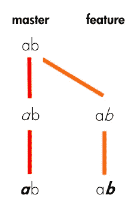
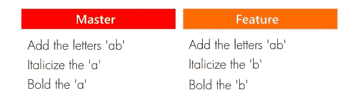
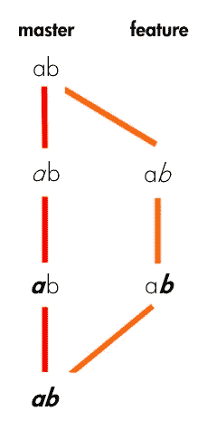
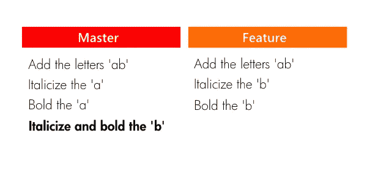
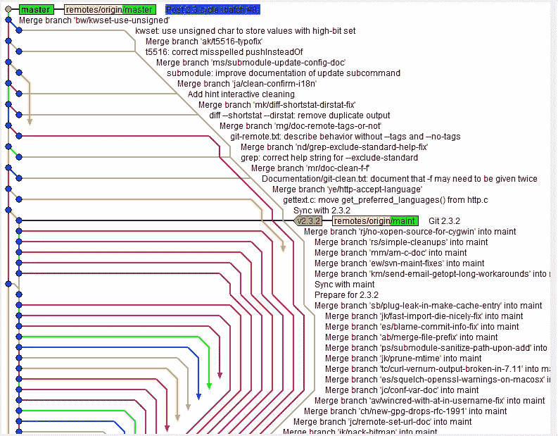
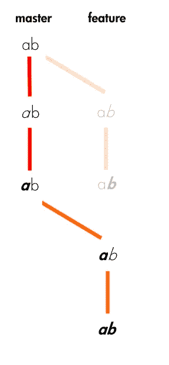
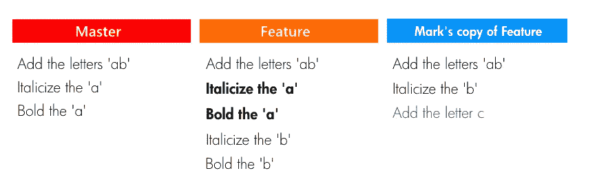

# Git 合并与 Rebase:区别在哪里？

> 原文：<https://medium.com/hackernoon/git-merge-vs-rebase-whats-the-diff-76413c117333>


[Image Credit](https://www.gizmodo.com.au/2012/05/all-the-worlds-subways-are-converging-to-a-single-optimal-layout/)

那些吃了一大块芥末却认为那是一大块鳄梨的人已经学会了区分两种非常相似的东西的重要性。理解 [Git 的](https://hackernoon.com/tagged/git) merge 和 rebase 命令之间的区别可能对你的身体健康并不重要，但这一点仍然成立。

[*git merge*](https://hackernoon.com/tagged/git-merge) 和 *git rebase* 提供相同的服务:将提交从一个 git 分支合并到另一个 git 分支。关键的区别在于*这个结果是如何*实现的。

让我们找出*如何*，好吗？

# 像 ABC 一样简单

我们将把我们的简短讨论建立在有史以来最简陋的“网站”上。最初，这个网站由一个带有字母“ab”的页面组成。就是这样。


This is going in the résumé.

通常在 Git 工作流中，开发人员会创建特性分支来独立处理新特性。这给了他们在不影响项目主分支的情况下对正在进行的特性进行增量提交的自由(关于使用特性分支的更多信息可以在 [Atlassian 的 Git 教程](https://www.atlassian.com/git/tutorials/comparing-workflows#feature-branch-workflow)中找到)。

在我们项目的 Git 存储库中，目前存在两个分支:通常的主分支，以及我们在初始提交之后创建的特性分支。在主分支上，我们用斜体表示“a ”,然后用粗体表示“a”。在我们的特征分支上，我们用斜体表示“b”，然后用粗体表示“b”。



The master and feature branches for the most complicated web project of 2017.



The commit logs/histories for the master and feature branches (read from top to bottom).

让我们通过这个项目中几个典型的 Git 工作流情况来弄清楚 merge 和 rebase 有什么不同。

# 合并

我们相信我们对字母“b”的重新设计是一个杰作，所以我们决定将我们的工作带回主分支，将其融入实际项目中:

```
git checkout master
git merge feature
```

通过将**特征**合并到**主**中，主获得一个新的提交——一个“合并提交”。



Merging master into our feature branch. “Let’s just smush these branches together”.



Branch histories after the merge, with master’s new merge commit.

合并提交本身代表了自从从主服务器分支以来在特征上发生的每一个变化。干净简单。

合并的坏处？如果使用得太随意，合并提交会弄乱您的 Git 日志，并使理解项目历史的流程变得更加困难。对于其他开发人员(甚至可能是项目经理/领导或 QA)阅读您项目的 Git 日志以获得洞察力和上下文的协作工作流，可读性很重要。



An extreme example of merge-mania. Difficult to decipher, but at least the colors are pretty… [Image Credit](http://www.tugberkugurlu.com/archive/resistance-against-london-tube-map-commit-history-a-k-a--git-merge-hell)

为了避免这个陷阱，尽量有目的、有节制地使用合并。当只进行小的调整或小的错误修复时，避免分支和合并。如果您希望让一组提交脱颖而出，请使用 merge。

大型重构和主要特性添加是独立特性分支的良好候选，这些分支稍后可以合并到 master 中。作为一个额外的好处，当合并被保留给这些主要的变更时，合并提交作为里程碑，其他人可以使用它来确定这些主要的变更何时被合并到项目中。

# 重定…的基准

让我们倒回去，假装我们想继续设计字母“b”的样式——也许改变它的大小、字体、颜色等等。我们需要做得恰到好处——这个变化影响了我们 50%的代码库！但是在我们继续我们的功能分支之前，我们决定要引入 master 的最新变化以保持新鲜。

我们没有将主模块的新提交合并到特性中，而是选择将我们的特性分支**转移到主模块*。*

```
*git checkout feature
git rebase master*
```

*在高层次上，重定基线可以理解为“将分支的基底移动到不同的位置”。把它想象成重做——“我的意思是从这里的*开始*。*

**

*The result of rebasing our feature branch onto master.*

*在较低的层次上，rebase 实际做的是从一个分支中一个接一个地(按时间顺序)提取提交，并将它们重新附加到不同的提交。分支…分支的点现在已经改变了。*

**

*What actually happens when rebasing our feature branch onto master. We are essentially replaying the feature branch commits from a new starting point.*

*从上面的图表中，你可能会明白为什么在这种情况下我们会选择重定基础而不是合并。与合并不同，rebase 不会创建额外的提交。这对于我们的情况来说是理想的，因为我们目前所做的就是保持我们的特性分支与来自 master 的任何新提交保持同步。这绝对不是我们希望在项目历史中保留的有意义的事件。*

*尽管新重定基础的特性分支上的变化与之前的相同，但值得注意的是，从 Git 的角度来看，这些是带有新 SHA(提交标识符)的新提交。*

*但更重要的是，要意识到特征分支的历史已经被完全改写了。那听起来有点沉重，不是吗？你可能想知道这是否意味着你应该担心。*

**

*An expert on time travel and its drawbacks: Barry Allen, flash-forwarding to a future of regret. [Image Credit](http://www.mcmbuzz.com/blog/2016/04/19/the-flash-s02e17-flash-back-review/)*

*虽然当你是一个特定分支的唯一工作人员时，这并不重要，但是在与他人合作时，鲁莽地改变基础可能是一个大问题。简而言之，当其他人签出的分支副本(具有未更改的历史)与您更改的副本冲突时，这种可能性就出现了。*

*假设另一个叫 Mark 的开发人员正在和你一起开发特性分支。他在第二次提交时签出了特征分支——当“b”是斜体时。当我们将我们的功能分支版本重新基于 master 时，Mark 天真地决定在他自己的版本上添加另一个 commit，添加字母“c”。以下是该场景的样子:*

**

*The master branch, our rebased version of the feature branch, and Mark’s copy of the feature branch. Notice the inconsistencies between our branch (bold) and Mark’s copy (blue). Not immediately obvious how to sort this out.*

*即使我们的项目非常简单，也需要一点努力和脑力来找出解决差异的方法。想象一下，在现实生活中，在一个更大规模的项目中试图解决这种冲突。没什么乐趣。*

*你可以在这里阅读更多关于正确调整基数的方法:[调整基数的黄金法则](https://www.atlassian.com/git/tutorials/merging-vs-rebasing#the-golden-rule-of-rebasing)。一行总结:不要改变一个分支的基础，除非你是唯一使用它的人。或者你喜欢混乱。*

# *是时候像树和叶子一样成长了*

*总之，当希望将一个 Git 分支的变更合并到另一个分支时:*

*   *如果您希望一组提交在历史记录中清晰地分组在一起，请使用 merge*
*   *当您希望保持线性提交历史时，请使用 rebase*
*   *不要在公共/共享分支上使用 rebase*

*我就知道这么多。如果文章中有任何不清楚的地方，或者你有任何问题、评论或建议，请在下面的回复中留下！感谢您的宝贵时间！*