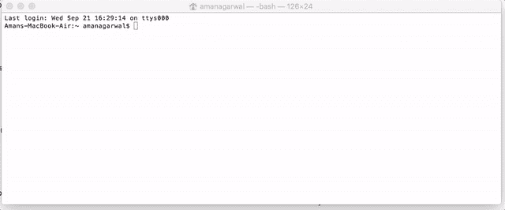
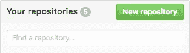
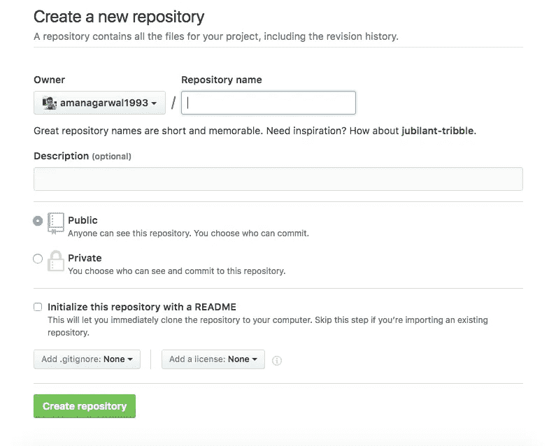
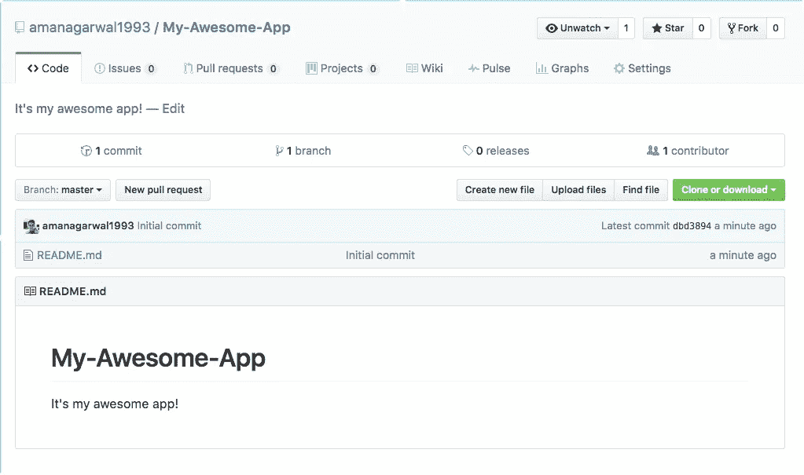
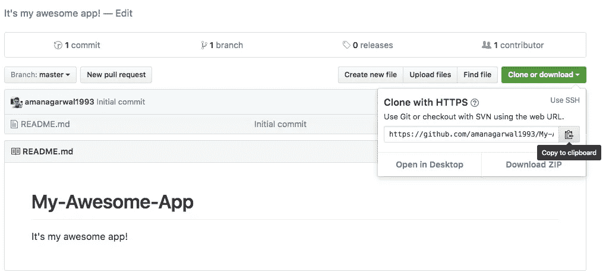

# 针对黑猩猩的 GitHub(以及针对科学家的简短咆哮)

> 原文：<https://medium.com/hackernoon/github-for-chimpanzees-and-a-short-rant-against-scientists-868fb04e5e4a>

甚至诺贝尔奖获得者也同意科学论文正走向 jargonocalypse。

## <rant></rant>

我是一名工程师，因此学习了自然科学和 T2 大学。然而我已经意识到，我发现阅读用西班牙语写的东西比大多数用英语*写的科学论文*更容易(而且我他妈的从来没学过西班牙语)。你知道为什么科研论文这么难读吗？我要在这里不公平的残酷。

因为这些论文的作者，这些天来，“全球科学界”， ***主要是*** 由一些人组成，他们的生活依赖于一件事:他们是否可以用足够的废话来掩盖他们的话，以至于真正的科学家不知道他们的工作实际上是多么微不足道。

我并不孤单——我知道很多资深科学家和经验丰富的工程师都持这种观点。就连人工智能领域最重要的研究人员之一吴恩达自己最近也说，当他第一次读 YOLO 的论文时，他发现它太难读了，以至于他不得不请一些同事来帮助他理解发生了什么。(更新 2019:我最近在康奈尔大学与诺贝尔奖得主化学家罗尔德·霍夫曼交谈，他表达了同样的担忧。真不敢相信)

现在等等——对于那些被这种说法冒犯的人，请允许我在你写一个令人讨厌的评论之前扩展一下。你很可能是一个愚蠢的研究生，认为在你的论文中写下冗长的绕口令会让你看起来足够聪明，足以掩盖当初让你被选中担任当前职位的错误。**(现在你可以写评论了)**

现在，我明白了你不能简单地用高中生的词汇来写论文。我也承认在阅读科学论文时需要必备的知识。确实总是需要一些技术术语，因为一般来说，这些论文的目标读者也是他们专业领域的专家。我并不主张科学家简单地替换每一个“难发音的单词”。这是关于*的另一种*做法，即添加额外的绒毛，让简单的事情在纸上听起来更复杂。我认为可读性的微小提高会使一份报纸的读者数量增加至少 5 倍。因此，将可读性提高两倍已经足够了，这就是我的全部要求——不是建议你将每篇论文都变成教科书。

> **读读** [**阿尔伯特·爱因斯坦的论文**](http://einsteinpapers.press.princeton.edu/vol2-trans/100) **如果你觉得做不到。和** [**这里还有另一篇很有影响力的**](http://cacm.acm.org/magazines/2017/6/217745/fulltext) **用简单的语言写的论文。**

我不怪你随大流——你的整个系统迫使你这么做，我也遇到过同样的情况——我大学时的导师曾经告诉我，我的项目报告应该使用更复杂的英语和被动语态等等，这样“听起来就像真正的研究”。每当我不得不在两个词之间做出选择时，我应该使用更花哨的术语，这样人们才会认真对待我的工作。

你猜怎么着，这种试图用更复杂的方式描述一切的文化是毁灭世界的部分原因。由于这种晦涩难懂的行话，学生们对追求科学望而却步，这也给来自其他国家的科学家设置了语言障碍。通过隐藏你的知识，你基本上是把它藏起来不让普通人知道，这些普通人可能对科学或一般的研究感兴趣，结果使整个社会变得更笨。然后你会坐上你自己的仿尼尔·泰森椅，抱怨那些不懂科学、否认气候变化和做蠢事的人。你猜怎么着，如果你试图让人们了解科学，也许他们真的会感兴趣。我郑重声明，我非常尊敬泰森博士以及他为教育普通人了解科学所做的努力。我对许多“科学家”附和他的观点，同时又虚伪地用不必要的术语夸大他们的论文感到愤怒。)

> 允许盲人使用电梯是一回事；但是你可以通过在电梯按钮上添加盲文来展示真正的同理心和人性。

程序员文档已经达到了前所未有的超级术语废话的水平。有时候我很惊讶，一份本该给*提供清晰简单说明的文件*对一个初学者来说竟然比吉萨金字塔中的象形文字壁画还要难懂。

**减少收入不平等和拯救世界的一个巨大挑战是公平竞争和教育该死的大众。这就是为什么我在寻求以自己的方式使专业知识民主化。**

我之前的一篇文章,[谷歌应用引擎](/@mngrwl/google-app-engine-quick-tutorial-for-dummies-like-me-5f75a6279f9d#.n2rjri72p)的傻瓜指南，吸引了和我有着相同想法的非零读者，令我震惊。

所以今天我将清理一大堆新开发人员必须处理的狗屎。**学习如何在 GitHub 上存储项目。**

我不得不指出，这更多的是一个“git”教程；git 和 [GitHub](https://hackernoon.com/tagged/github) 在技术上是两回事。此外，git 还可以用于更多的事情，而不仅仅是在线存储你的项目。这是一个“版本控制系统”，你可以谷歌一下这是什么意思。如果你想学习更高级的东西，参加这个在线课程。

我在网上看了一些其他的 git 教程，应该是为初学者准备的。但是在读完这篇**甚至[这篇](http://lifehacker.com/5983680/how-the-heck-do-i-use-github#)文章后，我得出结论，我的智力低于人类，因此只有针对黑猩猩和笨蛋的教程对我有效。**

> **假设地球上还有其他人也属于这一类，我正在写*一个针对黑猩猩的 GitHub 教程*。**

**顺便说一下，到目前为止我找到的最好的 GitHub 教程是这样的:**

**I highly recommend watching this if you have the time!**

**不要误解我的意思，我喜欢 GitHub。但是我发现很难阅读那些忘记了英语和 Java 之间界限的人写的花哨的文档。**

**抱歉，我又跑题了。不再咆哮。**

**我会直接切入正题。顺便说一下，如果你在学习本教程的过程中遇到任何问题，请告诉我。**

## **零废话 GITHUB 指南**

1.  **什么是存储库？我在每个 git 教程里都不断看到这个词。**

**存储库是一个有趣的词，用来描述基本上是一个在线文件夹，它存储了一个特定项目的所有代码文件。举例来说，如果你正在开发一个名为“猴子物种识别器”的应用程序，你会有一个大文件夹，里面有所有与该应用程序项目相关的子文件夹和文件，对吗？这就是所谓的“储存库”，它将有一个像“猴子-物种-标识符”的名字。郑重声明，我发誓这个名字不是受本教程标题的启发。**

**唯一使“存储库”不同于普通文件夹的是它有一些隐藏的文件，这些文件赋予了它某些特殊的属性。这些属性允许 git 系统跟踪这个文件夹中的变化，知道它来自哪里，等等。有了它，你甚至可以撤销和重复对文件夹所做的更改，并做其他一些很酷的事情，所有这些都可以归入“版本控制”这个大袋子里。**

**2 **。下载或安装 Git****

**有两种方法可以做到这一点。**如果你用的是 Mac** (像我一样)，就不要在网上冲浪寻找下载的东西了。打开你的终端，输入“git”。终端会自动告诉你没有安装 git，不管你是否想安装它，它会自动带你完成整个过程。最后，您的系统中会突然出现 git！**

**如果你使用 Windows，你必须下载 git，然后你可能需要一个叫做 Powershell 的东西，它看起来就像命令提示符，但可能有不同的颜色。**

**如果你使用 Linux，我不知道你应该做什么，因为你可能是一个已经知道这些东西的极客？不然你怎么会有 Linux？**

**无论如何，这一步的官方文档可以在这里找到:[https://help.github.com/articles/set-up-git/](https://help.github.com/articles/set-up-git/)**

**向下滚动像“分叉”和“存储库”等晦涩难懂的词，直接进入*好狗屎，这里他们使用像“下载”和“安装”这样熟悉的词。***

****

**3.**一旦你有了 git，打开你的终端，检查它是否工作正常:****

****

**Type ‘git’ and press enter.**

**在这之后，如果你有 Windows/Linux/Mac 等都没关系。一旦你安装了 GitHub，一切都是一样的。**

## **首先，了解如何使用命令行在文件夹之间导航。**

**其实挺简单的！我没有时间来创建我自己的教程，所以我将只向你推荐这个 ***美丽的*** 3 分钟的视频，它以一种黑猩猩可以理解的方式解释了如何非常容易地使用命令行。这不是我自己的视频，我在网上找到的，非常棒。**

**点击图片链接。**

****Please** invest 3 minutes into watching this video!**

# **现在，如何使用 GitHub？**

**你基本上只需要记住四个命令就可以启动并运行: ***克隆，添加，*** ***提交*** 和 ***推送*** *。***

## **创建新项目**

1.  **前往 github.com 并登录。**
2.  **找到并单击“新建存储库”按钮。你会在你的窗口右侧**的某个地方看到这样的东西。****

****

**3.您将看到类似这样的内容:**

****

**4.创建存储库名称。名称中不应有空格或标点符号。比如“我的-牛逼-App”。**

**5.现在选择“公共”选项。要选择“私人”，您需要将您的帐户升级为付费帐户。除非你在一家公司工作，或者你的代码应该对外界保密，否则这并没有什么不同。**

**6.选中“使用自述文件初始化此存储库”。**

**7.单击“创建存储库”。**

**8.现在你会看到这个:**

****

**You have created a new repository called ‘My-Awesome-App’.**

**目前，您的新存储库只有一个文件，即 README.md。它的创建是因为您选择了用 README 初始化 repo 的选项。:)**

**9.然后，进入你的 GitHub repo，点击“克隆或下载”。复制 https url。**

****

**11.现在打开你的终端/powershell/随便什么。导航(使用 cd 和 ls 函数)到您想要设置项目文件夹的位置。**

**12.键入“git clone ”,然后粘贴您在第 10 步中复制的 url。按回车键，如下所示:**

****

**The url is the one you copied earlier.**

**13.您将看到文件夹 My-Awesome-App 正在创建。现在，将项目文件(您的代码文件)添加到该文件夹中。**

**答对了。您现在已经创建了所谓的“本地存储库”，它是您在 github.com 上的存储库的克隆。**

## **现在—如何在线存储您的代码并对其进行更改**

**下一步是将这些更改与您在 github.com 上的在线存储库同步。这需要 2 个步骤:**

1.  **跟踪本地存储库中的更改**
2.  **更新在线存储库以反映这些更改**

**对于第一步，本地跟踪变更，我们使用两个命令，**添加**和**提交**。你不必理解它们到底是如何工作的(目前)。基本上，这就是 git 系统的创建方式，所以我们将继续这样做。**

**1.如果您的终端不在 My-Awesome-App 文件夹中，请使用 **cd** 通过命令行进入。**

**2.执行以下操作:**

****git add *****

**这告诉 GitHub 你已经在你的项目中添加了一些新文件，你想成为项目的一部分。每次向该文件夹添加新文件时，都将使用 add 命令。**

**17.现在，我们将“提交”这些更改。键入以下命令: *git commit -m "short comment "。*比如说，**

****git commit -m“添加了新文件”****

**18.快到了！现在，您的本地存储库已经更新了最新的更改。是时候将它与在线存储库同步了。**

**19.类型: **git 推送原点主控****

**20.通过执行上面的命令，你的终端会将本地文件上传到在线 repo，现在你的代码存储在 github 上了！**

**如果你现在去 github.com 检查你的库，你会在那里看到你所有的代码文件。不是太难，对吧？:)**

****

## ***“下次我该怎么办？”***

**上面的教程是关于你*第一次*使用 GitHub 的。但是，如果您对该项目进行了更改，并希望再次同步您的更新，该怎么办呢？好吧，你应该这么做:**

1.  **在本地存储库中对计算机上的代码进行任何更改，然后保存。**
2.  **命令: **git add *****
3.  **使用命令 **git commit -m "comment"** 。这允许您记录刚刚对代码所做的更改。你知道，就像告诉别人“嘿，我增加了一个新功能”。(如果您想要记录对 3 个不同文件的不同更改，您将使用该命令三次，通过对每个文件使用不同的注释并在末尾添加*文件名*，像' ***git commit -m "comment "文件名*** '
    这样，您将能够记录每个文件代码的最新更改。)**
4.  **将更改与 **git 推送原点主机**同步。**

**有道理？现在开始尝试吧。**

****

**一定要让我知道你对教程的看法。即使很糟糕。我把我所有的文章都放在 Reddit 上，让社区来撕，所以不要担心我脸皮厚。:)**

**你愿意和我保持联系吗？我不把它作为一个可以分享链接的通讯，而是作为一个双向交流的渠道，通过它我可以听到你的故事和想法。**

****如果你是一家科技公司或开发者，在为你的用户创建易于理解的培训材料或文档方面需要帮助，我可以帮助你！在 Twitter 上给我留言，地址是@mngrwl****