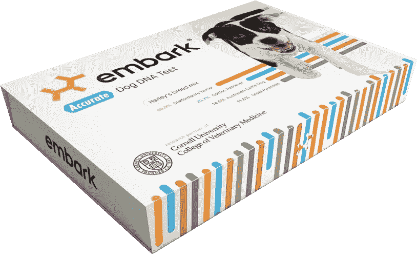
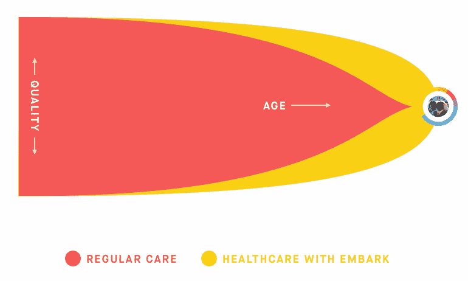

# 灰狗 Github:我们对 Embark 的投资

> 原文：<https://medium.com/hackernoon/github-for-greyhounds-our-investment-in-embark-a84b0737f027>

*由* [*埃里克*](https://twitter.com/epaley) *，搭档*

Snorkie、Miniboz、Cavazoo 和 Scoodle 都是过得去的初创公司名称，但它们实际上是相对较新的[杂交犬](https://dogs.thefuntimesguide.com/hybrid_mixed_dog_breeds/)，只代表了最近投资于设计狗的创业能量的一小部分。拉布拉多是拉布拉多寻回犬和狮子狗的低过敏性混种，是挪威王储麦莉·赛勒斯和佩利家族最喜欢的狗品种，直到 1955 年才出现。人类驯养狗已经有 15000 年了，但是第一只丝毛猎犬直到 1987 年才诞生。像门户网站一样， [Chiweenies](https://www.animalplanet.com/tv-shows/dogs-101/videos/chiweenie) (这是吉娃娃和腊肠狗的混种)，在 20 世纪 90 年代早期获得了巨大的人气。

我们生活在杂交小狗的全盛时期，这就是为什么[我们自豪地宣布投资 Embark](https://embarkvet.com/) ，这是一项为宠物主人、饲养者和兽医破译狗狗 DNA 的服务。可以把它想象成灰狗的 Github。

只需 199 美元，Embark 提供了一份报告，列出了数百个关于你的宠物的有趣事实——从它的地理起源到它可能表现出的性格特征的档案。消费者基因测试对系谱学家来说是一个令人惊讶的工具，对现代医学来说具有迷人的长期潜力，但这需要时间。Embark 测试可以在短短两个月内产生一窝更强壮、更健康的小狗，并且可以在仅仅十年内改变一个品种的寿命！

# Embark 如何提供帮助？

1.宠物主人:美国有 7200 万养狗家庭，每年在宠物身上的花费超过[660 亿美元](http://www.americanpetproducts.org/press_industrytrends.asp)。除了对心爱的家庭成员的起源和基因构成提供令人难以置信的新见解，Embark 还可以帮助金毛猎犬更好地享受他们的黄金岁月，让主人了解他们的杂种狗在基因上容易感染的疾病，以及哪些食物和干预措施可能对他们最好。谁不想给自己最好的朋友更长寿更健康的生活呢？

2.**兽医:**美国有[26000 家小兽医诊所](http://news.vin.com/vinnews.aspx?articleId=32051)。拥有 DNA 测试结果的兽医将能够更准确地诊断病人面临的健康风险，并提供积极的解决方案。此外，Embark 正在创建一个狗 DNA 的基因数据库，这必将导致兽医科学的新发现。

3.育种者:育种者的利益远远超出了那些想要开拓下一个定制品种的人。有了 Embark，纯种繁殖者可以用科学而不是迷信来宣布选择的窝，并进一步完善品种的家谱。通过投资于有助于提高一个品种的健康和寿命的 DNA 银行，饲养者可以确保他们的狗和企业在未来几代人的价值。

除了给宠物爱好者和兽医带来的好处，Embark 还是我们在初创企业中寻找的一种模式:

# 创始人是最优秀的

## (几乎没有其他人能创办这家公司)

Airbnb 和脸书是由刚毕业的大学生创办的，这是有原因的。TJ 帕克是第二代药剂师，他热爱技术，痴迷于用户体验，是领导 PillPack 的最佳人选。

局外人可以给市场带来有用的视角，但在同等条件下，我们更愿意支持适合他们市场的创始人。联合创始人亚当和瑞安·鲍伊科非常适合理解狗的 DNA。Adam 是康奈尔大学的兽医教授，他在期刊上发表了 41 篇文章。瑞安在哈佛学习计算机科学，在耶鲁学习流行病学。多年来，他们一直在一起擦拭狗的脸颊，并前往秘鲁、乌干达和埃及寻找稀有品种，以建立他们的模型。有多少团队的成员钻研狗的口水来获得博士学位，有设计数据库的能力，有面向消费者的设计的明显诀窍？

# 他们找错了对象

## (我们所说的怪异和奇妙是指什么)

我们谈论了很多关于资助奇怪而奇妙的生意。人们通常认为这意味着我们喜欢或寻求听起来奇怪的想法，但这是一种肤浅的解读。我们寻找的是那些在一个对大多数人来说不透明或完全可怕的行业或市场中，看到一个清晰的用例，并且远离当前风险投资主题的创始人。我们很少为了热门的新技术平台而投资它们，但是我们愿意支持恰好在奇怪的行业中运行的伟大用例。

# 他们对商业很敏感

## (好的创始人喜欢谈论难题)

说实话，刚被介绍走 Embark 的时候，我有点怀疑；然而，瑞安用大量关于该业务及其早期牵引力和市场采用的信息支持了一个疯狂的叫卖。

他们的成功不仅仅是销售的问题。在很短的时间内，Embark 已经真正成为领先的狗 DNA 测试产品，尽管竞争对手已经存在多年。Ryan 和 Adam 定期接受《纽约时报》、《国家地理》和其他国家出版物的采访，因为他们在犬类遗传健康方面建立了世界级的思想领导地位。他们做了一些创造性的商业开发交易，比如为《华盛顿邮报》设计测验，为一年一度的小狗碗提供基因测试。他们可能是我见过的最了解媒体的一对科学家。对于专注于科学的团队来说，轻松解决棘手的商业问题是很容易的，比如假装向小猎犬扔网球，但鲍伊科兄弟已经完成了围绕他们的技术突破建立真正商业的艰苦工作。

有些人说所有的交易都有跳蚤，但我们疯狂地摇着尾巴，与第三类的[莎娜·费舍尔](https://www.crunchbase.com/person/shana-fisher)、自由式的[珍妮·莱科特](http://freestyle.vc/team_members/jenny-lefcourt/)、第 32 部分的[比尔·马里斯](https://www.section32.com/)、个人投资的安妮·沃西基一起领导这轮融资，并且不能更兴奋地欢迎 Embark 加入方正集体！