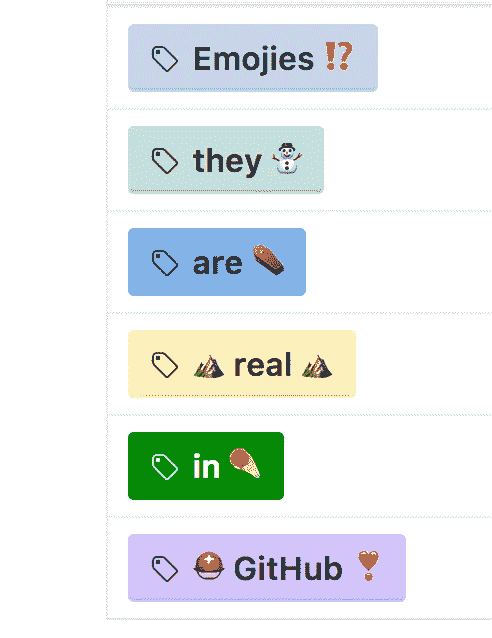
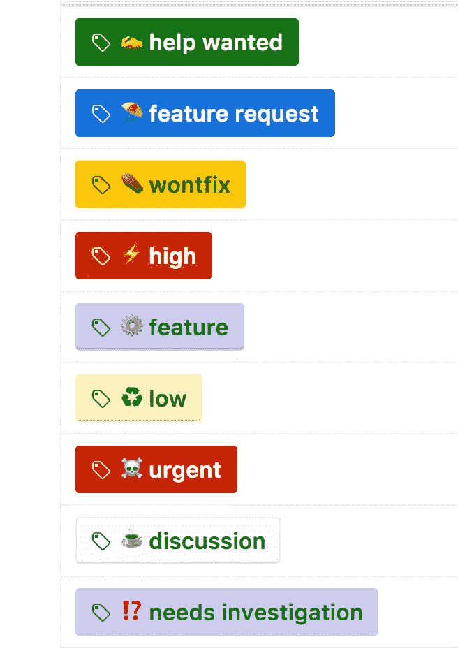

# GitHub 标签和表情符号❤️️

> 原文：<https://medium.com/hackernoon/github-labels-and-emojis-%EF%B8%8F%EF%B8%8F-9d5c351344bb>

Github labels with emojis

不管你喜不喜欢，表情符号已经成为我们在互联网上交流的一部分。只要看到那张带着喜悦泪水的黄脸😂，你瞬间就知道发给你的人觉得某样东西真的很好笑到笑哭。像“嘿”这样的句子。你好吗？”几乎总是伴随着那圆圆的笑脸。我最近的一个发现是 Github 标签中的表情符号。

[GitHub 标签](https://help.github.com/articles/creating-and-editing-labels-for-issues-and-pull-requests/)可以应用于问题和拉式请求，以表示优先级、类别或任何其他您认为有用的信息。为 GitHub 标签分配表情符号会很棒。

信不信由你，GitHub 标签支持高达 [Unicode 版本 5.2](http://emojipedia.org/unicode-5.2/) 的表情符号。无法使用 Unicode 6.0 或更高版本，因为它们包含高于 0xFFFF 的 Unicode 字符😭这是我们为 GitHub 标签选择的表情符号。

Our emoji choices for GitHub labels

欢迎在你的 GitHub 项目中尝试表情符号，并分享你的选择❣️

> [黑客中午](http://bit.ly/Hackernoon)是黑客如何开始他们的下午。我们是 [@AMI](http://bit.ly/atAMIatAMI) 家庭的一员。我们现在[接受投稿](http://bit.ly/hackernoonsubmission)并乐意[讨论广告&赞助](mailto:partners@amipublications.com)机会。
> 
> 如果你喜欢这个故事，我们推荐你阅读我们的[最新科技故事](http://bit.ly/hackernoonlatestt)和[趋势科技故事](https://hackernoon.com/trending)。直到下一次，不要把世界的现实想当然！

