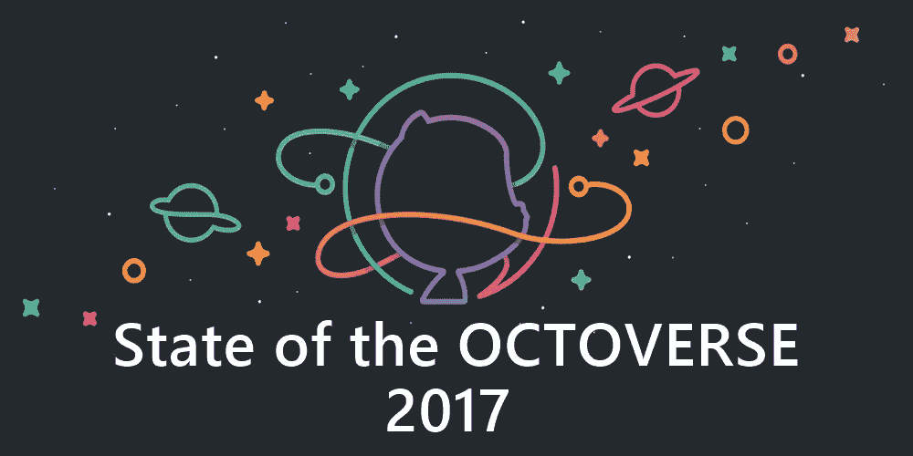
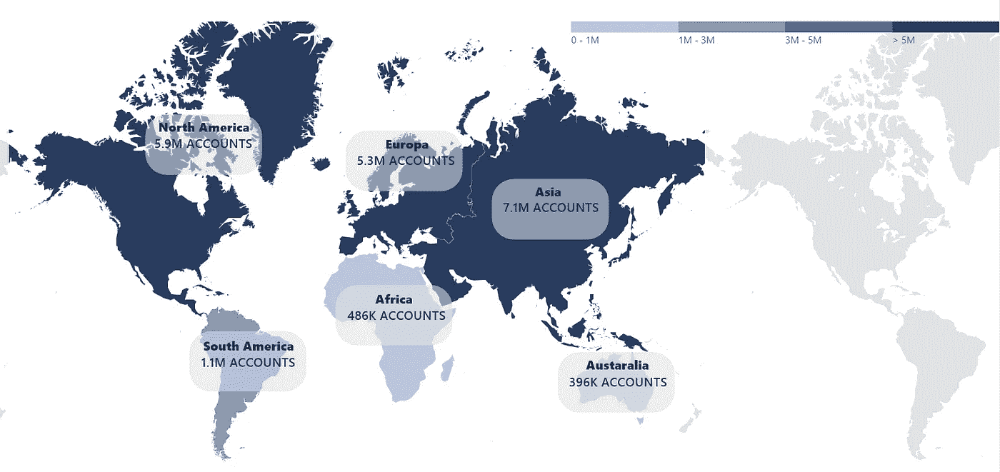
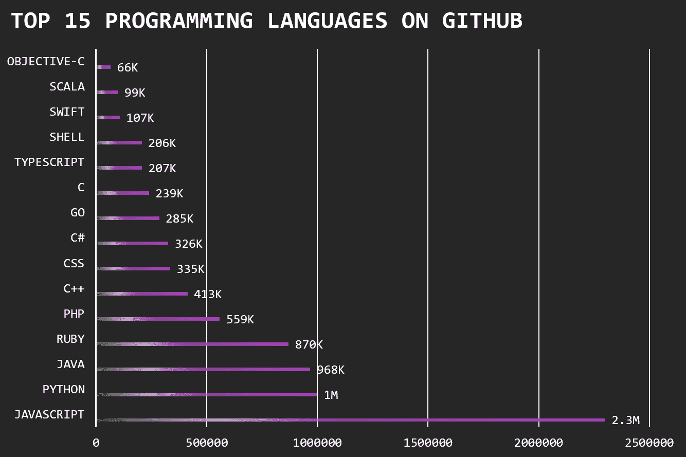
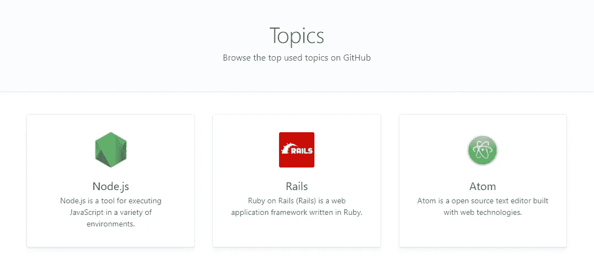
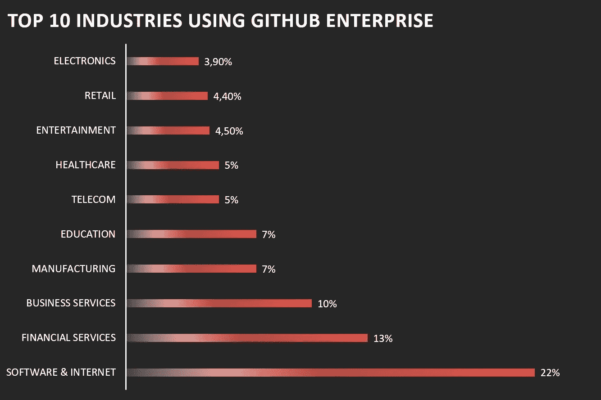
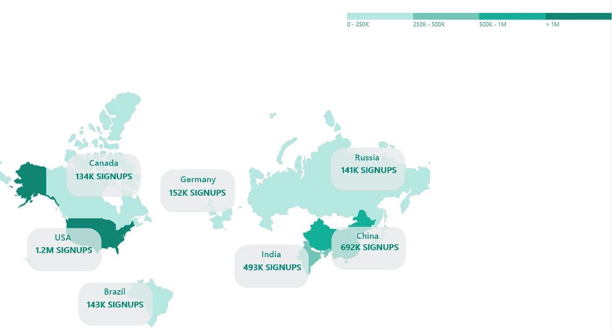

# GitHub Octoverse 2017 概述—热门趋势

> 原文：<https://medium.com/hackernoon/github-octoverse-2017-overview-top-trends-9ed5c4595683>

在[**dash bounk**](https://dashbouquet.com/)**我们积极地使用 GitHub，所以很明显我们关注着所有与之相关的信息。最近 GitHub 发布了 2017 年的总结，其中有很多数字和数据——都是关于开发者和他们对 GitHub 的使用。我们认为与你分享是个好主意，因为你肯定也是这些数字的一部分。**

**首先，今年 GitHub 上的社区吸引了来自 200 个国家的 2400 万开发者，共有 150 万个组织和 6700 万个存储库。**

****

**这些数字的确令人印象深刻，现在让我们把它们分解成更多的细节。**

**从 2016 年 9 月开始计算，GitHub 社区产生了 2530 万个活跃的回购，即提交的代码、创建的评论等。还创建了 1250 万个活动问题和 130 万个新请求。但是这些数据非常笼统，因为我们是为开发者写博客的，所以你肯定想了解 GitHub 上的顶级编程语言。**

**JavaScript 以 230 万用户排名第一(老实说，我们也很喜欢它)，第二名是 Python(100 万用户)，第三名是 Java(98.6 万用户)。有趣的是，今年 Python 比 Java 更受欢迎，2017 年打开的 pull 请求增加了 40%。**

********

**2017 年 1 月，GitHub 发布了主题，这是一种存储库标签，您可以在搜索中使用，通过技术、行业等找到项目。排名靠前的标签是:机器学习、游戏、iOS、API、深度学习、游戏、博客、数据库。我们对这一事实并不感到惊讶，因为自 2016 年以来，机器学习越来越受欢迎，游戏行业也发生了巨大的变化，导致更多开发者对它感兴趣。**

**现在，如果我们更多地谈论商业，值得一提的是，财富 50 强中有 52%的公司使用 GitHub 构建他们的软件，而财富 100 强中有 45%的公司使用 GitHub。这些公司代表的行业各不相同:GitHub 帮助为软件和互联网、金融服务、商业服务、制造和教育(顶级行业)构建软件。还有你想知道组织安装的排名靠前的应用吗？分别是 [Codecov](https://codecov.io/) 、 [Buddybuild](https://www.buddybuild.com/) 、 [WaffleBot](https://bot.waffle.io/) 、 [GreenKeeper](https://greenkeeper.io/) 和 [GitBook](https://www.gitbook.com/) 。**

****

**2017 年 5 月，我们推出了 Marketplace，以帮助您改善工作流程并找到高效工作的新方法。现在市场上有 26 个应用程序，安装最多的付费应用程序是 Codacy，Codecov(再次！)，ZenHub，CircleCi，Travis CI。**

****

**GitHub 也很酷，因为它是最好的学习场所之一。目前有超过 505，000 名学生和 5，300 名教师在 GitHub 上学习。原因很简单:自 2014 年推出 [**学生开发者包**](https://education.github.com/pack) 以来，超过 85 万名学生学会了如何成为编程专家。**

**那么总结是什么？2016 年以来新增开发者 670 万，新增组织 45.1 万。大多数新移民认为自己是学生，28%的人声称自己是专业人士。有趣的是，45%的新手说他们有一点经验，45%的人说他们对编程完全陌生。**

****

**GitHub 致力于帮助构建、使用和共享软件。GitHub 团队致力于寻找通过事件连接人和软件的新方法，并与全球非营利组织建立合作伙伴关系。数字不会说谎，赞助了 121 项社会影响活动，举办了 14 项拼凑活动，创建了 667 个新的非营利账户。**

**这是一个很有说服力的理由，说明为什么人们应该尽快加入 GitHub。**

**基于 2017 年十月 的 [**状态。**](https://octoverse.github.com/)**

**[*纳塔利娅·库库什金娜*](https://www.linkedin.com/in/natalia-kukushkina-b62397132/)**

***想了解更多信息？* [*在这里查看*](https://dashbouquet.com/blog)**