# FaaS 让 GitHub 状态变得简单

> 原文：<https://medium.com/hackernoon/github-statuses-made-easy-with-faas-fd9236a41925>

## 使用 Azure 函数自动化你的请求验证

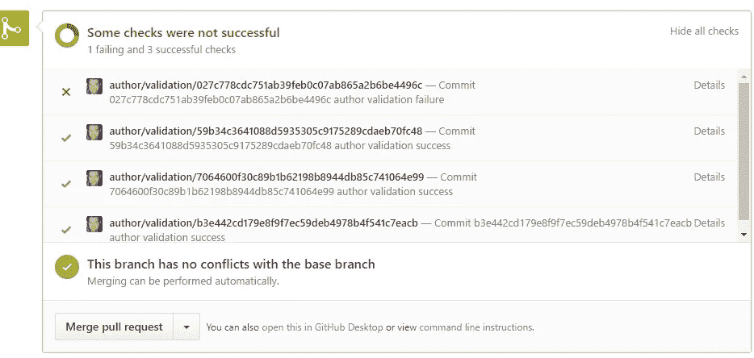

如果你有一个开源项目，你能围绕拉式请求审查过程自动化得越多越好，至少我是这么认为的。

因此，如果你仔细检查你的期望清单，你会发现有些东西是明显的持续集成，已经存在良好的服务，但你的一些检查可能是独特的，目前是手动的——我最近的自动检查就是本文中的例子。

## 这个例子

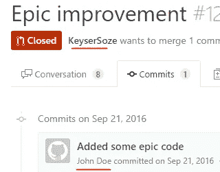

这篇博文中解释的例子将会进行验证，因此 pull 请求中的每个提交都来自一个已知的 GitHub 用户，这是一个非常容易的检查，但是当你检查自己时也很容易错过，因为 pull 请求本身总是来自一个已知的 GitHub 用户——所以仅仅通过查看 GitHub 上的 pull 请求，这不是一个明显的问题。

这样做的原因可能是，如果你想在发布说明中自动归属作者，验证 CLAs 等等。

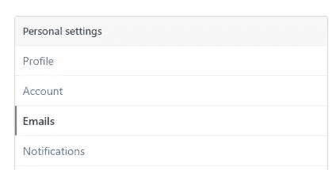

发生这种情况的原因通常不是恶意的，而是使用了 GitHub 未知的电子邮件地址，即发行者的公司电子邮件地址。

最简单的解决方法是在 GitHub 设置/电子邮件下添加所有的电子邮件地址，另一种方法是用所需的电子邮件地址修改提交，并用新的提交进行强制推送。

## 这个概念

FaaS——功能即服务——非常适合这种情况，因为你不需要网站/服务器 24/7 全天候运行，而是 FaaS 使你能够拥有只在被调用时才启动和运行的代码——这种想法是只为你使用时使用的东西付费。

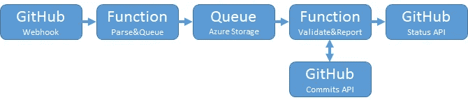

大致的流程是 GitHub 触发对一个函数的 webhook 调用，该函数将从 GitHub 有效负载中解析出所需的内容，并将其放在 Azure 存储队列中，该队列将触发一个函数，该函数使用 GitHub rest API 进行验证并向 pull 请求报告状态。

## 新功能

我通常使用 Azure Functions CLI 脚手架，用 VS 代码编写我的函数，然后通过 KUDU 或选择的 CI/CD 进行部署。但是 Azure 门户也非常强大，可以作为快速入门的方式，并且完全有可能在以后获得源代码控制(*在生产中，源代码控制应该总是这样，但是当开始时，围绕门户进行原型制作和游戏实际上是非常高效的*

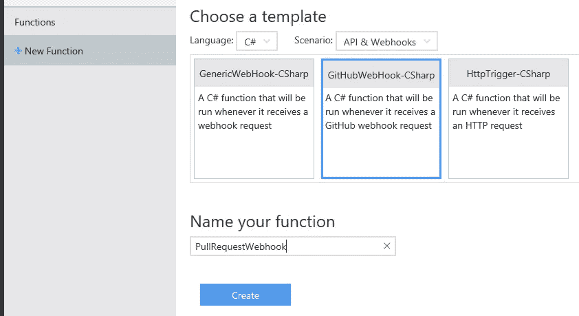

Azure Functions 有现成的模板，可以快速上手 GitHub webhooks。

这个模板将为您动态解析从 GitHub 发布的数据提供一个很好的起点，使得支持大多数场景变得容易。

## 添加队列

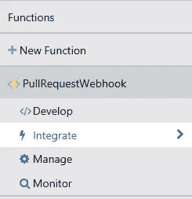

所以现在我们有了进入服务的数据设置，并且有了解析输入数据的能力。现在，我们只想快速地从 GitHub 有效载荷中挑选出需要的东西，将其放入队列供以后处理，并告诉 GitHub 我们得到了它。

转到“集成”，通过门户添加一个队列输出，单击
“+新输出”，在这种情况下，我们需要一个 Azure 存储队列

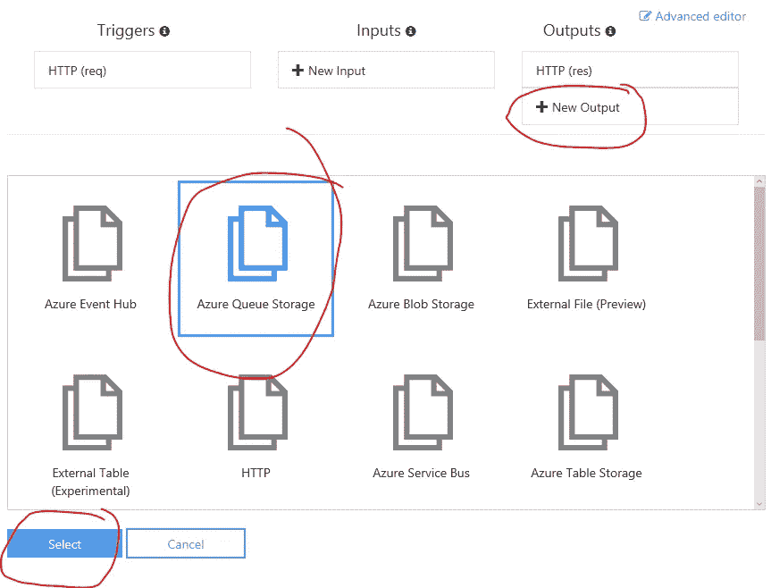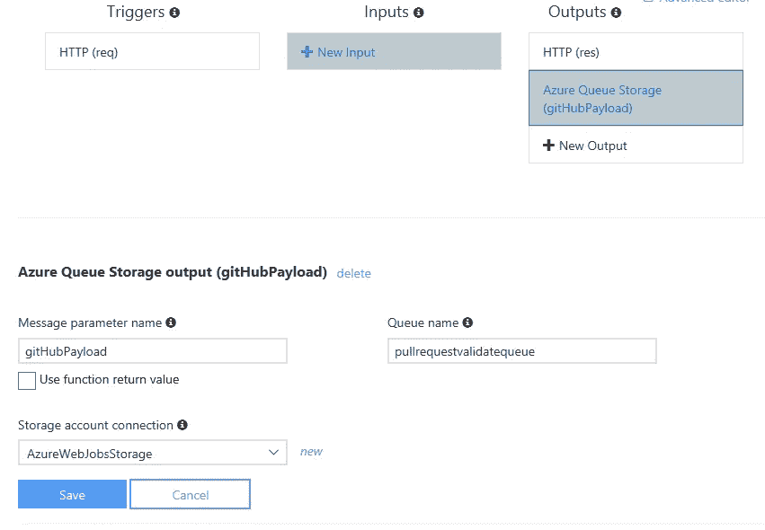

然后给“队列输出”一个参数名，它将是函数中输出参数的名称，然后是要将消息推送到的队列的名称，最后选择存储队列连接字符串所在的`appsetting`。点击 save，我们的队列参数绑定就准备好了。

## 填充队列

现在我们只需要将它作为输出参数添加到我们的函数中，这样我们就可以为它分配内容:

正如您在这里看到的，使用 output 参数会失去 async/await 功能，如果您不需要多个输出，并且只想在成功处理和排队后返回
“200—OK ”,那么您可以继续使用 async/await，方法是在“Integrate”下移除 HTTP 结果绑定，并将队列设置为绑定到函数的返回值。

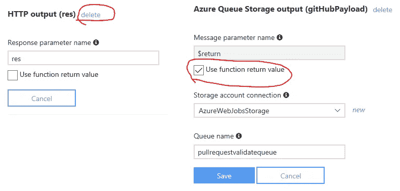

因此，一个完整的函数在解析和排队的同时仍然支持 async/await，可能如下所示:

## 类型化参数

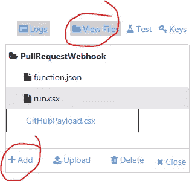

一个巧妙的事情是，队列项可以被更改为自定义类，然后它会自动序列化和反序列化 JSON 字符串。所以让我们创建一个类，为了保持它的整洁，我们将把它添加到自己的文件中。
点击“查看文件”——>“+添加”，然后输入文件名，点击回车。

我们的有效负载的类将如下所示

然后，我们可以在函数`run.csx`中使用类似
`#load "GitHubPayload.csx"`的`#load`指令，它在我们的函数中是可用的，我们可以将我们的函数方法签名更改为类型化返回值，并最终得到如下所示的结果:

那么上面是做什么的呢？不多也不少，它解析 GitHub [pull 请求事件](https://developer.github.com/v3/activity/events/types/#pullrequestevent)的动作、发布状态的 URL 和获取 pull 请求提交的 URL。
当我们将返回值绑定到队列时，它将被自动序列化为 JSON 并排队。

## 插队

现在我们需要一些东西来弹出队列并做实际的工作。

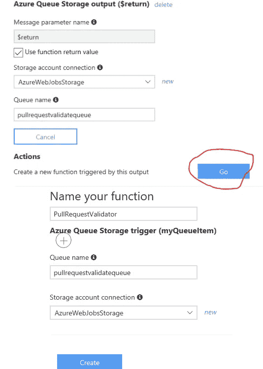

要快速启动并运行，Azure Functions 实际上提供了一个脚手架选项，可以让你快速启动并运行。

如果你去整合我们之前创建的队列输出，有一个“创建一个由这个输出触发的新函数”动作。

这将预先选择一个 C#队列触发器，填写队列名称和使用的存储帐户连接。

你所需要做的就是他的 hit create，但是你可能想把你的函数命名得比`QueueTriggerCSharp1`更有意义。

创建的函数如下所示。

当有东西进入队列时，它就会被触发，出队的值就是您得到的值，模板示例只是将它输出到跟踪日志中。

## 解析和验证

此外，可以通过重用我们之前创建的类来对出列触发器进行类型化，这样 Azure 函数会自动将排队的 JSON 反序列化为我们可以轻松处理的类型化对象。

上面的代码将验证我们感兴趣的是一个事件/动作，并确保我们得到了报告状态所需的状态 API URL 和获取拉请求提交细节所需的提交 API URL。

## GitHub 授权

现在我们已经解析好了队列项，下一步是从 GitHub 获取提交，在此之前，我们需要能够验证它们。

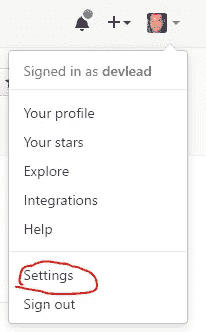

GitHub 有几种方式来验证的 API，一种方式是通过个人访问令牌，这就是我在这篇博文中使用的。

进入“设置”,然后点击左侧菜单中的“个人访问令牌”,即可找到您的个人访问令牌。

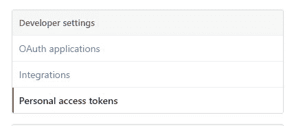

然后点击“生成令牌”按钮，给令牌一个描述，选择所需的访问权限，有很多可用的权限，但对于这篇文章，“repo:status”是唯一需要的访问权限

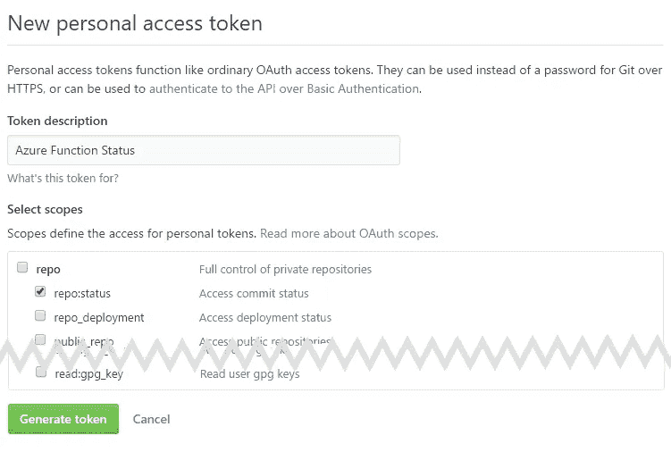

点击“生成令牌”，您将看到新生成的令牌。

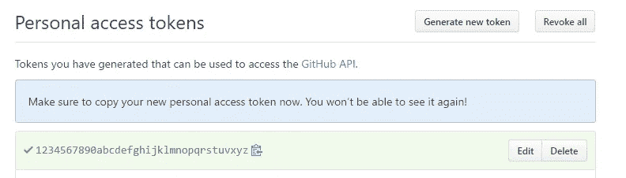

## 应用程序设置

我们不想在源代码中存储我们的令牌，幸运的是，Azure 的功能就像其他 Azure 应用服务一样，提供了存储应用设置的方法。

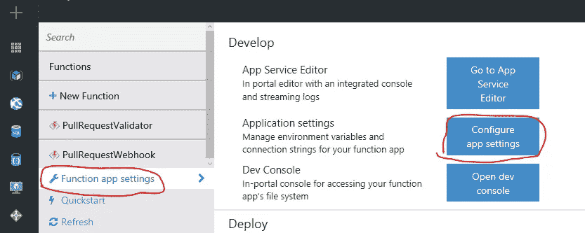

你可以在“功能应用设置”->“配置应用设置”下找到它

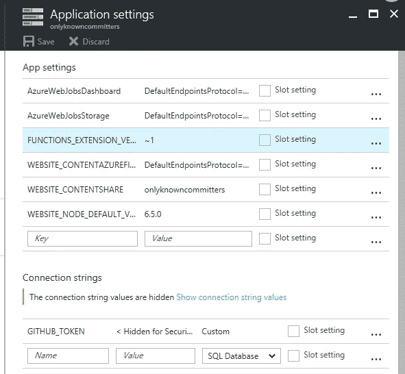

这里有一个键值对列表，您可以添加、删除和修改应用程序设置和连接字符串。

所有应用程序设置和连接字符串都可以作为环境变量来访问，这使得无论您选择使用 Azure 功能支持的语言，都可以轻松访问。

连接字符串环境变量以它的提供者为前缀，也就是说，如果你选择自定义提供者，它会以`CUSTOMCONNSTR_`为前缀，所以如果你输入一个名为`GITHUB_TOKEN`的变量，你会以`CUSTOMCONNSTR_GITHUB_TOKEN`的名字访问它。

## 呼叫 GitHub

现在，我们已经将令牌和应用程序设置就绪，我们希望`get`迭代请求提交，验证每个请求，然后`post`验证请求是否通过。的。NET `HttpClient`用于调用 GitHub API，为了方便和保持整洁，我将它包装在两个助手方法`GetObjectAsync`和`PostObjectAsJsonAsync`中，两者都使用相同的方法进行公共头和认证，都放在它自己的`HttpClientHelper.csx`文件中

## 完成拼图

把所有的部分放在一起，我们最终得到了这样一个函数

现在，我们的功能已经完成，准备好对 GitHub webhook 请求进行排队，验证输入，验证并报告提交是否有注册的 GitHub 用户作为作者。

## 配置 webhook

现在我们只需要配置 GitHub，以便在创建或修改 pull 请求时调用我们的函数。这是在存储库(或组织)设置“webhooks”->“添加 web hook”下完成的

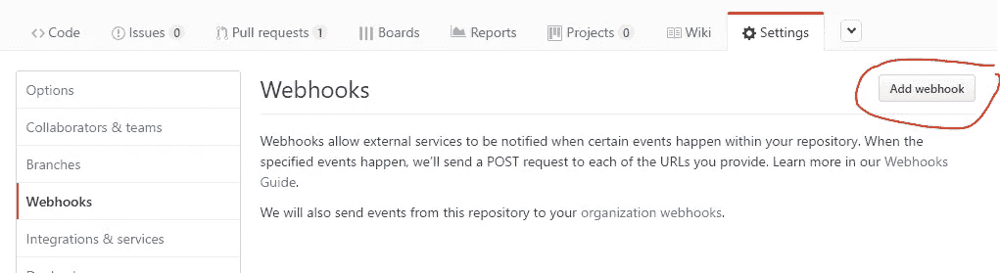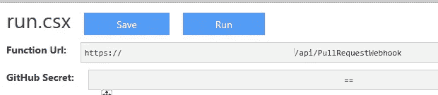

你可以在你的 GitHub webhook 函数下找到要使用的 URL 和 secret。输入这些内容作为有效负载 URL、机密，并选择`application/json`作为内容类型

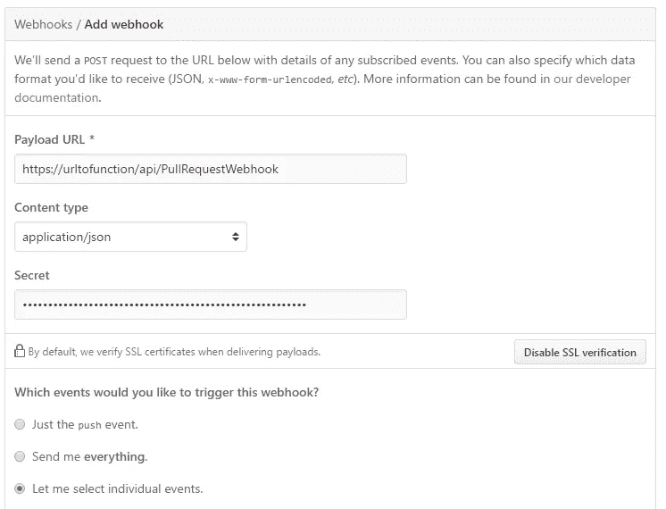

选择以选择单个事件，并仅选择“拉”请求事件

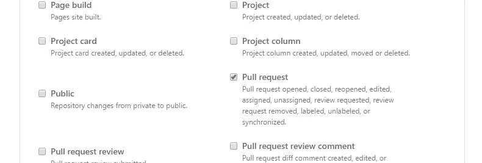

然后只需点击“添加 webhook”就大功告成了。

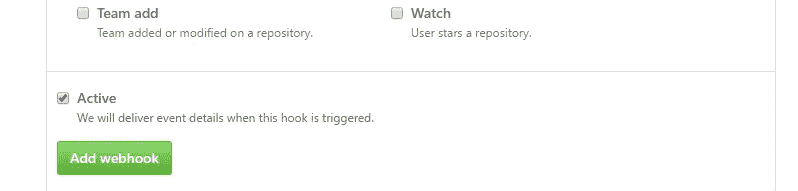

## 测试第一次公关

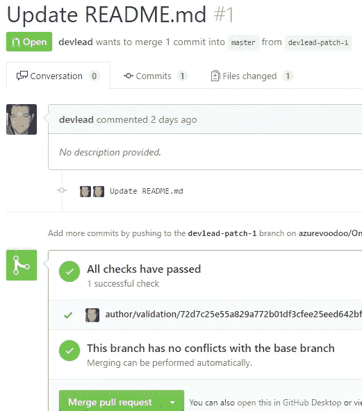

现在，我们为配置了 webhook 的存储库创建第一个 PR。

如果一切按计划进行，您应该看到已经执行了 1 个作者验证，由于我是一个已知的 GitHub 用户，测试通过了，一切正常。

现在我们将添加一个来自未知用户的提交，最简单的测试方法是在提交时覆盖作者。从命令行，看起来像这样

```
git commit -a -m "Unknown update" --author "John <[John@unknown.doe.com](mailto:John@unknown.doe.com)>"
```

然后我们推送我们的更改，这将触发 GitHub pull request `synchronize`事件和我们的函数

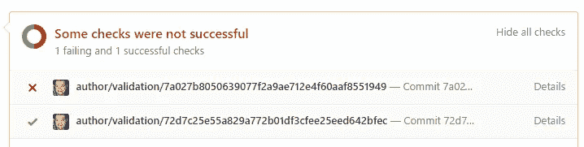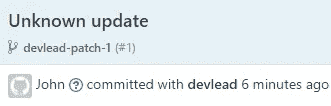

按下详细信息链接将把我们带到显示未知作者的提交页面。

## 结论

阅读这篇文章所花的时间可能比启动和运行这些功能所花的时间要长得多——因为当你知道它的时候，很多事情都很容易。它真的让你专注于你想要解决的问题，正如我所展示的，与第三方 API 的结合非常简单，这使得它非常强大。使用队列是一件轻而易举的事情，对于即将到来的 web 钩子来说，这是一个很好的方法，因为你只需要接收和确认——在一个单独的函数中做实际的工作，你可以为每个队列将函数挂接到一个有害的消息队列，使它成为一个非常健壮的解决方案——而不会使它*变得太*复杂。

最后，用小规模的自动检查来扩展 GitHub pull 请求审查过程是一种很好的方式，不仅可以节省您的时间，还可以加快与您的贡献者的沟通——并且天空确实是您可以检查的极限！你也可以做类似机器人的事情，比如某些维护者的评论触发了一个集成测试，产生了新的问题，一个微软团队的消息，等等。

因此，我认为对于这些场景，功能即服务方法非常合适！你怎么想呢?希望听到您的反馈！

## 代码

这篇博文中函数的完整代码可以在 GitHub 上找到

[](https://github.com/azurevoodoo/OnlyKnownCommitters) [## azure voodoo/OnlyKnownCommitters

### 在 GitHub 上创建一个帐户，为 OnlyKnownCommitters 的开发做出贡献。

github.com](https://github.com/azurevoodoo/OnlyKnownCommitters) 

## 以前的帖子

如果你想学习更多的 Azure 功能，请查看我以前写的一些关于这个主题的帖子！

[](https://hackernoon.com/bring-static-to-life-using-serverless-e722be5eaf84) [## 使用 serverless⚡赋予静电以生命

### 使用 Azure 函数给你的静态网站注入活力

hackernoon.com](https://hackernoon.com/bring-static-to-life-using-serverless-e722be5eaf84) [](/@devlead/azure-deployment-microsoft-teams-ed1c15df4a08) [## ⚡Azure 部署->微软团队

### 使用 Azure 函数将 Azure 应用服务部署通知连接到微软团队通道

medium.com](/@devlead/azure-deployment-microsoft-teams-ed1c15df4a08) [](/@devlead/going-serverless-with-powershell-705677a9ae86) [## 使用 PowerShell 实现无服务器化

### 为什么 JavaScript 开发者应该享受所有的乐趣？

medium.com](/@devlead/going-serverless-with-powershell-705677a9ae86) [](http://bit.ly/HackernoonFB)[](https://goo.gl/k7XYbx)[](https://goo.gl/4ofytp)

> [黑客中午](http://bit.ly/Hackernoon)是黑客如何开始他们的下午。我们是 [@AMI](http://bit.ly/atAMIatAMI) 家庭的一员。我们现在[接受投稿](http://bit.ly/hackernoonsubmission)，并乐意[讨论广告&赞助](mailto:partners@amipublications.com)机会。
> 
> 如果你喜欢这个故事，我们推荐你阅读我们的[最新科技故事](http://bit.ly/hackernoonlatestt)和[趋势科技故事](https://hackernoon.com/trending)。直到下一次，不要把世界的现实想当然！

