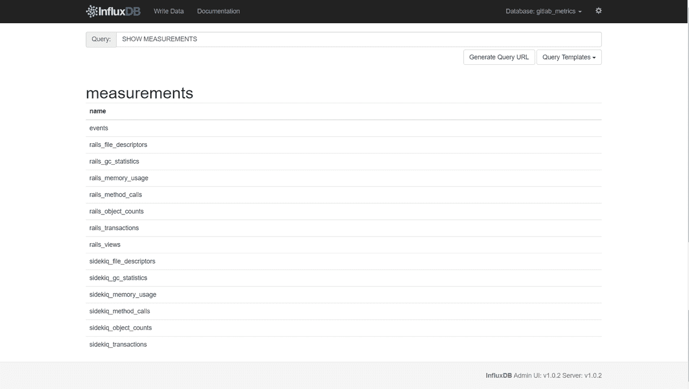
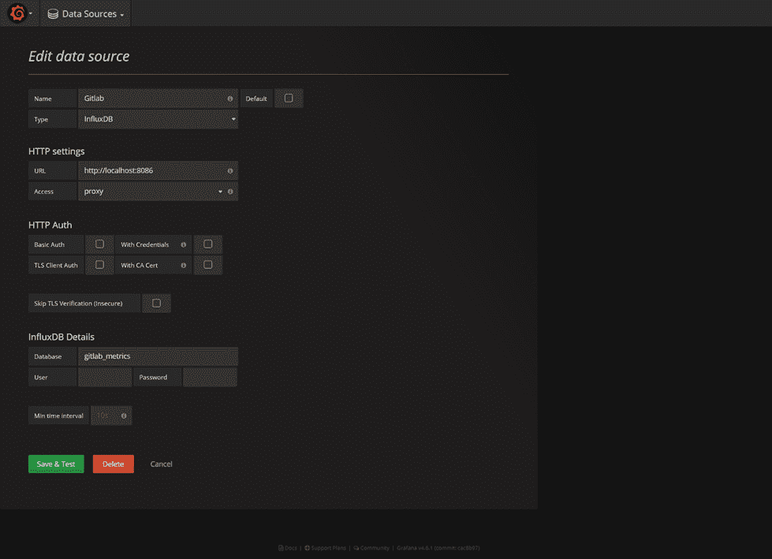
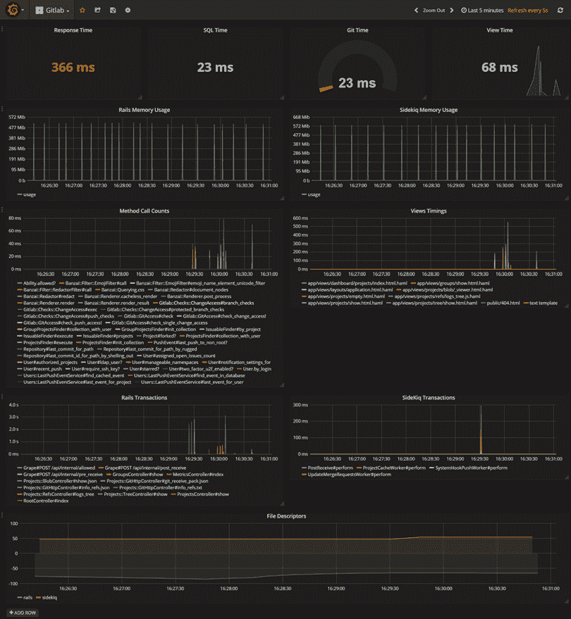

# 使用 Grafana 监控 GitLab 性能

> 原文：<https://medium.com/hackernoon/gitlab-performance-monitoring-with-grafana-a2394848d071>

从 **GitLab v8.4** 开始，您可以通过使用名为“ **Gitlab 性能监控**”的 GitLab 应用程序性能测量系统，使用**influx db**&**Grafana**堆栈来监控您自己的实例。

**GitLab** 通过 **UDP 将指标写入 **InfluxDB** 。**因此，这必须在**/etc/influx db/influx db . conf**中启用:

重启您的 **InfluxDB** 实例。然后，创建一个数据库来存储 **GitLab** 指标:

> 创建数据库“gitlab_metrics”

接下来，转到**Gitlab settings Dashboard**并启用**InfluxDB**Metrics，如下所示:

然后，你需要重启 **GitLab** :

> gitlab-ctl 重新启动

现在，您的 **GitLab** 实例应该将数据发送到 **InfluxDB** :

最后，将您的浏览器指向您的 **Grafana URL** ，然后以 *admin* 用户的身份登录。从菜单中选择**数据源**。然后，点击顶部栏中的“**添加新的**”。

填写 **InfluxDB** 数据源的配置详细信息:

您现在可以通过打开仪表板下拉菜单并单击'**导入**'来导入[*dashboard . JSON*](https://github.com/mlabouardy/grafana-dashboards/blob/master/gitlab/dashboard.json)文件:

注:查看我的 [Github](https://github.com/mlabouardy/grafana-dashboards) 获得更多互动&漂亮 **Grafana** 仪表盘。