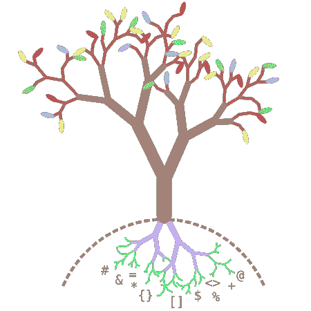
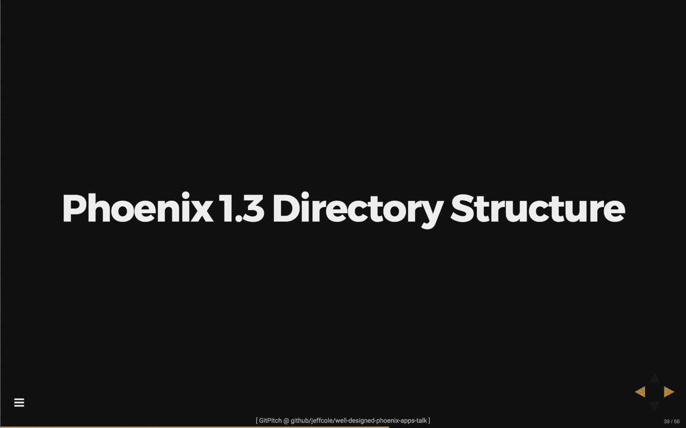

# 当天的 GitPitch 演示#6

> 原文：<https://medium.com/hackernoon/gitpitch-presentation-of-the-day-6-6536035a56ba>

> 了解 GitPitch 代码展示如何不仅仅展示代码，还能提供一些令人惊讶的展示特性。

这篇文章是今日系列*展示的最新一篇。本系列文章重点介绍了 GitPitch 社区中开发的一些优秀作品。你可以在这个博客[这里](/@gitpitch)找到本系列早期文章的链接以及相关内容。*

# 请击鼓…

事不宜迟，让我来介绍今天最新的 *GitPitch 演示:*

[ GitPitch Presentation of the Day ] — Click To Focus

**提示！**演示文稿获得焦点后，按`F`键打开演示文稿进行全屏查看。

这个演示是由 Jeff Cole 创作的，他可以在 GitHub 上找到[。Jeff 为在菲尼克斯框架上用 Elixir 设计干净、可维护的应用程序提供了一些很好的指导。因为我有时喜欢自己尝试长生不老药，所以我真的很喜欢这个演示。感谢分享 Jeff！](https://github.com/jeffcole)

你可以直接进入 GitHub repo 查看这个 GitPitch 演示文稿，并通过`PITCHME.md` markdown 和`PITCHME.yaml`查看演示文稿是如何创建的:

 [## jeffcole/精心设计-凤凰-应用-对话

### 精心设计的 phoenix-apps-talk -关于编写精心设计的 phoenix 应用程序的演讲

github.com](https://github.com/jeffcole/well-designed-phoenix-apps-talk) 

# 演示技巧和窍门！

我的这个*今日演讲*系列的目标之一是利用每篇文章来突出今天的专题演讲所使用的一些强大的 GitPitch 特性。

今天我将重点介绍 GitPitch [代码演示](https://github.com/gitpitch/gitpitch/wiki/Code-Presenting)的一种新颖用法，它既引人注目，又可能对各种演示非常有用。

# 行走的目录树(没有束缚)

代码演示时最典型的用例是直接在幻灯片中单步执行渲染精美、语法突出显示的源代码。

但是 GitPitch 代码演示让你可以遍历任何文本，而不仅仅是源代码。演示者的一个有趣的用例是遍历文件系统目录结构或树。

[ Warning: Not A Real Directory Tree! ]

目录树并不总是像这个一样漂亮，所以 GitPitch 给了我们一点帮助来渲染和单步执行目录和文件，以达到很好的效果:

# 它是如何工作的？

你可以随时查看今天专题演讲的 [PITCHME.md](https://github.com/jeffcole/well-designed-phoenix-apps-talk) ，看看杰夫是如何创造他的*树走*效果的。但这里有一个涉及步骤的简要总结:

1.  在您的终端中执行 ***树*** 命令行实用程序，以纯文本格式捕获所需的目录列表。
2.  接下来将 ***树*** 输出插入任何幻灯片上的 Markdown [代码块](https://github.com/gitpitch/gitpitch/wiki/Code-Slides)，使用*文本*语言提示。
3.  然后将[代码呈现语法](https://github.com/gitpitch/gitpitch/wiki/Code-Presenting#code-presenting-markdown-syntax)添加到幻灯片中，以突出显示并单步执行目录树结构中的任何目录或文件。

你差不多完成了。最后一步是去*哇*你的观众；-)

# Git 上每个人的演示文稿。*

好了，今天就到这里。我希望您能够从今天的专题演示中获得一些灵感或有用的提示。

GitPitch 让你毫不费力地制作和分享关于你所关心的事物的美丽内容。用它来推销、推销或展示任何东西；)

> 如果您有自己的演示文稿，并且您认为它是当天 GitPitch 演示文稿的最佳候选，请联系我们。

**您可以在**[**Medium**](/@gitpitch)**或**[**Twitter**](https://twitter.com/gitpitch)**上关注我，了解 GitPitch 社区的更多新闻、技巧和独特创意。**