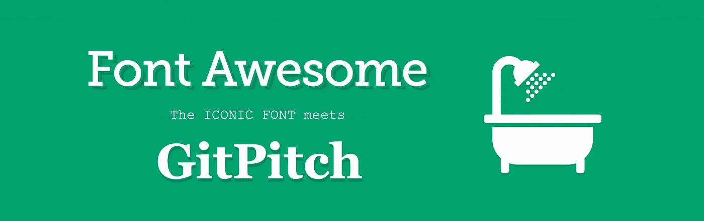

# GitPitch 演示现在(Font)棒极了！

> 原文：<https://medium.com/hackernoon/gitpitch-presentations-for-developers-are-now-font-awesome-342c8aa86715>

> 现在有超过 600 种字体的图标可用于你的幻灯片。

人人都爱[字体令人敬畏的](http://fontawesome.io/icons)图标，这是有充分理由的。不可否认，*他们很牛逼。超过 600 个图标可供选择，几乎每个场合都有一个图标。甚至洗澡的时候:)*



所以我认为是时候让 GitPitch 的用户有机会开始在演示幻灯片中直接使用这个神奇的图标集了。

# 字体真棒图标现场

有什么比 GitPitch 演示更好的方式来介绍这一新功能呢？只需点击关注下面的 GitPitch 幻灯片，像你从未见过的那样向字体牛逼的图标问好。

[ GitPitch Font Awesome Demo Presentation — Click To Focus ]

# 轻松可怕的图标

和所有与 GitPitch 相关的东西一样，我的动机是提供简单、美观、使用直观的特性。字体牛逼图标支持也不例外。GitPitch 提供了一个简单的语法，可以在任何`PITCHME.md`中使用，以在你的幻灯片中呈现字体很棒的图标。

这再简单不过了，例如:

```
@fa[thumbs-up]
```

或者如果我们想变得更有趣，这个怎么样:

```
@fa[thumbs-up fa-5x](Sounds great!)
```

这个简单的降价片段将在你的幻灯片上呈现令人敬畏的字体*竖起大拇指图标*，将图标放大到指定的大小。与图标相关联的附加标签是可选的。

你可以在 [GitPitch Wiki](https://github.com/gitpitch/gitpitch/wiki/Font-Awesome-Icons) 上阅读更多关于新语法和选项的内容。

# 时髦的可怕图标

你可能已经注意到了，在上面的演示中，图标在很多情况下都会以不同的大小呈现，并且使用了各种各样的颜色。

如果你想知道如何将自定义样式应用到你的图标上，我推荐你查看一下演示库中的`PITCHME.md`、`PITCHME.yaml`和相关的自定义 css，可以在这里找到:

[](https://github.com/gitpitch/feature-demo/tree/fontawesome-shortcut-syntax) [## git pitch/功能演示

### feature-demo -向 GitPitch 社区演示 markdown 演示功能。

github.com](https://github.com/gitpitch/feature-demo/tree/fontawesome-shortcut-syntax) 

# 让字体牛逼的图标来说话

我希望您对 GitPitch 的这一新功能感到兴奋。我期待看到字体令人敬畏的图标丰富 GitPitch 社区创建的各种演示文稿。

请记住，GitPitch 让你毫不费力地制作和分享关于你所关心的事物的美丽内容。**用它来推销、推销或呈现绝对的任何东西；)**

[](https://twitter.com/gitpitch)

**您可以在** [**Medium**](/@gitpitch) **或**[**Twitter**](https://twitter.com/gitpitch)**上关注我，了解 GitPitch 社区的更多新闻、技巧和独特创意。**