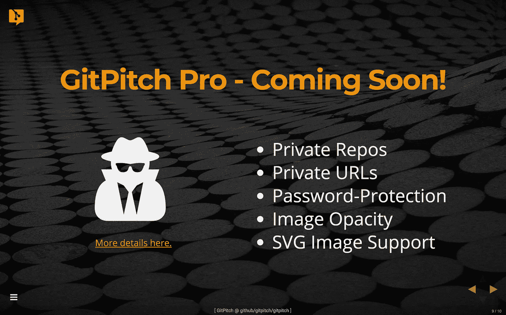
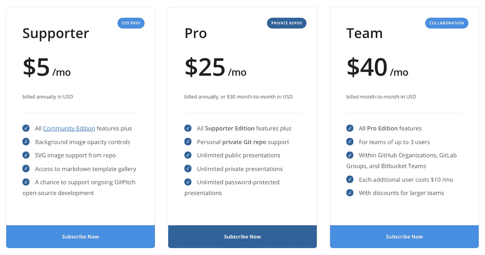

# GitPitch Pro 即将推出

> 原文：<https://medium.com/hackernoon/gitpitch-pro-coming-soon-bda8c71ca9ea>

> 伟大的新功能使用 Git 私人回购和更多。

在过去的 18 个月里，GitPitch 用户最常要求的功能是什么？毫无疑问，**支持 Git 私有回购**。

今天，我很高兴地宣布，私人回购支持即将到来。很快。全新的 **GitPitch Pro 订阅服务**。GitHub、GitLab 和 Bitbucket 上的所有人。

# 免费 v 专业版

不要慌！您今天在 GitPitch.com[上享受的所有精彩功能都将 100%免费公开回购。没有变化。如果你需要一个惊人特性集的提示，请查看 GitPitch 网站上新的](https://gitpitch.com)[社区页面](https://gitpitch.com/features)。

但是如果你喜欢 GitPitch，并且想通过支持 GitPitch 来表达你对正在进行的开源开发的支持，我为你创建了一个特殊的**支持者**订阅。以每月一杯咖啡+松饼的价格。更多细节见下文。

新的 **Pro** 版订阅计划面向 Pro 用户。

# 专业功能:私人和机密

专业用户享受新的隐私和保密功能:

1.  分享私人回购中的公共幻灯片演示，同时保持所有其他回购内容的 100%隐私。
2.  使用*隐藏模式*授予和撤销私有回购中幻灯片演示的私有 URL。
3.  使用*保密模式*授权和撤销对私人回购中幻灯片演示的密码保护访问。

通过提供一个解决方案，使授予和撤销私有 URL 和密码保护访问变得简单，您现在有了一个强大的工具来保护您的内容和管理您的受众。

# 专业功能:影像服务

所有 Pro 计划(包括**支持者**)享受新形象服务:

1.  应用新的图像不透明度控制，在背景图像和幻灯片上的文字之间达到完美的视觉平衡。
2.  利用新的 GitPitch CDN 直接从 repo 提供 SVG 图像，实现任何分辨率下的像素完美渲染。

# GitPitch Pro 订阅价格

新的 GitPitch Pro 订阅计划的定价模式简单透明:

在 GitHub、GitLab 或 Bitbucket 上激活任何**个人账户**的**支持者**或 **Pro** 版订阅。

使用 GitHub 组织、GitLab 组或 Bitbucket 团队帐户为您的**组织**激活**团队**版订阅。

如果您对这些 GitPitch Pro 订阅计划有任何疑问，请随时联系我们。

# 想知道 Pro 什么时候推出？

如果这个 GitPitch Pro 版本听起来很有趣，你可以[现在就注册](https://gitpitch.com/pricing#gopro)到新的邮件列表来接收发布新闻和更新。零垃圾邮件，保证。

如果您对在[新网站](https://gitpitch.com)上找到的任何东西或即将发布的 GitPitch Pro 版本本身有任何问题或反馈，请随时联系我。

GitPitch 将变得更加有趣。但在本质上，GitPitch 保持不变。它的存在是为了帮助你毫不费力地制作和分享关于你所关心的事物的美丽内容。**用它来推销、推销或展示任何东西；)**

**您可以在**[**Medium**](/@gitpitch)**或**[**Twitter**](https://twitter.com/gitpitch)**上关注我，了解 GitPitch 社区的更多新闻、技巧和独特创意。**