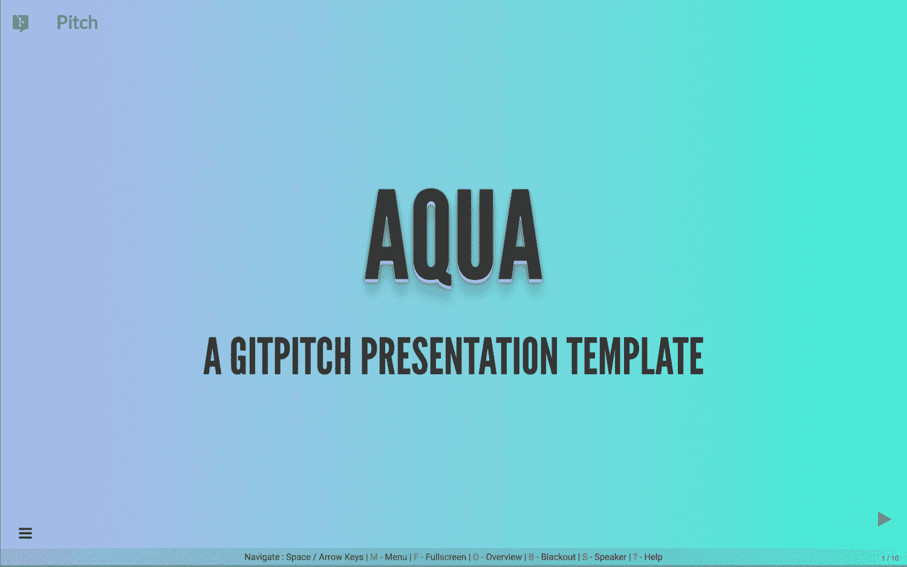

# GitPitch 幻灯片演示模板

> 原文：<https://medium.com/hackernoon/gitpitch-slideshow-presentation-templates-a683b2910761>

> 使用模板快速开始下一个演示文稿。

## 2018 年 9 月更新:这篇博文中描述的模板现在已经不推荐使用了。请看新的博文， [GitPitch 模板](/@gitpitch/gitpitch-the-template-40ac9cbf74c1)。

作为最近重新设计的 GitPitch [网站](https://gitpitch.com)的一部分，一个新的 **GitPitch 模板库**被添加进来。



模板已经过**精心制作，使用 markdown、定制 css 和优化图像**为演示文稿作者提供完美的跳板。使用模板，您可以创建和交付漂亮的演示文稿。毫不费力。只需下载一个模板，然后定制降价内容，以反映你关心的事情。

> 最新消息。GitPitch Pro 即将推出。点击了解更多[。](https://hackernoon.com/gitpitch-pro-coming-soon-bda8c71ca9ea)

# 模板入门

模板库提供了广泛的快速入门模板。首先浏览[图库](https://gitpitch.com/templates)找到你喜欢的演示模板。单击图库中的任何模板即可实时查看。

例如，下面是 [*木材*](https://gitpitch.com/gitpitch/templates/timber) 模板的现场查看:

[ GitPitch Presentation Template — Press F to go Fullscreen]

# 一键下载

模板库为每个模板提供了*一键式*下载功能。要开始使用您选择的模板，只需将下载包中的文件添加到 GitHub、GitLab 或 Bitbucket 上的任何公共[[repo 中，很快就会添加到私有](https://hackernoon.com/gitpitch-pro-coming-soon-bda8c71ca9ea)repo 中。

下载整个模板库最快的方法是在 Github 上分叉模板回购，见[这里](https://github.com/gitpitch/templates)。

# 通过实例学习:模板的剖析

每个模板都存在于 GitHub 上 git pitch[templates](https://github.com/gitpitch/templates)repo 中自己的分支中。

模板是了解 GitPitch 所提供的一些优秀特性的绝佳方式。在每个下载包中，您可以找到以下文件:

```
├── PITCHME.md
├── PITCHME.yaml
├── assets
│   ├── css
│   │   ├── PITCHME.codemax.css
│   │   └── PITCHME.css
│   └── image
│       ├── gitpitch-audience.jpg
│       └── logo.png
└── sample
    └── go
        └── server.go
```

每个模板的演示降价和自定义配置分别位于 **PITCHME.md** 和 **PITCHME.yaml** 文件中。PITCHME.yaml 文件中指定的`theme-override`属性表示应用于模板的自定义 CSS 文件的路径。

模板的默认定制 CSS 文件位于`assets/css/PITCHME.css`。更新`theme-override`属性，指向 **PITCHME.codemax.css** 文件，看看对自定义 css 的小改动会如何导致幻灯片的大改动。

# 立即下载或获取演示模板！

随着时间的推移，[模板库](https://gitpitch.com/templates)将被更新，新的模板将被添加。所以记得不时回来查看，或者在 GitHub 上简单地[观看这个回购](https://github.com/gitpitch/templates)并自动获得更新通知。

随着模板的引入，GitPitch 让制作和分享你所关心的事物的美丽内容变得前所未有的简单。**用它来推销、推销或展示任何东西；)**

我期待看到 GitPitch 社区下一步会创造什么。

请记住，GitPitch 即将使用 Git 私有回购解锁伟大的新功能。即将推出！详情见以下博文:

[](https://hackernoon.com/gitpitch-pro-coming-soon-bda8c71ca9ea) [## GitPitch Pro 即将推出

### 伟大的新功能使用 Git 私人回购和更多。

hackernoon.com](https://hackernoon.com/gitpitch-pro-coming-soon-bda8c71ca9ea) [](https://twitter.com/gitpitch)

**您可以在**[**Medium**](/@gitpitch)**或**[**Twitter**](https://twitter.com/gitpitch)**上关注我，了解 GitPitch 社区的更多新闻、技巧和独特创意。**