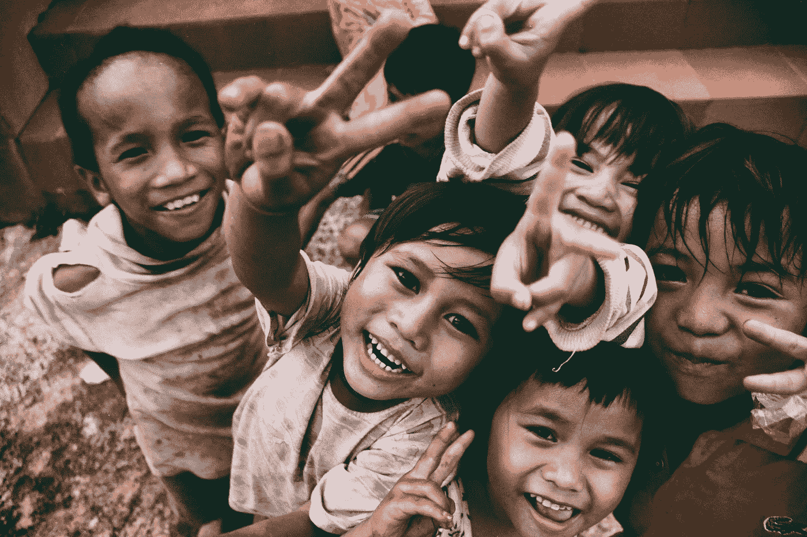
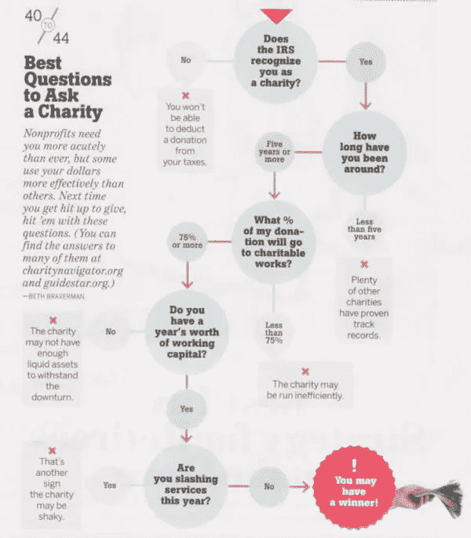
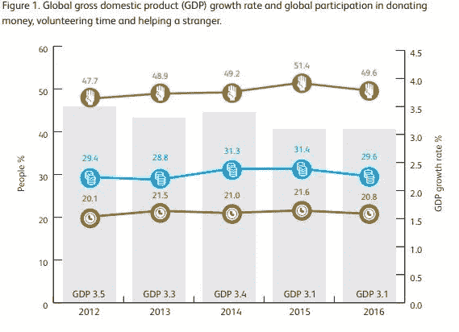
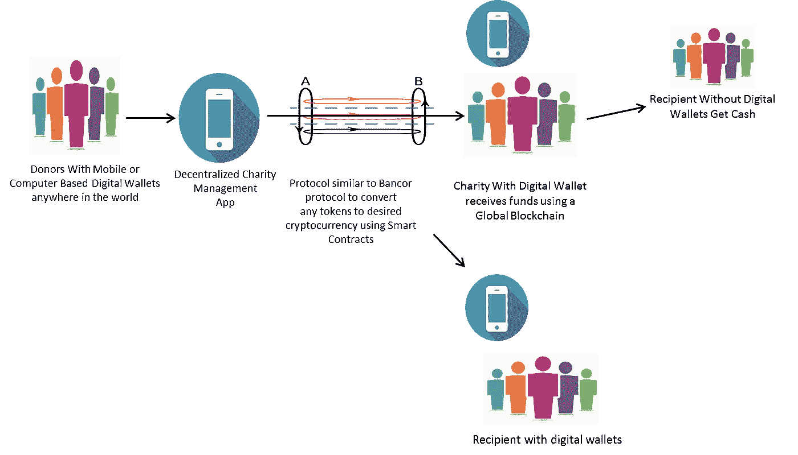

# 在最需要的地方给予

> 原文：<https://medium.com/hackernoon/giving-where-its-needed-the-most-cacb46ca6162>

## 区块链如何改善慈善捐赠的世界

Photo by [Larm Rmah](https://unsplash.com/photos/AEaTUnvneik?utm_source=unsplash&utm_medium=referral&utm_content=creditCopyText) on [Unsplash](https://unsplash.com/?utm_source=unsplash&utm_medium=referral&utm_content=creditCopyText)

> 在我们做好事的同时，让我们不要忘记，真正的解决方案在于一个慈善变得没有必要的世界。”― **奇努阿·阿奇贝**，**大草原的蚁丘**

*这篇文章讨论了区块链的应用，通过无中介和直接交付给最需要的接收者来促进资源的转移。虽然大多数慈善机构都在有效运作，但在为某一特定事业调配资金或减少对受益人没有直接好处的领域的支出方面，仍有改进的余地。毫不奇怪，区块链可以帮助跨境转移货币，而边际成本几乎为零。然而，区块链最人性化的应用之一可以是跟踪、交付和记录为慈善目的捐赠的资金。当然，这并不能排除世界上最贫困地区对基础设施的需求。然而，随着手机普及率大幅提高，数字钱包可以帮助人们几乎瞬间转移资金，更重要的是转移到需要资金维持生活的人手中。*

# 感恩节餐桌上的讨论

本周四(2017 年 11 月 23 日)，像每年一样，数百万人将聚集在餐桌前和他们的家人朋友家里庆祝感恩节。去年，我记得我作为客人去参加一个朋友的感恩节庆祝活动。我发现了素火鸡，也被称为“tofurkey”。更重要的是，我感到被爱、被需要、被喂得很饱。以至于，我的思绪无法停止漫游到世界上所有那些被剥夺了家的舒适和食物的温暖的人们身上。称之为因果报应或其他什么，但我想很多人在感恩节都有类似的想法。

周围的人都知道我是一个不善于隐藏自己情绪的人。在餐桌上，我的朋友问我“是什么阻止了你做慈善？”。

起初，我回答说我相信慈善始于家庭。除非我有足够的钱来确保经济安全，否则我不会有勇气给予。所以，我告诉他，我希望我能赚到足够的财富，能够产生持久的影响，比如建立一所小学校，让印度农村地区的数百万儿童接受教育。我特别热衷于教育女童，因为女性可以释放另一波经济发展浪潮，推动国内生产总值和整体财富的增长。他用慈善援助基金会首席执行官约翰·洛爵士在 2017 年 CAF 世界捐赠指数报告中的话提醒了我:

*“…给予关乎精神和内在动力，而不是经济手段”*

接下来，我继续说道，当我看到无家可归、衣着暴露的人在街上乞讨时，我会像每个有爱心的人一样感同身受。然而，我希望有一种方法，我可以教他们如何赚钱，而不是提供一个创可贴和短期修复。此外，我也不确定我的钱花得值不值。把这些感觉放大一千倍，你就会意识到慈善捐赠的问题。

诚然，某些支出是不可避免的，但缺乏透明度和更好的治理，阻碍了像我这样的许多捐赠者更加公开地捐赠。

moneymagazine

# 全球捐赠指数

尽管许多预测显示世界经济增长 3.8%至 4%，但[世界银行](https://medium.com/u/6ed2e6ddbb88?source=post_page-----cacb46ca6162--------------------------------)将其明年的增长预测称为“脆弱的复苏”，并预计全球经济将从 2017 年的 2.7%增长 0.2%，至 2018-19 年的 2.9%。

慈善援助基金会(CAF)报告称，非洲是 2016 年唯一一个增加捐赠的大陆，这并不令我惊讶。所有其他国家都减少了慈善捐赠。

CAF Global Giving Index Report, September 2017

CAF 根据三种不同的分类来衡量慈善捐赠:帮助陌生人、捐款和志愿服务时间:

CAF Global Giving Index Report, September 2017

# 移动设备上的区块链:未来事物的形状

如果区块链要变得无处不在，当务之急是改善分散式应用程序(dapp)的用户体验，让用户享受应用程序，就像应用程序商店或游戏商店中的应用程序一样。设计必须如此无缝，以至于手机用户不知道智能合约、加密货币转换协议以及最终的区块链正在供电

# 它将如何工作？

除了现有的万维网和物联网，一个全新的互联网正在一个叫做以太坊的通用区块链(操作系统)上形成。以太坊是一个由世界各地相互连接的计算机组成的巨大网络。这些计算机的所有者实质上已经把他们机器的多余处理能力借给了网络，创造了一个运行以太坊软件的互联机器的全球网络，成为网络的一部分。

在这个操作系统之上，开发人员正在构建无数的去中心化应用程序(简称 Dapps)。这些领域从预测市场到对冲基金，到几乎任何可以在以太坊区块链上开发的项目。这些项目的资金大部分是由？你猜对了——ICO 的。

区块链被视为未来互联网的基石。他们是真正的记录(会计)工具，提供单一版本的真相。

想象一下，如果有一个用户友好的界面，可以让你对你喜欢的慈善机构捐赠的时间、金钱或努力进行排序。

然后，你可以通过手机或任何其他设备(AR/VR)上的数字钱包进行支付，这种支付会被全球区块链记录下来，并被传输到所选择的慈善机构，然后记录其如何分配捐款，并向你提供关于你的钱是如何花费的报告。每年，智能合同还可以将资金分配给最成功的慈善机构，甚至向捐赠者提出修改建议。

如果最终接收者有一个数字钱包，资金可以直接存入相应的数字钱包，以几乎零成本实现完全透明。我说几乎零成本，是因为这个世界上没有免费的午餐。区块链消耗大量的能量和计算能力，在这种情况下，通过向计算能力的所有者授予令牌(以太)来补偿。

Illustrative Process Flow

随后，慈善机构还可以使用虚拟现实、增强现实甚至简单的视频会议向你展示你放在接收者脸上的微笑。以色列的 Sirin Labs 等初创公司正在开发一款智能手机，这款手机将带有冷藏数字钱包。冷藏钱包是没有连接到世界范围内的区块链的离线钱包。今天，将你的比特币私钥存储在 USB 驱动器中或写在一张纸上也被称为脱离网格的冷存储钱包。

下一步可能是物联网(IoT)上的设备接收令牌/钱，借出它们的计算能力，并将钱捐给慈善机构，CAF 的罗德里·戴维斯称之为“人工智能慈善机构”

因此，总的来说，慈善组织和捐助者将受益于:

1.  慈善的可能无私调解
2.  捐赠资金的使用方式完全透明
3.  降低全球资金转移的交易成本
4.  通过物联网(IoT)连接的智能设备的捐赠基础扩大
5.  最终，包括物联网和价值互联网在内的万物互联将使更多类型的资源(除了时间和金钱之外)能够捐赠给慈善机构。

# 波浪和不均匀扰动

新兴技术(包括量子计算和合成密码术、人工智能、区块链、去中心化应用、虚拟现实/增强现实)的影响无处不在。斯图尔特·布兰德的这些话虽然生硬，却很能说明问题:

> *一旦新技术碾过你，如果你不是压路机的一部分，你就是道路的一部分。*

这意味着每个实体都将受到快速变化的影响，跟上这些变化将是生存的关键。虽然慈善捐赠领域也不例外，但现有慈善捐赠、透明度和管理机制的解体程度已经在考虑之中。

甚至在我们想到手机持有数字钱包之前，地球上有许多地方需要提供基本的食物、水和电。这些地方的首要任务是建设基础设施。很有可能，区块链的推出可能是同步的，这些地方可能会跃进到一个由智能合同驱动的捐赠世界。我唯一的观点是，这些变化将会一波一波地到来，并且在世界范围内分布不均匀。这也意味着第二个行动者可以学习和即兴发挥第一个行动者的优势。

然而，当你想到即将到来的这个假期时，请记住:

> 除非我们向他人敞开心扉，否则技术无法改变人们的生活。