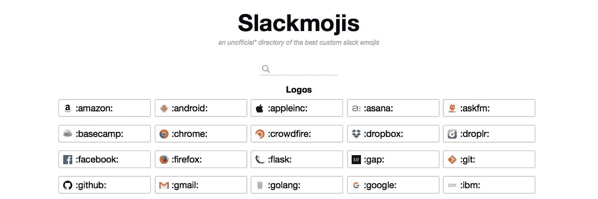
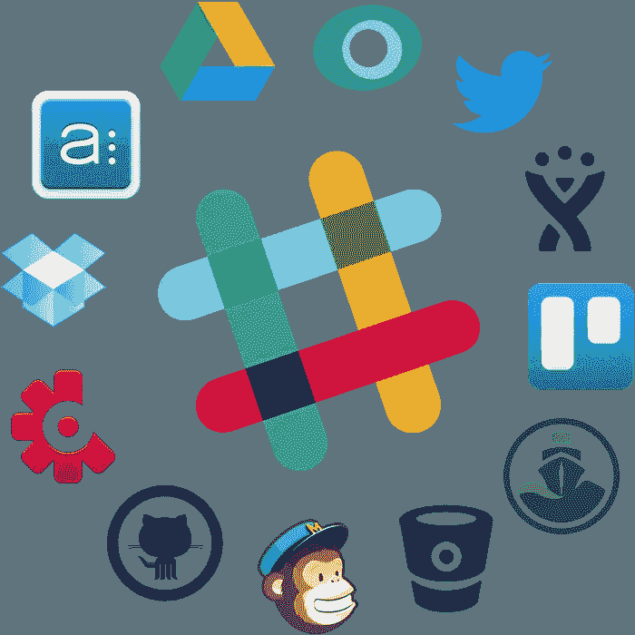

# 系统故障。我为什么买闲置股票。

> 原文：<https://medium.com/hackernoon/glitch-in-the-system-why-im-buying-slack-stock-f67fd01599e8>

我已经开始了新的一章，我想分享我的知识、经历、想法，谈论我感兴趣的事情。我想测试我的写作能力，以深入的“保持 100 分”现实生活内容为特色。我每两天写一篇新专栏，持续 30 天。主题包括科技、健康、旅游、食品、创业、创新、流行文化、体育、自行车、汽车和风险投资。请随意插话。第一条。拥抱和亲吻。

我记得 911 袭击美国时我在哪里。毕竟，谁能忘记那样的事情。我还记得当特朗普成为特朗普总统时，我在哪里，看着从东海岸到西海岸的选票，听着专家向美国人民保证他们的预测是准确的。在工作中，在那些“被车灯照着的鹿”的时间里，几乎没有什么成就。有影响的事件通常会留在我们的记忆中，偶尔我们会想起这些事件，我们的大脑会发现让我们及时重温那一刻很简单。我还记得当我公司[的一个人建议我们尝试这种叫做](http://www.tappr.io)[维基百科条目](https://medium.com/u/26d90a99f605#Google_Ride_Finder)。决定放弃谷歌骑手搜索服务有很多因素，但最重要的是，[技术](https://hackernoon.com/tagged/technology)还不具备成功推出这项服务的可行性。一晃几个月过去了，优步于 2009 年成立，直到 2011 年才正式推出用户如今所熟知的技术。从 2009 年到 2011 年的两年间，一些事件改变了这一格局:

*   苹果的 iPhone 4 于 2010 年 6 月 24 日推出，除了修复糟糕的电池寿命之外，最大的改进之一是对“A-GPS”或辅助 GPS 的改进，它不仅使用 GPS 在快速时间内协调 iPhone 的位置，还使用蜂窝塔网络进行三角定位。在 2009-2011 年间，智能手机上的 GPS 精度从大约 25+米上升到 8 米。自 2011 年以来，在覆盖良好的地区，iPhones 下降了几英尺。
*   2009 年，随着高容量网络的出现、计算机和存储设备成本的降低以及面向服务架构的广泛采用，云计算得到了广泛采用。

除了让一家公司专注于像优步这样的服务之外，这项技术还处于一个关键点，与现有的出租车或豪华轿车公司或过去时代的其他科技公司相比，它能够提供更好的服务。优步的部分成功可能来自技术的可获得性和可负担性，以及社会行为中不断变化的公众观念。

当 Slack 在 2013 年从 TinySpeck 转型时，云和移动计算动摇了软件安全和存储的旧模式。随着存储容量的增加，移动设备变得越来越快，像[#随机。然而，很快我们就意识到团队中的每个人都在一个频道里讨论所有的事情。因此，我们开始为开发、运营、销售和营销创造新的渠道。我们认为这是一个好的开始，并对结果感到满意。](https://medium.com/u/2d2c8f4cb281#通用</strong>或<strong class=)

[随着时间的推移，这些频道中的每一个都需要分成多个更集中的频道。开发变成了 **#dev_hardware** 、 **#dev_api** 、 **#dev_tech_leads** 和 **#delivery_manager** 。运营、客户支持、营销和业务发展也出现了类似的扩张。我们甚至尝试让电子邮件进入我们的直接信息渠道，看看我们是否可以完全没有电子邮件。](https://medium.com/u/2d2c8f4cb281#通用</strong>或<strong class=)

[对于每个渠道，我们添加了新的集成或网络挂钩，这给团队的一些人带来了很多噪音，而其他人则发现新提供的信息很有见地。你可以想象，我们再次分离了渠道，让员工选择最适合他们的。](https://medium.com/u/2d2c8f4cb281#通用</strong>或<strong class=)

[在这个过程的最后，我们有 65 个频道，这还不包括私人频道和存档频道。经过 6 个月的使用，它太多了，我们开始挑选可以合并或存档的频道。截至 2017 年复活节，我们减少到 45 个频道。](https://medium.com/u/2d2c8f4cb281#通用</strong>或<strong class=)

[值得讨论的一个方面是通过 Slack 创建的内容。作为 Tappr 为 AusIndustry 提供的年度研发(R&D)资助的一部分，我们提供了来自某些 Slack 渠道的数据作为提交的一部分。我们发现，当讨论我们如何在 R&D 活动中克服可能的未知时，我们发现我们为什么做出某些决定的整个过程在 Slack 中有很好的记录，尽管事实上也有数百个表情符号。Dev 的将会是 dev 的，我确信 AusIndustry 的人会从中得到乐趣。](https://medium.com/u/2d2c8f4cb281#通用</strong>或<strong class=)

## [**自定义表情符号——slack mojis**](https://medium.com/u/2d2c8f4cb281#通用</strong>或<strong class=)

[Slack’s Slackmoji](https://medium.com/u/2d2c8f4cb281#通用</strong>或<strong class=) [https://slackmojis.com/](https://slackmojis.com/)

我花了一段时间才赶上表情符号的潮流，但现在我已经稳稳地站在了表情符号这座大山的顶端，不会很快下山。Slack 的一个鲜为人知的功能是创建或添加自定义表情符号的能力。Slack 自带了大量的默认表情符号。然而，当披萨日只有一个旋转的披萨表情符号时，你不会失望的。

## **光明的机器人集成未来**

Slack’s Integrations. Source: Troop.ai

你可以为 Slack 对第三方开发者社区参与度的惊人提升建立一个案例。早期，Slack 与 [Google Docs](https://docs.google.com) 、 [Heroku](http://www.heroku.com) 、 [GitHub](http://www.github.com) 、 [ZenDesk](https://www.zendesk.com) 合作，这种早期的整合为其他第三方开发者将他们的服务与 Slack 整合铺平了道路。

之前，我用 Google Cal 查看我的日历，用 ZenDesk 查看客户服务单，用对讲机和客户聊天，用 Git 查看工作效率，用电子邮件给同事发邮件。更不用说，我们在 API 中添加了几个 web 挂钩来查看所有销售和交易。

我现在只查看 Slack 的内部信息，偶尔查看电子邮件来管理我的初创公司。

Slack 和其他科技公司之间的一个显著区别是，Slack 本质上是一个沟通工具，你可以使用 Slack 直接与其他开发者聊天，或者更重要的是，与 Slack 开发团队聊天。你可以看到并参与 Slack 开发团队 [SwayFinance](https://medium.com/u/fb5dd2d116a1#/) 、 [Guru](https://www.getguru.com/solutions/slack/) 和 [DataFox](https://www.datafox.com/tour/slack/) 等等。

## **警告:需要平衡**

虽然 Slack 改变了 Tappr 内部沟通的方式，但它可能会很吵，让人分心，更不用说没有人情味了。

我们已经尝试了几乎所有的 bot 或集成，但每天可以使用的 1001 个 CatFacts 的数量是有限制的。我们甚至尝试了站立机器人，看看我们是否可以松弛我们的开发冲刺，然而，试图讨论复杂的主题可能很难使用松弛，并且不会促进团队建设。

在开发中采用更传统的敏捷方面有助于更多的面对面会议，并且通常可以在更短的时间内解决更复杂的问题。在我们的空闲高峰时期，我们有时会通过 Slack 与多人就复杂的问题聊天长达 20 分钟，而面对面的会议本可以在 2 分钟内解决这些问题。

简而言之，有效的沟通需要的不仅仅是惊人的连通性。许多 Tappr 团队成员抱怨说，他们不知道公司发生了什么，也不知道为什么会做出某些决定。执行管理团队(EMT)确保每两周召开一次会议(有啤酒、葡萄酒和小吃),供所有团队成员与团队领导或在场的其他员工一起提问。EMT 详细介绍了公司的进展、里程碑和当前进展。任何人都可以问任何问题，任何话题都不是禁忌。

我听说过其他一些公司，他们将 Slack 作为唯一的沟通工具，并发现了类似的爱情故事，但在严重依赖后，他们仍然称赞适度。我听说过一些公司暂停使用 Slack，因为它可能会很吵或者没有人情味，我理解为什么，毕竟团队精神和理智很重要，不管成年人如何正确使用，Slack 无疑是初创公司的必备工具。

## 我在买闲置的股票。

毫无疑问，Slack 是一项吸引人的服务，任何公司都可以把它作为交流的枢纽。当然，有些人担心懈怠会接管你的整个生活，但我们这里不是在谈论天网。在 Tappr，我们沉迷于使用它做任何事情，然而随着时间的推移，常识占了上风，我们适度地使用 Slack。

现在已经进入发布的第四个年头，随着 Slack 的快速增长开始放缓，该公司现在正在寻求成为一个更加多元化的平台。无与伦比的用户活动率，不断增长的集成列表，即将发布的 Slack API 新版本，以及一个风投基金，我在这里享受 Slack 的日落之旅，迫不及待地等待 IPO。

两天后我会再发一篇文章。

> [黑客中午](http://bit.ly/Hackernoon)是黑客如何开始他们的下午。我们是 [@AMI](http://bit.ly/atAMIatAMI) 家庭的一员。我们现在[接受投稿](http://bit.ly/hackernoonsubmission)并乐意[讨论广告&赞助](mailto:partners@amipublications.com)机会。
> 
> 如果你喜欢这个故事，我们推荐你阅读我们的[最新科技故事](http://bit.ly/hackernoonlatestt)和[趋势科技故事](https://hackernoon.com/trending)。直到下一次，不要把世界的现实想当然！

